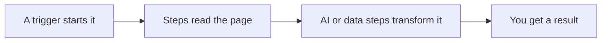

import { LinkCard, CardGrid } from "@astrojs/starlight/components";
import { Badge } from "@components/awflow";

Agentic Workflow (AWFlow) automates what you do on websites: reading a page, copying data, filling forms, summarising with AI. You build a **workflow** by connecting steps on a canvas, or you ask the assistant, **Aria**, to build it for you. It runs in your browser, so it works with the page you're on, and it needs no account.

## Start here: Level 1 · Your first automations

Five lessons, about 30 minutes in total. Each one ends with something that works, and your progress is saved in this browser. <Badge variant="no-setup" />

<CardGrid>
  <LinkCard title="1 · Install AWFlow" description="Add the extension, pin it, open the side panel. 3 min." href="/get-started/install/" />
  <LinkCard title="2 · Your first workflow" description="Read the text you select on a page and reshape it. 6 min." href="/get-started/first-workflow/" />
  <LinkCard title="3 · Summarise a page with AI" description="Add a model, on-device or with an API key, and get three bullets. 8 min." href="/get-started/summarize-with-ai/" />
  <LinkCard title="4 · Your first automation" description="Run it from a keyboard shortcut or on a schedule, then check its runs. 5 min." href="/get-started/first-automation/" />
  <LinkCard title="5 · Ask Aria to build one" description="Describe a workflow in chat and open the result on the canvas. 5 min." href="/get-started/build-with-aria/" />
</CardGrid>

See the whole route, including what comes after level 1, on the [learning path](/get-started/learning-path/).

## How a workflow works

1. **A trigger starts it**: you press Run, a page loads, you press a shortcut, a schedule fires, or you right-click.
2. **Steps (nodes) do the work**: read text, links or tables from the page, click and fill, transform data, ask an AI model.
3. **You see each step's output**, so you can adjust a step and run again until the result is right.

## Already comfortable?

<CardGrid>
  <LinkCard title="Recipes" description="Complete workflows for one job, ready to import." href="/recipes/" />
  <LinkCard title="Use the app" description="Every screen of the app: workflows, runs, connections, Aria, settings." href="/app/" />
  <LinkCard title="Concepts" description="How data, flow and AI work, in more depth." href="/concepts/" />
  <LinkCard title="Node reference" description="Every node, its settings and its outputs." href="/nodes/" />
</CardGrid>
