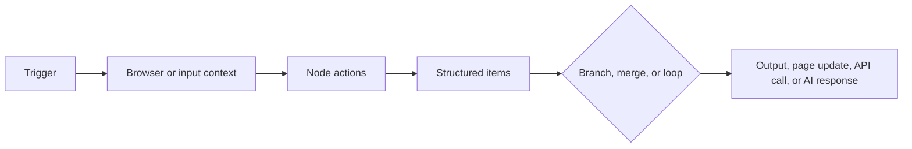

import { Card, CardGrid } from "@astrojs/starlight/components";
import "@styles/home.css";
import SiteHero from "$lib/components/SiteHero.svelte";
import { PUBLIC_SITE_URL } from "astro:env/client";

<SiteHero
  topCTA={{
    href: PUBLIC_SITE_URL,
    value: "Visit the official website",
  }}
  title="Agentic WorkFlow"
  subtitle="Documentation"
  description="Build browser-native workflows that read pages, transform data, call services, and use AI models through a visual node system."
  button1={{
    href: "/usage/getting-started/quick-intro/",
    value: "Start Learning",
  }}
  button2={{
    href: "/nodes/",
    value: "Browse Nodes",
  }}
/>

## What You Can Build

<CardGrid stagger>
  <Card title="Browser Workflows" icon="puzzle">
    Read the current page, extract selected text, inspect metadata, collect links and images, fill forms, click controls, wait for page changes, and display results back in the browser.
  </Card>

  <Card title="Data Pipelines" icon="pkl">
    Move items between nodes, map fields, branch with conditions, merge streams, loop through records, format values, and send clean output to APIs or integrations.
  </Card>

  <Card title="AI Systems" icon="seti:bicep">
    Connect chat models, embeddings, vector stores, memory, output parsers, and agent nodes to summarize, classify, answer questions, or reason over page content.
  </Card>

  <Card title="Service Automation" icon="rocket">
    Combine browser context with HTTP requests and integrations such as Google Sheets, Gmail, Notion, Slack, Airtable, and Google Drive.
  </Card>
</CardGrid>

## How Agentic WorkFlow Thinks About Automation

Every workflow is a small execution graph. A trigger starts the run, each node receives data from previous nodes, and the workflow either updates the browser, transforms data, calls an external service, or asks an AI model to produce an answer.

The most reliable workflows keep this graph explicit: know what starts the run, what data each node outputs, where the browser state can change, and where failures should stop or branch.

## Start With The Right Section

<CardGrid>
  <Card title="First Workflow" icon="open-book">
    New to the app? Start with the quick intro, then build a small workflow that reads a page and returns a visible result.

    [Open the quick intro](/usage/getting-started/quick-intro/)
  </Card>

  <Card title="Key Concepts" icon="list-tree">
    Learn the mental models behind workflow lifecycle, execution order, browser context, item linking, data mapping, loops, merges, waiting, and errors.

    [Study the concepts](/usage/key-concepts/flow-logic/workflow-lifecycle/)
  </Card>

  <Card title="Node Reference" icon="boxes">
    Use the source-aligned node reference when you need exact node behavior, inputs, outputs, credentials, dependencies, and troubleshooting notes.

    [Browse all nodes](/nodes/)
  </Card>

  <Card title="Advanced AI" icon="brain">
    Learn when to use model dependencies, agents, RAG, memory, structured outputs, tool selection, and evaluation patterns.

    [Explore AI concepts](/advanced-ai/concepts/)
  </Card>
</CardGrid>

## Node Palette Map

The node documentation follows the same group order as the app palette:

1. [Trigger](/nodes/builtin/trigger/whenstarted/) - start a workflow manually, from the browser, or from a page event.
2. [Lambda](/nodes/builtin/lambda/lambdainput/) - package reusable workflow logic behind clear inputs and outputs.
3. [In Page Action](/nodes/extension/) - read, inspect, display, or interact with the active browser page.
4. [Flow](/nodes/builtin/flow/if/) - branch, wait, merge, loop, and stop workflows.
5. [Data Transformation](/nodes/builtin/datatransformation/editfields/) - edit fields, pick values, format dates, and download output.
6. [Core](/nodes/builtin/core/http-request/) - run code, make HTTP requests, read URLs, and process feeds.
7. [AI](/nodes/builtin/ai/) - build model chains, agents, RAG workflows, and reusable AI dependencies.
8. [Integrations](/nodes/builtin/integration/google-sheets/) - connect workflow output to external services.

## Practical Learning Path

Use this order when you are learning or debugging:

1. Build a simple browser workflow with [Get Selected Text](/nodes/extension/getselectedtext/) or [Get All Text](/nodes/extension/getalltext/).
2. Read [Data Structure](/usage/key-concepts/data/data-structure/) and [Item Linking](/usage/key-concepts/data/item-linking/) so mappings make sense.
3. Add control flow with [If](/nodes/builtin/flow/if/), [Merge](/nodes/builtin/flow/merge/), [Loop](/nodes/builtin/flow/loop/), and [Wait](/nodes/builtin/flow/wait/).
4. Add AI only after the data shape is stable. Start with [Model Dependencies](/advanced-ai/concepts/model-dependencies/) and [Prompting and Structured Outputs](/advanced-ai/concepts/prompting-and-outputs/).
5. When something breaks, use the [Troubleshooting Guide](/usage/troubleshooting/) to isolate whether the issue is browser state, data mapping, credentials, timing, or model output.

Agentic WorkFlow is easiest to learn when each workflow stays observable: run small sections, inspect node outputs, name important fields clearly, and keep browser actions separated from data processing whenever possible.
