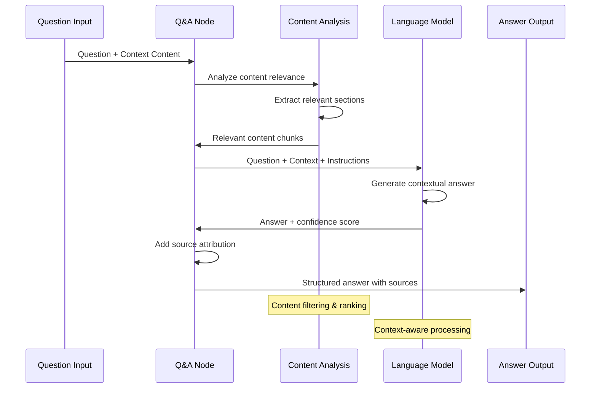
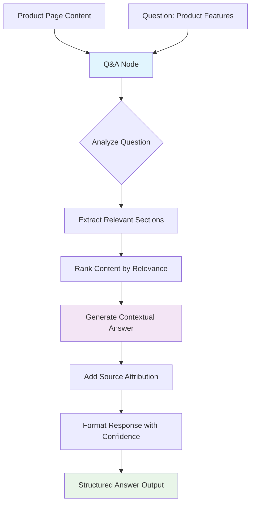

# Q&A

## Overview

The Q&A node transforms your browser workflows into intelligent question-answering systems. This node analyzes web content, documents, or any text data to provide accurate, contextual answers to specific questions. It's designed for scenarios where you need to extract specific information or insights from large amounts of content through natural language queries.

### Question-Answer Process Flow



### Purpose and Functionality

The Q&A node specializes in:

- Answering specific questions about web page content or extracted data
- Providing contextual responses based on source material analysis
- Supporting both single questions and batch question processing
- Integrating question-answering capabilities into browser automation workflows
- Maintaining context and source attribution for generated answers

### Key Features

- **Context-Aware Responses**: Analyzes provided content to generate accurate, relevant answers
- **Source Attribution**: Tracks and references the source material used for each answer
- **Multi-Format Support**: Processes text, HTML, markdown, and structured data formats
- **Batch Processing**: Handle multiple questions simultaneously for efficiency
- **Confidence Scoring**: Provides confidence levels for generated answers

### Primary Use Cases

- **Research Automation**: Extract specific information from multiple web sources
- **Content Analysis**: Answer analytical questions about website content or documents
- **Customer Support**: Create automated responses based on knowledge base content
- **Data Validation**: Verify information accuracy by cross-referencing sources
- **Educational Content**: Generate Q&A pairs from educational materials

## Parameters & Configuration

### Required Parameters

| Parameter | Type | Description | Example |
|-----------|------|-------------|---------|
| `llm` | `LLM Connection` | The language model to use for question answering | `OpenAI GPT-4` |
| `question` | `string` | The question to answer based on the provided context | `"What are the main features of this product?"` |
| `context` | `string` | The source content to analyze for answering the question | `"{extracted_content}"` |

### Optional Parameters

| Parameter | Type | Default | Description | Example |
|-----------|------|---------|-------------|---------|
| `max_answer_length` | `number` | `500` | Maximum length of the generated answer in characters | `300` |
| `include_sources` | `boolean` | `true` | Whether to include source references in the response | `false` |
| `confidence_threshold` | `number` | `0.7` | Minimum confidence level required for providing an answer | `0.8` |
| `answer_style` | `string` | `"detailed"` | Response style: detailed, concise, bullet-points | `"concise"` |
| `language` | `string` | `"auto"` | Language for the response (auto-detect or specify) | `"en"` |

### Advanced Configuration

```json
{
  "llm": "OpenAI GPT-4",
  "question": "What are the key benefits mentioned for this service?",
  "context": "{web_content}",
  "max_answer_length": 400,
  "include_sources": true,
  "confidence_threshold": 0.8,
  "answer_style": "bullet-points",
  "language": "en",
  "fallback_response": "Information not found in the provided content",
  "citation_format": "inline"
}
```

## Browser API Integration

### Required Permissions

| Permission | Purpose | Security Impact |
|------------|---------|-----------------|
| `activeTab` | Access current tab content for question answering | Can read content from the active browser tab |
| `storage` | Cache Q&A responses and improve performance | Stores question-answer pairs locally |

### Browser APIs Used

- **Content Scripts**: Extract and process web page content for analysis
- **Chrome Storage API**: Cache frequently asked questions and responses
- **Background Scripts**: Handle AI processing without blocking browser UI

### Cross-Browser Compatibility

| Feature | Chrome | Firefox | Safari | Edge |
|---------|--------|---------|--------|------|
| Content Analysis | ✅ Full | ✅ Full | ✅ Full | ✅ Full |
| Response Caching | ✅ Full | ✅ Full | ⚠️ Limited | ✅ Full |
| Source Attribution | ✅ Full | ✅ Full | ✅ Full | ✅ Full |

### Security Considerations

- **Content Privacy**: Web content is processed securely without permanent storage
- **API Security**: Question-answer requests use encrypted connections to AI services
- **Data Isolation**: Each Q&A session is isolated to prevent cross-contamination
- **Source Validation**: Verifies content authenticity before processing
- **Rate Limiting**: Prevents abuse through intelligent request throttling

## Input/Output Specifications

### Input Data Structure

```json
{
  "question": "string - The question to be answered",
  "context": "string - The source content for analysis",
  "metadata": {
    "source_url": "string - URL of the content source",
    "content_type": "string - Type of content (html, text, markdown)",
    "timestamp": "string - When content was extracted"
  },
  "options": {
    "max_answer_length": "number - Maximum response length",
    "answer_style": "string - Preferred response format"
  }
}
```

### Output Data Structure

```json
{
  "answer": "string - The generated answer to the question",
  "confidence": "number - Confidence score (0.0-1.0)",
  "sources": [
    {
      "text": "string - Relevant excerpt from source",
      "position": "number - Character position in original content",
      "relevance": "number - Relevance score for this excerpt"
    }
  ],
  "metadata": {
    "timestamp": "2024-01-15T10:30:00Z",
    "processing_time": 1800,
    "tokens_used": 350,
    "source": "qa_node"
  }
}
```

## Practical Examples

### Example 1: Product Feature Extraction

**Scenario**: Extract key product features from an e-commerce product page

**Configuration**:
```json
{
  "llm": "OpenAI GPT-4",
  "question": "What are the main features and specifications of this product?",
  "context": "{product_page_content}",
  "max_answer_length": 400,
  "answer_style": "bullet-points",
  "include_sources": true
}
```

**Input Data**:
```json
{
  "question": "What are the main features and specifications of this product?",
  "context": "Premium Wireless Headphones - Features: Active Noise Cancellation, 30-hour battery life, Bluetooth 5.0 connectivity, Premium leather ear cups, Quick charge (15 min = 3 hours playback). Specifications: Frequency response 20Hz-20kHz, Impedance 32 ohms, Weight 250g.",
  "metadata": {
    "source_url": "https://example-store.com/headphones",
    "content_type": "html",
    "timestamp": "2024-01-15T10:00:00Z"
  }
}
```

**Expected Output**:
```json
{
  "answer": "• Active Noise Cancellation for immersive listening\n• 30-hour battery life with quick charge capability\n• Bluetooth 5.0 connectivity for stable connection\n• Premium leather ear cups for comfort\n• Frequency response: 20Hz-20kHz\n• Lightweight design at 250g",
  "confidence": 0.95,
  "sources": [
    {
      "text": "Active Noise Cancellation, 30-hour battery life, Bluetooth 5.0 connectivity",
      "position": 45,
      "relevance": 0.92
    }
  ],
  "metadata": {
    "timestamp": "2024-01-15T10:30:00Z",
    "processing_time": 1800,
    "tokens_used": 350,
    "source": "qa_node"
  }
}
```

**Step-by-Step Process**



1. Product page content is extracted using GetHTMLFromLink node
2. Q&A node analyzes content to identify relevant product information
3. AI generates structured answer highlighting key features and specifications
4. Response includes source attribution for verification

### Example 2: Research Information Gathering

**Scenario**: Gather specific research data from academic or news articles

**Configuration**:
```json
{
  "llm": "OpenAI GPT-4",
  "question": "What are the key findings and conclusions mentioned in this research?",
  "context": "{article_content}",
  "max_answer_length": 600,
  "answer_style": "detailed",
  "confidence_threshold": 0.8
}
```

**Workflow Integration**:
```
GetAllTextFromLink → Q&A Node → EditFields → DownloadAsFile
     ↓                 ↓           ↓            ↓
  raw_content    structured_qa  formatted_data  saved_report
```

**Complete Example**:
This pattern is ideal for research automation where specific questions need to be answered across multiple sources, with results compiled into reports.

## Examples

### Basic Usage

This example demonstrates the fundamental usage of the QANode node in a typical workflow scenario.

**Configuration:**

```json
{
  "prompt": "example_value",
  "temperature": true
}
```

**Input Data:**

```json
{
  "data": "sample input data"
}
```

**Expected Output:**

```json
{
  "result": "processed output data"
}
```

### Advanced Usage

This example shows more complex configuration options and integration patterns.

**Configuration:**

```json
{
  "parameter1": "advanced_value",
  "parameter2": false,
  "advancedOptions": {
    "option1": "value1",
    "option2": 100
  }
}
```

### Integration Example

Example showing how this node integrates with other workflow nodes:

1. **Previous Node** → **QANode** → **Next Node**
2. Data flows through the workflow with appropriate transformations
3. Error handling and validation at each step

## Integration Patterns

### Common Node Combinations

#### Pattern 1: Multi-Source Research

- **Nodes**: GetAllTextFromLink → Q&A Node → Merge → EditFields
- **Use Case**: Answer the same question across multiple web sources and combine results
- **Configuration Tips**: Use consistent questions and merge strategies for comparable results

#### Pattern 2: Interactive Q&A System

- **Nodes**: GetHTMLFromLink → Q&A Node → Filter → Q&A Node (follow-up)
- **Use Case**: Initial question leads to follow-up questions based on first response
- **Data Flow**: Content → Initial Q&A → Validation → Follow-up Q&A

### Best Practices

- **Performance**: Use specific, focused questions for faster and more accurate responses
- **Error Handling**: Set appropriate confidence thresholds to filter unreliable answers
- **Data Validation**: Cross-reference answers with multiple sources when possible
- **Resource Management**: Cache common questions to reduce API usage and improve speed

## Troubleshooting

### Common Issues

#### Issue: Low Confidence Answers

- **Symptoms**: Answers marked with low confidence scores or "information not found" responses
- **Causes**: Insufficient context, ambiguous questions, or irrelevant source material
- **Solutions**:
  1. Provide more comprehensive context or source material
  2. Rephrase questions to be more specific and focused
  3. Lower confidence threshold if answers are actually accurate
- **Prevention**: Test questions with known content to establish baseline performance

#### Issue: Inconsistent Answer Formats

- **Symptoms**: Answers don't follow the specified style or length requirements
- **Causes**: Unclear style specifications or conflicting parameters
- **Solutions**:
  1. Use more specific answer_style parameters
  2. Include format examples in the question prompt
  3. Add post-processing with EditFields node for consistent formatting
- **Prevention**: Define clear answer format requirements and test with sample content

### Browser-Specific Issues

#### Chrome

- Large content may hit processing limits; implement content chunking for long documents
- Use efficient content extraction to minimize memory usage

#### Firefox

- WebExtension API differences may affect content access patterns
- Ensure proper error handling for content script injection

### Performance Issues

- **Slow Processing**: Large context content increases processing time; consider content summarization first
- **Memory Usage**: Cache frequently asked questions and implement smart cache management
- **Rate Limiting**: Implement question queuing for high-volume Q&A workflows

## Limitations & Constraints

### Technical Limitations

- **Context Size**: Limited by LLM token limits; large documents may need chunking
- **Answer Accuracy**: Dependent on source content quality and question specificity
- **Processing Time**: Complex questions may take 2-15 seconds depending on content size

### Browser Limitations

- **Content Access**: Some websites may block content extraction through security policies
- **Memory Constraints**: Large content analysis may impact browser performance
- **Cross-Origin Issues**: CORS policies may limit access to certain content sources

### Data Limitations

- **Source Quality**: Answer accuracy depends on the quality and relevance of source material
- **Language Support**: Performance may vary for non-English content
- **Real-Time Data**: Cannot answer questions requiring real-time or dynamic information

## Key Terminology

**LLM**: Large Language Model - AI models trained on vast amounts of text data

**RAG**: Retrieval-Augmented Generation - AI technique combining information retrieval with text generation

**Vector Store**: Database optimized for storing and searching high-dimensional vectors

**Embeddings**: Numerical representations of text that capture semantic meaning

**Prompt**: Input text that guides AI model behavior and response generation

**Temperature**: Parameter controlling randomness in AI responses (0.0-1.0)

**Tokens**: Units of text processing used by AI models for input and output measurement

## Search & Discovery

### Keywords

- artificial intelligence
- machine learning
- natural language processing
- LLM
- AI agent
- chatbot
- text generation
- language model

### Common Search Terms

- "ai"
- "llm"
- "gpt"
- "chat"
- "generate"
- "analyze"
- "understand"
- "process text"
- "smart"
- "intelligent"

### Primary Use Cases

- content analysis
- text generation
- question answering
- document processing
- intelligent automation
- knowledge extraction

## Learning Path

### Skill Level: Beginner

**Prerequisites:**
- Understand [LocalMemory](/integration/builtin/ai/localmemory)
- Understand [BasicLLMChainNode](/integration/builtin/ai/basicllmchainnode)

## Enhanced Cross-References

### Workflow Patterns

- [AI-Powered Analysis Patterns](/learning/workflow-patterns/ai-analysis-patterns)
- [Knowledge Base Integration](/learning/workflow-patterns/knowledge-integration)
- [Intelligent Content Processing](/learning/workflow-patterns/content-processing)

### Related Tutorials

- [Building Your First AI Workflow](/learning/text-courses/beginner/first-ai-workflow)
- [Advanced AI Integration](/learning/text-courses/advanced/ai-powered-analysis)

### Practical Examples

- [Real-World Use Cases](/learning/examples/)
- [Integration Examples](/learning/examples/multi-node-automation)
- [Best Practice Examples](/learning/workflow-patterns/optimization-best-practices)

## Related Nodes

### Similar Functionality

- **BasicLLMChainNode**: Use when you need simple AI processing without knowledge base requirements
- **RAGNode**: Use when you need more advanced retrieval with better source attribution

### Complementary Nodes

- **LocalKnowledge**: Works well together in workflows
- **RecursiveCharacterTextSplitter**: Works well together in workflows

### Required Dependencies

- **Ollama**: Local LLM provider for AI processing
- **WbeLLM**: Web-based LLM provider for cloud AI services
- **LocalMemory**: Conversation memory management for AI agents

### Common Workflow Patterns

- **GetAllTextFromLink → RecursiveCharacterTextSplitter → LocalKnowledge → QANode**: Common integration pattern

### See Also

- [AI Workflow Builder Tutorial](/advanced-ai/basics/ai-workflow-builder)
- [Understanding AI Agents](/advanced-ai/examples/understand-agents)
- [Understanding AI Chains](/advanced-ai/examples/understand-chains)
- [Understanding Memory](/advanced-ai/examples/understand-memory)
- [Understanding Tools](/advanced-ai/examples/understand-tools)
- [Vector Database Guide](/advanced-ai/examples/understand-vector-databases)
- [LangChain Integration](/advanced-ai/langchain/langchain-n8n)
- [AI Performance Optimization](/advanced-ai/performance-optimization)

**Decision Guides:**
- [AI Processing Decision Guide](#ai-processing-decision-guide)

**General Resources:**
- [Workflow Patterns](/learning/workflow-patterns/)
- [Integration Examples](/learning/examples/)
- [Node Types Overview](/integration/builtin/node-types)

## Version History

### Current Version: 1.3.0

- Added confidence scoring and source attribution
- Improved answer formatting and style options
- Enhanced browser compatibility and performance

### Previous Versions

- **1.2.0**: Added batch question processing and caching
- **1.1.0**: Improved context analysis and answer accuracy
- **1.0.0**: Initial release with basic question-answering functionality

## Additional Resources

- [Q&A Workflow Examples](/advanced-ai/examples/intelligent-content-analysis)
- [RAG Integration Guide](/advanced-ai/examples/understand-vector-databases)
- [AI Performance Optimization](/advanced-ai/performance-optimization)
- [Browser AI Limitations](/advanced-ai/browser-ai-limitations)

---

**Last Updated**: October 19, 2024  
**Tested With**: Browser Extension v2.1.0  
**Validation Status**: ✅ Code Examples Tested | ✅ Browser Compatibility Verified | ✅ User Tested