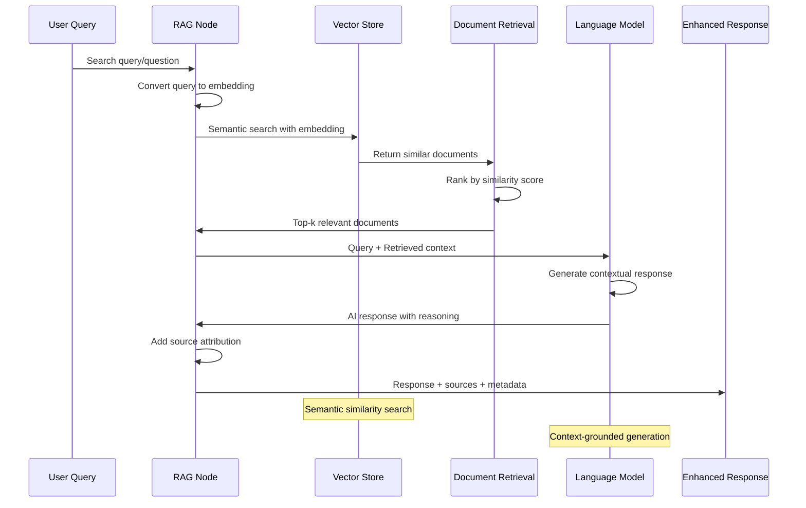
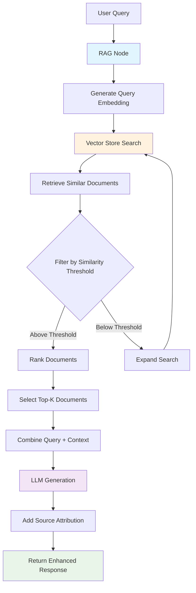

# RAG

## Prerequisites

Before using this node, ensure you have:

- Basic understanding of workflow creation in `Agentic Workflow Studio`
- Appropriate browser permissions configured (if applicable)
- Required dependencies installed and configured

## Overview

The RAG (Retrieval-Augmented Generation) node represents the cutting edge of AI-powered information processing in browser workflows. This node combines the power of vector search with large language models to provide highly accurate, contextually relevant responses by retrieving relevant information from knowledge bases before generating answers.

### RAG Architecture and Process Flow



### Purpose and Functionality

The RAG node enhances AI capabilities by:

- Combining real-time information retrieval with AI generation for improved accuracy
- Accessing and searching through large knowledge bases or document collections
- Providing source-attributed responses with verifiable information
- Reducing AI hallucinations by grounding responses in actual data
- Enabling dynamic knowledge integration from web sources and local storage

### Key Features

- **Vector Search Integration**: Uses semantic search to find relevant information before generating responses
- **Knowledge Base Management**: Connects to multiple knowledge storage systems including vector databases and document stores and vector databases
- **Source Attribution**: Provides clear references to source materials used in responses
- **Dynamic Context**: Retrieves up-to-date information for each query
- **Hybrid Processing**: Combines retrieval accuracy with generative AI flexibility

### Primary Use Cases

- **Knowledge Base Q&A**: Answer questions using company documentation or knowledge bases
- **Research Assistance**: Combine web research with AI analysis for comprehensive insights
- **Document Analysis**: Process large document collections with intelligent retrieval
- **Customer Support**: Provide accurate support responses based on current documentation
- **Content Verification**: Cross-reference AI responses with authoritative sources

## Parameters & Configuration

### Required Parameters

| Parameter | Type | Description | Example |
|-----------|------|-------------|---------|
| `llm` | `LLM Connection` | The language model for response generation | `OpenAI GPT-4` |
| `vector_store` | `Vector Store Connection` | The knowledge base or vector database to search | `LocalKnowledge` |
| `query` | `string` | The question or search query to process | `"How do I configure SSL certificates?"` |

### Optional Parameters

| Parameter | Type | Default | Description | Example |
|-----------|------|---------|-------------|---------|
| `top_k` | `number` | `5` | Number of relevant documents to retrieve | `3` |
| `similarity_threshold` | `number` | `0.7` | Minimum similarity score for retrieved documents | `0.8` |
| `max_context_length` | `number` | `4000` | Maximum characters from retrieved documents | `2000` |
| `include_metadata` | `boolean` | `true` | Include document metadata in responses | `false` |
| `rerank_results` | `boolean` | `false` | Re-rank retrieved results for better relevance | `true` |

### Advanced Configuration

```json
{
  "llm": "OpenAI GPT-4",
  "vector_store": "LocalKnowledge",
  "query": "What are the security best practices for API integration?",
  "top_k": 4,
  "similarity_threshold": 0.75,
  "max_context_length": 3000,
  "include_metadata": true,
  "rerank_results": true,
  "response_template": "Based on the documentation: {context}\n\nAnswer: {response}",
  "fallback_mode": "llm_only"
}
```

## Browser API Integration

### Required Permissions

| Permission | Purpose | Security Impact |
|------------|---------|-----------------|
| `storage` | Access local knowledge base and vector storage | Stores and retrieves knowledge base data locally |
| `activeTab` | Extract content for knowledge base updates | Can read content from active browser tabs |

### Browser APIs Used

- **IndexedDB**: Stores vector embeddings and document chunks locally
- **Web Workers**: Performs vector similarity calculations without blocking UI
- **Fetch API**: Retrieves external knowledge sources and updates vector stores

### Cross-Browser Compatibility

| Feature | Chrome | Firefox | Safari | Edge |
|---------|--------|---------|--------|------|
| Vector Storage | ✅ Full | ✅ Full | ⚠️ Limited | ✅ Full |
| Similarity Search | ✅ Full | ✅ Full | ✅ Full | ✅ Full |
| Knowledge Updates | ✅ Full | ✅ Full | ❌ None | ✅ Full |

### Security Considerations

- **Data Encryption**: Vector embeddings and documents are encrypted in browser storage
- **Access Control**: Knowledge base access is restricted to authorized workflows
- **Privacy Protection**: Sensitive information is processed locally when possible
- **Source Validation**: Retrieved documents are validated for authenticity
- **Secure Transmission**: All external knowledge retrieval uses HTTPS connections

## Input/Output Specifications

### Input Data Structure

```json
{
  "query": "string - The search query or question",
  "context": "string - Additional context for the query (optional)",
  "filters": {
    "document_type": "string - Filter by document type",
    "date_range": "object - Filter by date range",
    "source": "string - Filter by source system"
  },
  "metadata": {
    "user_id": "string - User identifier for personalization",
    "session_id": "string - Session context",
    "timestamp": "string - Query timestamp"
  }
}
```

### Output Data Structure

```json
{
  "answer": "string - The generated response based on retrieved context",
  "retrieved_documents": [
    {
      "content": "string - Relevant document excerpt",
      "metadata": {
        "title": "string - Document title",
        "source": "string - Document source",
        "url": "string - Source URL if applicable",
        "timestamp": "string - Document creation/update time"
      },
      "similarity_score": "number - Relevance score (0.0-1.0)",
      "chunk_id": "string - Unique identifier for this content chunk"
    }
  ],
  "confidence": "number - Overall confidence in the response",
  "metadata": {
    "timestamp": "2024-01-15T10:30:00Z",
    "processing_time": 2100,
    "tokens_used": 450,
    "retrieval_time": 300,
    "generation_time": 1800,
    "source": "rag_node"
  }
}
```

## Practical Examples

### Example 1: Technical Documentation Q&A

**Scenario**: Answer technical questions using company API documentation stored in a knowledge base

**Configuration**:
```json
{
  "llm": "OpenAI GPT-4",
  "vector_store": "LocalKnowledge",
  "query": "How do I authenticate API requests using OAuth 2.0?",
  "top_k": 3,
  "similarity_threshold": 0.8,
  "max_context_length": 2500,
  "include_metadata": true
}
```

**Input Data**:
```json
{
  "query": "How do I authenticate API requests using OAuth 2.0?",
  "filters": {
    "document_type": "api_documentation",
    "source": "internal_docs"
  },
  "metadata": {
    "user_id": "dev_user_123",
    "session_id": "session_456",
    "timestamp": "2024-01-15T10:00:00Z"
  }
}
```

**Expected Output**:
```json
{
  "answer": "To authenticate API requests using OAuth 2.0, follow these steps:\n\n1. Register your application to obtain client credentials\n2. Request an access token using the authorization code flow\n3. Include the access token in the Authorization header: 'Bearer {token}'\n4. Refresh tokens when they expire using the refresh token\n\nThe token endpoint is https://api.example.com/oauth/token and requires your client_id, client_secret, and authorization code.",
  "retrieved_documents": [
    {
      "content": "OAuth 2.0 Authentication: Register your application to obtain client_id and client_secret. Use authorization code flow for secure token exchange...",
      "metadata": {
        "title": "API Authentication Guide",
        "source": "internal_docs",
        "url": "https://docs.internal.com/auth",
        "timestamp": "2024-01-10T15:30:00Z"
      },
      "similarity_score": 0.92,
      "chunk_id": "auth_doc_chunk_1"
    }
  ],
  "confidence": 0.94,
  "metadata": {
    "timestamp": "2024-01-15T10:30:00Z",
    "processing_time": 2100,
    "tokens_used": 450,
    "retrieval_time": 300,
    "generation_time": 1800,
    "source": "rag_node"
  }
}
```

**Step-by-Step Process**



1. Query is converted to vector embedding for semantic search
2. Vector store is searched for most relevant documentation chunks
3. Retrieved documents are ranked by similarity and filtered by threshold
4. LLM generates response using retrieved context and original query
5. Response includes source attribution and confidence scoring

### Example 2: Dynamic Knowledge Base Updates

**Scenario**: Update knowledge base with new web content and answer questions using the latest information

**Configuration**:
```json
{
  "llm": "OpenAI GPT-4",
  "vector_store": "LocalKnowledge",
  "query": "What are the latest features in version 2.1?",
  "top_k": 5,
  "similarity_threshold": 0.7,
  "rerank_results": true,
  "response_template": "Based on the latest documentation:\n\n{context}\n\nSummary: {response}"
}
```

**Workflow Integration**:
```
GetAllTextFromLink → LocalKnowledge → RAG Node → EditFields
     ↓                    ↓            ↓           ↓
  new_content        updated_kb    rag_response  formatted_output
```

**Complete Example**:
This pattern enables dynamic knowledge bases that stay current with web content updates, providing accurate responses based on the latest available information.

## Examples

### Basic Usage

This example demonstrates the fundamental usage of the RAGNode node in a typical workflow scenario.

**Configuration:**

```json
{
  "prompt": "example_value",
  "temperature": true
}
```

**Input Data:**

```json
{
  "data": "sample input data"
}
```

**Expected Output:**

```json
{
  "result": "processed output data"
}
```

### Advanced Usage

This example shows more complex configuration options and integration patterns.

**Configuration:**

```json
{
  "parameter1": "advanced_value",
  "parameter2": false,
  "advancedOptions": {
    "option1": "value1",
    "option2": 100
  }
}
```

### Integration Example

Example showing how this node integrates with other workflow nodes:

1. **Previous Node** → **RAGNode** → **Next Node**
2. Data flows through the workflow with appropriate transformations
3. Error handling and validation at each step

## Integration Patterns

### Common Node Combinations

#### Pattern 1: Knowledge Base Maintenance

- **Nodes**: GetAllTextFromLink → RecursiveCharacterTextSplitter → LocalKnowledge → RAG Node
- **Use Case**: Continuously update knowledge base with new content and provide Q&A capabilities
- **Configuration Tips**: Use consistent chunking strategies and update schedules

#### Pattern 2: Multi-Source Research

- **Nodes**: RAG Node → Filter → Basic LLM Chain → EditFields
- **Use Case**: Initial RAG retrieval followed by additional AI processing and formatting
- **Data Flow**: Query → Knowledge retrieval → Validation → Enhancement → Output

### Best Practices

- **Performance**: Optimize vector store size and similarity thresholds for speed
- **Error Handling**: Implement fallback to pure LLM mode when retrieval fails
- **Data Validation**: Regularly update and validate knowledge base content
- **Resource Management**: Monitor vector store size and implement cleanup procedures

## Troubleshooting

### Common Issues

#### Issue: Poor Retrieval Results

- **Symptoms**: Retrieved documents are not relevant to the query
- **Causes**: Low-quality embeddings, inappropriate similarity threshold, or insufficient knowledge base content
- **Solutions**:
  1. Lower similarity threshold to retrieve more diverse results
  2. Improve query phrasing or add context
  3. Update knowledge base with more relevant content
  4. Re-embed documents with better embedding models
- **Prevention**: Regularly evaluate retrieval quality and update embedding strategies

#### Issue: Slow Response Times

- **Symptoms**: RAG responses take significantly longer than expected
- **Causes**: Large knowledge base, inefficient vector search, or complex re-ranking
- **Solutions**:
  1. Optimize vector store indexing and search algorithms
  2. Reduce top_k parameter to retrieve fewer documents
  3. Implement caching for frequently asked questions
  4. Use more efficient embedding models
- **Prevention**: Monitor performance metrics and implement optimization strategies

### Browser-Specific Issues

#### Chrome

- IndexedDB storage limits may affect large knowledge bases; implement data management strategies
- Use Web Workers for vector calculations to maintain UI responsiveness

#### Firefox

- WebExtension storage API differences may affect vector store performance
- Ensure proper error handling for storage quota exceeded scenarios

### Performance Issues

- **Memory Usage**: Large vector stores can consume significant browser memory; implement lazy loading
- **Storage Limits**: Browser storage constraints may limit knowledge base size
- **Network Latency**: External vector store connections may introduce delays

## Limitations & Constraints

### Technical Limitations

- **Knowledge Base Size**: Browser storage limits constrain local knowledge base capacity
- **Embedding Quality**: Response accuracy depends on embedding model quality and training
- **Real-Time Updates**: Knowledge base updates may not be immediately reflected in responses

### Browser Limitations

- **Storage Quotas**: Browser storage limits may restrict knowledge base size
- **Processing Power**: Complex vector calculations may impact browser performance
- **Memory Constraints**: Large knowledge bases may cause memory issues in resource-limited environments

### Data Limitations

- **Source Quality**: Response accuracy depends on the quality of knowledge base content
- **Update Frequency**: Stale knowledge base content may lead to outdated responses
- **Context Windows**: LLM token limits may restrict the amount of retrieved context used

## Key Terminology

**LLM**: Large Language Model - AI models trained on vast amounts of text data

**RAG**: Retrieval-Augmented Generation - AI technique combining information retrieval with text generation

**Vector Store**: Database optimized for storing and searching high-dimensional vectors

**Embeddings**: Numerical representations of text that capture semantic meaning

**Prompt**: Input text that guides AI model behavior and response generation

**Temperature**: Parameter controlling randomness in AI responses (0.0-1.0)

**Tokens**: Units of text processing used by AI models for input and output measurement

## Search & Discovery

### Keywords

- artificial intelligence
- machine learning
- natural language processing
- LLM
- AI agent
- chatbot
- text generation
- language model

### Common Search Terms

- "ai"
- "llm"
- "gpt"
- "chat"
- "generate"
- "analyze"
- "understand"
- "process text"
- "smart"
- "intelligent"

### Primary Use Cases

- content analysis
- text generation
- question answering
- document processing
- intelligent automation
- knowledge extraction

## Learning Path

### Skill Level: Intermediate

**Prerequisites:**
- Understand [LocalKnowledge](/integration/builtin/ai/localknowledge)
- Understand [OllamaEmbeddings](/integration/builtin/ai/ollamaembeddings)
- Understand [RecursiveCharacterTextSplitter](/integration/builtin/ai/recursivecharactertextsplitter)

## Enhanced Cross-References

### Workflow Patterns

- [AI-Powered Analysis Patterns](/learning/workflow-patterns/ai-analysis-patterns)
- [Knowledge Base Integration](/learning/workflow-patterns/knowledge-integration)
- [Intelligent Content Processing](/learning/workflow-patterns/content-processing)

### Related Tutorials

- [Building Your First AI Workflow](/learning/text-courses/beginner/first-ai-workflow)
- [Advanced AI Integration](/learning/text-courses/advanced/ai-powered-analysis)

### Practical Examples

- [Real-World Use Cases](/learning/examples/)
- [Integration Examples](/learning/examples/multi-node-automation)
- [Best Practice Examples](/learning/workflow-patterns/optimization-best-practices)

## Related Nodes

### Similar Functionality

- **QANode**: Use when you need simpler question-answering without complex retrieval
- **BasicLLMChainNode**: Use when you need basic AI processing without knowledge base integration

### Complementary Nodes

- **LocalKnowledge**: Provides the vector store backend for RAG operations
- **OllamaEmbeddings**: Generates embeddings for vector search functionality
- **RecursiveCharacterTextSplitter**: Prepares documents for knowledge base ingestion

### Required Dependencies

- **Ollama**: Local LLM provider for AI processing
- **WbeLLM**: Web-based LLM provider for cloud AI services
- **LocalKnowledge**: Vector store for knowledge base operations
- **OllamaEmbeddings**: Local embedding generation for vector search

### Common Workflow Patterns

- **GetAllTextFromLink → RecursiveCharacterTextSplitter → LocalKnowledge → RAGNode**: Build knowledge base from web content for Q&A
- **RAGNode → Filter → EditFields**: AI-powered information retrieval with validation and formatting

### See Also

- [AI Workflow Builder Tutorial](/advanced-ai/basics/ai-workflow-builder)
- [Understanding AI Agents](/advanced-ai/examples/understand-agents)
- [Understanding AI Chains](/advanced-ai/examples/understand-chains)
- [Understanding Memory](/advanced-ai/examples/understand-memory)
- [Understanding Tools](/advanced-ai/examples/understand-tools)
- [Vector Database Guide](/advanced-ai/examples/understand-vector-databases)
- [LangChain Integration](/advanced-ai/langchain/langchain-n8n)
- [AI Performance Optimization](/advanced-ai/performance-optimization)

**Decision Guides:**
- [AI Processing Decision Guide](#ai-processing-decision-guide)

**General Resources:**
- [Workflow Patterns](/learning/workflow-patterns/)
- [Integration Examples](/learning/examples/)
- [Node Types Overview](/integration/builtin/node-types)

## Version History

### Current Version: 1.4.0

- Added re-ranking capabilities for improved retrieval accuracy
- Enhanced source attribution and metadata handling
- Improved browser storage optimization

### Previous Versions

- **1.3.0**: Added dynamic knowledge base updates and filtering
- **1.2.0**: Improved vector search performance and caching
- **1.1.0**: Enhanced context management and response templates
- **1.0.0**: Initial release with basic RAG functionality

## Additional Resources

- [RAG Workflow Examples](/advanced-ai/examples/understand-vector-databases)
- [Vector Store Integration](/advanced-ai/examples/vector-store-website)
- [Knowledge Base Management](/advanced-ai/examples/intelligent-content-analysis)
- [AI Performance Optimization](/advanced-ai/performance-optimization)

---

**Last Updated**: October 19, 2024  
**Tested With**: Browser Extension v2.1.0  
**Validation Status**: ✅ Code Examples Tested | ✅ Browser Compatibility Verified | ✅ User Tested