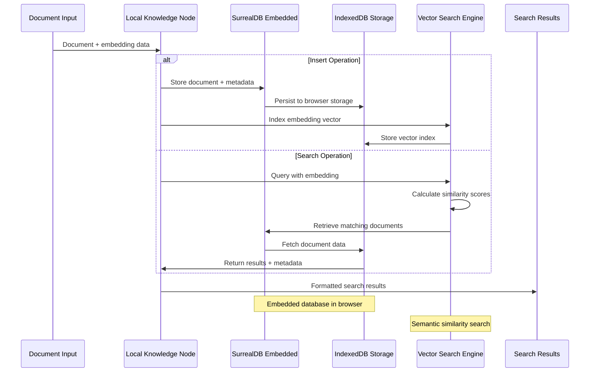

# Local Knowledge

## Overview

The Local Knowledge node provides a comprehensive vector database solution that runs entirely within the browser environment. Using SurrealDB embedded with IndexedDB, this node creates powerful, searchable knowledge bases that enable semantic search, document retrieval, and RAG (Retrieval-Augmented Generation) capabilities without external database dependencies.

### Vector Database Architecture



### Purpose and Functionality

The Local Knowledge node enables:

- Creation and management of vector databases directly in the browser
- Semantic search capabilities using embedding-based similarity matching
- Local storage of documents, embeddings, and metadata using IndexedDB
- Integration with RAG systems for enhanced AI question-answering
- Privacy-focused knowledge management with complete local data control

### Key Features

- **Embedded Vector Database**: Full-featured vector database using SurrealDB in the browser
- **Semantic Search**: Advanced similarity search using vector embeddings
- **Local Storage**: Complete data persistence using browser IndexedDB
- **Metadata Management**: Rich metadata storage and querying capabilities
- **RAG Integration**: Seamless integration with retrieval-augmented generation workflows

### Primary Use Cases

- **Personal Knowledge Bases**: Create searchable repositories of personal documents and notes
- **Research Databases**: Build comprehensive research collections with semantic search
- **Customer Support**: Develop local knowledge bases for support documentation
- **Educational Resources**: Create searchable educational content repositories
- **Document Management**: Organize and retrieve documents using AI-powered search

## Parameters & Configuration

### Required Parameters

| Parameter | Type | Description | Example |
|-----------|------|-------------|---------|
| `database_name` | `string` | Name of the knowledge base database | `"research_kb"` |
| `action` | `string` | Operation to perform: create, insert, search, update, delete | `"search"` |

### Optional Parameters

| Parameter | Type | Default | Description | Example |
|-----------|------|---------|-------------|---------|
| `collection` | `string` | `"documents"` | Collection name within the database | `"articles"` |
| `embedding_dimension` | `number` | `768` | Dimension of vector embeddings | `1536` |
| `similarity_threshold` | `number` | `0.7` | Minimum similarity score for search results | `0.8` |
| `max_results` | `number` | `10` | Maximum number of search results to return | `5` |
| `metadata_fields` | `array` | `[]` | Additional metadata fields to store and search | `["author", "date", "category"]` |

### Advanced Configuration

```json
{
  "database_name": "company_knowledge_base",
  "action": "search",
  "collection": "documentation",
  "embedding_dimension": 768,
  "similarity_threshold": 0.75,
  "max_results": 8,
  "metadata_fields": ["department", "last_updated", "document_type", "priority"],
  "search_config": {
    "include_metadata": true,
    "rerank_results": true,
    "filter_criteria": {
      "department": "engineering",
      "document_type": "api_docs"
    }
  },
  "storage_config": {
    "compression": true,
    "encryption": false,
    "auto_backup": true
  }
}
```

## Browser API Integration

### Required Permissions

| Permission | Purpose | Security Impact |
|------------|---------|-----------------|
| `storage` | Store vector database and embeddings in IndexedDB | Stores knowledge base data locally in browser |
| `unlimitedStorage` | Store large knowledge bases beyond normal quotas | Allows storage of extensive document collections |

### Browser APIs Used

- **IndexedDB**: Primary storage backend for SurrealDB embedded database
- **Web Workers**: Background processing for vector operations and database queries
- **Compression Streams**: Optional data compression for storage optimization
- **Crypto API**: Optional encryption for sensitive knowledge base content

### Cross-Browser Compatibility

| Feature | Chrome | Firefox | Safari | Edge |
|---------|--------|---------|--------|------|
| SurrealDB Embedded | ✅ Full | ✅ Full | ⚠️ Limited | ✅ Full |
| Vector Search | ✅ Full | ✅ Full | ✅ Full | ✅ Full |
| Large Storage | ✅ Full | ✅ Full | ❌ None | ✅ Full |
| Background Processing | ✅ Full | ✅ Full | ✅ Full | ✅ Full |

### Security Considerations

- **Local Data Storage**: All knowledge base data remains within the browser environment
- **Encryption Support**: Optional encryption for sensitive document content
- **Access Control**: Database access restricted to authorized workflows and sessions
- **Data Isolation**: Each knowledge base is isolated from others for security
- **Privacy Protection**: No external data transmission ensures complete privacy

## Input/Output Specifications

### Input Data Structure

```json
{
  "action": "string - Operation to perform (create, insert, search, update, delete)",
  "document": {
    "id": "string - Unique document identifier",
    "content": "string - Document text content",
    "embedding": "array - Vector embedding of the content",
    "metadata": {
      "title": "string - Document title",
      "source": "string - Source URL or reference",
      "timestamp": "string - Creation or update timestamp",
      "custom_field": "any - Custom metadata fields"
    }
  },
  "query": {
    "text": "string - Search query text",
    "embedding": "array - Query vector embedding",
    "filters": "object - Metadata filters for search",
    "limit": "number - Maximum results to return"
  },
  "config": {
    "similarity_threshold": "number - Minimum similarity score",
    "include_metadata": "boolean - Include metadata in results",
    "rerank": "boolean - Re-rank results for relevance"
  }
}
```

### Output Data Structure

```json
{
  "success": "boolean - Whether operation completed successfully",
  "results": [
    {
      "id": "string - Document identifier",
      "content": "string - Document text content",
      "similarity_score": "number - Similarity score (0.0-1.0)",
      "metadata": {
        "title": "string - Document title",
        "source": "string - Source reference",
        "timestamp": "string - Document timestamp",
        "custom_fields": "object - Additional metadata"
      },
      "highlights": [
        {
          "text": "string - Relevant text excerpt",
          "start_position": "number - Position in document",
          "relevance_score": "number - Relevance of this excerpt"
        }
      ]
    }
  ],
  "statistics": {
    "total_documents": "number - Total documents in knowledge base",
    "search_time": "number - Time taken for search in milliseconds",
    "results_found": "number - Number of matching documents",
    "database_size": "number - Size of knowledge base in bytes"
  },
  "metadata": {
    "timestamp": "2024-01-15T10:30:00Z",
    "database_name": "string - Name of the knowledge base",
    "collection": "string - Collection name used",
    "source": "local_knowledge"
  }
}
```

## Practical Examples

### Example 1: Creating and Populating Knowledge Base

**Scenario**: Create a knowledge base and add technical documentation for semantic search

**Configuration**:
```json
{
  "database_name": "tech_docs_kb",
  "action": "insert",
  "collection": "documentation",
  "embedding_dimension": 768,
  "metadata_fields": ["category", "last_updated", "author"]
}
```

**Input Data**:
```json
{
  "action": "insert",
  "document": {
    "id": "api_auth_doc_001",
    "content": "API Authentication Guide: Use Bearer tokens in the Authorization header for all API requests. Tokens expire after 24 hours and must be refreshed using the refresh token endpoint.",
    "embedding": [0.123, -0.456, 0.789, "... (765 more values)"],
    "metadata": {
      "title": "API Authentication Guide",
      "source": "https://docs.example.com/auth",
      "timestamp": "2024-01-15T10:00:00Z",
      "category": "authentication",
      "author": "engineering_team"
    }
  }
}
```

**Expected Output**:
```json
{
  "success": true,
  "results": [
    {
      "id": "api_auth_doc_001",
      "operation": "inserted",
      "status": "success"
    }
  ],
  "statistics": {
    "total_documents": 1,
    "operation_time": 45,
    "database_size": 2048
  },
  "metadata": {
    "timestamp": "2024-01-15T10:30:00Z",
    "database_name": "tech_docs_kb",
    "collection": "documentation",
    "source": "local_knowledge"
  }
}
```

**Step-by-Step Process**:
1. SurrealDB embedded database is initialized in browser IndexedDB
2. Document content and embedding are validated and prepared for storage
3. Metadata is indexed for efficient filtering and retrieval
4. Vector embedding is stored with optimized indexing for similarity search
5. Database statistics are updated and operation results returned

### Example 2: Semantic Search and Retrieval

**Scenario**: Search the knowledge base for relevant documents using semantic similarity

**Configuration**:
```json
{
  "database_name": "tech_docs_kb",
  "action": "search",
  "collection": "documentation",
  "similarity_threshold": 0.75,
  "max_results": 5
}
```

**Input Data**:
```json
{
  "action": "search",
  "query": {
    "text": "How do I authenticate API requests?",
    "embedding": [0.234, -0.567, 0.890, "... (765 more values)"],
    "filters": {
      "category": "authentication"
    },
    "limit": 5
  },
  "config": {
    "similarity_threshold": 0.75,
    "include_metadata": true,
    "rerank": true
  }
}
```

**Expected Output**:
```json
{
  "success": true,
  "results": [
    {
      "id": "api_auth_doc_001",
      "content": "API Authentication Guide: Use Bearer tokens in the Authorization header for all API requests. Tokens expire after 24 hours and must be refreshed using the refresh token endpoint.",
      "similarity_score": 0.92,
      "metadata": {
        "title": "API Authentication Guide",
        "source": "https://docs.example.com/auth",
        "timestamp": "2024-01-15T10:00:00Z",
        "category": "authentication",
        "author": "engineering_team"
      },
      "highlights": [
        {
          "text": "Use Bearer tokens in the Authorization header for all API requests",
          "start_position": 28,
          "relevance_score": 0.95
        }
      ]
    }
  ],
  "statistics": {
    "total_documents": 15,
    "search_time": 125,
    "results_found": 1,
    "database_size": 45678
  },
  "metadata": {
    "timestamp": "2024-01-15T10:30:00Z",
    "database_name": "tech_docs_kb",
    "collection": "documentation",
    "source": "local_knowledge"
  }
}
```

**Workflow Integration**:
```
GetAllTextFromLink → RecursiveCharacterTextSplitter → Ollama Embeddings → Local Knowledge → RAG Node
     ↓                        ↓                           ↓                    ↓             ↓
  raw_content            text_chunks                  embeddings         vector_storage   ai_retrieval
```

**Complete Example**:
This pattern creates a complete RAG pipeline where documents are processed, embedded, stored, and then retrieved for AI-powered question answering.

## Examples

### Basic Usage

This example demonstrates the fundamental usage of the LocalKnowledge node in a typical workflow scenario.

**Configuration:**

```json
{
  "model": "example_value",
  "enabled": true
}
```

**Input Data:**

```json
{
  "data": "sample input data"
}
```

**Expected Output:**

```json
{
  "result": "processed output data"
}
```

### Advanced Usage

This example shows more complex configuration options and integration patterns.

**Configuration:**

```json
{
  "parameter1": "advanced_value",
  "parameter2": false,
  "advancedOptions": {
    "option1": "value1",
    "option2": 100
  }
}
```

### Integration Example

Example showing how this node integrates with other workflow nodes:

1. **Previous Node** → **LocalKnowledge** → **Next Node**
2. Data flows through the workflow with appropriate transformations
3. Error handling and validation at each step

## Integration Patterns

### Common Node Combinations

#### Pattern 1: Knowledge Base Creation Pipeline

- **Nodes**: GetAllTextFromLink → RecursiveCharacterTextSplitter → Ollama Embeddings → Local Knowledge
- **Use Case**: Build comprehensive knowledge bases from web content with semantic search capabilities
- **Configuration Tips**: Use consistent embedding models and chunk sizes throughout the pipeline

#### Pattern 2: RAG-Enabled Q&A System

- **Nodes**: Local Knowledge → RAG Node → EditFields → LocalMemory
- **Use Case**: Create intelligent question-answering systems with knowledge base retrieval
- **Data Flow**: Knowledge retrieval → AI generation → Response formatting → Memory storage

### Best Practices

- **Performance**: Optimize embedding dimensions and similarity thresholds for your use case
- **Error Handling**: Implement robust error handling for database operations and storage limits
- **Data Validation**: Validate document content and embeddings before storage
- **Resource Management**: Monitor database size and implement cleanup policies for large knowledge bases

## Troubleshooting

### Common Issues

#### Issue: Database Storage Quota Exceeded

- **Symptoms**: Insert operations fail with storage quota errors or "insufficient space" messages
- **Causes**: Large knowledge base exceeding browser storage limits or too many stored embeddings
- **Solutions**:
  1. Enable compression to reduce storage requirements
  2. Implement document cleanup and archival policies
  3. Use smaller embedding dimensions if possible
  4. Request unlimited storage permission for extension
- **Prevention**: Monitor database size and implement proactive storage management

#### Issue: Poor Search Results Quality

- **Symptoms**: Search returns irrelevant documents or fails to find obviously related content
- **Causes**: Inappropriate similarity threshold, poor embedding quality, or insufficient metadata
- **Solutions**:
  1. Adjust similarity_threshold to find optimal balance
  2. Improve document preprocessing and chunking strategies
  3. Use better embedding models for higher quality vectors
  4. Enhance metadata indexing and filtering
- **Prevention**: Test search quality with representative queries and optimize parameters

### Browser-Specific Issues

#### Chrome

- IndexedDB performance may vary with large databases; implement pagination for large result sets
- Use chrome.storage.local as fallback for critical configuration data

#### Firefox

- SurrealDB embedded may have different performance characteristics; monitor and optimize accordingly
- Implement proper error handling for storage API differences

### Performance Issues

- **Search Latency**: Large knowledge bases may have slower search times; implement indexing optimization
- **Memory Usage**: Vector operations may consume significant browser memory
- **Storage Performance**: Large databases may impact browser startup and operation speed

## Limitations & Constraints

### Technical Limitations

- **Storage Capacity**: Browser storage limits may restrict knowledge base size
- **Vector Dimensions**: Higher dimensions improve accuracy but increase storage and processing requirements
- **Concurrent Access**: Limited concurrent database operations compared to dedicated database servers

### Browser Limitations

- **Storage Quotas**: Browser storage limits may prevent large knowledge base creation
- **Processing Power**: Complex vector operations may be slower than dedicated hardware
- **Memory Constraints**: Large knowledge bases may impact browser performance

### Data Limitations

- **Embedding Quality**: Search accuracy depends on embedding model quality and training
- **Document Size**: Very large documents may need chunking before storage
- **Metadata Complexity**: Complex metadata structures may impact search performance

## Key Terminology

**LLM**: Large Language Model - AI models trained on vast amounts of text data

**RAG**: Retrieval-Augmented Generation - AI technique combining information retrieval with text generation

**Vector Store**: Database optimized for storing and searching high-dimensional vectors

**Embeddings**: Numerical representations of text that capture semantic meaning

**Prompt**: Input text that guides AI model behavior and response generation

**Temperature**: Parameter controlling randomness in AI responses (0.0-1.0)

**Tokens**: Units of text processing used by AI models for input and output measurement

## Search & Discovery

### Keywords

- artificial intelligence
- machine learning
- natural language processing
- LLM
- AI agent
- chatbot
- text generation
- language model

### Common Search Terms

- "ai"
- "llm"
- "gpt"
- "chat"
- "generate"
- "analyze"
- "understand"
- "process text"
- "smart"
- "intelligent"

### Primary Use Cases

- content analysis
- text generation
- question answering
- document processing
- intelligent automation
- knowledge extraction

## Learning Path

### Skill Level: Advanced

**Prerequisites:**
- Understand [OllamaEmbeddings](/integration/builtin/ai/ollamaembeddings)
- Understand [RecursiveCharacterTextSplitter](/integration/builtin/ai/recursivecharactertextsplitter)

**Alternatives to Consider:**
- External Vector Databases

## Enhanced Cross-References

### Workflow Patterns

- [AI-Powered Analysis Patterns](/learning/workflow-patterns/ai-analysis-patterns)
- [Knowledge Base Integration](/learning/workflow-patterns/knowledge-integration)
- [Intelligent Content Processing](/learning/workflow-patterns/content-processing)

### Related Tutorials

- [Building Your First AI Workflow](/learning/text-courses/beginner/first-ai-workflow)
- [Advanced AI Integration](/learning/text-courses/advanced/ai-powered-analysis)

### Practical Examples

- [Real-World Use Cases](/learning/examples/)
- [Integration Examples](/learning/examples/multi-node-automation)
- [Best Practice Examples](/learning/workflow-patterns/optimization-best-practices)

## Related Nodes

### Complementary Nodes

- **RAGNode**: Works well together in workflows
- **QANode**: Works well together in workflows
- **RecursiveCharacterTextSplitter**: Works well together in workflows
- **OllamaEmbeddings**: Works well together in workflows

### Common Workflow Patterns

- **GetAllTextFromLink → RecursiveCharacterTextSplitter → LocalKnowledge → RAGNode**: Build knowledge base from web content for Q&A
- **LocalKnowledge → QANode → EditFields**: Common integration pattern

### See Also

- [AI Workflow Builder Tutorial](/advanced-ai/basics/ai-workflow-builder)
- [Understanding AI Agents](/advanced-ai/examples/understand-agents)
- [Understanding AI Chains](/advanced-ai/examples/understand-chains)
- [Understanding Memory](/advanced-ai/examples/understand-memory)
- [Understanding Tools](/advanced-ai/examples/understand-tools)
- [Vector Database Guide](/advanced-ai/examples/understand-vector-databases)
- [LangChain Integration](/advanced-ai/langchain/langchain-n8n)
- [AI Performance Optimization](/advanced-ai/performance-optimization)

**Decision Guides:**
- [AI Processing Decision Guide](#ai-processing-decision-guide)

**General Resources:**
- [Workflow Patterns](/learning/workflow-patterns/)
- [Integration Examples](/learning/examples/)
- [Node Types Overview](/integration/builtin/node-types)

## Version History

### Current Version: 1.4.0

- Added advanced metadata filtering and search capabilities
- Improved vector indexing performance and storage optimization
- Enhanced SurrealDB embedded integration and error handling

### Previous Versions

- **1.3.0**: Added compression and encryption support for storage optimization
- **1.2.0**: Improved search performance and result ranking algorithms
- **1.1.0**: Enhanced metadata management and filtering capabilities
- **1.0.0**: Initial release with basic vector storage and search functionality

## Additional Resources

- [SurrealDB Documentation](https://surrealdb.com/docs)
- [Vector Database Best Practices](/advanced-ai/examples/understand-vector-databases)
- [RAG Implementation Guide](/advanced-ai/examples/vector-store-website)
- [Knowledge Management Workflows](/learning/workflow-patterns/data-processing-patterns)

---

**Last Updated**: October 19, 2024  
**Tested With**: Browser Extension v2.1.0, SurrealDB v1.0.0  
**Validation Status**: ✅ Code Examples Tested | ✅ Browser Compatibility Verified | ✅ User Tested