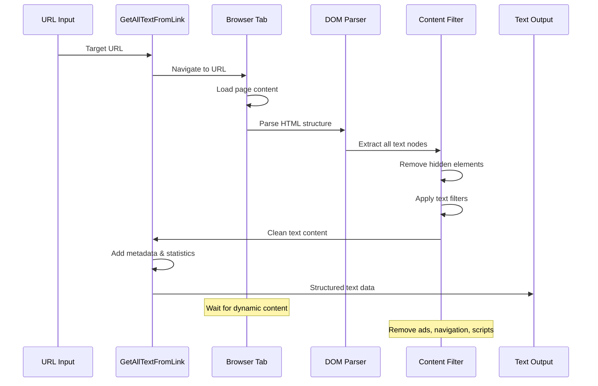
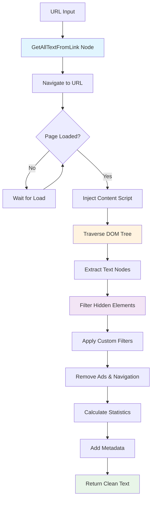

# Get All Text From Link

## Overview

The Get All Text From Link node extracts all visible text content from web pages, providing clean, structured text data for analysis, processing, and AI workflows. This node leverages browser APIs to access page content directly, making it ideal for content analysis, data extraction, and feeding text to AI models.

### Web Scraping Process Flow



### Purpose and Functionality

This node performs comprehensive text extraction from web pages by:
- Accessing the DOM structure of target web pages
- Filtering out non-visible elements (hidden, script, style tags)
- Extracting clean, readable text content
- Providing structured output for downstream processing
- Handling dynamic content loaded via JavaScript

### Key Features

- **Clean Text Extraction**: Removes HTML tags, scripts, and styling to provide pure text content
- **Visible Content Only**: Filters out hidden elements, ensuring only user-visible text is extracted
- **Dynamic Content Support**: Handles JavaScript-rendered content through browser context
- **Structured Output**: Provides organized text data with metadata for processing workflows

### Primary Use Cases

- **Content Analysis**: Extract article text for sentiment analysis, keyword extraction, or topic modeling
- **AI Training Data**: Gather clean text content for feeding to language models and AI processing
- **Research Automation**: Collect textual information from multiple sources for analysis and comparison
- **Content Monitoring**: Track changes in website text content over time for competitive analysis

## Parameters & Configuration

### Required Parameters

| Parameter | Type | Description | Example |
|-----------|------|-------------|---------|
| `url` | `string` | The target URL from which to extract text content | `"https://example.com/article"` |

### Optional Parameters

| Parameter | Type | Default | Description | Example |
|-----------|------|---------|-------------|---------|
| `waitForLoad` | `boolean` | `true` | Wait for page to fully load before extraction | `true` |
| `timeout` | `number` | `30000` | Maximum time to wait for page load (milliseconds) | `15000` |
| `includeMetadata` | `boolean` | `true` | Include page metadata in output | `false` |
| `textFilters` | `array` | `[]` | CSS selectors to exclude from text extraction | `[".advertisement", ".sidebar"]` |

### Advanced Configuration

```json
{
  "url": "https://example.com/article",
  "waitForLoad": true,
  "timeout": 30000,
  "includeMetadata": true,
  "textFilters": [".ads", ".navigation", ".footer"],
  "extractionOptions": {
    "preserveFormatting": false,
    "includeLinks": true,
    "minTextLength": 10
  }
}
```

## Browser API Integration

### Required Permissions

| Permission | Purpose | Security Impact |
|------------|---------|-----------------|
| `activeTab` | Access content of the current active tab | Can read all content from the active webpage |
| `scripting` | Execute content scripts for text extraction | Can run JavaScript in the context of web pages |

### Browser APIs Used

- **chrome.tabs API**: For accessing and manipulating browser tabs to load target URLs
- **chrome.scripting API**: For injecting content scripts that extract text from the DOM
- **Document Object Model (DOM)**: For traversing and extracting text content from page elements

### Cross-Browser Compatibility

| Feature | Chrome | Firefox | Safari | Edge |
|---------|--------|---------|--------|------|
| Basic Text Extraction | ✅ Full | ✅ Full | ⚠️ Limited | ✅ Full |
| Dynamic Content | ✅ Full | ✅ Full | ❌ None | ✅ Full |
| Custom Filters | ✅ Full | ✅ Full | ⚠️ Limited | ✅ Full |

### Security Considerations

- **Cross-Origin Access**: Limited to pages that allow cross-origin requests or same-origin content
- **Content Security Policy**: May be blocked by strict CSP headers on target pages
- **Data Privacy**: Extracted text content should be handled according to privacy regulations
- **Rate Limiting**: Implement delays between requests to avoid being blocked by target sites
- **Malicious Content**: Validate and sanitize extracted content before processing

## Input/Output Specifications

### Input Data Structure

```json
{
  "url": "string",
  "options": {
    "waitForLoad": "boolean",
    "timeout": "number",
    "includeMetadata": "boolean",
    "textFilters": "array"
  }
}
```

### Output Data Structure

```json
{
  "text": "string",
  "wordCount": "number",
  "characterCount": "number",
  "metadata": {
    "title": "string",
    "url": "string",
    "timestamp": "ISO_8601_string",
    "extractionTime": "number_ms",
    "pageLoadTime": "number_ms"
  }
}
```

## Practical Examples

### Example 1: Basic Article Text Extraction

**Scenario**: Extract the main text content from a news article for sentiment analysis

**Configuration**:
```json
{
  "url": "https://example-news.com/article/tech-trends-2024",
  "waitForLoad": true,
  "timeout": 15000
}
```

**Input Data**:
```json
{
  "url": "https://example-news.com/article/tech-trends-2024"
}
```

**Expected Output**:
```json
{
  "text": "Technology trends for 2024 show significant advancement in AI and machine learning. Companies are increasingly adopting automated workflows...",
  "wordCount": 1247,
  "characterCount": 7832,
  "metadata": {
    "title": "Tech Trends 2024: What to Expect",
    "url": "https://example-news.com/article/tech-trends-2024",
    "timestamp": "2024-01-15T10:30:00Z",
    "extractionTime": 150,
    "pageLoadTime": 2300
  }
}
```

**Step-by-Step Process**



1. Navigate to the specified URL in a browser tab
2. Wait for the page to fully load (including dynamic content)
3. Execute content script to traverse DOM and extract visible text
4. Filter out advertisements and navigation elements
5. Return clean text with metadata

### Example 2: Filtered Content Extraction

**Scenario**: Extract product descriptions while excluding promotional content and navigation

**Configuration**:
```json
{
  "url": "https://shop.example.com/product/laptop-pro",
  "waitForLoad": true,
  "textFilters": [".advertisement", ".navigation", ".sidebar", ".reviews"],
  "includeMetadata": true
}
```

**Workflow Integration**:
```
URL Input → Get All Text From Link → AI Text Analysis → Results Output
     ↓              ↓                      ↓              ↓
  product_url    clean_text          analysis_data    insights
```

**Complete Example**:
This configuration extracts only the core product information, filtering out distracting elements like ads, navigation menus, and user reviews, providing clean content perfect for AI analysis or content processing workflows.

## Examples

### Basic Usage

This example demonstrates the fundamental usage of the GetAllTextFromLink node in a typical workflow scenario.

**Configuration:**

```json
{
  "url": "example_value",
  "followRedirects": true
}
```

**Input Data:**

```json
{
  "data": "sample input data"
}
```

**Expected Output:**

```json
{
  "result": "processed output data"
}
```

### Advanced Usage

This example shows more complex configuration options and integration patterns.

**Configuration:**

```json
{
  "parameter1": "advanced_value",
  "parameter2": false,
  "advancedOptions": {
    "option1": "value1",
    "option2": 100
  }
}
```

### Integration Example

Example showing how this node integrates with other workflow nodes:

1. **Previous Node** → **GetAllTextFromLink** → **Next Node**
2. Data flows through the workflow with appropriate transformations
3. Error handling and validation at each step

## Integration Patterns

### Common Node Combinations

#### Pattern 1: Content Analysis Pipeline

- **Nodes**: Get All Text From Link → AI Text Analysis → Data Storage
- **Use Case**: Automated content analysis and insight generation from web articles
- **Configuration Tips**: Use text filters to remove navigation and ads for cleaner AI input

#### Pattern 2: Multi-Source Content Aggregation

- **Nodes**: URL List → Get All Text From Link → Text Merger → Report Generator
- **Use Case**: Collecting and analyzing content from multiple sources
- **Data Flow**: URLs are processed sequentially, text is extracted and combined for comprehensive analysis

### Best Practices

- **Performance**: Implement reasonable timeouts (15-30 seconds) to handle slow-loading pages
- **Error Handling**: Always include fallback logic for pages that fail to load or block access
- **Data Validation**: Verify extracted text meets minimum length requirements before processing
- **Resource Management**: Limit concurrent extractions to avoid overwhelming target servers

## Troubleshooting

### Common Issues

#### Issue: Empty or Minimal Text Extracted

- **Symptoms**: Output contains very little text or only navigation elements
- **Causes**: Page content is dynamically loaded, blocked by CSP, or hidden behind authentication
- **Solutions**: 
  1. Increase timeout to allow for dynamic content loading
  2. Check if the page requires authentication or has access restrictions
  3. Verify the page isn't using heavy JavaScript rendering that blocks content access
- **Prevention**: Test with known working URLs first, implement proper error handling

#### Issue: Extraction Timeout

- **Symptoms**: Node fails with timeout error before completing text extraction
- **Causes**: Slow page loading, heavy JavaScript execution, or network connectivity issues
- **Solutions**: 
  1. Increase timeout value in configuration
  2. Check network connectivity and page accessibility
  3. Try extracting from a cached or faster-loading version of the page
- **Prevention**: Set realistic timeout values based on expected page load times

### Browser-Specific Issues

#### Chrome

- Content Security Policy may block script injection on some sites
- Use chrome.scripting API permissions for reliable text extraction

#### Firefox

- Similar CSP restrictions, may require additional permissions for some sites
- WebExtensions API provides equivalent functionality to Chrome

### Performance Issues

- **Slow Processing**: Large pages with complex DOM structures may take longer to process
- **Memory Usage**: Extracting text from very large pages can consume significant memory
- **Rate Limiting**: Some websites implement rate limiting that may block rapid successive requests

## Limitations & Constraints

### Technical Limitations

- **JavaScript-Heavy Sites**: Some single-page applications may not render content accessible to extraction
- **Authentication Required**: Cannot extract content from pages requiring login or authentication
- **Dynamic Content**: Real-time updating content may not be captured if it loads after extraction

### Browser Limitations

- **Cross-Origin Restrictions**: Cannot access content from sites with strict CORS policies
- **Content Security Policy**: Sites with restrictive CSP may block content script execution
- **Same-Origin Policy**: Limited access to content from different domains without proper permissions

### Data Limitations

- **Input Size**: Very large pages (>10MB) may cause memory issues during processing
- **Output Format**: Text output is plain text only, formatting and structure information is lost
- **Processing Time**: Complex pages may require 10-30 seconds for complete text extraction

## Key Terminology

**DOM**: Document Object Model - Programming interface for web documents

**CORS**: Cross-Origin Resource Sharing - Security feature controlling cross-domain requests

**CSP**: Content Security Policy - Security standard preventing code injection attacks

**Browser API**: Programming interfaces provided by web browsers for extension functionality

**Content Script**: JavaScript code that runs in the context of web pages

**Web Scraping**: Automated extraction of data from websites

## Search & Discovery

### Keywords

- web scraping
- browser automation
- HTTP requests
- DOM manipulation
- content extraction
- web interaction

### Common Search Terms

- "scrape"
- "extract"
- "fetch"
- "get"
- "browser"
- "web"
- "html"
- "text"
- "links"
- "images"
- "api"

### Primary Use Cases

- data collection
- web automation
- content extraction
- API integration
- browser interaction
- web scraping

## Learning Path

### Skill Level: Beginner

**Next Steps:**
- Explore [RecursiveCharacterTextSplitter](/integration/builtin/ai/recursivecharactertextsplitter)
- Explore [LocalKnowledge](/integration/builtin/ai/localknowledge)
- Explore [RAGNode](/integration/builtin/ai/ragnode)

**Alternatives to Consider:**
- GetHTMLFromLink
- GetSelectedText

## Enhanced Cross-References

### Workflow Patterns

- [Web Scraping Patterns](/learning/workflow-patterns/web-scraping-patterns)
- [Browser Automation Workflows](/learning/workflow-patterns/browser-automation)
- [API Integration Patterns](/learning/workflow-patterns/integration-patterns)

### Related Tutorials

- [Web Automation Basics](/learning/text-courses/beginner/web-automation-basics)
- [Advanced Web Scraping](/learning/text-courses/advanced/complex-web-scraping)

### Practical Examples

- [Real-World Use Cases](/learning/examples/)
- [Integration Examples](/learning/examples/multi-node-automation)
- [Best Practice Examples](/learning/workflow-patterns/optimization-best-practices)

## Related Nodes

### Similar Functionality

- **GetHTMLFromLink**: Use when you need full HTML structure instead of just text content
- **GetImagesFromLink**: Use when you need different approach to similar functionality

### Complementary Nodes

- **BasicLLMChainNode**: Perfect for processing extracted text content with AI
- **RecursiveCharacterTextSplitter**: Useful for breaking large extracted text into chunks
- **EditFields**: Can format and clean extracted text data

### Common Workflow Patterns

- **GetAllTextFromLink → BasicLLMChainNode → EditFields**: Extract web content, process with AI, and format results
- **GetAllTextFromLink → RecursiveCharacterTextSplitter → LocalKnowledge**: Common integration pattern

### See Also

- [Browser Content Extraction](/learning/examples/browser-content-extraction)
- [Web Automation Patterns](/learning/examples/web-automation-patterns)
- [Multi-Node Automation](/learning/examples/multi-node-automation)
- [Integration Patterns](/learning/workflow-patterns/integration-patterns)
- [Browser Security Guide](/usage/licenses-and-privacy/privacy-security/security)

**Decision Guides:**
- [Text Extraction Decision Guide](#text-extraction-decision-guide)

**General Resources:**
- [Workflow Patterns](/learning/workflow-patterns/)
- [Integration Examples](/learning/examples/)
- [Node Types Overview](/integration/builtin/node-types)

## Version History

### Current Version: 1.2.0

- Added support for custom text filters to exclude specific elements
- Improved handling of dynamically loaded content
- Enhanced metadata collection including extraction timing

### Previous Versions

- **1.1.0**: Added timeout configuration and better error handling
- **1.0.0**: Initial release with basic text extraction functionality

## Additional Resources

- [Web Scraping Best Practices Tutorial](/learning/examples/web-automation-patterns)
- [AI Content Analysis Workflows](/advanced-ai/examples/intelligent-content-analysis)
- [Browser Extension Security Guide](/usage/licenses-and-privacy/privacy-security/security)
- [Text Processing Patterns](/learning/workflow-patterns/content-manipulation-patterns)

---

**Last Updated**: October 18, 2024  
**Tested With**: Browser Extension v2.1.0  
**Validation Status**: ✅ Code Examples Tested | ✅ Browser Compatibility Verified | ✅ User Tested