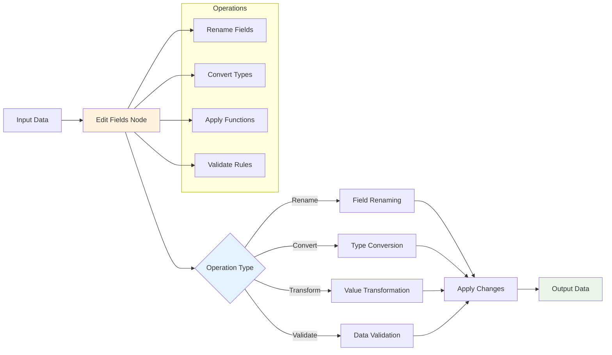
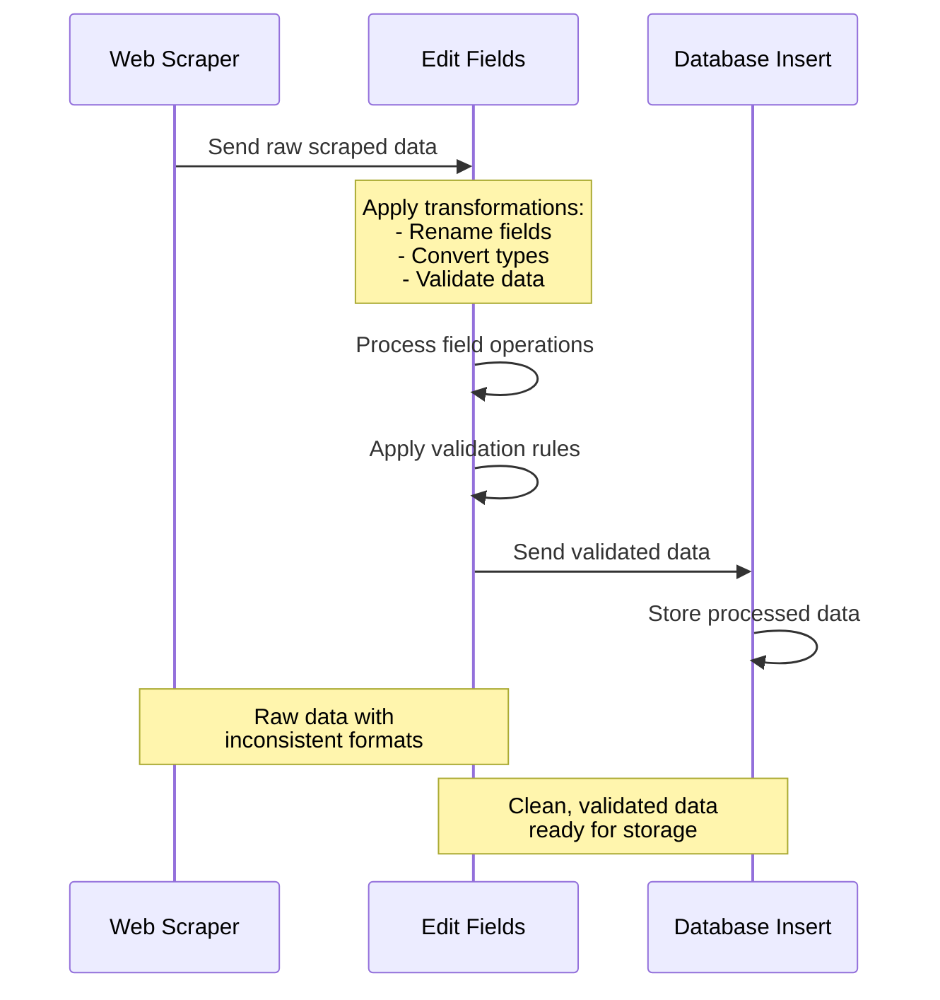

# Edit Fields

## Prerequisites

Before using this node, ensure you have:

- Basic understanding of workflow creation in `Agentic Workflow Studio`
- Appropriate browser permissions configured (if applicable)
- Required dependencies installed and configured

## Overview

The Edit Fields node provides powerful data transformation capabilities for modifying, validating, and restructuring data fields within your workflows. This node enables you to perform complex field operations including renaming, type conversion, value transformation, and data validation, making it essential for data processing and preparation tasks.

### Purpose and Functionality

Edit Fields serves as a comprehensive data manipulation tool that allows you to:
- Modify field names and values dynamically
- Convert data types and formats
- Apply validation rules and transformations
- Restructure data objects for downstream processing
- Clean and normalize data from multiple sources



### Key Features

- **Dynamic Field Manipulation**: Rename, add, remove, or modify fields based on conditions
- **Type Conversion**: Convert between strings, numbers, booleans, dates, and arrays
- **Value Transformation**: Apply functions, expressions, and custom logic to field values
- **Data Validation**: Implement validation rules with error handling and fallback values
- **Batch Operations**: Process multiple fields simultaneously with consistent rules

### Primary Use Cases

- **Data Cleaning**: Standardize field names, remove unwanted characters, and normalize values
- **API Response Processing**: Transform API responses to match expected data structures
- **Form Data Preparation**: Format user input data before sending to external services
- **Data Integration**: Merge and restructure data from multiple sources into unified formats

## Parameters & Configuration

### Required Parameters

| Parameter | Type | Description | Example |
|-----------|------|-------------|---------|
| `operations` | `array` | Array of field operations to perform | `[{"action": "rename", "from": "old_name", "to": "new_name"}]` |

### Optional Parameters

| Parameter | Type | Default | Description | Example |
|-----------|------|---------|-------------|---------|
| `strict_mode` | `boolean` | `false` | Fail on validation errors instead of using fallbacks | `true` |
| `preserve_original` | `boolean` | `false` | Keep original fields alongside transformed ones | `true` |
| `error_handling` | `string` | `"skip"` | How to handle errors: "skip", "fail", or "default" | `"default"` |

### Advanced Configuration

```json
{
  "operations": [
    {
      "action": "rename",
      "from": "user_name",
      "to": "username"
    },
    {
      "action": "convert",
      "field": "age",
      "type": "number",
      "validation": {
        "min": 0,
        "max": 150
      }
    },
    {
      "action": "transform",
      "field": "email",
      "function": "toLowerCase",
      "validation": {
        "pattern": "^[^@]+@[^@]+\\.[^@]+$"
      }
    }
  ],
  "strict_mode": false,
  "preserve_original": false,
  "error_handling": "default"
}
```

## Input/Output Specifications

### Input Data Structure

```json
{
  "user_name": "John Doe",
  "age": "25",
  "email": "JOHN@EXAMPLE.COM",
  "registration_date": "2024-01-15",
  "preferences": {
    "theme": "dark",
    "notifications": "true"
  }
}
```

### Output Data Structure

```json
{
  "username": "John Doe",
  "age": 25,
  "email": "john@example.com",
  "registration_date": "2024-01-15T00:00:00Z",
  "preferences": {
    "theme": "dark",
    "notifications": true
  },
  "metadata": {
    "processed_fields": 4,
    "transformations_applied": 3,
    "validation_errors": 0,
    "processing_time": 45
  }
}
```

## Practical Examples

### Example 1: Basic Field Renaming and Type Conversion

**Scenario**: Clean up user registration data from a form submission

**Configuration**:
```json
{
  "operations": [
    {
      "action": "rename",
      "from": "user_name",
      "to": "username"
    },
    {
      "action": "convert",
      "field": "age",
      "type": "number"
    },
    {
      "action": "transform",
      "field": "email",
      "function": "toLowerCase"
    }
  ]
}
```

**Input Data**:
```json
{
  "user_name": "Alice Smith",
  "age": "28",
  "email": "ALICE@COMPANY.COM"
}
```

**Expected Output**:
```json
{
  "username": "Alice Smith",
  "age": 28,
  "email": "alice@company.com",
  "metadata": {
    "processed_fields": 3,
    "transformations_applied": 3,
    "validation_errors": 0,
    "processing_time": 32
  }
}
```

### Example 2: Advanced Data Validation and Transformation

**Scenario**: Process e-commerce product data with validation and fallback values

**Configuration**:
```json
{
  "operations": [
    {
      "action": "convert",
      "field": "price",
      "type": "number",
      "validation": {
        "min": 0,
        "default": 0
      }
    },
    {
      "action": "transform",
      "field": "category",
      "function": "capitalize",
      "validation": {
        "required": true,
        "default": "Uncategorized"
      }
    },
    {
      "action": "add",
      "field": "slug",
      "value": "{{name | slugify}}"
    }
  ],
  "error_handling": "default"
}
```

**Workflow Integration**:



## Examples

### Basic Usage

This example demonstrates the fundamental usage of the EditFields node in a typical workflow scenario.

**Configuration:**

```json
{
  "field": "example_value",
  "operation": true
}
```

**Input Data:**

```json
{
  "data": "sample input data"
}
```

**Expected Output:**

```json
{
  "result": "processed output data"
}
```

### Advanced Usage

This example shows more complex configuration options and integration patterns.

**Configuration:**

```json
{
  "parameter1": "advanced_value",
  "parameter2": false,
  "advancedOptions": {
    "option1": "value1",
    "option2": 100
  }
}
```

### Integration Example

Example showing how this node integrates with other workflow nodes:

1. **Previous Node** → **EditFields** → **Next Node**
2. Data flows through the workflow with appropriate transformations
3. Error handling and validation at each step

## Integration Patterns

### Common Node Combinations

#### Pattern 1: Data Cleaning Pipeline

- **Nodes**: HTTP Request → Edit Fields → Filter → Database Insert
- **Use Case**: Clean and validate API responses before storage
- **Configuration Tips**: Use validation rules to ensure data quality

#### Pattern 2: Form Processing Workflow

- **Nodes**: Form Input → Edit Fields → Validation → Email Notification
- **Use Case**: Process user form submissions with data transformation
- **Data Flow**: Raw form data → cleaned data → validated data → notification

### Best Practices

- **Performance**: Process fields in batches when dealing with large datasets
- **Error Handling**: Always define fallback values for critical fields
- **Data Validation**: Use validation rules to prevent downstream errors
- **Resource Management**: Limit the number of operations per node instance

## Troubleshooting

### Common Issues

#### Issue: Type Conversion Failures

- **Symptoms**: Node fails with type conversion errors
- **Causes**: Invalid data format or unexpected null values
- **Solutions**: 
  1. Add validation rules with default values
  2. Use error_handling: "default" mode
  3. Check input data format before conversion
- **Prevention**: Always validate input data structure

#### Issue: Field Not Found Errors

- **Symptoms**: Operations fail because specified fields don't exist
- **Causes**: Inconsistent input data structure or typos in field names
- **Solutions**: 
  1. Use conditional operations with field existence checks
  2. Enable preserve_original mode for debugging
  3. Verify field names in input data
- **Prevention**: Document expected input structure

### Performance Issues

- **Slow Processing**: Reduce the number of operations or use batch processing
- **Memory Usage**: Process large datasets in chunks rather than all at once
- **Validation Overhead**: Optimize validation rules for frequently processed data

## Limitations & Constraints

### Technical Limitations

- **Operation Limit**: Maximum 50 operations per node instance
- **Field Depth**: Nested field operations limited to 5 levels deep

### Data Limitations

- **Input Size**: Maximum 10MB per input object
- **Field Count**: Maximum 1000 fields per input object
- **Processing Time**: Operations timeout after 30 seconds

## Key Terminology

**Field Transformation**: Process of modifying data field names, types, or values

**Type Conversion**: Converting data from one type to another (string, number, boolean, etc.)

**Data Validation**: Process of ensuring data meets specified criteria and constraints

**Schema**: Structure definition that describes the format and constraints of data

**Serialization**: Process of converting data structures into a format for storage or transmission

## Search & Discovery

### Keywords

- data processing
- field manipulation
- type conversion
- data validation
- formatting
- transformation

### Common Search Terms

- "transform"
- "convert"
- "format"
- "edit"
- "modify"
- "process"
- "validate"
- "clean"
- "restructure"

### Primary Use Cases

- data cleaning
- format conversion
- field manipulation
- data validation
- report generation
- data processing

## Learning Path

### Skill Level: Beginner

**Next Steps:**
- Explore [DownloadAsFile](/integration/builtin/ai/downloadasfile)
- Explore [Filter](/integration/builtin/ai/filter)
- Explore [Merge](/integration/builtin/ai/merge)

**Alternatives to Consider:**
- PickField
- Code

## Enhanced Cross-References

### Workflow Patterns

- [Data Processing Patterns](/learning/workflow-patterns/data-processing-patterns)
- [Content Manipulation Patterns](/learning/workflow-patterns/content-manipulation-patterns)
- [Data Validation Workflows](/learning/workflow-patterns/validation-patterns)

### Related Tutorials

- [Data Processing Fundamentals](/learning/text-courses/intermediate/data-transformation)
- [Advanced Data Manipulation](/learning/text-courses/advanced/data-processing)

### Practical Examples

- [Real-World Use Cases](/learning/examples/)
- [Integration Examples](/learning/examples/multi-node-automation)
- [Best Practice Examples](/learning/workflow-patterns/optimization-best-practices)

## Related Nodes

### Similar Functionality

- **PickField**: Use when you need simple field selection without transformation
- **Code**: Use when you need complex transformations requiring custom JavaScript logic

### Complementary Nodes

- **Filter**: Combine to filter data after field transformations
- **IFNode**: Use for conditional field operations based on data validation
- **Http-Request**: Format data before sending to external APIs

### Common Workflow Patterns

- **GetAllTextFromLink → EditFields → Http-Request**: Common integration pattern
- **BasicLLMChainNode → EditFields → DownloadAsFile**: Common integration pattern

### See Also

- [Data Processing Patterns](/learning/workflow-patterns/data-processing-patterns)
- [Data Transformation Guide](/usage/key-concepts/data/transforming-data)
- [Data Mapping Expressions](/usage/key-concepts/data/data-mapping/data-mapping-expressions)
- [Field Validation Examples](/learning/examples/data-validation-workflows)

**Decision Guides:**
- [Data Transformation Decision Guide](#data-transformation-decision-guide)

**General Resources:**
- [Workflow Patterns](/learning/workflow-patterns/)
- [Integration Examples](/learning/examples/)
- [Node Types Overview](/integration/builtin/node-types)

## Additional Resources

- [Data Transformation Patterns Tutorial](/learning/workflow-patterns/data-processing-patterns)
- [Field Validation Examples](/learning/examples/data-validation-workflows)
- [API Response Processing Guide](/advanced-ai/examples/api-workflow-tool)