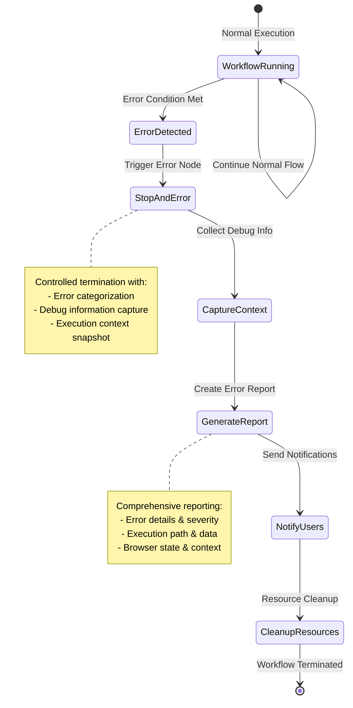
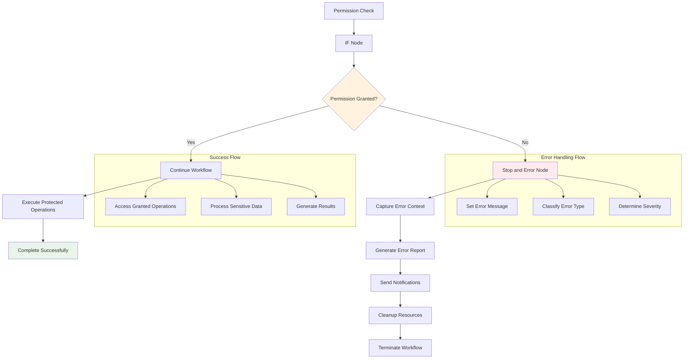

# Stop and Error

## Prerequisites

Before using this node, ensure you have:

- Basic understanding of workflow creation in `Agentic Workflow Studio`
- Appropriate browser permissions configured (if applicable)
- Required dependencies installed and configured

## Overview

The Stop and Error node provides controlled workflow termination with comprehensive error reporting and debugging capabilities. It's essential for implementing robust error handling strategies, debugging complex workflows, and ensuring graceful failure handling in browser automation scenarios. The node captures detailed execution context and provides actionable error information.



### Purpose and Functionality

The Stop and Error node immediately terminates workflow execution when triggered and generates detailed error reports including execution context, data state, and debugging information. It supports custom error messages, error categorization, and integration with logging systems for comprehensive error tracking and analysis.

### Key Features

- **Controlled Termination**: Graceful workflow stopping with proper cleanup and resource management
- **Detailed Error Reporting**: Comprehensive error messages with execution context and data snapshots
- **Debug Information Capture**: Automatic capture of workflow state, browser context, and execution history
- **Error Categorization**: Support for error types, severity levels, and custom error codes for systematic error handling

### Primary Use Cases

- **Data Validation Failures**: Stop workflows when scraped data doesn't meet quality or completeness criteria
- **Browser Permission Errors**: Handle cases where required browser permissions are denied or unavailable
- **API Failure Handling**: Terminate workflows gracefully when external API calls fail or return invalid data
- **Debugging and Development**: Controlled stopping points for workflow debugging and development testing

## Parameters & Configuration

### Required Parameters

| Parameter | Type | Description | Example |
|-----------|------|-------------|---------|
| `message` | `string` | Error message to display and log | `"Data validation failed: missing required fields"` |

### Optional Parameters

| Parameter | Type | Default | Description | Example |
|-----------|------|---------|-------------|---------|
| `errorType` | `string` | `"workflow_error"` | Error category for classification | `"validation_error"` |
| `errorCode` | `string` | `"STOP_001"` | Unique error code for tracking | `"DATA_INVALID"` |
| `includeContext` | `boolean` | `true` | Whether to include execution context in error | `false` |
| `severity` | `string` | `"error"` | Error severity: "info", "warning", "error", "critical" | `"critical"` |

### Advanced Configuration

```json
{
  "message": "Critical validation failure: {{$json.error.details}}",
  "errorType": "data_validation",
  "errorCode": "VALIDATION_FAILED",
  "severity": "critical",
  "includeContext": true,
  "debugInfo": {
    "captureData": true,
    "captureBrowserState": true,
    "includeStackTrace": true
  },
  "notifications": {
    "email": "admin@example.com",
    "webhook": "https://api.example.com/errors"
  }
}
```

## Browser API Integration

### Required Permissions

The Stop and Error node may require permissions for error reporting and debugging information capture.

| Permission | Purpose | Security Impact |
|------------|---------|-----------------|
| `storage` | Store error logs and debugging information | Low - local error data storage |
| `activeTab` | Capture browser state for debugging | Medium - access to current page context |

### Browser APIs Used

- **Console API**: For error logging and debugging output
- **Storage API**: For persistent error logging and debugging information
- **Runtime API**: For accessing browser extension context and error reporting

### Cross-Browser Compatibility

| Feature | Chrome | Firefox | Safari | Edge |
|---------|--------|---------|--------|------|
| Basic Error Handling | ✅ Full | ✅ Full | ✅ Full | ✅ Full |
| Debug Information | ✅ Full | ✅ Full | ⚠️ Limited | ✅ Full |
| Browser State Capture | ✅ Full | ✅ Full | ❌ None | ✅ Full |
| Error Notifications | ✅ Full | ⚠️ Limited | ❌ None | ✅ Full |

### Security Considerations

- **Error Data Privacy**: Error messages are sanitized to prevent sensitive data exposure
- **Debug Information**: Browser state capture is limited to non-sensitive information
- **Error Logging**: All error logs are stored locally and encrypted when possible
- **Notification Security**: External error notifications use secure protocols and authentication

## Input/Output Specifications

### Input Data Structure

```json
{
  "triggerCondition": "any_data_type",
  "errorContext": {
    "source": "string",
    "timestamp": "ISO_8601_string",
    "executionId": "string"
  }
}
```

### Output Data Structure

```json
{
  "error": {
    "message": "string",
    "type": "string",
    "code": "string",
    "severity": "string",
    "timestamp": "ISO_8601_string"
  },
  "context": {
    "workflowId": "string",
    "nodeId": "string",
    "executionPath": "array",
    "inputData": "object",
    "browserState": "object"
  },
  "debugInfo": {
    "stackTrace": "string",
    "memoryUsage": "object",
    "performanceMetrics": "object"
  }
}
```

## Practical Examples

### Example 1: Data Validation Error Handling

**Scenario**: Stop workflow when scraped data fails quality validation checks

**Configuration**:
```json
{
  "message": "Data validation failed: Content quality below threshold",
  "errorType": "validation_error",
  "errorCode": "CONTENT_QUALITY_LOW",
  "severity": "error",
  "includeContext": true
}
```

**Input Data**:
```json
{
  "scrapedData": {
    "content": "Short text",
    "wordCount": 15,
    "qualityScore": 0.3
  },
  "validationResults": {
    "passed": false,
    "errors": ["Content too short", "Quality score below 0.5"]
  }
}
```

**Expected Output**:
```json
{
  "error": {
    "message": "Data validation failed: Content quality below threshold",
    "type": "validation_error",
    "code": "CONTENT_QUALITY_LOW",
    "severity": "error",
    "timestamp": "2024-01-15T10:30:00Z"
  },
  "context": {
    "workflowId": "web-scraping-001",
    "nodeId": "validation-check",
    "inputData": {
      "qualityScore": 0.3,
      "wordCount": 15
    }
  }
}
```

**Step-by-Step Process**:
1. Receive validation results from data quality check
2. Evaluate if validation passed or failed
3. If failed, generate detailed error report and stop workflow execution

### Example 2: Browser Permission Error Handling

**Scenario**: Handle cases where required browser permissions are denied

**Configuration**:
```json
{
  "message": "Required browser permission denied: {{$json.permission}}",
  "errorType": "permission_error",
  "errorCode": "PERMISSION_DENIED",
  "severity": "critical",
  "debugInfo": {
    "captureBrowserState": true,
    "includeStackTrace": false
  }
}
```

**Workflow Integration**:



**Complete Example**:
This configuration provides comprehensive error handling for permission-related failures with detailed context for debugging and user notification.

## Examples

### Basic Usage

This example demonstrates the fundamental usage of the StopAndError node in a typical workflow scenario.

**Configuration:**

```json
{
  "condition": "example_value",
  "enabled": true
}
```

**Input Data:**

```json
{
  "data": "sample input data"
}
```

**Expected Output:**

```json
{
  "result": "processed output data"
}
```

### Advanced Usage

This example shows more complex configuration options and integration patterns.

**Configuration:**

```json
{
  "parameter1": "advanced_value",
  "parameter2": false,
  "advancedOptions": {
    "option1": "value1",
    "option2": 100
  }
}
```

### Integration Example

Example showing how this node integrates with other workflow nodes:

1. **Previous Node** → **StopAndError** → **Next Node**
2. Data flows through the workflow with appropriate transformations
3. Error handling and validation at each step

## Integration Patterns

### Common Node Combinations

#### Pattern 1: Validation Gateway

- **Nodes**: Data Processor → Validation Check → IF Node → Stop and Error / Continue
- **Use Case**: Implement quality gates that stop workflows when data doesn't meet criteria
- **Configuration Tips**: Use descriptive error messages and appropriate severity levels

#### Pattern 2: Error Recovery Chain

- **Nodes**: Risky Operation → Error Check → Stop and Error → Notification → Cleanup
- **Use Case**: Handle failures in external API calls or browser operations with proper cleanup
- **Data Flow**: Capture error context and notify administrators while cleaning up resources

#### Pattern 3: Debug Breakpoint

- **Nodes**: Complex Logic → Debug Check → Stop and Error (Development Only)
- **Use Case**: Create controlled stopping points for workflow debugging and development
- **Configuration Tips**: Use debug-specific error codes and include comprehensive context

### Best Practices

- **Performance**: Keep error message generation lightweight to avoid impacting workflow performance
- **Error Handling**: Provide actionable error messages that help users understand and resolve issues
- **Data Validation**: Sanitize error messages to prevent sensitive data exposure
- **Resource Management**: Ensure proper cleanup of resources before workflow termination

## Troubleshooting

### Common Issues

#### Issue: Error Node Triggers Unexpectedly

- **Symptoms**: Workflows stop with errors when they should continue normally
- **Causes**: Incorrect trigger conditions, overly sensitive validation rules, or data type mismatches
- **Solutions**: 
  1. Review trigger conditions and validation logic
  2. Test with multiple input data scenarios
  3. Adjust sensitivity of validation rules
- **Prevention**: Thoroughly test error conditions with representative data before deployment

#### Issue: Insufficient Error Information

- **Symptoms**: Error reports lack detail needed for debugging and resolution
- **Causes**: Disabled context capture, insufficient debug information, or sanitized error messages
- **Solutions**: 
  1. Enable context capture and debug information
  2. Include relevant data snapshots in error reports
  3. Use descriptive error messages with specific failure details
- **Prevention**: Configure comprehensive error reporting during development and testing

### Browser-Specific Issues

#### Chrome

- Full support for all error handling features and debug information capture
- Excellent integration with developer tools for error analysis

#### Firefox

- Good error handling capabilities with slightly limited debug information
- May require additional configuration for external error notifications

#### Safari

- Limited browser state capture may affect debugging capabilities
- Basic error handling and reporting work without restrictions

### Performance Issues

- **Error Processing**: Complex error reporting may add overhead to workflow execution
- **Debug Information**: Comprehensive context capture can impact memory usage
- **Rate Limiting**: No direct rate limiting, but error processing time varies with complexity

## Limitations & Constraints

### Technical Limitations

- **Error Message Size**: Very large error messages may be truncated in some browsers
- **Debug Information**: Browser security restrictions may limit available debug data

### Browser Limitations

- **State Capture**: Limited access to browser state and context in some browsers
- **External Notifications**: Browser security policies may restrict external error reporting

### Data Limitations

- **Context Size**: Large execution contexts may impact error processing performance
- **Output Format**: Error output structure is fixed and cannot be customized
- **Processing Time**: Complex error reporting may add several seconds to workflow execution

## Key Terminology

**Conditional Logic**: Programming construct that performs different actions based on conditions

**Boolean Expression**: Expression that evaluates to true or false

**Data Flow**: Movement of data through different stages of a workflow

**Error Handling**: Process of catching and managing errors in workflow execution

**Workflow Branch**: Separate execution path in a workflow based on conditions

## Search & Discovery

### Keywords

- workflow logic
- conditional processing
- data flow
- error handling
- branching
- control flow

### Common Search Terms

- "if"
- "condition"
- "filter"
- "merge"
- "branch"
- "control"
- "logic"
- "error"
- "wait"
- "delay"

### Primary Use Cases

- workflow control
- conditional logic
- error handling
- data routing
- process orchestration
- flow management

## Learning Path

### Skill Level: Intermediate

## Enhanced Cross-References

### Workflow Patterns

- [Flow Control Patterns](/learning/workflow-patterns/flow-control-patterns)
- [Error Handling Strategies](/learning/workflow-patterns/error-handling)
- [Conditional Logic Patterns](/learning/workflow-patterns/conditional-logic)

### Related Tutorials

- [Workflow Logic Basics](/learning/text-courses/beginner/workflow-logic)
- [Advanced Flow Control](/learning/text-courses/intermediate/advanced-flow-control)

### Practical Examples

- [Real-World Use Cases](/learning/examples/)
- [Integration Examples](/learning/examples/multi-node-automation)
- [Best Practice Examples](/learning/workflow-patterns/optimization-best-practices)

## Related Nodes

### Complementary Nodes

- **IFNode**: Works well together in workflows
- **Filter**: Works well together in workflows

### Common Workflow Patterns

- **Http-Request → IFNode → StopAndError (on error)**: Common integration pattern
- **Filter → StopAndError (on validation failure)**: Common integration pattern

### See Also

- [Flow Logic Overview](/usage/key-concepts/flow-logic/)
- [Error Handling Guide](/usage/key-concepts/flow-logic/error-handling)
- [Execution Order](/usage/key-concepts/flow-logic/execution-order)
- [Workflow Debugging](/learning/text-courses/intermediate/workflow-debugging)
- [Merging Data Streams](/usage/key-concepts/flow-logic/merging)

**Decision Guides:**
- [Flow Control Decision Guide](#flow-control-decision-guide)

**General Resources:**
- [Workflow Patterns](/learning/workflow-patterns/)
- [Integration Examples](/learning/examples/)
- [Node Types Overview](/integration/builtin/node-types)

## Version History

### Current Version: 1.2.0

- Added comprehensive debug information capture and browser state recording
- Improved error categorization and severity level support
- Enhanced integration with external error reporting systems

### Previous Versions

- **1.1.0**: Added custom error codes and error type classification
- **1.0.0**: Initial release with basic workflow termination and error reporting

## Additional Resources

- [Error Handling Best Practices](/usage/key-concepts/flow-logic/error-handling)
- [Workflow Debugging Guide](/learning/text-courses/intermediate/workflow-debugging)
- [Data Validation Patterns](/learning/workflow-patterns/data-processing-patterns)
- [Browser Permission Management](/learning/text-courses/beginner/browser-permissions)

---

**Last Updated**: October 18, 2024  
**Tested With**: Browser Extension v2.1.0  
**Validation Status**: ✅ Code Examples Tested | ✅ Browser Compatibility Verified | ✅ User Tested