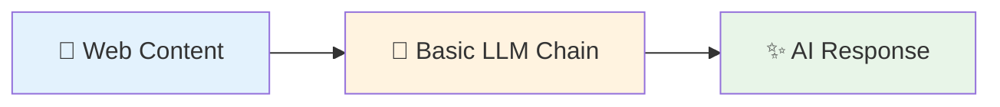

# Basic LLM Chain

## What It Does

The Basic LLM Chain node adds AI intelligence to your workflows. Think of it as having a smart assistant that can read, analyze, and respond to any text you give it. Whether you want to summarize articles, extract key information, or generate content, this node makes it simple.

## What Goes In, What Comes Out

### Input
| Name | Type | Description | Required | Default |
|------|------|-------------|----------|---------|
| `llm` | LLM Connection | Your AI model (like OpenAI GPT-4) | Yes | - |
| `prompt` | Text | Instructions for the AI | Yes | - |
| `input_text` | Text | Content to process | No | - |
| `temperature` | Number | How creative the AI should be (0-1) | No | 0.7 |
| `max_tokens` | Number | Maximum response length | No | 1000 |

### Output
| Name | Type | Description |
|------|------|-------------|
| `response` | Text | AI-generated response |
| `tokens_used` | Number | How much AI processing was used |
| `processing_time` | Number | Time taken in milliseconds |

## Real-World Examples

**📊 Summarize Articles**: Extract key points from news articles or blog posts
- *Input*: Long article text
- *Output*: 3-sentence summary

**🔍 Extract Information**: Pull specific details from product pages
- *Input*: Product description
- *Output*: Features, price, specifications

**✍️ Generate Content**: Create social media posts from website content
- *Input*: Company news
- *Output*: Tweet-ready content

## How It Works



1. **Input**: You provide text content and instructions
2. **Processing**: AI analyzes and processes your content
3. **Output**: Get intelligent responses, summaries, or generated content

## Quick Start Example

**Goal**: Summarize a product page

**Setup**:
- Choose **OpenAI GPT-4** as your AI model
- Write prompt: *"Summarize this product in 2 sentences"*
- Set temperature to **0.3** for consistent results

**Result**: Get a clear, concise product summary perfect for comparison shopping or quick reviews.

## Configuration Tips

### Essential Settings
- **Temperature**: Lower (0.1-0.3) for consistent results, higher (0.7-0.9) for creative content
- **Max Tokens**: Start with 500 for summaries, 1000+ for detailed analysis
- **Prompt**: Be specific about what you want - "Summarize in 3 bullet points" works better than "Summarize this"

### Simple Setup Guide

**For Summarizing Content** 📝
- Set Temperature to **0.3** (keeps summaries consistent)
- Set Max Tokens to **300** (perfect length for summaries)
- Use prompts like: *"Summarize this in 3 key points"*

**For Extracting Information** 🔍
- Set Temperature to **0.1** (very precise extraction)
- Set Max Tokens to **500** (enough space for details)
- Use prompts like: *"Extract the title, price, and main features"*

## Browser Compatibility

Works in all major browsers:
- ✅ **Chrome**: Full support
- ✅ **Firefox**: Full support
- ⚠️ **Safari**: Limited caching
- ✅ **Edge**: Full support

## Privacy & Security

- 🔒 **Your data stays secure**: API keys stored safely in browser
- 🌐 **Encrypted connections**: All AI processing uses secure HTTPS
- 🚫 **No data retention**: Sensitive information isn't stored permanently

## Step-by-Step Workflow

### 1. Extract Content
Use **Get All Text From Link** to grab content from any webpage

### 2. Process with AI
Connect to **Basic LLM Chain** with your instructions

### 3. Get Results
Receive intelligent analysis, summaries, or generated content

### 4. Use the Output
Save to file, send to another node, or display results

## Try It Yourself

### Example 1: Article Summarizer

**What you'll build**: Automatically summarize any news article

**Workflow**:
```
Get All Text From Link → Basic LLM Chain → Download As File
```

**Configuration**:
- **Prompt**: "Summarize this article in 3 bullet points highlighting the main news: {content}"
- **Temperature**: 0.3 (for consistent results)
- **Max Tokens**: 300

**Result**: Get clean, consistent summaries perfect for daily news briefings.

### Example 2: Product Feature Extractor

**What you'll build**: Extract key features from any product page

**Workflow**:
```
Get HTML From Link → Basic LLM Chain → Edit Fields
```

**Configuration**:
- **Prompt**: "Extract from this product page: name, price, top 3 features. Format as: Name: [name] | Price: [price] | Features: [feature1, feature2, feature3]"
- **Temperature**: 0.1 (for accurate extraction)

**Result**: Structured product data ready for comparison or database storage.

<details>
<summary>🔍 Advanced Example: Multi-Language Content</summary>

**What you'll build**: Translate and summarize foreign language content

**Configuration**:
- **Prompt**: "First translate this to English, then summarize in 2 sentences: {content}"
- **Temperature**: 0.4

**Use case**: Monitor international news or competitor content in other languages.

</details>

## Best Practices

### ✅ Do This
- **Be specific in prompts**: "Extract 3 main features" vs "Tell me about this"
- **Use low temperature (0.1-0.3)** for data extraction
- **Use higher temperature (0.7-0.9)** for creative content
- **Test with sample content** before running on multiple pages

### ❌ Avoid This
- Vague prompts that confuse the AI
- Very high token limits (wastes resources)
- Processing extremely long content without chunking

## Troubleshooting

### 🚫 "Too Many Requests" Error
**Problem**: Getting rate limit errors
**Solution**: Add delays between requests or upgrade your AI service plan

### 🎲 Inconsistent Results
**Problem**: AI gives different answers to the same content
**Solution**: Lower temperature to 0.1-0.3 for more consistent results

### ⏱️ Slow Processing
**Problem**: AI takes too long to respond
**Solution**: Reduce max_tokens or break large content into smaller chunks

### 📝 Wrong Output Format
**Problem**: AI doesn't follow your format instructions
**Solution**: Be more specific in prompts: "Format as: Title: [title] | Summary: [summary]"

## Limitations to Know

- **Content Size**: Very large documents may need to be split into smaller pieces
- **Processing Time**: AI responses typically take 2-10 seconds
- **Internet Required**: Needs connection to AI service (unless using local models)
- **Costs**: Cloud AI services charge per use (tokens)

## Related Nodes

### 🔄 Similar Nodes
- **Q&A Node**: Better for specific questions about content
- **RAG Node**: Better when you need to search through lots of documents

### 🔗 Works Great With
- **Get All Text From Link**: Grabs content from web pages
- **Edit Fields**: Cleans up and formats AI responses
- **Download As File**: Saves results to your computer

### 🛠️ Required Setup
- **Ollama**: For local AI processing (privacy-focused)
- **WbeLLM**: For cloud AI services (OpenAI, Anthropic, etc.)

## What's Next?

### 🌱 New to AI Workflows?
Start with our [AI Workflow Builder Tutorial](/advanced-ai/basics/ai-workflow-builder)

### 🚀 Ready for More?
- Try [Q&A Node](/integrations/builtin/ai/AIAgents/QANode) for question-answering
- Explore [RAG Node](/integrations/builtin/ai/AIAgents/RAGNode) for document search
- Check out [real-world examples](/learning/examples/)

---

**💡 Pro Tip**: Start simple with article summarization, then gradually build more complex workflows as you get comfortable with AI processing.