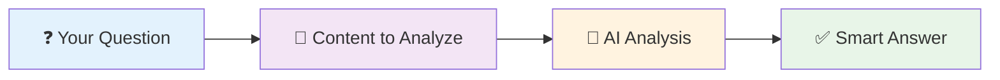

# Q&A (Question & Answer)

## What It Does

The Q&A node is like having a smart reading assistant. Give it any text content and ask specific questions about it. It will analyze the content and provide accurate, contextual answers based on what it reads.

## What Goes In, What Comes Out

### Input
| Name | Type | Description | Required | Default |
|------|------|-------------|----------|---------|
| `llm` | LLM Connection | Your AI model | Yes | - |
| `question` | Text | What you want to know | Yes | - |
| `context` | Text | Content to analyze | Yes | - |
| `max_answer_length` | Number | Maximum response length | No | 500 |
| `confidence_threshold` | Number | Minimum confidence level (0-1) | No | 0.7 |

### Output
| Name | Type | Description |
|------|------|-------------|
| `answer` | Text | AI's answer to your question |
| `confidence` | Number | How confident the AI is (0-1) |
| `sources` | Array | Relevant parts of the content used |
| `processing_time` | Number | Time taken in milliseconds |

## Real-World Examples

**📰 Article Analysis**: "What are the main points in this news article?"
- *Input*: News article text
- *Output*: Key points and takeaways

**🛍️ Product Research**: "What are the pros and cons mentioned in this review?"
- *Input*: Product review content  
- *Output*: Balanced summary of positives and negatives

**📊 Report Insights**: "What were the key findings in this research?"
- *Input*: Research document
- *Output*: Main conclusions and discoveries

## How It Works



**Perfect for when you need to:**
- 🎯 **Extract specific information** from long documents
- 📊 **Analyze content** and get insights  
- ✅ **Verify facts** mentioned in articles
- 🔍 **Find answers** without reading everything yourself

## Quick Start Example

**Goal**: Analyze product reviews to find common complaints

**Setup**:
```json
{
  "question": "What are the main complaints customers have about this product?",
  "context": "{review_content}",
  "confidence_threshold": 0.8
}
```

**Result**: Get a clear summary of customer issues, perfect for product improvement or purchase decisions.

## Configuration Tips

### Essential Settings
- **Answer Style**: Choose "concise" for quick facts, "detailed" for thorough analysis, "bullet-points" for lists
- **Confidence Threshold**: 0.7 for general use, 0.8+ when accuracy is critical
- **Max Answer Length**: 300 for summaries, 500+ for detailed explanations

### Common Configurations

**For Quick Facts**:
```json
{
  "answer_style": "concise",
  "max_answer_length": 200,
  "confidence_threshold": 0.8
}
```

**For Detailed Analysis**:
```json
{
  "answer_style": "detailed", 
  "max_answer_length": 600,
  "include_sources": true
}
```

**For Structured Lists**:
```json
{
  "answer_style": "bullet-points",
  "max_answer_length": 400,
  "confidence_threshold": 0.7
}
```

## Browser Compatibility

Works in all major browsers:
- ✅ **Chrome**: Full support with response caching
- ✅ **Firefox**: Full support  
- ⚠️ **Safari**: Limited caching capabilities
- ✅ **Edge**: Full support

## Privacy & Security

- 🔒 **Secure Processing**: Content analyzed securely without permanent storage
- 🔐 **Encrypted Connections**: All AI requests use secure HTTPS
- 🚫 **No Data Retention**: Content isn't stored after processing
- ✅ **Source Verification**: Validates content before analysis

## Step-by-Step Workflow

### 1. Get Your Content
Use **Get All Text From Link** or **Get HTML From Link** to extract content

### 2. Ask Your Question
Connect **Q&A Node** with a specific question about the content

### 3. Get Smart Answers
Receive contextual answers with confidence scores and source references

### 4. Use the Results
Save answers, combine with other data, or ask follow-up questions

## Try It Yourself

### Example 1: Product Comparison Helper

**What you'll build**: Extract key product information for easy comparison

**Workflow**:
```
Get HTML From Link → Q&A Node → Edit Fields → Download As File
```

**Configuration**:
- **Question**: "What are the price, main features, and customer rating of this product?"
- **Answer Style**: "bullet-points"
- **Max Answer Length**: 300

**Result**: Structured product data perfect for comparison shopping or market research.

### Example 2: News Article Analyzer

**What you'll build**: Extract key information from news articles

**Workflow**:
```
Get All Text From Link → Q&A Node → Merge → Download As File
```

**Configuration**:
- **Question**: "What happened, when did it happen, and what are the implications?"
- **Answer Style**: "detailed"
- **Confidence Threshold**: 0.8

**Result**: Comprehensive news summaries with key facts and analysis.

### Example 3: Research Paper Insights

**What you'll build**: Extract findings from academic papers

**Workflow**:
```
Get All Text From Link → Q&A Node → Edit Fields
```

**Configuration**:
- **Question**: "What are the main findings, methodology, and limitations of this study?"
- **Answer Style**: "detailed"
- **Max Answer Length**: 600

**Result**: Structured research summaries perfect for literature reviews.

<details>
<summary>🔍 Advanced Example: Multi-Question Analysis</summary>

**What you'll build**: Ask multiple questions about the same content

**Setup**: Use multiple Q&A nodes in parallel, each with different questions:
- "What are the main benefits?"
- "What are the drawbacks?"
- "Who is the target audience?"

**Use case**: Comprehensive content analysis from multiple angles.

</details>


## Best Practices

### ✅ Do This
- **Ask specific questions**: "What are the top 3 benefits?" vs "Tell me about this"
- **Use appropriate confidence thresholds**: 0.8+ for critical information
- **Match answer style to your needs**: bullet-points for lists, detailed for analysis
- **Test questions with sample content** before running on multiple sources

### ❌ Avoid This
- Asking questions the content can't answer
- Using very low confidence thresholds (may get unreliable answers)
- Making questions too broad or vague
- Expecting answers about information not in the content

## Troubleshooting

### 🤔 "Low Confidence" Answers
**Problem**: AI says it's not confident about the answer  
**Solution**: Make your question more specific or check if the content actually contains the information

### 📝 Inconsistent Answer Formats
**Problem**: Answers don't follow your requested format  
**Solution**: Be more specific in your question: "List the top 3 features as bullet points"

### ⏱️ Slow Processing
**Problem**: Q&A takes too long to respond  
**Solution**: Break very long content into smaller chunks or ask more focused questions

### ❌ "Information Not Found"
**Problem**: AI can't find answers in the content  
**Solution**: Verify the content actually contains what you're asking about, or rephrase your question

## Limitations to Know

- **Content Dependent**: Can only answer questions about information actually in the content
- **Processing Time**: Complex analysis takes 2-10 seconds depending on content length
- **Context Size**: Very large documents may need to be split into smaller pieces
- **Language**: Works best with English content, may vary with other languages

## Related Nodes

### 🔄 Similar Nodes
- **Basic LLM Chain**: Better for general AI processing without specific questions
- **RAG Node**: Better when you need to search through document collections

### 🔗 Works Great With
- **Get All Text From Link**: Extracts content from web pages for analysis
- **Get HTML From Link**: Gets structured content for detailed questions
- **Edit Fields**: Formats and cleans up Q&A responses

### 🛠️ Required Setup
- **Ollama**: For local AI processing (privacy-focused)
- **WbeLLM**: For cloud AI services (OpenAI, Anthropic, etc.)

## What's Next?

### 🌱 New to Q&A Workflows?
Start with our [AI Workflow Builder Tutorial](/advanced-ai/basics/ai-workflow-builder)

### 🚀 Ready for More?
- Try [RAG Node](/integrations/builtin/ai/AIAgents/RAGNode) for document search capabilities
- Explore [Basic LLM Chain](/integrations/builtin/ai/AIAgents/BasicLLMChainNode) for general AI processing
- Check out [real-world examples](/learning/examples/)

---

**💡 Pro Tip**: Start with simple, specific questions like "What is the price?" before moving to complex analytical questions like "What are the implications of this research?"