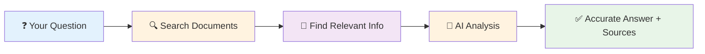

# RAG (Smart Document Search + AI)

## What It Does

RAG is like having a research assistant that actually reads your documents before answering questions. Instead of guessing, it searches through your knowledge base, finds relevant information, then uses AI to give you accurate, source-backed answers.

## What Goes In, What Comes Out

### Input
| Name | Type | Description | Required | Default |
|------|------|-------------|----------|---------|
| `llm` | LLM Connection | Your AI model | Yes | - |
| `vector_store` | Vector Store | Your document database | Yes | - |
| `query` | Text | Question to ask | Yes | - |
| `top_k` | Number | How many documents to search | No | 5 |
| `similarity_threshold` | Number | How closely documents must match (0-1) | No | 0.7 |

### Output
| Name | Type | Description |
|------|------|-------------|
| `answer` | Text | AI answer based on found documents |
| `retrieved_documents` | Array | Source documents used |
| `confidence` | Number | How confident the AI is (0-1) |
| `sources` | Array | Where the information came from |

## Real-World Examples

**📚 Company Knowledge Base**: Ask questions about policies, procedures, or documentation
- *Input*: "What's our vacation policy?"
- *Output*: Accurate answer with policy references

**🔍 Research Assistant**: Get insights from large document collections  
- *Input*: "What are the main findings about climate change?"
- *Output*: Summary with source citations

**💬 Smart Customer Support**: Answer questions using your help documentation
- *Input*: "How do I reset my password?"
- *Output*: Step-by-step instructions from your docs

## How It Works



**Why RAG is Better Than Regular AI:**
- 🎯 **More Accurate**: Uses your actual documents, not AI's training data
- 📚 **Source Citations**: Shows you exactly where answers come from  
- 🚫 **No Hallucinations**: Can't make up facts because it reads real documents first
- 🔄 **Always Current**: Uses your latest documents, not outdated training data

## Quick Start Example

**Goal**: Create a smart FAQ system for your company docs

**Setup**:
1. Upload your documents to **Local Knowledge** 
2. Connect **RAG Node** to search and answer
3. Ask questions like "What's our return policy?"

**Result**: Get accurate answers with source references, just like having an expert who's read all your documentation.

## Configuration Tips

### Essential Settings
- **Top K**: Start with 3-5 documents. More isn't always better
- **Similarity Threshold**: 0.7 is good for most cases, 0.8+ for very specific matches
- **Include Metadata**: Turn on to see document titles and sources

### Simple Setup Guide

**For General Questions** 💬
- Search **5 documents** (good balance of speed and coverage)
- Set similarity to **0.7** (finds related content)
- Turn on **metadata** (shows document titles and sources)

**For Precise Answers** 🎯
- Search **3 documents** (faster, more focused)
- Set similarity to **0.8** (very specific matches only)
- Use for technical or specific factual questions

**For Research & Exploration** 🔍
- Search **8 documents** (comprehensive coverage)
- Set similarity to **0.6** (catches broader connections)
- Great for discovering related topics and concepts

## Browser Compatibility

Works in all major browsers:
- ✅ **Chrome**: Full support with fast vector search
- ✅ **Firefox**: Full support  
- ⚠️ **Safari**: Limited storage for large document collections
- ✅ **Edge**: Full support

## Privacy & Security

- 🔒 **Local Storage**: Your documents stay in your browser
- 🔐 **Encrypted**: Document storage is encrypted for security
- 🚫 **No External Sharing**: Documents never leave your device
- ✅ **Source Validation**: Verifies document authenticity

## Step-by-Step Workflow

### 1. Build Your Knowledge Base
Use **Get All Text From Link** + **Local Knowledge** to create your document collection

### 2. Ask Questions
Connect **RAG Node** and ask natural language questions

### 3. Get Smart Answers
Receive answers with source citations and confidence scores

### 4. Verify Sources
Check the retrieved documents to validate the information

## Try It Yourself

### Example 1: Company FAQ Bot

**What you'll build**: Smart FAQ system that answers questions about your company

**Workflow**:
```
Get All Text From Link → Local Knowledge → RAG Node → Edit Fields
```

**Setup**:
1. **Collect Documents**: Use Get All Text to grab your FAQ pages, policies, etc.
2. **Build Knowledge Base**: Store everything in Local Knowledge
3. **Configure RAG**: Set similarity_threshold to 0.8 for precise answers
4. **Ask Questions**: "What's our return policy?" → Get accurate, sourced answers

**Result**: Instant, accurate answers to company questions with source citations.

### Example 2: Research Assistant

**What you'll build**: AI that searches through research papers and gives sourced answers

**Workflow**:
```
Upload Documents → Local Knowledge → RAG Node → Download As File
```

**Setup**:
- **Top K**: 5 (to get comprehensive coverage)
- **Similarity Threshold**: 0.7 (to catch related concepts)
- **Include Metadata**: Yes (to see paper titles and dates)

**Result**: Ask "What are the main benefits of renewable energy?" and get a comprehensive answer with citations from your research collection.

<details>
<summary>🔍 Advanced Example: Multi-Language Knowledge Base</summary>

**What you'll build**: Knowledge base that works across multiple languages

**Setup**:
- Use embedding models that support multiple languages
- Store documents in different languages in the same knowledge base
- RAG will find relevant documents regardless of language

**Use case**: International company with documentation in multiple languages.

</details>


## Best Practices

### ✅ Do This
- **Start with quality documents**: Better source material = better answers
- **Use descriptive document titles**: Helps with source attribution
- **Test similarity thresholds**: 0.7 is good for most cases, adjust as needed
- **Keep documents updated**: Remove outdated information regularly

### ❌ Avoid This
- Storing too many irrelevant documents (creates noise)
- Setting similarity threshold too high (might miss relevant info)
- Asking questions outside your document scope
- Ignoring source citations (always verify important answers)

## Troubleshooting

### 🎯 "No Relevant Documents Found"
**Problem**: RAG can't find documents related to your question  
**Solution**: Lower similarity_threshold to 0.6 or add more documents to your knowledge base

### 🐌 Slow Search Results
**Problem**: RAG takes too long to find and process documents  
**Solution**: Reduce top_k to 3, or clean up your knowledge base to remove irrelevant documents

### 📄 Poor Answer Quality
**Problem**: Answers don't make sense or miss important information  
**Solution**: Check if your documents actually contain the information you're asking about

### 💾 "Storage Quota Exceeded"
**Problem**: Can't add more documents to knowledge base  
**Solution**: Remove old/irrelevant documents or use document compression

## Limitations to Know

- **Document Quality Matters**: RAG is only as good as the documents you feed it
- **Storage Limits**: Browser storage limits how many documents you can store
- **Processing Time**: Searching large document collections takes 2-5 seconds
- **Question Scope**: Can only answer questions about information in your documents

## Related Nodes

### 🔄 Similar Nodes
- **Q&A Node**: Simpler question-answering without document search
- **Basic LLM Chain**: Basic AI processing without knowledge base

### 🔗 Works Great With
- **Local Knowledge**: Stores your documents for searching
- **Recursive Character Text Splitter**: Breaks documents into searchable chunks
- **Ollama Embeddings**: Creates searchable representations of your documents

### 🛠️ Required Setup
- **Local Knowledge**: Vector database for document storage
- **Ollama Embeddings**: For creating document embeddings
- **Ollama or WbeLLM**: AI model for generating answers

## What's Next?

### 🌱 New to Document Search?
Start with [Local Knowledge](/integrations/builtin/ai/AIDependencies/vectorStore/LocalKnowledge) to build your first document collection

### 🚀 Ready for More?
- Try [Q&A Node](/integrations/builtin/ai/AIAgents/QANode) for simpler question-answering
- Explore [Vector Database Guide](/advanced-ai/examples/understand-vector-databases)
- Check out [real-world RAG examples](/learning/examples/)

---

**💡 Pro Tip**: Start with a small, focused document collection (10-20 documents) to test your RAG setup, then gradually expand as you get comfortable with the results.