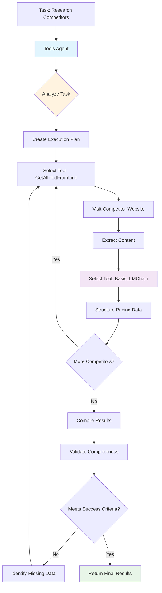

# Tools Agent (Smart Automation)

## What It Does

The Tools Agent is like having an AI assistant that can actually do things. Give it a task like "research competitor pricing" and it will automatically figure out which tools to use, visit websites, extract information, and compile results - all on its own.

## What Goes In, What Comes Out

### Input
| Name | Type | Description | Required | Default |
|------|------|-------------|----------|---------|
| `llm` | LLM Connection | AI model for reasoning and planning | Yes | - |
| `task_description` | Text | What you want the agent to accomplish | Yes | - |
| `available_tools` | Array | Tools the agent can use | Yes | - |
| `max_iterations` | Number | Maximum steps the agent can take | No | 10 |
| `planning_mode` | Text | How to approach the task (adaptive/sequential) | No | "adaptive" |

### Output
| Name | Type | Description |
|------|------|-------------|
| `task_result` | Object | Final results of the task |
| `execution_plan` | Array | Step-by-step log of what the agent did |
| `agent_reasoning` | Array | AI's decision-making process |
| `metadata` | Object | Performance stats and timing |

## Real-World Examples

**🔍 Competitive Research**: "Find pricing info from 5 competitor websites"
- *Agent automatically*: Visits sites, extracts pricing, compares features, creates report

**📊 Market Analysis**: "Research AI startups founded in 2024"
- *Agent automatically*: Searches multiple sources, extracts company data, validates information

**📝 Lead Generation**: "Find contact info for tech companies in San Francisco"
- *Agent automatically*: Searches directories, extracts contacts, validates emails

## How It Works


**What Makes It Smart:**
- 🧠 **AI Planning**: Breaks complex tasks into logical steps
- 🎯 **Smart Tool Choice**: Automatically picks the best tool for each step
- 🔄 **Adaptive**: Changes approach if something doesn't work
- 📊 **Self-Monitoring**: Tracks progress and adjusts strategy
- 🛡️ **Error Recovery**: Tries alternative approaches when things fail

## Quick Start Example

**Goal**: Research competitor pricing across 3 websites

**Setup**:
```json
{
  "task_description": "Visit competitor websites and extract pricing information",
  "available_tools": ["GetAllTextFromLink", "BasicLLMChain", "EditFields"],
  "max_iterations": 8
}
```

**What the Agent Does Automatically**:
1. Plans the research approach
2. Visits each competitor website
3. Extracts pricing information
4. Structures the data consistently
5. Compiles a comparison report

**Result**: Complete competitive analysis without manual intervention.

## Configuration Tips

### Essential Settings
- **Task Description**: Be specific about what you want - "Extract pricing from 3 competitor websites" vs "research competitors"
- **Available Tools**: Only include tools the agent actually needs for the task
- **Max Iterations**: Start with 5-10 steps, increase if needed for complex tasks

### Common Configurations

**For Research Tasks**:
```json
{
  "available_tools": ["GetAllTextFromLink", "BasicLLMChain", "EditFields"],
  "max_iterations": 8,
  "planning_mode": "adaptive"
}
```

**For Data Collection**:
```json
{
  "available_tools": ["GetHTMLFromLink", "EditFields", "Filter"],
  "max_iterations": 6,
  "error_tolerance": "medium"
}
```

**For Complex Analysis**:
```json
{
  "available_tools": ["GetAllTextFromLink", "BasicLLMChain", "RAGNode", "EditFields"],
  "max_iterations": 12,
  "planning_mode": "adaptive"
}
```

## Browser API Integration

### Required Permissions

| Permission | Purpose | Security Impact |
|------------|---------|-----------------|
| `activeTab` | Access and manipulate current browser tab | Can read and modify content in active tabs |
| `tabs` | Create and manage browser tabs for multi-page tasks | Can open, close, and navigate browser tabs |
| `storage` | Store intermediate results and agent state | Stores execution history and temporary data |
| `scripting` | Execute content scripts for web page interaction | Can inject and run scripts in web pages |

### Browser APIs Used

- **Chrome Extension APIs**: Full access to chrome.tabs, chrome.scripting, and chrome.storage
- **Content Script Injection**: Dynamic script injection for web page manipulation
- **Background Processing**: Manages long-running agent tasks without blocking UI
- **Cross-Tab Communication**: Coordinates actions across multiple browser tabs

### Cross-Browser Compatibility

| Feature | Chrome | Firefox | Safari | Edge |
|---------|--------|---------|--------|------|
| Tool Execution | ✅ Full | ✅ Full | ⚠️ Limited | ✅ Full |
| Multi-Tab Management | ✅ Full | ✅ Full | ❌ None | ✅ Full |
| Content Script Injection | ✅ Full | ✅ Full | ⚠️ Limited | ✅ Full |
| Background Processing | ✅ Full | ✅ Full | ✅ Full | ✅ Full |

### Security Considerations

- **Tool Access Control**: Restricts agent to explicitly authorized tools and APIs
- **Execution Sandboxing**: Each tool execution is isolated and monitored
- **Data Privacy**: Intermediate results are encrypted and automatically cleaned up
- **Permission Validation**: Verifies browser permissions before tool execution
- **Rate Limiting**: Prevents excessive API usage and browser resource consumption

## Input/Output Specifications

### Input Data Structure

```json
{
  "task_description": "string - Clear description of the task to accomplish",
  "context": {
    "starting_url": "string - Initial URL or starting point (optional)",
    "constraints": "array - Any limitations or requirements",
    "expected_output": "string - Description of desired output format"
  },
  "tools_config": {
    "tool_name": {
      "parameters": "object - Default parameters for this tool",
      "priority": "number - Tool selection priority"
    }
  },
  "metadata": {
    "user_id": "string - User identifier",
    "session_id": "string - Session context",
    "timestamp": "string - Task initiation time"
  }
}
```

### Output Data Structure

```json
{
  "task_result": "object - The final result of the task execution",
  "execution_plan": [
    {
      "step": "number - Step number in execution sequence",
      "tool": "string - Tool/node used in this step",
      "action": "string - Description of action performed",
      "input": "object - Input data for this step",
      "output": "object - Output data from this step",
      "success": "boolean - Whether step completed successfully",
      "duration": "number - Step execution time in milliseconds"
    }
  ],
  "agent_reasoning": [
    {
      "decision_point": "string - What decision was being made",
      "reasoning": "string - AI reasoning for the decision",
      "alternatives": "array - Other options considered",
      "confidence": "number - Confidence in the decision"
    }
  ],
  "metadata": {
    "timestamp": "2024-01-15T10:30:00Z",
    "total_duration": 45000,
    "steps_executed": 6,
    "tools_used": ["GetAllTextFromLink", "EditFields", "Filter"],
    "success_rate": 0.95,
    "source": "tools_agent"
  }
}
```

## Practical Examples

### Example 1: Competitive Research Automation

**Scenario**: Research competitor pricing and features across multiple websites

**Configuration**:
```json
{
  "llm": "OpenAI GPT-4",
  "task_description": "Visit competitor websites and extract pricing information and key features for SaaS products",
  "available_tools": [
    "GetAllTextFromLink",
    "GetHTMLFromLink",
    "EditFields",
    "Filter",
    "BasicLLMChain"
  ],
  "max_iterations": 12,
  "planning_mode": "adaptive",
  "output_format": "structured"
}
```

**Input Data**:
```json
{
  "task_description": "Visit competitor websites and extract pricing information and key features for SaaS products",
  "context": {
    "starting_url": "https://competitor1.com/pricing",
    "constraints": ["Extract at least 3 pricing tiers", "Include feature comparisons"],
    "expected_output": "Structured comparison table"
  },
  "tools_config": {
    "GetAllTextFromLink": {
      "parameters": {"extract_structured": true},
      "priority": 1
    },
    "BasicLLMChain": {
      "parameters": {"temperature": 0.1},
      "priority": 2
    }
  }
}
```

**Expected Output**:
```json
{
  "task_result": {
    "competitors_analyzed": 3,
    "pricing_data": [
      {
        "company": "Competitor 1",
        "tiers": [
          {"name": "Basic", "price": "$29/month", "features": ["Feature A", "Feature B"]},
          {"name": "Pro", "price": "$79/month", "features": ["Feature A", "Feature B", "Feature C"]}
        ]
      }
    ]
  },
  "execution_plan": [
    {
      "step": 1,
      "tool": "GetAllTextFromLink",
      "action": "Extract pricing page content",
      "input": {"url": "https://competitor1.com/pricing"},
      "output": {"content": "Pricing information extracted..."},
      "success": true,
      "duration": 2500
    },
    {
      "step": 2,
      "tool": "BasicLLMChain",
      "action": "Structure pricing information",
      "input": {"content": "Raw pricing text..."},
      "output": {"structured_data": "Organized pricing tiers..."},
      "success": true,
      "duration": 3200
    }
  ],
  "agent_reasoning": [
    {
      "decision_point": "Tool selection for content extraction",
      "reasoning": "GetAllTextFromLink chosen over GetHTMLFromLink for cleaner text extraction",
      "alternatives": ["GetHTMLFromLink", "Code"],
      "confidence": 0.85
    }
  ],
  "metadata": {
    "timestamp": "2024-01-15T10:30:00Z",
    "total_duration": 45000,
    "steps_executed": 6,
    "tools_used": ["GetAllTextFromLink", "BasicLLMChain", "EditFields"],
    "success_rate": 1.0,
    "source": "tools_agent"
  }
}
```

**Step-by-Step Process**



1. Agent analyzes task and creates execution plan
2. Visits first competitor website using GetAllTextFromLink
3. Extracts and structures pricing information using BasicLLMChain
4. Repeats process for additional competitors
5. Compiles results into structured comparison format
6. Validates completeness against success criteria

### Example 2: Intelligent Form Automation

**Scenario**: Fill out job application forms across multiple career websites with adaptive field detection

**Configuration**:
```json
{
  "llm": "OpenAI GPT-4",
  "task_description": "Complete job application forms on career websites using provided resume data",
  "available_tools": [
    "GetHTMLFromLink",
    "FormFiller",
    "GetSelectedText",
    "InsertText",
    "Filter"
  ],
  "max_iterations": 15,
  "planning_mode": "sequential",
  "error_tolerance": "medium"
}
```

**Workflow Integration**:
```
Tools Agent → Filter → EditFields → DownloadAsFile
     ↓           ↓         ↓            ↓
multi_step_execution → validation → formatting → report_generation
```

**Complete Example**:
This pattern demonstrates how the Tools Agent can handle complex, multi-step automation tasks that require intelligent adaptation to different website structures and form layouts.

## Examples

### Basic Usage

This example demonstrates the fundamental usage of the ToolsAgentNode node in a typical workflow scenario.

**Configuration:**

```json
{
  "prompt": "example_value",
  "temperature": true
}
```

**Input Data:**

```json
{
  "data": "sample input data"
}
```

**Expected Output:**

```json
{
  "result": "processed output data"
}
```

### Advanced Usage

This example shows more complex configuration options and integration patterns.

**Configuration:**

```json
{
  "parameter1": "advanced_value",
  "parameter2": false,
  "advancedOptions": {
    "option1": "value1",
    "option2": 100
  }
}
```

### Integration Example

Example showing how this node integrates with other workflow nodes:

1. **Previous Node** → **ToolsAgentNode** → **Next Node**
2. Data flows through the workflow with appropriate transformations
3. Error handling and validation at each step

## Integration Patterns

### Common Node Combinations

#### Pattern 1: Research and Analysis Pipeline

- **Nodes**: Tools Agent → Filter → EditFields → DownloadAsFile
- **Use Case**: Complex research tasks with intelligent tool selection and result compilation
- **Configuration Tips**: Use adaptive planning mode for maximum flexibility

#### Pattern 2: Multi-Source Data Collection

- **Nodes**: Tools Agent → Merge → BasicLLMChain → LocalKnowledge
- **Use Case**: Collect data from multiple sources and integrate into knowledge base
- **Data Flow**: Autonomous collection → Data merging → AI analysis → Knowledge storage

### Best Practices

- **Performance**: Limit max_iterations to prevent infinite loops and control execution time
- **Error Handling**: Use appropriate error_tolerance settings based on task criticality
- **Data Validation**: Always validate agent outputs before using in downstream processes
- **Resource Management**: Monitor browser resource usage during complex agent tasks

## Troubleshooting

### Common Issues

#### Issue: Agent Gets Stuck in Loops

- **Symptoms**: Agent repeats the same actions without making progress
- **Causes**: Unclear task description, insufficient success criteria, or tool limitations
- **Solutions**:
  1. Provide more specific task descriptions and success criteria
  2. Reduce max_iterations to force completion
  3. Add explicit constraints to guide agent behavior
  4. Review available tools for task appropriateness
- **Prevention**: Test agent behavior with clear, measurable objectives

#### Issue: Tool Selection Errors

- **Symptoms**: Agent chooses inappropriate tools for specific tasks
- **Causes**: Insufficient tool descriptions, conflicting tool capabilities, or unclear task requirements
- **Solutions**:
  1. Provide detailed tool descriptions and capabilities
  2. Set tool preferences in configuration
  3. Limit available tools to task-appropriate options
  4. Improve task description clarity
- **Prevention**: Carefully curate available tools for specific use cases

### Browser-Specific Issues

#### Chrome

- Extension manifest v3 requirements may limit some tool capabilities
- Use service workers for background agent processing

#### Firefox

- WebExtension API differences may affect tool availability
- Ensure proper error handling for unsupported browser features

### Performance Issues

- **Slow Execution**: Complex tasks may take significant time; implement progress monitoring
- **Memory Usage**: Long-running agents may consume browser memory; implement cleanup procedures
- **Rate Limiting**: Multiple API calls may trigger rate limits; implement intelligent throttling

## Limitations & Constraints

### Technical Limitations

- **Tool Dependencies**: Agent effectiveness depends on available tool quality and capabilities
- **Planning Complexity**: Very complex tasks may exceed AI planning capabilities
- **Execution Time**: Long-running tasks may timeout or impact browser performance

### Browser Limitations

- **Permission Constraints**: Agent capabilities are limited by browser extension permissions
- **Cross-Origin Restrictions**: Some websites may block automated interactions
- **Resource Limits**: Browser memory and processing constraints may limit agent complexity

### Data Limitations

- **Context Windows**: LLM token limits may restrict agent reasoning for very complex tasks
- **Tool Integration**: Not all workflow nodes may be suitable for agent automation
- **Real-Time Adaptation**: Agent may not handle rapidly changing web content effectively

## Key Terminology

**LLM**: Large Language Model - AI models trained on vast amounts of text data

**RAG**: Retrieval-Augmented Generation - AI technique combining information retrieval with text generation

**Vector Store**: Database optimized for storing and searching high-dimensional vectors

**Embeddings**: Numerical representations of text that capture semantic meaning

**Prompt**: Input text that guides AI model behavior and response generation

**Temperature**: Parameter controlling randomness in AI responses (0.0-1.0)

**Tokens**: Units of text processing used by AI models for input and output measurement

## Search & Discovery

### Keywords

- artificial intelligence
- machine learning
- natural language processing
- LLM
- AI agent
- chatbot
- text generation
- language model

### Common Search Terms

- "ai"
- "llm"
- "gpt"
- "chat"
- "generate"
- "analyze"
- "understand"
- "process text"
- "smart"
- "intelligent"

### Primary Use Cases

- content analysis
- text generation
- question answering
- document processing
- intelligent automation
- knowledge extraction

