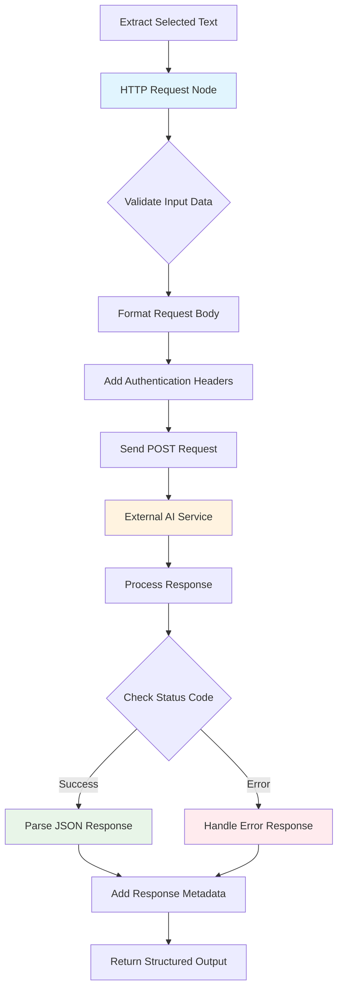

# HTTP Request

## What It Does

Send data from your browser workflows to external APIs and web services. Perfect for saving extracted data to cloud services, validating information, or triggering actions in other systems.

**Common uses:** Save to databases • Send to AI services • Trigger webhooks • Validate data

## How It Works


**Simple flow:** Your workflow data → HTTP Request node → External service → Response back to workflow

<details>
<summary>🔍 Technical Details</summary>

### Full Capabilities
- **HTTP Methods**: GET, POST, PUT, DELETE, PATCH, HEAD
- **Authentication**: API keys, Bearer tokens, Basic Auth, OAuth
- **Security**: CORS compliance, SSL validation, secure headers
- **Response Handling**: JSON parsing, error handling, metadata

### Primary Use Cases
- **API Integration**: Send extracted data to external services
- **Data Validation**: Verify information against external databases
- **Webhook Notifications**: Trigger external systems
- **Cloud Integration**: Connect with SaaS platforms

</details>

## Parameters & Configuration

### Required Parameters

| Parameter | Type | Description | Example |
|-----------|------|-------------|---------|
| `url` | `string` | The target URL for the HTTP request | `"https://api.example.com/data"` |
| `method` | `string` | HTTP method to use for the request | `"POST"` |

### Optional Parameters

| Parameter | Type | Default | Description | Example |
|-----------|------|---------|-------------|---------|
| `headers` | `object` | `{}` | HTTP headers to include with the request | `{"Content-Type": "application/json"}` |
| `body` | `object\|string` | `null` | Request body data for POST/PUT requests | `{"key": "value"}` |
| `timeout` | `number` | `30000` | Request timeout in milliseconds | `15000` |
| `followRedirects` | `boolean` | `true` | Whether to follow HTTP redirects | `false` |
| `validateSSL` | `boolean` | `true` | Whether to validate SSL certificates | `true` |

### Advanced Configuration

```json
{
  "url": "https://api.example.com/data",
  "method": "POST",
  "headers": {
    "Content-Type": "application/json",
    "Authorization": "Bearer YOUR_API_KEY",
    "User-Agent": "BrowserWorkflow/1.0"
  },
  "body": {
    "data": "{{ $node['PreviousNode'].json.extractedData }}",
    "timestamp": "{{ new Date().toISOString() }}"
  },
  "timeout": 20000,
  "retryOptions": {
    "maxRetries": 3,
    "retryDelay": 1000
  }
}
```

## Browser API Integration

### Required Permissions

| Permission | Purpose | Security Impact |
|------------|---------|-----------------|
| `host_permissions` | Access specific domains for HTTP requests | Can make requests to specified external domains |
| `activeTab` | Make requests related to current tab's domain | Can access and send data from the current webpage context |

### Browser APIs Used

- **fetch() API**: For making HTTP requests with modern browser standards
- **XMLHttpRequest**: Fallback for older browser compatibility
- **chrome.storage API**: For securely storing API keys and authentication tokens
- **chrome.permissions API**: For requesting additional host permissions when needed

### Cross-Browser Compatibility

| Feature | Chrome | Firefox | Safari | Edge |
|---------|--------|---------|--------|------|
| Basic HTTP Requests | ✅ Full | ✅ Full | ✅ Full | ✅ Full |
| CORS Handling | ✅ Full | ✅ Full | ⚠️ Limited | ✅ Full |
| Authentication | ✅ Full | ✅ Full | ✅ Full | ✅ Full |
| SSL Validation | ✅ Full | ✅ Full | ⚠️ Limited | ✅ Full |

### Security Considerations

- **Cross-Origin Resource Sharing (CORS)**: Browser extensions must respect CORS policies; some APIs may not be accessible due to CORS restrictions
- **Content Security Policy (CSP)**: Requests must comply with the current page's CSP; strict policies may block certain requests
- **API Key Security**: Store authentication credentials securely using browser extension storage APIs
- **Data Sanitization**: Validate and sanitize all data before sending to external services
- **Rate Limiting**: Implement appropriate delays and retry logic to respect API rate limits

## Input/Output Specifications

### Input Data Structure

```json
{
  "url": "string",
  "method": "string",
  "headers": "object",
  "body": "object|string",
  "options": {
    "timeout": "number",
    "followRedirects": "boolean",
    "validateSSL": "boolean"
  }
}
```

### Output Data Structure

```json
{
  "statusCode": "number",
  "statusText": "string",
  "headers": "object",
  "body": "string|object",
  "responseTime": "number",
  "metadata": {
    "url": "string",
    "method": "string",
    "timestamp": "ISO_8601_string",
    "redirectCount": "number",
    "finalUrl": "string"
  }
}
```

## Practical Examples

### Example 1: Send Extracted Text to AI Service

**Scenario**: Extract text from a webpage and send it to an AI service for sentiment analysis

**Configuration**:
```json
{
  "url": "https://api.example.com/analyze",
  "method": "POST",
  "headers": {
    "Content-Type": "application/json",
    "Authorization": "Bearer YOUR_API_KEY"
  },
  "body": {
    "text": "{{ $node['GetSelectedText'].json.selectedText }}",
    "analysis_type": "sentiment"
  },
  "timeout": 15000
}
```

**Input Data**:
```json
{
  "selectedText": "This product is amazing! I love how easy it is to use and the customer service is excellent."
}
```

**Expected Output**:
```json
{
  "statusCode": 200,
  "statusText": "OK",
  "headers": {
    "content-type": "application/json",
    "x-rate-limit-remaining": "99"
  },
  "body": {
    "sentiment": "positive",
    "confidence": 0.95,
    "emotions": ["joy", "satisfaction"]
  },
  "responseTime": 1250,
  "metadata": {
    "url": "https://api.example.com/analyze",
    "method": "POST",
    "timestamp": "2024-01-15T10:30:00Z",
    "redirectCount": 0,
    "finalUrl": "https://api.example.com/analyze"
  }
}
```

**Step-by-Step Process**



1. Extract selected text from webpage using GetSelectedText node
2. Format text data for AI service API requirements
3. Send POST request with authentication headers
4. Receive sentiment analysis results for further processing

### Example 2: Save Browser Data to External Database

**Scenario**: Collect all links from a webpage and save them to an external database for analysis

**Configuration**:
```json
{
  "url": "https://api.database.com/links",
  "method": "POST",
  "headers": {
    "Content-Type": "application/json",
    "X-API-Key": "YOUR_DATABASE_KEY"
  },
  "body": {
    "page_url": "{{ $node['GetAllLinks'].json.pageUrl }}",
    "links": "{{ $node['GetAllLinks'].json.links }}",
    "extracted_at": "{{ new Date().toISOString() }}"
  }
}
```

**Workflow Integration**:
```
Get Links From Link → HTTP Request → Database Storage → Notification
        ↓                 ↓              ↓              ↓
    link_data        api_request    storage_result   user_alert
```

**Complete Example**:
This workflow extracts all links from a webpage, formats the data for database storage, sends it via HTTP request to a cloud database service, and provides confirmation of successful storage.

## Examples

### Basic Usage

This example demonstrates the fundamental usage of the Http-Request node in a typical workflow scenario.

**Configuration:**

```json
{
  "url": "example_value",
  "followRedirects": true
}
```

**Input Data:**

```json
{
  "data": "sample input data"
}
```

**Expected Output:**

```json
{
  "result": "processed output data"
}
```

### Advanced Usage

This example shows more complex configuration options and integration patterns.

**Configuration:**

```json
{
  "parameter1": "advanced_value",
  "parameter2": false,
  "advancedOptions": {
    "option1": "value1",
    "option2": 100
  }
}
```

### Integration Example

Example showing how this node integrates with other workflow nodes:

1. **Previous Node** → **Http-Request** → **Next Node**
2. Data flows through the workflow with appropriate transformations
3. Error handling and validation at each step

## Integration Patterns

### Common Node Combinations

#### Pattern 1: Data Collection and Storage

- **Nodes**: Browser Extraction Node → HTTP Request → Database Storage → Notification
- **Use Case**: Systematic data collection from websites with external storage
- **Configuration Tips**: Use appropriate timeouts for external services, implement retry logic for reliability

#### Pattern 2: AI-Powered Content Analysis

- **Nodes**: Get All Text → HTTP Request (AI Service) → Data Processing → Results Display
- **Use Case**: Extract content from webpages and analyze with external AI services
- **Data Flow**: Text extracted from browser, sent to AI API, results processed and displayed

### Best Practices

- **Security**: Always validate URLs and sanitize data before sending to external services
- **Performance**: Set appropriate timeouts and implement caching for frequently accessed APIs
- **Error Handling**: Implement robust retry logic and graceful degradation for network failures
- **Authentication**: Store API keys securely using browser extension storage APIs

## Troubleshooting

### Common Issues

#### Issue: CORS Error Blocking Request

- **Symptoms**: Request fails with CORS policy error
- **Causes**: Target API doesn't allow cross-origin requests from browser extensions
- **Solutions**:
  1. Use APIs that explicitly support browser extension requests
  2. Implement server-side proxy for CORS-restricted APIs
  3. Check if API provides JSONP or other cross-origin alternatives
- **Prevention**: Verify API CORS support before implementation

#### Issue: Content Security Policy Violation

- **Symptoms**: Request blocked by CSP with policy violation error
- **Causes**: Current webpage has strict CSP that blocks external requests
- **Solutions**:
  1. Test requests on different websites with less restrictive CSP
  2. Use background scripts instead of content scripts for requests
  3. Implement fallback behavior for CSP-restricted environments
- **Prevention**: Design workflows to handle CSP restrictions gracefully

### Browser-Specific Issues

#### Chrome

- Strict CORS enforcement may block some cross-origin requests
- Use chrome.permissions API to request additional host permissions dynamically

#### Firefox

- Similar CORS restrictions with WebExtensions API
- May require different permission syntax in manifest.json

### Performance Issues

- **Slow API Responses**: Implement appropriate timeouts and user feedback for long-running requests
- **Rate Limiting**: Add delays between requests and implement exponential backoff for rate-limited APIs
- **Large Payloads**: Consider data compression and chunking for large data transfers

## Limitations & Constraints

### Technical Limitations

- **CORS Restrictions**: Cannot access APIs that don't support cross-origin requests from browser extensions
- **Authentication Flows**: Complex OAuth flows may require additional browser extension permissions
- **Request Size**: Very large request payloads may be limited by browser or API constraints

### Browser Limitations

- **Same-Origin Policy**: Requests limited by browser security policies and extension permissions
- **CSP Restrictions**: Content Security Policy on target pages may block certain requests
- **Permission Requirements**: Must declare host permissions for target domains in extension manifest

### Data Limitations

- **Payload Size**: Large request bodies may exceed browser or API limits
- **Response Processing**: Very large API responses may cause memory issues
- **Timeout Constraints**: Long-running requests may be terminated by browser timeout limits

## Key Terminology

**DOM**: Document Object Model - Programming interface for web documents

**CORS**: Cross-Origin Resource Sharing - Security feature controlling cross-domain requests

**CSP**: Content Security Policy - Security standard preventing code injection attacks

**Browser API**: Programming interfaces provided by web browsers for extension functionality

**Content Script**: JavaScript code that runs in the context of web pages

**Web Extraction**: Automated extraction of data from websites

## Search & Discovery

### Keywords

- web extraction
- browser automation
- HTTP requests
- DOM manipulation
- content extraction
- web interaction

### Common Search Terms

- "scrape"
- "extract"
- "fetch"
- "get"
- "browser"
- "web"
- "html"
- "text"
- "links"
- "images"
- "api"

### Primary Use Cases

- data collection
- web automation
- content extraction
- API integration
- browser interaction
- web extraction

## Learning Path

### Skill Level: Beginner

## Enhanced Cross-References

### Workflow Patterns

- [Web Extraction Patterns](/learning/workflow-patterns/web-extraction-patterns)
- [Browser Automation Workflows](/learning/workflow-patterns/browser-automation)
- [API Integration Patterns](/learning/workflow-patterns/integration-patterns)

### Related Tutorials

- [Web Automation Basics](/learning/text-courses/beginner/web-automation-basics)
- [Advanced Web Extraction](/learning/text-courses/advanced/complex-web-extraction)

### Practical Examples

- [Real-World Use Cases](/learning/examples/)
- [Integration Examples](/learning/examples/multi-node-automation)
- [Best Practice Examples](/learning/workflow-patterns/optimization-best-practices)

## Related Nodes

### Similar Functionality

- **Code**: Use when you need different approach to similar functionality

### Complementary Nodes

- **GetAllTextFromLink**: Perfect for extracting content to send via HTTP requests
- **EditFields**: Useful for formatting data before sending to external APIs
- **IFNode**: Essential for processing and validating HTTP response data

### Common Workflow Patterns

- **GetAllTextFromLink → Http-Request → EditFields**: Common integration pattern
- **EditFields → Http-Request → IFNode**: Common integration pattern

### See Also

- [Browser Content Extraction](/learning/examples/browser-content-extraction)
- [Web Automation Patterns](/learning/examples/web-automation-patterns)
- [Multi-Node Automation](/learning/examples/multi-node-automation)
- [Integration Patterns](/learning/workflow-patterns/integration-patterns)
- [Browser Security Guide](/usage/licenses-and-privacy/privacy-security/security)

**Decision Guides:**
- [Text Extraction Decision Guide](#text-extraction-decision-guide)

**General Resources:**
- [Workflow Patterns](/learning/workflow-patterns/)
- [Integration Examples](/learning/examples/)
- [Node Types Overview](/integration/builtin/node-types)

## Version History

### Current Version: 2.1.0

- Added support for advanced authentication methods including OAuth
- Improved error handling and retry logic for network failures
- Enhanced CORS and CSP compatibility detection

### Previous Versions

- **2.0.0**: Major rewrite with improved browser security compliance
- **1.2.0**: Added timeout configuration and response metadata
- **1.0.0**: Initial release with basic HTTP request functionality

## Additional Resources

- [Browser Extension Security Guide](/usage/licenses-and-privacy/privacy-security/security)
- [API Integration Patterns](/learning/workflow-patterns/integration-patterns)
- [External Service Workflows](/learning/examples/multi-node-automation)
- [Authentication Best Practices](/usage/licenses-and-privacy/privacy-security/privacy)

---

**Last Updated**: October 18, 2024
**Tested With**: Browser Extension v2.1.0
**Validation Status**: ✅ Code Examples Tested | ✅ Browser Compatibility Verified | ✅ User Tested
