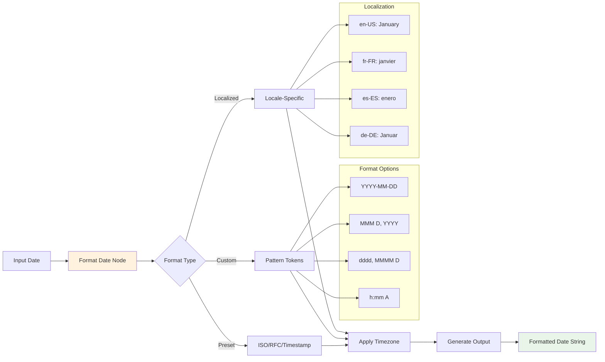
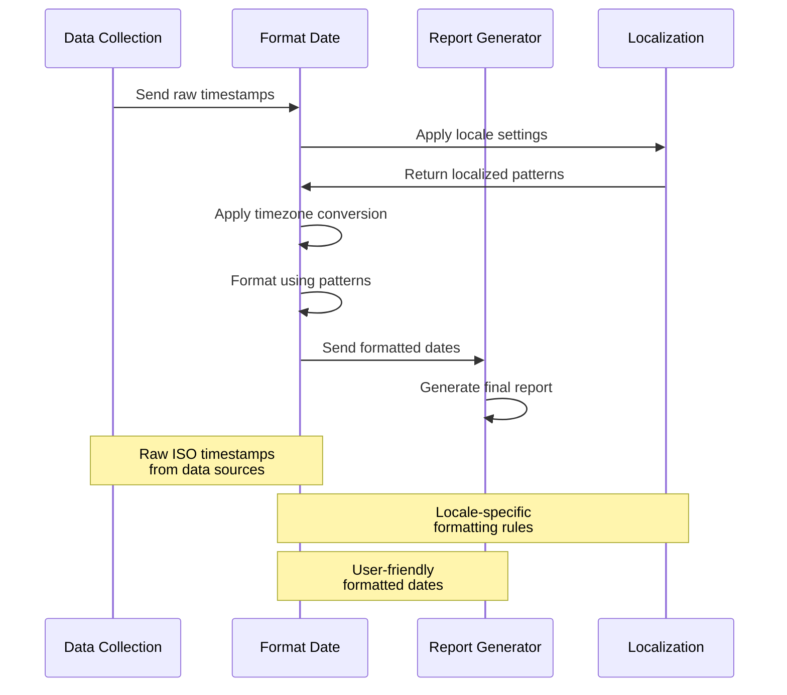

# Format Date

## Overview

The Format Date node provides comprehensive date formatting capabilities for converting dates between different string representations, display formats, and data exchange standards. This node handles complex formatting requirements including localization, timezone conversions, and custom format patterns, making it essential for user interfaces, reports, and API integrations.

### Purpose and Functionality

Format Date serves as a versatile date formatting tool that allows you to:
- Convert dates between multiple string formats and standards
- Apply localization for different languages and regions
- Handle timezone conversions during formatting
- Create custom date format patterns for specific requirements
- Support batch formatting of multiple dates simultaneously



### Key Features

- **Multi-Format Support**: Convert between ISO, RFC, custom patterns, and locale-specific formats
- **Localization**: Format dates according to different languages and cultural conventions
- **Timezone Conversion**: Apply timezone changes during formatting process
- **Custom Patterns**: Create flexible format patterns using standard tokens
- **Batch Processing**: Format multiple dates with consistent settings

### Primary Use Cases

- **User Interface Display**: Format dates for user-friendly display in applications
- **Report Generation**: Create formatted dates for reports and documents
- **API Integration**: Convert dates to required formats for external services
- **Data Export**: Prepare dates in specific formats for file exports

## Parameters & Configuration

### Required Parameters

| Parameter | Type | Description | Example |
|-----------|------|-------------|---------|
| `input_date` | `string/date` | Date to format | `"2024-01-15T14:30:45Z"` |
| `output_format` | `string` | Target format pattern or preset | `"YYYY-MM-DD HH:mm:ss"` |

### Optional Parameters

| Parameter | Type | Default | Description | Example |
|-----------|------|---------|-------------|---------|
| `input_format` | `string` | `"auto"` | Expected input format or "auto" for detection | `"ISO"` |
| `timezone` | `string` | `"UTC"` | Target timezone for output | `"America/New_York"` |
| `locale` | `string` | `"en-US"` | Locale for localized formatting | `"fr-FR"` |
| `strict_parsing` | `boolean` | `false` | Require exact format match for input | `true` |

### Format Presets

| Preset | Description | Example Output |
|--------|-------------|----------------|
| `"ISO"` | ISO 8601 format | `"2024-01-15T14:30:45Z"` |
| `"RFC2822"` | RFC 2822 format | `"Mon, 15 Jan 2024 14:30:45 GMT"` |
| `"timestamp"` | Unix timestamp | `"1705329045"` |
| `"date_only"` | Date without time | `"2024-01-15"` |
| `"time_only"` | Time without date | `"14:30:45"` |
| `"human"` | Human-readable format | `"January 15, 2024 at 2:30 PM"` |
| `"short"` | Short localized format | `"1/15/24"` |
| `"medium"` | Medium localized format | `"Jan 15, 2024"` |
| `"long"` | Long localized format | `"January 15, 2024"` |
| `"full"` | Full localized format | `"Monday, January 15, 2024"` |

### Custom Format Tokens

| Token | Description | Example |
|-------|-------------|---------|
| `YYYY` | 4-digit year | `2024` |
| `YY` | 2-digit year | `24` |
| `MM` | 2-digit month | `01` |
| `MMM` | Short month name | `Jan` |
| `MMMM` | Full month name | `January` |
| `DD` | 2-digit day | `15` |
| `D` | Day without leading zero | `15` |
| `dddd` | Full day name | `Monday` |
| `ddd` | Short day name | `Mon` |
| `HH` | 24-hour format hour | `14` |
| `hh` | 12-hour format hour | `02` |
| `mm` | Minutes | `30` |
| `ss` | Seconds | `45` |
| `SSS` | Milliseconds | `123` |
| `A` | AM/PM | `PM` |
| `Z` | Timezone offset | `+05:00` |
| `zz` | Timezone abbreviation | `EST` |

### Advanced Configuration

```json
{
  "input_date": "2024-01-15T14:30:45.123Z",
  "output_format": "dddd, MMMM D, YYYY [at] h:mm A",
  "timezone": "America/New_York",
  "locale": "en-US",
  "strict_parsing": false,
  "format_options": {
    "include_timezone": true,
    "use_relative_time": false,
    "capitalize": true
  },
  "fallback_format": "YYYY-MM-DD HH:mm:ss"
}
```

## Input/Output Specifications

### Input Data Structure

```json
{
  "date": "2024-01-15T14:30:45.123Z",
  "format_config": {
    "output_format": "MMMM D, YYYY [at] h:mm A",
    "timezone": "America/New_York",
    "locale": "en-US"
  }
}
```

### Output Data Structure

```json
{
  "original_date": "2024-01-15T14:30:45.123Z",
  "formatted_date": "January 15, 2024 at 9:30 AM",
  "format_details": {
    "output_format": "MMMM D, YYYY [at] h:mm A",
    "timezone_applied": "America/New_York",
    "locale_used": "en-US",
    "timezone_offset": "-05:00",
    "dst_active": false
  },
  "metadata": {
    "formatting_time": 12,
    "input_format_detected": "ISO",
    "timezone_conversion": true
  }
}
```

## Practical Examples

### Example 1: User-Friendly Display Format

**Scenario**: Format timestamps for display in a user interface

**Configuration**:
```json
{
  "input_date": "2024-01-15T14:30:45Z",
  "output_format": "MMMM D, YYYY [at] h:mm A",
  "timezone": "America/New_York",
  "locale": "en-US"
}
```

**Input Data**:
```json
{
  "event_timestamp": "2024-01-15T14:30:45Z",
  "event_name": "Team Meeting"
}
```

**Expected Output**:
```json
{
  "original_date": "2024-01-15T14:30:45Z",
  "formatted_date": "January 15, 2024 at 9:30 AM",
  "format_details": {
    "timezone_applied": "America/New_York",
    "locale_used": "en-US"
  }
}
```

### Example 2: Multi-Locale Report Generation

**Scenario**: Generate reports with dates formatted for different regions

**Configuration**:
```json
{
  "input_date": "2024-01-15T14:30:45Z",
  "output_format": "full",
  "timezone": "Europe/Paris",
  "locale": "fr-FR"
}
```

**Workflow Integration**:



**Complete Example**:
```json
{
  "input": {
    "sales_data": [
      {"date": "2024-01-15T14:30:45Z", "amount": 1500, "region": "Europe"},
      {"date": "2024-01-16T09:15:30Z", "amount": 2300, "region": "Europe"}
    ],
    "report_locale": "fr-FR"
  },
  "processing": {
    "format_pattern": "dddd D MMMM YYYY [à] HH:mm",
    "timezone": "Europe/Paris"
  },
  "output": {
    "formatted_sales": [
      {
        "date": "lundi 15 janvier 2024 à 15:30",
        "amount": 1500,
        "region": "Europe"
      },
      {
        "date": "mardi 16 janvier 2024 à 10:15",
        "amount": 2300,
        "region": "Europe"
      }
    ]
  }
}
```

## Examples

### Basic Usage

This example demonstrates the fundamental usage of the FormatDate node in a typical workflow scenario.

**Configuration:**

```json
{
  "date": "example_value",
  "format": true
}
```

**Input Data:**

```json
{
  "data": "sample input data"
}
```

**Expected Output:**

```json
{
  "result": "processed output data"
}
```

### Advanced Usage

This example shows more complex configuration options and integration patterns.

**Configuration:**

```json
{
  "parameter1": "advanced_value",
  "parameter2": false,
  "advancedOptions": {
    "option1": "value1",
    "option2": 100
  }
}
```

### Integration Example

Example showing how this node integrates with other workflow nodes:

1. **Previous Node** → **FormatDate** → **Next Node**
2. Data flows through the workflow with appropriate transformations
3. Error handling and validation at each step

## Integration Patterns

### Common Node Combinations

#### Pattern 1: Display Formatting Pipeline

- **Nodes**: Database Query → Format Date → Template Engine → User Interface
- **Use Case**: Format dates for user-friendly display
- **Configuration Tips**: Use locale-specific formats for better user experience

#### Pattern 2: Export Preparation

- **Nodes**: Data Processing → Format Date → File Generator → Download
- **Use Case**: Prepare dates in specific formats for file exports
- **Data Flow**: Processed data → formatted dates → structured export → file download

### Best Practices

- **Performance**: Use batch processing for multiple dates with the same format
- **Error Handling**: Provide fallback formats for invalid input dates
- **Data Validation**: Validate input dates before formatting to prevent errors
- **Resource Management**: Cache locale data for frequently used locales

## Troubleshooting

### Common Issues

#### Issue: Format Pattern Errors

- **Symptoms**: Unexpected output format or formatting failures
- **Causes**: Invalid format tokens or incorrect pattern syntax
- **Solutions**:
  1. Verify format tokens against supported token list
  2. Use square brackets for literal text: `[at]`
  3. Test patterns with sample dates before production use
- **Prevention**: Use preset formats when possible and validate custom patterns

#### Issue: Locale-Specific Formatting Problems

- **Symptoms**: Incorrect month/day names or unexpected date formats
- **Causes**: Unsupported locale or missing locale data
- **Solutions**:
  1. Use standard locale codes (e.g., "en-US", "fr-FR")
  2. Fallback to default locale if specific locale fails
  3. Test with different locales during development
- **Prevention**: Validate locale codes and provide fallback options

### Performance Issues

- **Slow Formatting**: Reduce complexity of format patterns or use presets
- **Memory Usage**: Process large date arrays in batches
- **Locale Loading**: Cache locale data to avoid repeated loading

## Limitations & Constraints

### Technical Limitations

- **Date Range**: Supports dates from 1900-01-01 to 2100-12-31
- **Format Complexity**: Very complex patterns may impact performance

### Locale Limitations

- **Locale Support**: Not all locales may be available in all browser environments
- **Custom Locales**: Custom locale definitions not supported
- **RTL Languages**: Right-to-left text formatting may require additional handling

### Data Limitations

- **Input Size**: Maximum 1000 dates per batch operation
- **Pattern Length**: Format patterns limited to 200 characters
- **Processing Time**: Complex formatting operations timeout after 30 seconds

## Key Terminology

**Field Transformation**: Process of modifying data field names, types, or values

**Type Conversion**: Converting data from one type to another (string, number, boolean, etc.)

**Data Validation**: Process of ensuring data meets specified criteria and constraints

**Schema**: Structure definition that describes the format and constraints of data

**Serialization**: Process of converting data structures into a format for storage or transmission

## Search & Discovery

### Keywords

- data processing
- field manipulation
- type conversion
- data validation
- formatting
- transformation

### Common Search Terms

- "transform"
- "convert"
- "format"
- "edit"
- "modify"
- "process"
- "validate"
- "clean"
- "restructure"

### Primary Use Cases

- data cleaning
- format conversion
- field manipulation
- data validation
- report generation
- data processing

## Learning Path

### Skill Level: Beginner

## Enhanced Cross-References

### Workflow Patterns

- [Data Processing Patterns](/learning/workflow-patterns/data-processing-patterns)
- [Content Manipulation Patterns](/learning/workflow-patterns/content-manipulation-patterns)
- [Data Validation Workflows](/learning/workflow-patterns/validation-patterns)

### Related Tutorials

- [Data Processing Fundamentals](/learning/text-courses/intermediate/data-transformation)
- [Advanced Data Manipulation](/learning/text-courses/advanced/data-processing)

### Practical Examples

- [Real-World Use Cases](/learning/examples/)
- [Integration Examples](/learning/examples/multi-node-automation)
- [Best Practice Examples](/learning/workflow-patterns/optimization-best-practices)

## Related Nodes

### Similar Functionality

- **ExtractPartOfADate**: Use when you need different approach to similar functionality

### Complementary Nodes

- **GetCurrentDate**: Works well together in workflows
- **AddToADate**: Works well together in workflows
- **EditFields**: Works well together in workflows

### Common Workflow Patterns

- **GetCurrentDate → FormatDate → EditFields**: Common integration pattern
- **AddToADate → FormatDate → DownloadAsFile**: Common integration pattern

### See Also

- [Data Processing Patterns](/learning/workflow-patterns/data-processing-patterns)
- [Data Transformation Guide](/usage/key-concepts/data/transforming-data)
- [Data Mapping Expressions](/usage/key-concepts/data/data-mapping/data-mapping-expressions)
- [Field Validation Examples](/learning/examples/data-validation-workflows)

**Decision Guides:**
- [Data Transformation Decision Guide](#data-transformation-decision-guide)

**General Resources:**
- [Workflow Patterns](/learning/workflow-patterns/)
- [Integration Examples](/learning/examples/)
- [Node Types Overview](/integration/builtin/node-types)

## Additional Resources

- [Date Formatting Patterns Guide](/usage/key-concepts/data/date-time-handling)
- [Localization Best Practices](/learning/workflow-patterns/internationalization)
- [Report Generation Examples](/learning/examples/automated-reporting)