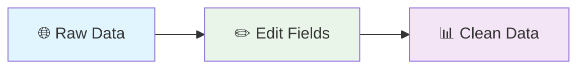

# Edit Fields

**What it does:** Transforms and cleans up data by renaming fields, converting data types, and applying validation rules.

**Perfect for:** Data cleaning • API response processing • Form data preparation • Field standardization

## What It Does

- **Rename fields** - Change field names to match your needs
- **Convert data types** - Turn strings into numbers, dates, etc.
- **Clean values** - Remove extra spaces, fix formatting
- **Add validation** - Ensure data meets your requirements

## How It Works



**Simple flow:** Raw data → Edit Fields node → Clean, formatted data

## Common Operations

**Rename Fields**
```json
{"action": "rename", "from": "user_name", "to": "username"}
```

**Convert Types**
```json
{"action": "convert", "field": "age", "type": "number"}
```

**Clean Values**
```json
{"action": "transform", "field": "email", "function": "toLowerCase"}
```

**Add New Fields**
```json
{"action": "add", "field": "timestamp", "value": "{{now}}"}
```

## Real Example

**Before (messy data):**
```json
{
  "user_name": "Alice Smith",
  "age": "28",
  "email": "ALICE@COMPANY.COM"
}
```

**After (clean data):**
```json
{
  "username": "Alice Smith",
  "age": 28,
  "email": "alice@company.com"
}
```

**What happened:** Renamed "user_name" to "username", converted age from text to number, and made email lowercase.

## Common Use Cases

**Clean web scraped data** - Fix messy field names and data types from websites  
**Prepare API data** - Format data before sending to external services  
**Process form submissions** - Clean and validate user input data  
**Standardize data** - Make data consistent across different sources

## Quick Troubleshooting

**Field not found errors:** Check that field names match exactly (case-sensitive)  
**Type conversion fails:** Make sure the data can actually be converted (e.g., "abc" can't become a number)  
**Operations not working:** Verify your JSON syntax is correct

## What's Next?

**Related nodes:** [Filter](/integrations/builtin/flow/Filter/) • [Merge](/integrations/builtin/flow/Merge/) • [HTTP Request](/integrations/builtin/core/Http-Request/)

**Common workflows:** [Data Processing Patterns](/learning/workflow-patterns/data-processing-patterns/) • [Web Scraping Workflows](/learning/workflow-patterns/web-scraping-patterns/) • [API Integration](/learning/workflow-patterns/integration-patterns/)

**Learn more:** [Data Transformation Guide](/learning/text-courses/intermediate/data-transformation/) • [Multi-Step Workflows](/learning/text-courses/intermediate/multi-step-workflows/)