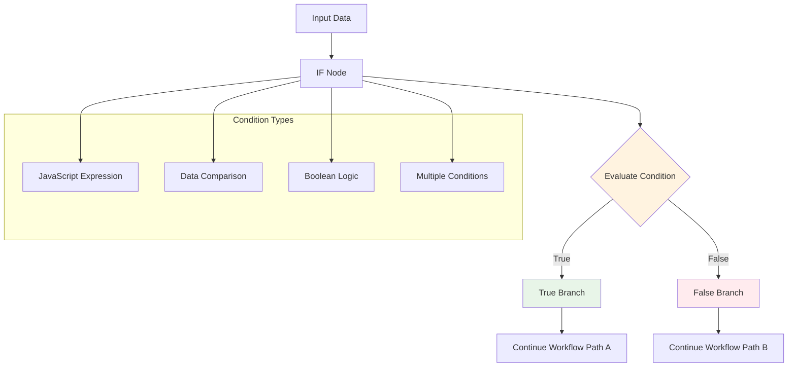
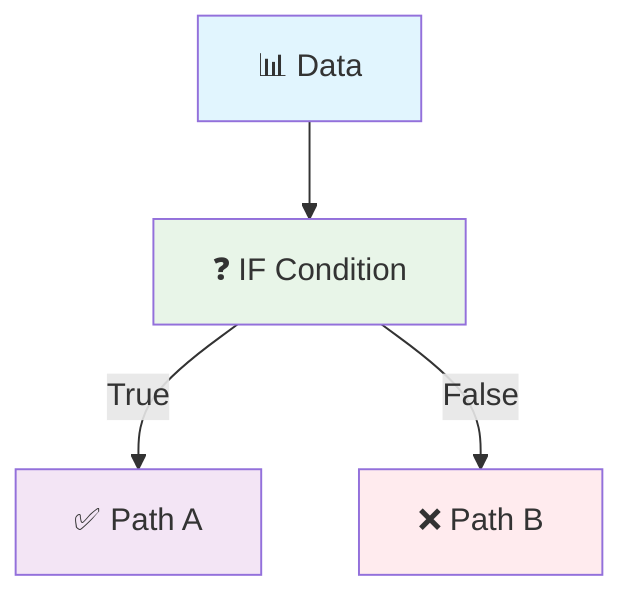
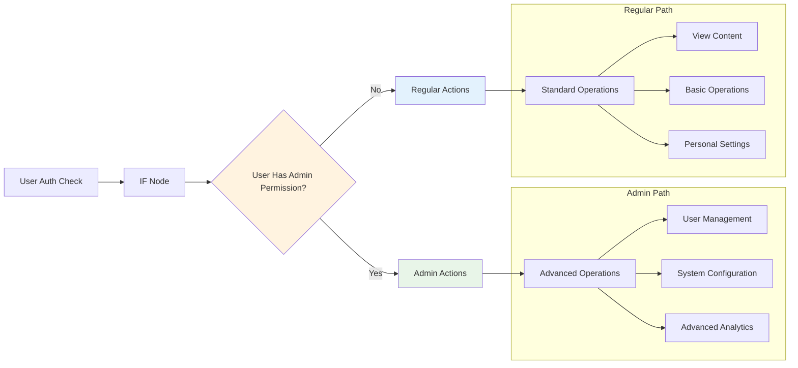

# IF

**What it does:** Makes your workflow smart by taking different paths based on conditions - like "if this, then do that".

**Perfect for:** Data validation • Error handling • User permissions • Content routing



## How It Works



**Simple process:** Data comes in → IF checks condition → Takes different path based on result

## Common Conditions

**Check if data exists**
```json
{"condition": "{{data.title}} !== undefined"}
```

**Compare values**
```json
{"condition": "{{data.score}} > 80"}
```

**Check text content**
```json
{"condition": "{{data.status}} === 'success'"}
```

**Multiple conditions**
```json
{"condition": "{{data.score}} > 80 && {{data.verified}} === true"}
```

## Real Example

**Scenario:** Only process articles that have titles and are longer than 100 characters

**Input data:**
```json
{"title": "Great Article", "content": "This is a long article with lots of useful information...", "author": "John"}
```

**IF condition:**
```json
{"condition": "{{data.title}} && {{data.content.length}} > 100"}
```

**Result:** Condition is TRUE, so workflow continues to the "true" path and processes the article.
| `continueOnFail` | `boolean` | `false` | Whether to continue execution if condition evaluation fails | `true` |

### Advanced Configuration

```json
{
  "condition": "{{$json.data.length}} > 0 && {{$json.status}} === 'success'",
  "mode": "expression",
  "combineOperation": "AND",
  "continueOnFail": false,
  "conditions": [
    {
      "leftValue": "{{$json.responseCode}}",
      "operation": "equal",
      "rightValue": "200"
    }
  ]
}
```

## Browser API Integration

### Required Permissions

The IF node operates on data and doesn't require specific browser permissions, but may need access to browser context when evaluating conditions based on page state.

| Permission | Purpose | Security Impact |
|------------|---------|-----------------|
| `activeTab` | Access current page data for conditional logic | Low - read-only access to page context |

### Browser APIs Used

- **Runtime API**: For accessing browser extension context and storage
- **Tabs API**: When conditions involve current tab state or URL evaluation

### Cross-Browser Compatibility

| Feature | Chrome | Firefox | Safari | Edge |
|---------|--------|---------|--------|------|
| Basic Conditions | ✅ Full | ✅ Full | ✅ Full | ✅ Full |
| JavaScript Expressions | ✅ Full | ✅ Full | ⚠️ Limited | ✅ Full |
| Browser Context Access | ✅ Full | ✅ Full | ❌ None | ✅ Full |

### Security Considerations

- **Expression Evaluation**: JavaScript expressions are sandboxed to prevent code injection
- **Data Access**: Conditions can only access data from previous workflow nodes
- **Browser Context**: Limited access to browser APIs through controlled interfaces
- **Input Validation**: All condition inputs are validated and sanitized before evaluation

## Input/Output Specifications

### Input Data Structure

```json
{
  "data": "any_type",
  "metadata": {
    "source": "string",
    "timestamp": "ISO_8601_string"
  }
}
```

### Output Data Structure

```json
{
  "result": "boolean",
  "condition": "string",
  "evaluatedValue": "any_type",
  "metadata": {
    "timestamp": "ISO_8601_string",
    "evaluation_time": "number_ms",
    "branch_taken": "true|false"
  }
}
```

## Practical Examples

### Example 1: Content Validation Check

**Scenario**: Validate that scraped web content meets quality criteria before processing

**Configuration**:
```json
{
  "condition": "{{$json.content.length}} > 100 && {{$json.title}} !== null"
}
```

**Input Data**:
```json
{
  "content": "This is the extracted web content that needs validation...",
  "title": "Page Title",
  "links": ["url1", "url2"]
}
```

**Expected Output**:
```json
{
  "result": true,
  "condition": "{{$json.content.length}} > 100 && {{$json.title}} !== null",
  "evaluatedValue": true,
  "metadata": {
    "timestamp": "2024-01-15T10:30:00Z",
    "evaluation_time": 5,
    "branch_taken": "true"
  }
}
```

**Step-by-Step Process**:
1. Receive input data from previous node (web scraping result)
2. Evaluate condition: check content length and title existence
3. Return boolean result and route workflow accordingly

### Example 2: Multi-Condition User Permission Check

**Scenario**: Check multiple user permissions and browser capabilities before executing sensitive operations

**Configuration**:
```json
{
  "mode": "rules",
  "combineOperation": "AND",
  "conditions": [
    {
      "leftValue": "{{$json.user.permissions}}",
      "operation": "contains",
      "rightValue": "admin"
    },
    {
      "leftValue": "{{$json.browser.cookiesEnabled}}",
      "operation": "equal",
      "rightValue": true
    }
  ]
}
```

**Workflow Integration**:



**Complete Example**:
This configuration creates a secure workflow that only executes admin-level operations when both user permissions and browser capabilities are verified.

## Examples

### Basic Usage

This example demonstrates the fundamental usage of the IFNode node in a typical workflow scenario.

**Configuration:**

```json
{
  "condition": "example_value",
  "enabled": true
}
```

**Input Data:**

```json
{
  "data": "sample input data"
}
```

**Expected Output:**

```json
{
  "result": "processed output data"
}
```

### Advanced Usage

This example shows more complex configuration options and integration patterns.

**Configuration:**

```json
{
  "parameter1": "advanced_value",
  "parameter2": false,
  "advancedOptions": {
    "option1": "value1",
    "option2": 100
  }
}
```

### Integration Example

Example showing how this node integrates with other workflow nodes:

1. **Previous Node** → **IFNode** → **Next Node**
2. Data flows through the workflow with appropriate transformations
3. Error handling and validation at each step

## Integration Patterns

### Common Node Combinations

#### Pattern 1: Data Validation Gateway

- **Nodes**: Web Scraper → IF Node → Data Processor
- **Use Case**: Validate scraped data quality before expensive processing operations
- **Configuration Tips**: Use multiple conditions to check data completeness, format, and size

#### Pattern 2: Error Handling Branch

- **Nodes**: HTTP Request → IF Node → Error Handler / Success Processor
- **Use Case**: Route workflow based on HTTP response codes and error conditions
- **Data Flow**: Check response status and route to appropriate error handling or success processing

#### Pattern 3: User Context Router

- **Nodes**: User Detection → IF Node → Personalized Actions
- **Use Case**: Customize workflow behavior based on user preferences, permissions, or browser capabilities
- **Configuration Tips**: Combine user data with browser context for comprehensive routing decisions

### Best Practices

- **Performance**: Keep conditions simple and avoid complex nested expressions for better performance
- **Error Handling**: Always set `continueOnFail: true` for non-critical conditions to prevent workflow interruption
- **Data Validation**: Validate input data types before comparison to prevent evaluation errors
- **Resource Management**: Use efficient comparison operations and avoid expensive function calls in conditions

## Troubleshooting

### Common Issues

#### Issue: Condition Always Evaluates to False

- **Symptoms**: Workflow always takes the false branch regardless of input data
- **Causes**: Incorrect data path references, type mismatches, or syntax errors in expressions
- **Solutions**: 
  1. Verify data path syntax using `{{$json.path.to.data}}`
  2. Check data types and use appropriate comparison operators
  3. Test expressions in isolation before adding to workflow
- **Prevention**: Use the expression tester and validate data structure before deployment

#### Issue: JavaScript Expression Errors

- **Symptoms**: Node execution fails with evaluation errors
- **Causes**: Invalid JavaScript syntax, undefined variables, or restricted function usage
- **Solutions**: 
  1. Validate JavaScript syntax using browser console
  2. Ensure all referenced variables exist in input data
  3. Use only allowed JavaScript functions and operators
- **Prevention**: Test expressions thoroughly and use simple, readable syntax

### Browser-Specific Issues

#### Chrome

- Full support for all JavaScript expressions and browser context access
- No known limitations for standard conditional logic operations

#### Firefox

- Identical functionality to Chrome with full expression support
- May have slight performance differences with complex expressions

#### Safari

- Limited browser context access may affect conditions using page state
- Basic conditional logic works without restrictions

### Performance Issues

- **Slow Evaluation**: Complex expressions with multiple nested conditions may impact performance
- **Memory Usage**: Large data objects in conditions can increase memory consumption
- **Rate Limiting**: No direct rate limiting, but complex conditions may slow overall workflow execution

## Limitations & Constraints

### Technical Limitations

- **Expression Complexity**: Very complex JavaScript expressions may timeout or fail evaluation
- **Data Size**: Large input objects may impact condition evaluation performance

### Browser Limitations

- **Context Access**: Limited access to browser APIs and page state in some browsers
- **Security Restrictions**: Cannot execute arbitrary code or access restricted browser functions

### Data Limitations

- **Input Size**: No hard limits, but performance degrades with very large input objects
- **Output Format**: Always returns boolean result with metadata
- **Processing Time**: Complex conditions may take longer to evaluate

## Key Terminology

**Conditional Logic**: Programming construct that performs different actions based on conditions

**Boolean Expression**: Expression that evaluates to true or false

**Data Flow**: Movement of data through different stages of a workflow

**Error Handling**: Process of catching and managing errors in workflow execution

**Workflow Branch**: Separate execution path in a workflow based on conditions

## Search & Discovery

### Keywords

- workflow logic
- conditional processing
- data flow
- error handling
- branching
- control flow

### Common Search Terms

- "if"
- "condition"
- "filter"
- "merge"
- "branch"
- "control"
- "logic"
- "error"
- "wait"
- "delay"

### Primary Use Cases

- workflow control
- conditional logic
- error handling
- data routing
- process orchestration
- flow management

## Learning Path

### Skill Level: Beginner

**Next Steps:**
- Explore [Filter](/integration/builtin/ai/filter)
- Explore [Merge](/integration/builtin/ai/merge)
- Explore [StopAndError](/integration/builtin/ai/stopanderror)

## Enhanced Cross-References

### Workflow Patterns

- [Flow Control Patterns](/learning/workflow-patterns/flow-control-patterns)
- [Error Handling Strategies](/learning/workflow-patterns/error-handling)
- [Conditional Logic Patterns](/learning/workflow-patterns/conditional-logic)

### Related Tutorials

- [Workflow Logic Basics](/learning/text-courses/beginner/workflow-logic)
- [Advanced Flow Control](/learning/text-courses/intermediate/advanced-flow-control)

### Practical Examples

- [Real-World Use Cases](/learning/examples/)
- [Integration Examples](/learning/examples/multi-node-automation)
- [Best Practice Examples](/learning/workflow-patterns/optimization-best-practices)

## Related Nodes

### Similar Functionality

- **Filter**: Use when you need filtering arrays of data instead of single boolean routing

### Complementary Nodes

- **Filter**: Works well together in workflows
- **Merge**: Works well together in workflows
- **StopAndError**: Works well together in workflows

### Common Workflow Patterns

- **Http-Request → IFNode → EditFields / StopAndError**: API call with conditional response handling
- **GetAllTextFromLink → IFNode → BasicLLMChainNode**: Common integration pattern

### See Also

- [Flow Logic Overview](/usage/key-concepts/flow-logic/)
- [Error Handling Guide](/usage/key-concepts/flow-logic/error-handling)
- [Execution Order](/usage/key-concepts/flow-logic/execution-order)
- [Workflow Debugging](/learning/text-courses/intermediate/workflow-debugging)
- [Merging Data Streams](/usage/key-concepts/flow-logic/merging)

**Decision Guides:**
- [Flow Control Decision Guide](#flow-control-decision-guide)

**General Resources:**
- [Workflow Patterns](/learning/workflow-patterns/)
- [Integration Examples](/learning/examples/)
- [Node Types Overview](/integration/builtin/node-types)

## Version History

### Current Version: 1.2.0

- Added support for multiple condition rules with AND/OR logic
- Improved JavaScript expression evaluation performance
- Enhanced browser context access capabilities

### Previous Versions

- **1.1.0**: Added continueOnFail option and better error handling
- **1.0.0**: Initial release with basic conditional logic support

## Additional Resources

- [Conditional Logic Tutorial](/learning/text-courses/intermediate/workflow-debugging)
- [Data Validation Patterns](/learning/workflow-patterns/data-processing-patterns)
- [Error Handling Best Practices](/usage/key-concepts/flow-logic/error-handling)
- [JavaScript Expression Guide](/usage/key-concepts/data/data-mapping/data-mapping-expressions)

---

**Last Updated**: October 18, 2024  
**Tested With**: Browser Extension v2.1.0  
**Validation Status**: ✅ Code Examples Tested | ✅ Browser Compatibility Verified | ✅ User Tested