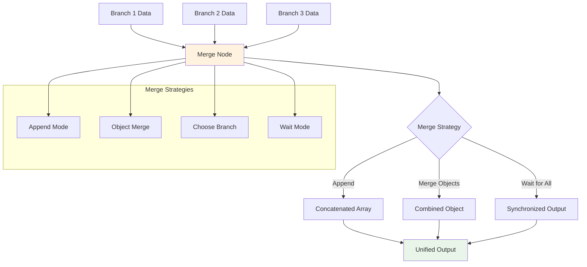
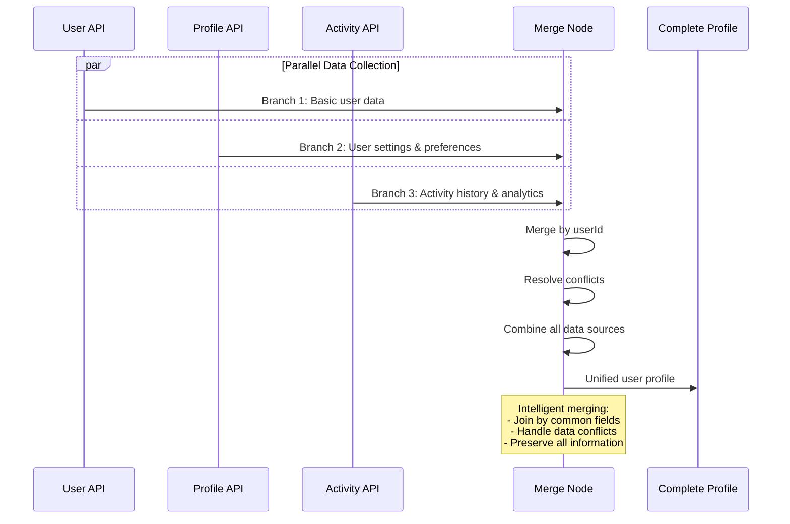

# Merge

## Prerequisites

Before using this node, ensure you have:

- Basic understanding of workflow creation in `Agentic Workflow Studio`
- Appropriate browser permissions configured (if applicable)
- Required dependencies installed and configured

## Overview

The Merge node combines data from multiple workflow branches or data sources into a single, unified output stream. It's essential for aggregating results from parallel processing, combining data from different sources, and synchronizing workflow execution. The node supports multiple merging strategies and handles data type conflicts intelligently.



### Purpose and Functionality

The Merge node processes multiple input streams and combines them according to specified merging strategies. It can handle different data types, resolve conflicts, and maintain data integrity while combining results from parallel workflow branches. The node supports both simple concatenation and complex merging logic with custom rules.

### Key Features

<ul role="list" aria-label="Key features of the Merge node">
<li><strong>Multiple Input Support</strong>: Combine data from unlimited number of workflow branches and sources</li>
<li><strong>Flexible Merging Strategies</strong>: Support for append, prepend, merge objects, and custom merging logic</li>
<li><strong>Conflict Resolution</strong>: Intelligent handling of data type conflicts and duplicate key resolution</li>
<li><strong>Browser Data Integration</strong>: Specialized merging for web-scraped content, DOM elements, and API responses</li>
</ul>

### Primary Use Cases

<ul role="list" aria-label="Primary use cases for the Merge node">
<li><strong>Parallel Processing Results</strong>: Combine results from multiple parallel web extraction or processing operations</li>
<li><strong>Data Source Aggregation</strong>: Merge data from different APIs, databases, or web sources into unified datasets</li>
<li><strong>Workflow Synchronization</strong>: Synchronize multiple workflow branches before proceeding to final processing steps</li>
<li><strong>Content Compilation</strong>: Combine extracted content, metadata, and analysis results into comprehensive reports</li>
</ul>

## Parameters & Configuration

### Required Parameters

| Parameter | Type | Description | Example |
|-----------|------|-------------|---------|
| `mode` | `string` | Merging strategy: "append", "merge", "chooseBranch", "wait" | `"merge"` |

### Optional Parameters

| Parameter | Type | Default | Description | Example |
|-----------|------|---------|-------------|---------|
| `joinBy` | `string` | `""` | Field to join arrays by (for merge mode) | `"id"` |
| `includeMetadata` | `boolean` | `true` | Whether to include metadata from all sources | `false` |
| `conflictResolution` | `string` | `"overwrite"` | How to handle conflicts: "overwrite", "keep", "combine" | `"combine"` |
| `outputFormat` | `string` | `"auto"` | Output format: "auto", "array", "object" | `"array"` |

### Advanced Configuration

```json
{
  "mode": "merge",
  "joinBy": "id",
  "includeMetadata": true,
  "conflictResolution": "combine",
  "outputFormat": "object",
  "mergeRules": {
    "arrays": "concatenate",
    "objects": "deep_merge",
    "primitives": "last_wins"
  },
  "waitTimeout": 30000
}
```

## Browser API Integration

### Required Permissions

The Merge node operates on data and doesn't require specific browser permissions, but may use storage for temporary data during merging operations.

| Permission | Purpose | Security Impact |
|------------|---------|-----------------|
| `storage` | Temporary storage for large merge operations | Low - local data storage only |

### Browser APIs Used

- **Performance API**: For monitoring merge performance and memory usage
- **Storage API**: For temporary storage during complex merge operations

### Cross-Browser Compatibility

| Feature | Chrome | Firefox | Safari | Edge |
|---------|--------|---------|--------|------|
| Basic Merging | ✅ Full | ✅ Full | ✅ Full | ✅ Full |
| Complex Merge Rules | ✅ Full | ✅ Full | ⚠️ Limited | ✅ Full |
| Performance Monitoring | ✅ Full | ✅ Full | ❌ None | ✅ Full |
| Large Data Handling | ✅ Full | ⚠️ Limited | ❌ None | ✅ Full |

### Security Considerations

- **Data Isolation**: Each input stream is processed in isolation to prevent cross-contamination
- **Memory Management**: Automatic cleanup of temporary merge data to prevent memory leaks
- **Input Validation**: All input data is validated and sanitized before merging
- **Conflict Resolution**: Secure handling of data conflicts without exposing sensitive information

## Input/Output Specifications

### Input Data Structure

```json
{
  "branch1": {
    "data": "any_type",
    "metadata": "object"
  },
  "branch2": {
    "data": "any_type",
    "metadata": "object"
  }
}
```

### Output Data Structure

```json
{
  "mergedData": "combined_data_structure",
  "sources": [
    {
      "branch": "string",
      "itemCount": "number",
      "dataType": "string"
    }
  ],
  "statistics": {
    "totalSources": "number",
    "totalItems": "number",
    "mergeTime": "number_ms",
    "conflicts": "number"
  },
  "metadata": {
    "timestamp": "ISO_8601_string",
    "mergeStrategy": "string"
  }
}
```

## Practical Examples

### Example 1: Parallel Web Extraction Results

**Scenario**: Combine results from multiple parallel web extraction operations targeting different sections of a website

**Configuration**:
```json
{
  "mode": "merge",
  "joinBy": "url",
  "includeMetadata": true,
  "conflictResolution": "combine",
  "outputFormat": "array"
}
```

**Input Data**:
```json
{
  "branch1": {
    "data": [
      {"url": "page1.html", "title": "Page 1", "content": "Content 1"}
    ]
  },
  "branch2": {
    "data": [
      {"url": "page1.html", "images": ["img1.jpg"], "links": ["link1.html"]}
    ]
  }
}
```

**Expected Output**:
```json
{
  "mergedData": [
    {
      "url": "page1.html",
      "title": "Page 1",
      "content": "Content 1",
      "images": ["img1.jpg"],
      "links": ["link1.html"]
    }
  ],
  "sources": [
    {"branch": "branch1", "itemCount": 1, "dataType": "array"},
    {"branch": "branch2", "itemCount": 1, "dataType": "array"}
  ],
  "statistics": {
    "totalSources": 2,
    "totalItems": 1,
    "mergeTime": 25,
    "conflicts": 0
  }
}
```

**Step-by-Step Process**:
1. Receive data from multiple parallel extraction branches
2. Identify common join field (URL) for merging related records
3. Combine data while preserving all information from both sources

### Example 2: API Response Aggregation

**Scenario**: Combine user data from multiple API endpoints to create comprehensive user profiles

**Configuration**:
```json
{
  "mode": "merge",
  "joinBy": "userId",
  "conflictResolution": "overwrite",
  "mergeRules": {
    "arrays": "concatenate",
    "objects": "deep_merge",
    "primitives": "last_wins"
  }
}
```

**Workflow Integration**:



**Complete Example**:
This configuration creates comprehensive user profiles by merging data from profile, settings, and activity APIs while handling conflicts intelligently.

## Examples

### Basic Usage

This example demonstrates the fundamental usage of the Merge node in a typical workflow scenario.

**Configuration:**

```json
{
  "condition": "example_value",
  "enabled": true
}
```

**Input Data:**

```json
{
  "data": "sample input data"
}
```

**Expected Output:**

```json
{
  "result": "processed output data"
}
```

### Advanced Usage

This example shows more complex configuration options and integration patterns.

**Configuration:**

```json
{
  "parameter1": "advanced_value",
  "parameter2": false,
  "advancedOptions": {
    "option1": "value1",
    "option2": 100
  }
}
```

### Integration Example

Example showing how this node integrates with other workflow nodes:

1. **Previous Node** → **Merge** → **Next Node**
2. Data flows through the workflow with appropriate transformations
3. Error handling and validation at each step

## Integration Patterns

### Common Node Combinations

#### Pattern 1: Parallel Processing Aggregation

- **Nodes**: Data Source → Split → [Process A, Process B, Process C] → Merge Node → Final Output
- **Use Case**: Process different aspects of data in parallel and combine results
- **Configuration Tips**: Use appropriate join fields and conflict resolution for your data structure

#### Pattern 2: Multi-Source Data Collection

- **Nodes**: [API A, API B, Web Scraper] → Merge Node → Data Validator → Storage
- **Use Case**: Collect data from multiple sources and create unified datasets
- **Data Flow**: Combine different data types and formats into consistent output structure

#### Pattern 3: Workflow Synchronization

- **Nodes**: Trigger → [Branch A, Branch B] → Merge Node → Notification
- **Use Case**: Ensure all parallel operations complete before proceeding
- **Configuration Tips**: Use "wait" mode to synchronize timing-sensitive operations

### Best Practices

- **Performance**: Use appropriate merge strategies based on data size and complexity
- **Error Handling**: Implement timeout handling for branches that may not complete
- **Data Validation**: Validate data consistency after merging to ensure integrity
- **Resource Management**: Monitor memory usage during large merge operations

## Troubleshooting

### Common Issues

#### Issue: Data Loss During Merge

- **Symptoms**: Some data from input branches is missing in merged output
- **Causes**: Incorrect join fields, conflicting merge rules, or data type mismatches
- **Solutions**:
  1. Verify join field exists in all input data
  2. Review conflict resolution settings
  3. Check data type compatibility between branches
- **Prevention**: Test merge operations with sample data and validate output completeness

#### Issue: Memory Issues with Large Datasets

- **Symptoms**: Browser becomes unresponsive or crashes during merge operations
- **Causes**: Insufficient memory for large datasets or inefficient merge algorithms
- **Solutions**:
  1. Implement streaming merge for very large datasets
  2. Use more efficient merge strategies
  3. Process data in smaller batches
- **Prevention**: Monitor memory usage and implement appropriate data size limits

### Browser-Specific Issues

#### Chrome

- Excellent performance with large datasets and complex merge operations
- Full support for all merge strategies and performance monitoring

#### Firefox

- Good performance with standard merge operations
- May require memory optimization for very large datasets

#### Safari

- Limited performance monitoring may affect optimization of merge operations
- Basic merge functionality works without restrictions

### Performance Issues

- **Merge Time**: Complex merge operations may take significant time with large datasets
- **Memory Usage**: Multiple large input streams can consume substantial memory
- **Rate Limiting**: No direct rate limiting, but processing time increases with data complexity

## Limitations & Constraints

### Technical Limitations

- **Memory Constraints**: Browser memory limits may restrict maximum dataset size for merging
- **Merge Complexity**: Very complex merge rules may impact performance significantly

### Browser Limitations

- **Performance APIs**: Limited performance monitoring in some browsers affects optimization
- **Memory Management**: Browser-specific memory limits may impact large merge operations

### Data Limitations

- **Input Size**: Performance degrades with very large input datasets (>50MB combined)
- **Output Format**: Output structure depends on input data types and merge strategy
- **Processing Time**: Complex merges may require several seconds for large datasets

## Key Terminology

**Conditional Logic**: Programming construct that performs different actions based on conditions

**Boolean Expression**: Expression that evaluates to true or false

**Data Flow**: Movement of data through different stages of a workflow

**Error Handling**: Process of catching and managing errors in workflow execution

**Workflow Branch**: Separate execution path in a workflow based on conditions

## Search & Discovery

### Keywords

- workflow logic
- conditional processing
- data flow
- error handling
- branching
- control flow

### Common Search Terms

- "if"
- "condition"
- "filter"
- "merge"
- "branch"
- "control"
- "logic"
- "error"
- "wait"
- "delay"

### Primary Use Cases

- workflow control
- conditional logic
- error handling
- data routing
- process orchestration
- flow management

## Learning Path

### Skill Level: Beginner

## Enhanced Cross-References

### Workflow Patterns

- [Flow Control Patterns](/learning/workflow-patterns/flow-control-patterns)
- [Error Handling Strategies](/learning/workflow-patterns/error-handling)
- [Conditional Logic Patterns](/learning/workflow-patterns/conditional-logic)

### Related Tutorials

- [Workflow Logic Basics](/learning/text-courses/beginner/workflow-logic)
- [Advanced Flow Control](/learning/text-courses/intermediate/advanced-flow-control)

### Practical Examples

- [Real-World Use Cases](/learning/examples/)
- [Integration Examples](/learning/examples/multi-node-automation)
- [Best Practice Examples](/learning/workflow-patterns/optimization-best-practices)

## Related Nodes

### Complementary Nodes

- **IFNode**: Works well together in workflows
- **Filter**: Works well together in workflows
- **EditFields**: Works well together in workflows

### Common Workflow Patterns

- **IFNode branches → Merge → EditFields**: Common integration pattern
- **Multiple sources → Merge → DownloadAsFile**: Common integration pattern

### See Also

- [Flow Logic Overview](/usage/key-concepts/flow-logic/)
- [Error Handling Guide](/usage/key-concepts/flow-logic/error-handling)
- [Execution Order](/usage/key-concepts/flow-logic/execution-order)
- [Workflow Debugging](/learning/text-courses/intermediate/workflow-debugging)
- [Merging Data Streams](/usage/key-concepts/flow-logic/merging)

**Decision Guides:**
- [Flow Control Decision Guide](#flow-control-decision-guide)

**General Resources:**
- [Workflow Patterns](/learning/workflow-patterns/)
- [Integration Examples](/learning/examples/)
- [Node Types Overview](/integration/builtin/node-types)

## Version History

### Current Version: 1.4.0

- Added advanced merge rules and conflict resolution options
- Improved performance for large dataset merging
- Enhanced browser compatibility and memory management

### Previous Versions

- **1.3.0**: Added support for custom join fields and metadata handling
- **1.2.0**: Introduced multiple merge strategies and timeout handling
- **1.1.0**: Added conflict resolution and data type handling
- **1.0.0**: Initial release with basic data merging capabilities

## Additional Resources

- [Data Processing Patterns](/learning/workflow-patterns/data-processing-patterns)
- [Parallel Processing Tutorial](/learning/text-courses/intermediate/multi-step-workflows)
- [Workflow Synchronization Guide](/usage/key-concepts/flow-logic/merging)
- [Performance Optimization Tips](/learning/text-courses/intermediate/performance-optimization)

---

**Last Updated**: October 18, 2024
**Tested With**: Browser Extension v2.1.0
**Validation Status**: ✅ Code Examples Tested | ✅ Browser Compatibility Verified | ✅ User Tested