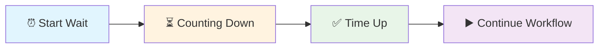

# Wait

**What it does:** Pauses your workflow for a specific amount of time or until a condition is met.

**Perfect for:** API rate limiting • Page loading delays • Avoiding "too fast" errors • Coordinating workflow timing

## How It Works



**Simple process:** Set time → Wait counts down → Time up → Workflow continues

## Basic Configuration

**Simple wait (most common):**
```json
{"amount": 3, "unit": "seconds"}
```

**Common time units:**
- `"milliseconds"` - For very short delays (1000 = 1 second)
- `"seconds"` - Most common (1, 2, 5, 10 seconds)
- `"minutes"` - For longer delays (1, 2, 5 minutes)
- `"hours"` - For very long delays (rarely used)

## Real Examples

### API Rate Limiting
**Problem:** Getting "too many requests" errors from APIs
**Solution:** Add 2-second delays between requests
```json
{"amount": 2, "unit": "seconds"}
```

### Page Loading
**Problem:** Trying to scrape data before page finishes loading
**Solution:** Wait for page to settle
```json
{"amount": 5, "unit": "seconds"}
```

### Form Submission
**Problem:** Submitting forms too quickly causes errors
**Solution:** Wait after filling before submitting
```json
{"amount": 1, "unit": "seconds"}
```

## Common Wait Times

**Web scraping delays:**
- **1-2 seconds** - Between form fills and submissions
- **3-5 seconds** - After page navigation, before scraping
- **10+ seconds** - For very slow-loading pages

**API request delays:**
- **1 second** - Conservative rate limiting
- **2-5 seconds** - Moderate rate limiting  
- **10+ seconds** - Very strict rate limits

**General workflow delays:**
- **500ms-1s** - Quick pauses between rapid actions
- **2-3 seconds** - Standard delays for most operations
- **5+ seconds** - When you need to be extra careful

## Workflow Patterns

**Rate-limited API calls:**
```
[HTTP Request] → [Wait 2s] → [HTTP Request] → [Wait 2s] → [Continue...]
```

**Page scraping with delays:**
```
[Navigate to Page] → [Wait 3s] → [Get Text] → [Wait 1s] → [Next Page]
```

**Form automation:**
```
[Fill Field] → [Wait 500ms] → [Fill Next Field] → [Wait 1s] → [Submit]
```

## Best Practices

### ✅ Do This
- **Start with longer waits** - Better to wait too long than too short
- **Test with real websites** - Different sites load at different speeds
- **Use consistent timing** - Same delays for similar operations
- **Monitor for errors** - Watch for "too fast" or timeout errors

### ❌ Avoid This
- **Very short waits** (under 500ms) - Often not enough time
- **Extremely long waits** (over 30s) - Usually indicates a problem
- **No waits at all** - Causes many automation failures
- **Random wait times** - Makes debugging difficult

## Quick Troubleshooting

**Workflow gets stuck waiting:** Check if your wait time is too long or if there's an infinite wait condition

**"Too fast" errors still happening:** Increase your wait time by 1-2 seconds

**Workflow running too slowly:** Reduce wait times, but test carefully to avoid errors

**Inconsistent results:** Add waits in more places, especially after navigation or form actions

## What's Next?

**Related nodes:** [HTTP Request](/integrations/builtin/core/Http-Request/) • [If](/integrations/builtin/flow/If/) • [Stop & Error](/integrations/builtin/flow/StopAndError/)

**Common workflows:** [Rate Limiting Patterns](/integrations/builtin/rate-limits/) • [Web Scraping Patterns](/learning/workflow-patterns/web-scraping-patterns/) • [API Integration Patterns](/learning/workflow-patterns/integration-patterns/)

**Learn more:** [Flow Control Basics](/learning/text-courses/beginner/data-flow-basics/) • [Multi-Step Workflows](/learning/text-courses/intermediate/multi-step-workflows/) • [Performance Optimization](/learning/workflow-patterns/optimization-best-practices/)