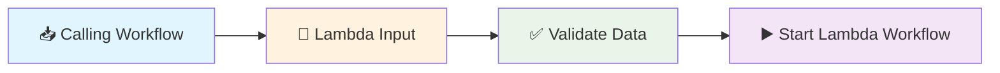

# Lambda Input

**What it does:** Defines what data your reusable workflow components need to receive from other workflows.

**Perfect for:** Reusable workflows • Template workflows • Modular design • Data processing pipelines

## How It Works



**Simple process:** Other workflow calls → Lambda Input receives data → Validates format → Starts your reusable workflow

## Common Use Cases

**Reusable components** - Create workflows that can be used by multiple other workflows
**Template workflows** - Build workflow templates that work with different data
**Data processing** - Create specialized data processing workflows
**API integration** - Standardize how workflows handle external data

## Real Example

**Scenario:** Create a reusable workflow that extracts content from any website URL

**Lambda Input Configuration:**
```json
{
  "parameterName": "websiteUrl",
  "inputSchema": {
    "type": "object",
    "properties": {
      "url": {"type": "string"},
      "timeout": {"type": "number", "default": 5000}
    },
    "required": ["url"]
  }
}
```

**When another workflow calls this lambda:**
```json
{
  "url": "https://news.example.com/article/123",
  "timeout": 10000
}
```

**Lambda Input outputs for your workflow:**
```json
{
  "websiteUrl": "https://news.example.com/article/123",
  "timeout": 10000
}
```
## Simple Configuration Tips

**Basic text input:**
```json
{
  "parameterName": "userText",
  "inputSchema": {"type": "string"}
}
```

**URL with validation:**
```json
{
  "parameterName": "websiteUrl",
  "inputSchema": {"type": "string", "format": "uri"}
}
```

**Optional parameters with defaults:**
```json
{
  "parameterName": "config",
  "inputSchema": {
    "type": "object",
    "properties": {
      "retries": {"type": "number", "default": 3},
      "timeout": {"type": "number", "default": 5000}
    }
  }
}
```

## Common Workflow Patterns

**Simple data processing:**
```
[Lambda Input] → [Process Data] → [Lambda Output]
```

**Web content extraction:**
```
[Lambda Input] → [Get Page Content] → [Extract Text] → [Lambda Output]
```

**AI analysis workflow:**
```
[Lambda Input] → [AI Analysis] → [Format Results] → [Lambda Output]
```

## Quick Troubleshooting

**Schema validation fails:** Check that the calling workflow sends data in the expected format

**Parameter not available:** Make sure the parameterName matches what you're using in other nodes

**Workflow won't start:** Verify that all required parameters are being provided

## What's Next?

**Related nodes:** [Lambda Output](/integrations/builtin/lambda/LambdaOutput/) • [Edit Fields](/integrations/builtin/dataTransformation/EditFields/) • [If](/integrations/builtin/flow/If/)

**Common workflows:** [Modular Workflow Patterns](/learning/workflow-patterns/modular-design/) • [Reusable Component Design](/learning/workflow-patterns/reusable-components/) • [Data Processing Pipelines](/learning/workflow-patterns/data-processing-patterns/)

**Learn more:** [Lambda Workflows Guide](/learning/workflow-patterns/lambda-workflows/) • [Advanced Workflow Design](/learning/text-courses/intermediate/advanced-workflow-design/) • [Workflow Architecture](/learning/text-courses/advanced/workflow-architecture/)