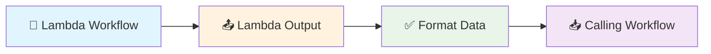

# Lambda Output

**What it does:** Defines what data your reusable workflow components return to other workflows.

**Perfect for:** Reusable workflows • Template workflows • Modular design • Data processing results

## How It Works



**Simple process:** Lambda workflow finishes → Lambda Output formats results → Returns data to calling workflow

## Common Use Cases

**Return processed data** - Send results back to the workflow that called your lambda
**Format results** - Structure data in a consistent way for other workflows
**Aggregate results** - Combine multiple processing steps into one output
**Standardize responses** - Ensure all your reusable workflows return data the same way

## Real Example

**Scenario:** Return extracted content and metadata from a web extraction lambda workflow

**Lambda Output Configuration:**
```json
{
  "outputSchema": {
    "type": "object",
    "properties": {
      "content": {"type": "string"},
      "wordCount": {"type": "number"},
      "extractedAt": {"type": "string"}
    }
  }
}
```

**Data from your lambda workflow:**
```json
{
  "extractedText": "This is the webpage content...",
  "wordCount": 156,
  "processingTime": 1200
}
```

**Lambda Output returns to calling workflow:**
```json
{
  "content": "This is the webpage content...",
  "wordCount": 156,
  "extractedAt": "2024-01-17T10:30:15Z"
}
```## Simple Configuration Tips

**Basic text result:**
```json
{
  "outputSchema": {"type": "string"}
}
```

**Structured data result:**
```json
{
  "outputSchema": {
    "type": "object",
    "properties": {
      "title": {"type": "string"},
      "content": {"type": "string"},
      "wordCount": {"type": "number"}
    }
  }
}
```

**Array of results:**
```json
{
  "outputSchema": {
    "type": "array",
    "items": {"type": "string"}
  }
}
```

## Common Workflow Patterns

**Simple data return:**
```
[Process Data] → [Lambda Output] → [Calling Workflow]
```

**Multiple processing steps:**
```
[Step 1] → [Step 2] → [Step 3] → [Lambda Output] → [Calling Workflow]
```

**Error handling:**
```
[Process Data] → [Check Results] → [Lambda Output OR Error Handler]
```

## Quick Troubleshooting

**Output validation fails:** Check that your data matches the output schema format

**Calling workflow gets wrong data:** Verify the output schema matches what the calling workflow expects

**Large data causes slowness:** Consider returning only essential data and processing large datasets in chunks

## What's Next?

**Related nodes:** [Lambda Input](/integrations/builtin/lambda/LambdaInput/) • [Edit Fields](/integrations/builtin/dataTransformation/EditFields/) • [If](/integrations/builtin/flow/If/)

**Common workflows:** [Modular Workflow Patterns](/learning/workflow-patterns/modular-design/) • [Reusable Component Design](/learning/workflow-patterns/reusable-components/) • [Data Processing Pipelines](/learning/workflow-patterns/data-processing-patterns/)

**Learn more:** [Lambda Workflows Guide](/learning/workflow-patterns/lambda-workflows/) • [Advanced Workflow Design](/learning/text-courses/intermediate/advanced-workflow-design/) • [Workflow Architecture](/learning/text-courses/advanced/workflow-architecture/)
