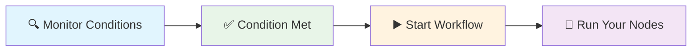

# When Started

**What it does:** Starts your workflows automatically when you visit certain pages, on a schedule, or with a manual button click.

**Perfect for:** Page automation • Scheduled tasks • Manual triggers • Event-driven workflows

## How It Works



**Simple process:** Set trigger conditions → Monitor for those conditions → When met, start your workflow

## Common Trigger Types

**Page Load** - Start when you visit specific websites or pages
**Manual** - Start when you click a button in your browser
**Scheduled** - Start automatically at specific times or intervals
**Event-based** - Start when specific browser events happen

## Real Examples

### Page Load Trigger
**Scenario:** Start workflow when visiting news articles
```json
{
  "triggerType": "pageLoad",
  "triggerCondition": {
    "urlPattern": "https://news.*.com/article/*"
  },
  "delay": 2000
}
```

### Manual Trigger
**Scenario:** Add a button to start workflow on any page
```json
{
  "triggerType": "manual",
  "triggerCondition": {
    "urlPattern": "*"
  }
}
```

### Scheduled Trigger
**Scenario:** Run workflow every 30 minutes during work hours
```json
{
  "triggerType": "scheduled",
  "triggerCondition": {
    "interval": 1800000,
    "activeHours": {"start": "09:00", "end": "17:00"}
  }
}
```## Trigger Configuration Tips

**URL Patterns:**
- `*` - Any page
- `*.example.com/*` - Any page on example.com
- `https://news.*.com/article/*` - News articles from any news site
- `https://specific-site.com/page` - Exact page only

**Timing Options:**
- `delay: 2000` - Wait 2 seconds after trigger before starting
- `cooldownPeriod: 30000` - Wait 30 seconds between executions
- `maxExecutions: 10` - Only run 10 times total

**Scheduled Intervals:**
- `300000` - Every 5 minutes (300,000 milliseconds)
- `1800000` - Every 30 minutes
- `3600000` - Every hour

## Common Workflow Patterns

**Page automation:**
```
[When Started] → [Get Page Content] → [Process Data] → [Save Results]
```

**Scheduled monitoring:**
```
[When Started] → [HTTP Request] → [Check Changes] → [Send Alert]
```

**Manual data extraction:**
```
[When Started] → [Extract Data] → [Format Results] → [Download File]
```

## Best Practices

### ✅ Do This
- **Start with specific URL patterns** - Better to be too specific than too broad
- **Add delays** - Give pages time to load before starting workflows
- **Test thoroughly** - Make sure triggers work on the pages you expect
- **Use cooldown periods** - Prevent workflows from running too frequently

### ❌ Avoid This
- **Overly broad patterns** - `*` matches every page and can cause problems
- **No delays** - Starting immediately can miss page content
- **Complex conditions** - Keep trigger conditions simple and reliable
- **Ignoring performance** - Too many triggers can slow down your browser

## Quick Troubleshooting

**Trigger not firing:** Check URL pattern matches the actual page URLs you're visiting

**Firing too often:** Add cooldown period or make URL pattern more specific

**Missing page content:** Add delay to wait for page to fully load

**Browser performance issues:** Reduce number of active triggers or add longer cooldowns

## What's Next?

**Related nodes:** [Get All Text](/integrations/builtin/extension/GetAllText/) • [HTTP Request](/integrations/builtin/core/Http-Request/) • [If](/integrations/builtin/flow/If/)

**Common workflows:** [Page Automation Patterns](/learning/workflow-patterns/web-extraction-patterns/) • [Scheduled Task Patterns](/learning/workflow-patterns/automation-patterns/) • [Event-Driven Workflows](/learning/workflow-patterns/event-driven-patterns/)

**Learn more:** [Workflow Automation Guide](/learning/text-courses/intermediate/workflow-automation/) • [Browser Extension Basics](/learning/text-courses/beginner/browser-extension-basics/) • [Advanced Triggers](/learning/text-courses/advanced/advanced-triggers/)