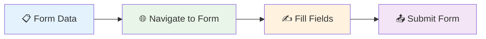

# Automate Form Filling

## What You'll Build

Create a workflow that automatically fills out web forms with your data, eliminating repetitive typing and reducing errors.

**⏱️ Time**: 10 minutes
**🎯 Difficulty**: Beginner
**✅ Result**: Automated form filling workflow

## Why This Matters

- **Save Hours**: No more repetitive data entry across multiple forms
- **Reduce Errors**: Consistent, accurate data entry every time
- **Boost Productivity**: Focus on important work, not form filling
- **Scale Operations**: Fill hundreds of forms quickly and reliably

## What Goes In, What Comes Out

| Input | Output |
|-------|--------|
| Form data (name, email, etc.) | Completed web forms |
| Target form URL | Submitted form confirmation |

**Example**: Contact info + job application form → Completed application

## Step-by-Step Guide

### Step 1: Prepare Your Data

Create a simple data structure with your information:

```json
{
  "name": "John Smith",
  "email": "john@example.com",
  "phone": "555-123-4567",
  "company": "Tech Solutions Inc"
}
```

### Step 2: Set Up Form Filling Workflow

Add these nodes to your canvas:
- **Lambda Input** (for your data)
- **Navigate to Link** (to open the form)
- **Insert Text** (to fill form fields)
- **Form Filler** (to submit the form)



### Step 3: Configure Field Mapping

**Insert Text Node Configuration:**
```json
{
  "fieldMappings": [
    {
      "selector": "#name",
      "value": "{{data.name}}"
    },
    {
      "selector": "#email",
      "value": "{{data.email}}"
    },
    {
      "selector": "#phone",
      "value": "{{data.phone}}"
    }
  ]
}
```

**✅ You should see**: Form fields automatically populated with your data

### Step 4: Handle Form Submission

**Form Filler Node Settings:**
- **Submit Button**: `button[type="submit"]` or `#submit-btn`
- **Wait for Confirmation**: Enable to verify submission
- **Capture Result**: Save confirmation message

## Real-World Example

**Use Case**: Job application forms
**Data**: Resume information
**Target**: Company career pages
**Result**: 50+ applications submitted in 30 minutes

**Before**: 5 minutes per form × 50 forms = 4+ hours
**After**: 30 seconds per form × 50 forms = 25 minutes

## Common Form Types

### Contact Forms
- Name, email, message fields
- Newsletter signups
- Support requests

### Registration Forms
- Account creation
- Event registration
- Service signups

### Application Forms
- Job applications
- School admissions
- Loan applications

## Troubleshooting

| Problem | Solution |
|---------|----------|
| Fields not filling | Check CSS selectors match form structure |
| Form won't submit | Verify submit button selector is correct |
| Validation errors | Ensure data format matches form requirements |
| Page not loading | Add wait time for dynamic content |

## What's Next?

Master form automation with these advanced tutorials:

- **[Extract Product Prices](extract-product-prices)** - Combine with data collection
- **[Monitor Competitor Prices](monitor-competitor-prices)** - Use forms for research signup
- **[Create AI-Powered Content Analysis](/usage/how-to/create-ai-content-analysis)** - Process form responses with AI

## Copy-Paste Ready Workflow

```json
{
  "workflow": {
    "name": "Form Filler",
    "nodes": [
      {
        "type": "LambdaInput",
        "config": {
          "data": {
            "name": "Your Name",
            "email": "your@email.com",
            "phone": "555-123-4567"
          }
        }
      },
      {
        "type": "NavigateToLink",
        "config": {
          "url": "https://example.com/contact-form",
          "waitForLoad": true
        }
      },
      {
        "type": "InsertText",
        "config": {
          "fieldMappings": [
            {"selector": "#name", "value": "{{data.name}}"},
            {"selector": "#email", "value": "{{data.email}}"},
            {"selector": "#phone", "value": "{{data.phone}}"}
          ]
        }
      },
      {
        "type": "FormFiller",
        "config": {
          "submitSelector": "button[type='submit']",
          "waitForConfirmation": true
        }
      }
    ]
  }
}
```

---

**💡 Pro Tip**: Test your workflow on one form first, then create a list of URLs to process multiple forms in batch.