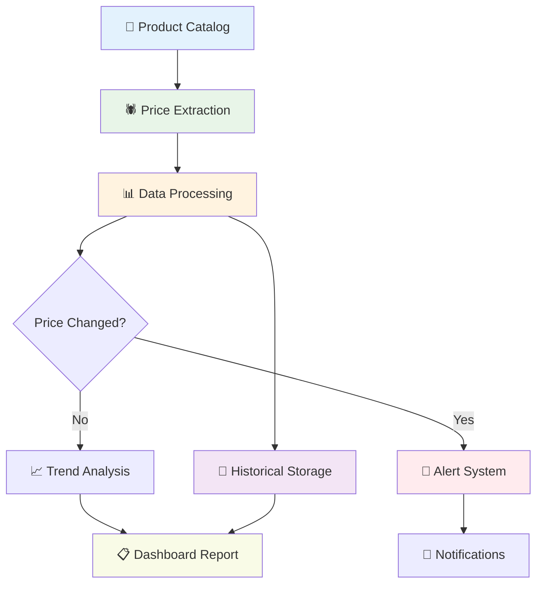
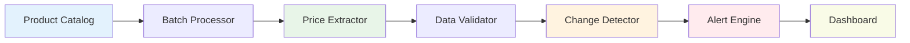

# Build a Price Monitoring System

## What You'll Build

Create a complete, enterprise-ready price monitoring system that tracks competitor prices, sends alerts for changes, and maintains historical data for trend analysis.

**⏱️ Time**: 60 minutes
**🎯 Difficulty**: Advanced
**✅ Result**: Full-featured price monitoring system with dashboard and alerts

## System Overview

This comprehensive system handles everything from data collection to business intelligence:



## Phase 1: Core Data Collection (20 minutes)

### Set Up Product Catalog

Create a structured catalog of products to monitor:

```json
{
  "products": [
    {
      "id": "laptop_pro_13",
      "name": "MacBook Pro 13-inch",
      "category": "laptops",
      "your_price": 1299.99,
      "competitors": [
        {
          "name": "Best Buy",
          "url": "https://bestbuy.com/macbook-pro-13",
          "selector_hints": ".pricing-price__range"
        },
        {
          "name": "Amazon",
          "url": "https://amazon.com/macbook-pro-13",
          "selector_hints": ".a-price-whole"
        }
      ]
    }
  ]
}
```

### Build Universal Price Extractor

Create a robust extraction workflow that handles different site formats:

**Multi-Pattern Price Extraction:**
```json
{
  "price_patterns": [
    {
      "name": "standard_dollar",
      "pattern": "\\$([0-9,]+\\.?[0-9]*)",
      "priority": 1
    },
    {
      "name": "price_class",
      "pattern": "price[^>]*>\\$?([0-9,]+\\.?[0-9]*)",
      "priority": 2
    },
    {
      "name": "data_price",
      "pattern": "data-price[^>]*>([0-9,]+\\.?[0-9]*)",
      "priority": 3
    }
  ]
}
```

**Extraction Workflow Configuration:**
```json
{
  "extraction_config": {
    "waitForLoad": true,
    "timeout": 30000,
    "textFilters": [
      ".navigation",
      ".footer",
      ".reviews",
      ".recommendations",
      ".advertisement"
    ],
    "retryAttempts": 3,
    "retryDelay": 5000
  }
}
```

## Phase 2: Data Processing & Storage (15 minutes)

### Price Data Normalization

Clean and standardize extracted price data:

```json
{
  "normalization_operations": [
    {
      "field": "raw_price",
      "operation": "remove_currency_symbols",
      "output_field": "numeric_price"
    },
    {
      "field": "numeric_price",
      "operation": "convert_to_float",
      "output_field": "price_float"
    },
    {
      "field": "price_float",
      "operation": "validate_range",
      "min_value": 1,
      "max_value": 50000,
      "output_field": "validated_price"
    }
  ]
}
```

### Historical Data Structure

Design data structure for trend analysis:

```json
{
  "price_history": {
    "product_id": "laptop_pro_13",
    "competitor": "Best Buy",
    "timestamp": "2024-01-15T10:30:00Z",
    "price": 1249.99,
    "previous_price": 1299.99,
    "change_amount": -50.00,
    "change_percent": -3.85,
    "extraction_success": true,
    "data_quality_score": 0.95
  }
}
```

## Phase 3: Alert System (15 minutes)

### Price Change Detection

Implement intelligent change detection with thresholds:

```json
{
  "alert_rules": [
    {
      "name": "significant_drop",
      "condition": "new_price < previous_price * 0.95",
      "priority": "high",
      "message": "Competitor dropped price by 5%+",
      "actions": ["email", "slack"]
    },
    {
      "name": "undercut_alert",
      "condition": "competitor_price < your_price * 0.98",
      "priority": "urgent",
      "message": "Competitor undercut your price",
      "actions": ["email", "sms", "slack"]
    },
    {
      "name": "opportunity_alert",
      "condition": "competitor_price > your_price * 1.1",
      "priority": "medium",
      "message": "Opportunity to raise prices",
      "actions": ["email"]
    }
  ]
}
```

### Multi-Channel Notifications

Set up various notification channels:

**Email Alert Configuration:**
```json
{
  "email_config": {
    "smtp_server": "smtp.gmail.com",
    "port": 587,
    "use_tls": true,
    "templates": {
      "price_drop": {
        "subject": "🚨 Price Alert: {{competitor}} dropped {{product}} to {{new_price}}",
        "body": "Competitor {{competitor}} reduced price for {{product}} from {{old_price}} to {{new_price}} ({{change_percent}}% decrease).\n\nYour current price: {{your_price}}\nRecommended action: {{recommendation}}"
      }
    }
  }
}
```

**Slack Integration:**
```json
{
  "slack_config": {
    "webhook_url": "https://hooks.slack.com/your-webhook",
    "channel": "#pricing-alerts",
    "message_format": {
      "text": "Price Alert",
      "attachments": [{
        "color": "danger",
        "fields": [
          {"title": "Product", "value": "{{product}}", "short": true},
          {"title": "Competitor", "value": "{{competitor}}", "short": true},
          {"title": "New Price", "value": "{{new_price}}", "short": true},
          {"title": "Change", "value": "{{change_percent}}%", "short": true}
        ]
      }]
    }
  }
}
```

## Phase 4: Analytics & Reporting (10 minutes)

### Trend Analysis

Generate insights from historical data:

```json
{
  "analytics_queries": [
    {
      "name": "price_trends_7d",
      "description": "7-day price movement analysis",
      "calculation": "average_daily_change",
      "timeframe": "7_days"
    },
    {
      "name": "competitor_positioning",
      "description": "Current market position vs competitors",
      "calculation": "price_rank_analysis",
      "include_market_share": true
    },
    {
      "name": "volatility_score",
      "description": "Price stability measurement",
      "calculation": "standard_deviation",
      "timeframe": "30_days"
    }
  ]
}
```

### Dashboard Report Generation

Create comprehensive reports:

```json
{
  "dashboard_config": {
    "report_frequency": "daily",
    "sections": [
      {
        "name": "Executive Summary",
        "metrics": ["total_products", "active_alerts", "avg_price_change"],
        "charts": ["price_trend_overview"]
      },
      {
        "name": "Competitive Analysis",
        "metrics": ["market_position", "undercut_count", "opportunity_count"],
        "charts": ["competitor_comparison", "price_distribution"]
      },
      {
        "name": "Product Performance",
        "metrics": ["top_movers", "stable_products", "volatile_products"],
        "charts": ["individual_trends", "category_analysis"]
      }
    ]
  }
}
```

## Advanced Features

### Dynamic Pricing Recommendations

Use AI to suggest optimal pricing:

```json
{
  "ai_pricing_prompt": "Based on this competitive pricing data, recommend optimal pricing strategy:\n\nProduct: {{product}}\nYour current price: {{your_price}}\nCompetitor prices: {{competitor_data}}\nHistorical trends: {{trend_data}}\nMarket position goal: {{positioning}}\n\nProvide:\n1. Recommended price\n2. Reasoning\n3. Expected impact\n4. Risk assessment"
}
```

### Market Intelligence

Extract additional insights beyond pricing:

```json
{
  "intelligence_extraction": [
    {
      "field": "product_availability",
      "patterns": ["in stock", "out of stock", "limited quantity"],
      "importance": "high"
    },
    {
      "field": "promotional_offers",
      "patterns": ["sale", "discount", "limited time", "free shipping"],
      "importance": "medium"
    },
    {
      "field": "product_reviews",
      "extraction": "review_count_and_rating",
      "importance": "low"
    }
  ]
}
```

## Real-World Implementation

### E-commerce Retailer Case Study

**Challenge**: Monitor 500+ products across 8 competitors
**Solution**: Automated system with smart batching and error handling

**System Architecture:**


**Results:**
- 95% extraction accuracy
- 2-minute average response time to price changes
- 30% improvement in competitive positioning
- $50K+ annual savings from optimized pricing

### Performance Optimization

**Batch Processing Configuration:**
```json
{
  "batch_config": {
    "batch_size": 10,
    "concurrent_batches": 3,
    "delay_between_batches": 5000,
    "retry_failed_items": true,
    "max_retries": 3
  }
}
```

**Caching Strategy:**
```json
{
  "cache_config": {
    "price_cache_ttl": 3600,
    "page_content_cache": true,
    "failed_extraction_cache": 1800,
    "cache_cleanup_interval": 86400
  }
}
```

## Troubleshooting Guide

### Common System Issues

| Issue | Symptoms | Solution |
|-------|----------|----------|
| **High extraction failure rate** | Many products showing "no price found" | Review and update extraction patterns, check for site changes |
| **False price alerts** | Alerts for unchanged prices | Improve price normalization, add validation rules |
| **Slow system performance** | Long processing times | Implement batching, optimize extraction filters |
| **Missing competitor data** | Gaps in price history | Add retry logic, monitor site accessibility |
| **Alert fatigue** | Too many notifications | Adjust alert thresholds, implement smart filtering |

### Monitoring System Health

**Health Check Metrics:**
```json
{
  "health_metrics": [
    {
      "name": "extraction_success_rate",
      "threshold": 0.90,
      "alert_if_below": true
    },
    {
      "name": "average_processing_time",
      "threshold": 300,
      "alert_if_above": true
    },
    {
      "name": "data_freshness",
      "threshold": 7200,
      "alert_if_stale": true
    }
  ]
}
```

## Deployment & Scaling

### Production Considerations

**Infrastructure Requirements:**
- Reliable internet connection for web extraction
- Database for historical data storage
- Email/SMS service for notifications
- Monitoring dashboard hosting

**Scaling Strategies:**
- Horizontal scaling with multiple extraction workers
- Database partitioning by product category or time
- CDN for dashboard and report delivery
- Load balancing for high-volume monitoring

### Maintenance Schedule

**Daily Tasks:**
- Review extraction success rates
- Check alert accuracy
- Monitor system performance

**Weekly Tasks:**
- Update extraction patterns for changed sites
- Review and adjust alert thresholds
- Analyze pricing trends and opportunities

**Monthly Tasks:**
- Full system health audit
- Competitor landscape review
- Performance optimization review

## Complete System Template

```json
{
  "price_monitoring_system": {
    "name": "Enterprise Price Monitor",
    "version": "2.0",
    "components": {
      "data_collection": {
        "extraction_workflow": "universal_price_extractor",
        "batch_processing": true,
        "error_handling": "retry_with_backoff"
      },
      "data_processing": {
        "normalization": "multi_pattern_cleaning",
        "validation": "range_and_format_checks",
        "storage": "time_series_database"
      },
      "alert_system": {
        "change_detection": "threshold_based",
        "notification_channels": ["email", "slack", "sms"],
        "escalation_rules": "priority_based"
      },
      "analytics": {
        "trend_analysis": "statistical_methods",
        "reporting": "automated_dashboards",
        "ai_insights": "pricing_recommendations"
      }
    },
    "monitoring_schedule": {
      "frequency": "every_4_hours",
      "peak_hours": ["9am", "1pm", "5pm"],
      "weekend_mode": "reduced_frequency"
    }
  }
}
```

## What's Next?

Enhance your monitoring system:

- **[Create AI-Powered Content Analysis](create-ai-content-analysis)** - Add competitor content monitoring
- **[Extract Data from Any Website](extract-data-from-any-website)** - Improve extraction reliability
- **[Monitor Competitor Prices](/usage/quick-wins/monitor-competitor-prices)** - Start with simpler version

---

**💡 Pro Tip**: Start with 5-10 key products to validate your system, then gradually scale to your full catalog. Focus on reliability before adding advanced features.