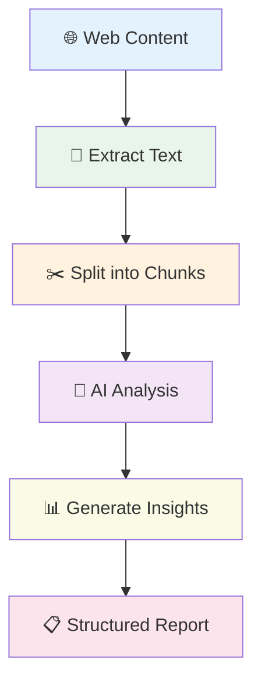
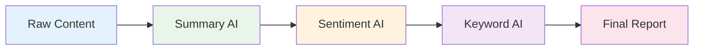
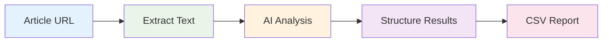
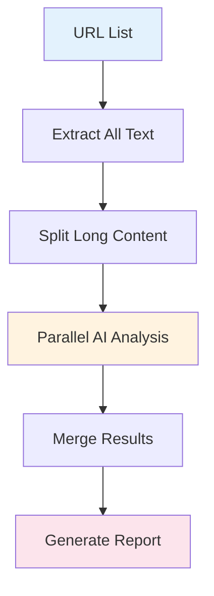

# Create AI-Powered Content Analysis

## What You'll Learn

Build intelligent workflows that can read, understand, and analyze web content like a human researcher. Perfect for content research, competitive analysis, and automated insights.

**⏱️ Time**: 45 minutes
**🎯 Difficulty**: Intermediate
**✅ Result**: AI workflow that analyzes content and generates insights

## Why AI Content Analysis?

- **Scale Human Intelligence**: Analyze hundreds of articles in minutes
- **Extract Insights**: Find patterns and themes across large content sets
- **Automate Research**: Generate summaries, sentiment analysis, and key points
- **Competitive Intelligence**: Understand competitor messaging and positioning

## The AI Analysis Pipeline



## Step 1: Set Up Content Extraction

### Extract Clean Text Content

Start with reliable text extraction that feeds clean data to AI:

**Get All Text From Link Configuration:**
```json
{
  "waitForLoad": true,
  "timeout": 25000,
  "textFilters": [
    ".navigation",
    ".footer",
    ".sidebar",
    ".advertisement",
    ".comments",
    ".related-articles"
  ],
  "includeMetadata": true
}
```

**✅ You should see**: Clean article text without navigation clutter

### Handle Long Content

For articles longer than AI context limits, use text splitting:

**Recursive Character Text Splitter:**
```json
{
  "chunkSize": 2000,
  "chunkOverlap": 200,
  "separators": ["\n\n", "\n", ". ", " "],
  "keepSeparator": true
}
```

## Step 2: Design Your Analysis Prompts

### Content Analysis Prompt Template

Create focused prompts that extract specific insights:

```json
{
  "analysis_prompt": "Analyze this content and provide:\n\n1. **Main Topic**: What is this content primarily about?\n2. **Key Points**: List 3-5 most important points\n3. **Sentiment**: Overall tone (positive/negative/neutral)\n4. **Target Audience**: Who is this written for?\n5. **Content Quality**: Rate 1-10 with brief explanation\n\nContent to analyze:\n{content}\n\nProvide structured analysis:"
}
```

### Specialized Analysis Types

**Competitive Analysis:**
```json
{
  "competitive_prompt": "Analyze this competitor content for:\n\n1. **Value Proposition**: How do they position their solution?\n2. **Key Features**: What capabilities do they highlight?\n3. **Pricing Strategy**: Any pricing information or approach?\n4. **Target Market**: Who are they targeting?\n5. **Messaging Tone**: Professional, casual, technical, etc.\n\nContent: {content}"
}
```

**SEO Content Analysis:**
```json
{
  "seo_prompt": "Analyze this content for SEO effectiveness:\n\n1. **Primary Keywords**: Main topics and terms\n2. **Content Structure**: Headings, organization, readability\n3. **User Intent**: What question does this answer?\n4. **Content Gaps**: What's missing or could be improved?\n5. **Optimization Score**: Rate 1-10 with suggestions\n\nContent: {content}"
}
```

## Step 3: Build the Analysis Workflow

### Core Workflow Nodes

Set up this proven 5-node analysis pattern:

1. **Get All Text From Link** - Extract content
2. **Recursive Character Text Splitter** - Handle long content
3. **Basic LLM Chain** - AI analysis
4. **Edit Fields** - Structure results
5. **Download as File** - Save insights

### LLM Chain Configuration

**Basic LLM Chain Setup:**
```json
{
  "llm": {
    "model": "gpt-3.5-turbo",
    "temperature": 0.3,
    "maxTokens": 1000
  },
  "prompt": "Analyze this content and provide structured insights:\n\n{content}\n\nAnalysis:",
  "outputParser": "structured"
}
```

**✅ You should see**: Structured AI analysis of your content

## Step 4: Structure and Format Results

### Extract Structured Data

Use Edit Fields to parse AI responses into structured data:

```json
{
  "operations": [
    {
      "field": "ai_response",
      "operation": "extract_regex",
      "pattern": "Main Topic: ([^\\n]+)",
      "output_field": "main_topic"
    },
    {
      "field": "ai_response",
      "operation": "extract_regex",
      "pattern": "Sentiment: ([^\\n]+)",
      "output_field": "sentiment"
    },
    {
      "field": "ai_response",
      "operation": "extract_regex",
      "pattern": "Content Quality: ([0-9]+)",
      "output_field": "quality_score"
    }
  ]
}
```

### Create Analysis Reports

**CSV Output Format:**
```csv
URL,Title,Main_Topic,Sentiment,Quality_Score,Key_Points,Analysis_Date
https://example.com/article1,Article Title,Marketing Strategy,Positive,8,"Point 1, Point 2, Point 3",2024-01-15
```

## Real-World Examples

### Example 1: Blog Content Analysis

**Use Case**: Analyze competitor blog posts for content strategy

**Workflow Setup:**
```json
{
  "content_sources": [
    "https://competitor.com/blog/post1",
    "https://competitor.com/blog/post2"
  ],
  "analysis_focus": "content_strategy",
  "output_format": "competitive_intelligence_report"
}
```

**Analysis Prompt:**
```
Analyze this blog post for content strategy insights:

1. **Content Type**: Tutorial, thought leadership, product announcement, etc.
2. **Expertise Level**: Beginner, intermediate, advanced
3. **Call-to-Action**: What action do they want readers to take?
4. **Content Pillars**: What themes/topics do they focus on?
5. **Engagement Factors**: What makes this content engaging?

Content: {content}
```

**Expected Output:**
```json
{
  "content_type": "Tutorial",
  "expertise_level": "Intermediate",
  "cta": "Sign up for free trial",
  "content_pillars": ["Automation", "Productivity", "Business Growth"],
  "engagement_factors": ["Step-by-step examples", "Real case studies", "Actionable tips"]
}
```

### Example 2: Product Review Analysis

**Use Case**: Analyze product reviews to understand customer sentiment

**Multi-Review Processing:**
```json
{
  "review_sources": [
    "https://reviews.com/product-a",
    "https://reviews.com/product-b"
  ],
  "analysis_type": "sentiment_and_features",
  "batch_size": 10
}
```

**Review Analysis Prompt:**
```
Analyze these product reviews:

1. **Overall Sentiment**: Positive, negative, or mixed
2. **Top Praised Features**: What do customers love?
3. **Common Complaints**: What issues come up repeatedly?
4. **Purchase Drivers**: Why do people buy this product?
5. **Improvement Suggestions**: What would make it better?

Reviews: {content}
```

## Advanced AI Techniques

### Multi-Step Analysis

For complex analysis, chain multiple AI calls:



**Step 1 - Summarization:**
```json
{
  "prompt": "Summarize this content in 2-3 sentences, focusing on the main message and key points:\n\n{content}"
}
```

**Step 2 - Sentiment Analysis:**
```json
{
  "prompt": "Analyze the sentiment of this summary. Provide:\n1. Overall sentiment (positive/negative/neutral)\n2. Confidence level (1-10)\n3. Key emotional indicators\n\nSummary: {summary}"
}
```

### RAG-Enhanced Analysis

Use RAG (Retrieval-Augmented Generation) for context-aware analysis:

**RAG Node Configuration:**
```json
{
  "vectorStore": "company_knowledge_base",
  "retrievalCount": 3,
  "prompt": "Based on our company knowledge and this content, analyze:\n\n1. How does this compare to our approach?\n2. What opportunities does this reveal?\n3. What threats should we be aware of?\n\nContent: {content}\nContext: {retrieved_context}"
}
```

## Troubleshooting Guide

### Top 5 Analysis Issues

| Issue | Symptoms | Solution |
|-------|----------|----------|
| **Inconsistent AI responses** | Results vary between runs | Lower temperature, add examples to prompt |
| **Analysis too generic** | Vague, unhelpful insights | Make prompts more specific, add constraints |
| **Content too long for AI** | Truncated or failed analysis | Use text splitter, analyze in chunks |
| **Poor quality extraction** | AI analyzing navigation/ads | Improve text filters, clean content first |
| **Slow processing** | Long wait times | Optimize prompts, use faster models, batch process |

### Debugging Workflow

1. **Test with single article** - Verify analysis quality
2. **Check extracted text** - Ensure clean content input
3. **Refine prompts iteratively** - Start simple, add complexity
4. **Validate AI responses** - Check for expected format
5. **Monitor token usage** - Optimize for cost and speed

## Data Flow Examples

### Simple Content Analysis



### Batch Content Processing



## Best Practices

### Prompt Engineering

- **Be specific**: Ask for exactly what you need
- **Provide examples**: Show the AI your desired output format
- **Set constraints**: Limit response length and format
- **Test iteratively**: Refine prompts based on results

### Performance Optimization

- **Batch processing**: Analyze multiple pieces together when possible
- **Smart chunking**: Split content at natural boundaries
- **Cache results**: Avoid re-analyzing unchanged content
- **Choose appropriate models**: Balance cost, speed, and quality

### Quality Assurance

- **Validate outputs**: Check AI responses for accuracy
- **Human review**: Sample check important analyses
- **Version control**: Track prompt changes and results
- **Error handling**: Plan for AI failures and edge cases

## What's Next?

Expand your AI analysis capabilities:

- **[Extract Data from Any Website](extract-data-from-any-website)** - Master content extraction first
- **[Build a Price Monitoring System](build-price-monitoring-system)** - Combine with monitoring
- **[Advanced AI Workflows](/advanced-ai/)** - Explore complex AI patterns

## Complete Workflow Template

```json
{
  "workflow": {
    "name": "AI Content Analyzer",
    "description": "Intelligent content analysis with structured insights",
    "nodes": [
      {
        "type": "LambdaInput",
        "config": {
          "urls": ["https://example.com/article1", "https://example.com/article2"]
        }
      },
      {
        "type": "GetAllTextFromLink",
        "config": {
          "waitForLoad": true,
          "timeout": 25000,
          "textFilters": [".navigation", ".footer", ".ads"],
          "includeMetadata": true
        }
      },
      {
        "type": "RecursiveCharacterTextSplitter",
        "config": {
          "chunkSize": 2000,
          "chunkOverlap": 200,
          "separators": ["\n\n", "\n", ". "]
        }
      },
      {
        "type": "BasicLLMChain",
        "config": {
          "llm": {
            "model": "gpt-3.5-turbo",
            "temperature": 0.3,
            "maxTokens": 1000
          },
          "prompt": "Analyze this content and provide:\n\n1. **Main Topic**: Primary subject\n2. **Key Points**: 3-5 important points\n3. **Sentiment**: Overall tone\n4. **Quality**: Rate 1-10\n\nContent: {content}\n\nAnalysis:"
        }
      },
      {
        "type": "EditFields",
        "config": {
          "operations": [
            {
              "field": "ai_response",
              "operation": "extract_regex",
              "pattern": "Main Topic: ([^\\n]+)",
              "output_field": "main_topic"
            },
            {
              "field": "ai_response",
              "operation": "extract_regex",
              "pattern": "Sentiment: ([^\\n]+)",
              "output_field": "sentiment"
            }
          ]
        }
      },
      {
        "type": "DownloadAsFile",
        "config": {
          "format": "csv",
          "filename": "content_analysis_{{timestamp}}.csv"
        }
      }
    ]
  }
}
```

---

**💡 Pro Tip**: Start with simple analysis prompts and gradually add complexity. The key to good AI analysis is asking the right questions, not using the most advanced models.