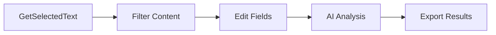
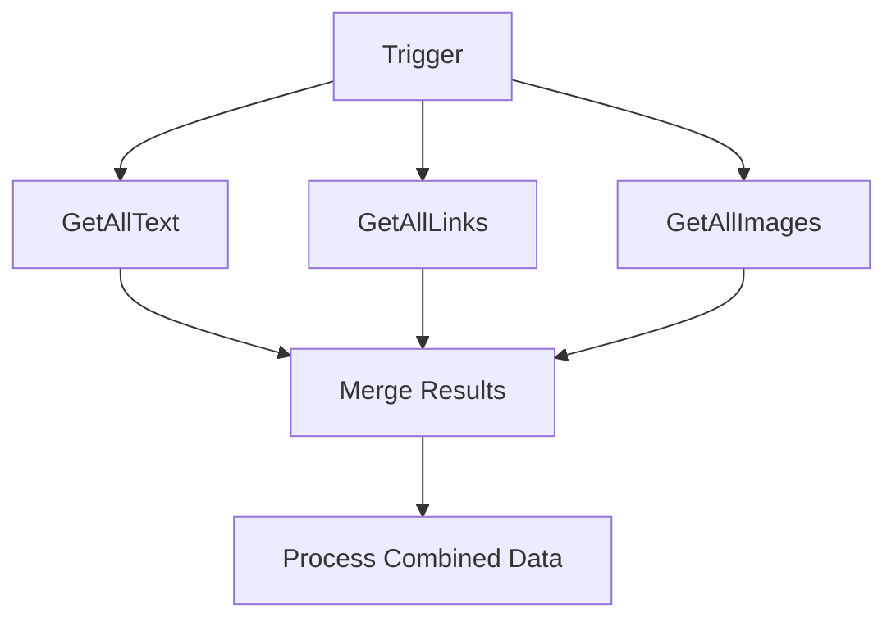
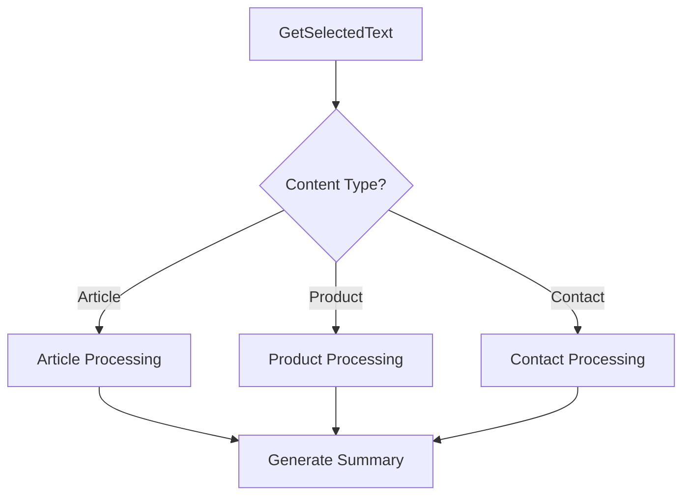

# Multi-Node Browser Automation Patterns

Master the art of combining multiple browser extension nodes to create sophisticated automation workflows. This guide covers proven patterns and best practices for multi-node browser automation.

## Core Automation Patterns

### Pattern 1: Sequential Content Processing

Process web content through a series of transformation steps:



**Implementation:**
```javascript
// Step 1: Extract user-selected content
{
  "node": "GetSelectedText",
  "parameters": {
    "preserveFormatting": true
  }
}

// Step 2: Clean and filter the content
{
  "node": "Edit Fields",
  "parameters": {
    "fields": {
      "cleanText": "{{ $node['GetSelectedText'].json.text.replace(/\\s+/g, ' ').trim() }}",
      "wordCount": "{{ $node['GetSelectedText'].json.text.split(' ').length }}"
    }
  }
}

// Step 3: Analyze content with AI
{
  "node": "AI Agent",
  "parameters": {
    "prompt": "Analyze this text and extract key insights: {{ $node['Edit Fields'].json.cleanText }}"
  }
}
```

### Pattern 2: Parallel Data Collection

Simultaneously gather different types of content from the same page:



**Implementation:**
```javascript
// Parallel extraction nodes (run simultaneously)
{
  "nodes": [
    {
      "node": "GetAllText",
      "parameters": { "includeHidden": false }
    },
    {
      "node": "GetAllLinks", 
      "parameters": { "includeExternal": true }
    },
    {
      "node": "GetAllImages",
      "parameters": { "includeAltText": true }
    }
  ]
}

// Merge all collected data
{
  "node": "Merge",
  "parameters": {
    "mode": "combine",
    "fields": {
      "pageContent": "{{ $node['GetAllText'].json }}",
      "links": "{{ $node['GetAllLinks'].json }}",
      "images": "{{ $node['GetAllImages'].json }}"
    }
  }
}
```

### Pattern 3: Conditional Content Routing

Route content through different processing paths based on content characteristics:



**Implementation:**
```javascript
// Extract and analyze content type
{
  "node": "GetSelectedText",
  "parameters": {
    "includeContext": true
  }
}

// Determine content type
{
  "node": "IF",
  "parameters": {
    "conditions": {
      "isArticle": "{{ $node['GetSelectedText'].json.text.includes('article') || $node['GetSelectedText'].json.text.includes('blog') }}",
      "isProduct": "{{ $node['GetSelectedText'].json.text.includes('price') || $node['GetSelectedText'].json.text.includes('buy') }}",
      "isContact": "{{ $node['GetSelectedText'].json.text.includes('email') || $node['GetSelectedText'].json.text.includes('phone') }}"
    }
  }
}

// Route to appropriate processing
// Different Edit Fields nodes for each content type
```

## Advanced Multi-Node Patterns

### Pattern 4: Iterative Content Discovery

Discover and process content across multiple pages or sections:

```javascript
// Start with initial link collection
{
  "node": "GetAllLinks",
  "parameters": {
    "filterPattern": "article|blog|news"
  }
}

// Process each link (simplified - would use loop in actual implementation)
{
  "node": "HTTP Request",
  "parameters": {
    "url": "{{ $item.href }}",
    "method": "GET"
  }
}

// Extract content from each page
{
  "node": "GetAllText",
  "parameters": {
    "source": "response"
  }
}
```

### Pattern 5: Content Validation and Quality Control

Ensure extracted content meets quality standards:

```javascript
// Extract content
{
  "node": "GetSelectedText"
}

// Validate content quality
{
  "node": "IF",
  "parameters": {
    "conditions": {
      "hasMinLength": "{{ $node['GetSelectedText'].json.text.length > 100 }}",
      "hasValidStructure": "{{ $node['GetSelectedText'].json.text.includes('.') }}",
      "notEmpty": "{{ $node['GetSelectedText'].json.text.trim() !== '' }}"
    }
  }
}

// Retry with different extraction method if validation fails
{
  "node": "GetAllText",
  "parameters": {
    "fallbackMode": true
  }
}
```

## Browser-Specific Multi-Node Considerations

### Handling Dynamic Content

When working with JavaScript-heavy websites:

```javascript
// Wait for content to load
{
  "node": "Wait",
  "parameters": {
    "duration": 2000,
    "reason": "Allow dynamic content to load"
  }
}

// Attempt extraction with retry logic
{
  "node": "GetSelectedText",
  "parameters": {
    "retryAttempts": 3,
    "retryDelay": 1000
  }
}
```

### Managing Browser Resources

Optimize performance across multiple nodes:

```javascript
// Batch similar operations
{
  "node": "Merge",
  "parameters": {
    "batchSize": 5,
    "operations": ["GetAllLinks", "GetAllImages"]
  }
}

// Clean up resources between operations
{
  "node": "Edit Fields",
  "parameters": {
    "fields": {
      "processedData": "{{ $node['PreviousNode'].json }}",
      "cleanup": "{{ delete $node['PreviousNode'] }}"
    }
  }
}
```

## Common Multi-Node Workflow Examples

### Example 1: Research Paper Analysis

```javascript
// 1. Extract paper abstract
{
  "node": "GetSelectedText",
  "selector": ".abstract"
}

// 2. Get all citations
{
  "node": "GetAllLinks",
  "parameters": {
    "filterPattern": "doi|arxiv|pubmed"
  }
}

// 3. Extract author information
{
  "node": "GetAllText",
  "parameters": {
    "selector": ".authors"
  }
}

// 4. Combine and structure data
{
  "node": "Edit Fields",
  "parameters": {
    "fields": {
      "title": "{{ $node['GetAllText'].json.title }}",
      "abstract": "{{ $node['GetSelectedText'].json.text }}",
      "citations": "{{ $node['GetAllLinks'].json }}",
      "authors": "{{ $node['GetAllText_Authors'].json.text }}"
    }
  }
}
```

### Example 2: E-commerce Product Comparison

```javascript
// 1. Extract product details
{
  "node": "GetSelectedText",
  "selector": ".product-details"
}

// 2. Get product images
{
  "node": "GetAllImages",
  "parameters": {
    "filterByClass": "product-image"
  }
}

// 3. Extract price information
{
  "node": "GetAllText",
  "parameters": {
    "selector": ".price"
  }
}

// 4. Get related product links
{
  "node": "GetAllLinks",
  "parameters": {
    "filterPattern": "product|item"
  }
}

// 5. Structure comparison data
{
  "node": "Edit Fields",
  "parameters": {
    "fields": {
      "productName": "{{ $node['GetSelectedText'].json.text.split('\\n')[0] }}",
      "price": "{{ $node['GetAllText_Price'].json.text }}",
      "images": "{{ $node['GetAllImages'].json.length }}",
      "relatedProducts": "{{ $node['GetAllLinks'].json.length }}"
    }
  }
}
```

### Example 3: Social Media Content Aggregation

```javascript
// 1. Extract post content
{
  "node": "GetSelectedText",
  "selector": ".post-content"
}

// 2. Get embedded media
{
  "node": "GetAllImages",
  "parameters": {
    "includeEmbedded": true
  }
}

// 3. Extract hashtags and mentions
{
  "node": "Edit Fields",
  "parameters": {
    "fields": {
      "hashtags": "{{ $node['GetSelectedText'].json.text.match(/#\\w+/g) }}",
      "mentions": "{{ $node['GetSelectedText'].json.text.match(/@\\w+/g) }}"
    }
  }
}

// 4. Get engagement metrics
{
  "node": "GetAllText",
  "parameters": {
    "selector": ".engagement-stats"
  }
}
```

## Best Practices for Multi-Node Workflows

### 1. Plan Your Data Flow
- Map out how data flows between nodes
- Identify dependencies and parallel opportunities
- Plan for error handling at each step

### 2. Optimize Node Ordering
- Run independent operations in parallel
- Place filtering operations early to reduce data volume
- Group similar operations together

### 3. Handle Errors Gracefully
- Use IF nodes to check for successful extraction
- Implement fallback extraction methods
- Provide meaningful error messages

### 4. Monitor Performance
- Track execution time for each node
- Identify bottlenecks in your workflow
- Optimize resource-intensive operations

### 5. Test Across Different Websites
- Verify workflows work on various site structures
- Test with different content types and layouts
- Handle edge cases and unusual page structures

## Troubleshooting Multi-Node Workflows

### Common Issues and Solutions

**Data Not Passing Between Nodes:**
- Check node output format and structure
- Verify field references are correct
- Use Edit Fields to transform data format

**Performance Degradation:**
- Reduce parallel operations if browser struggles
- Filter data earlier in the workflow
- Consider breaking complex workflows into smaller parts

**Inconsistent Results:**
- Add validation nodes to check data quality
- Implement retry logic for unreliable operations
- Use fallback extraction methods

**Browser Security Blocks:**
- Respect Content Security Policy restrictions
- Handle cross-origin limitations gracefully
- Provide user feedback when access is blocked

By mastering these multi-node patterns, you can create sophisticated browser automation workflows that efficiently process web content and deliver powerful results.