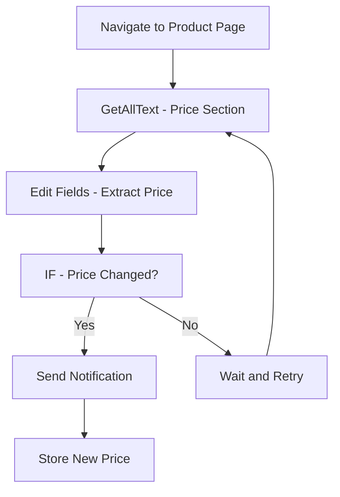

# Common Web Automation Workflow Patterns

Learn the most effective workflow patterns for automating common web tasks using the Agentic Workflow Studio browser extension. These patterns have been tested across various websites and use cases.

## Content Monitoring and Alerting Patterns

### Pattern: Price Tracking Workflow

Monitor product prices and get notified of changes:



**Implementation:**
```javascript
// Extract current price
{
  "node": "GetAllText",
  "parameters": {
    "selector": ".price, .cost, [data-price]",
    "includeHidden": false
  }
}

// Clean and parse price data
{
  "node": "Edit Fields",
  "parameters": {
    "fields": {
      "currentPrice": "{{ $node['GetAllText'].json.text.match(/\\$?([0-9,]+\\.?[0-9]*)/)[1] }}",
      "currency": "{{ $node['GetAllText'].json.text.match(/([£$€¥])/)[1] || '$' }}",
      "extractedAt": "{{ new Date().toISOString() }}"
    }
  }
}

// Compare with stored price
{
  "node": "IF",
  "parameters": {
    "conditions": {
      "priceChanged": "{{ parseFloat($node['Edit Fields'].json.currentPrice) !== parseFloat($workflow.previousPrice) }}",
      "priceDropped": "{{ parseFloat($node['Edit Fields'].json.currentPrice) < parseFloat($workflow.previousPrice) }}"
    }
  }
}
```

### Pattern: Content Change Detection

Monitor web pages for content updates:

```javascript
// Get current page content hash
{
  "node": "GetAllText",
  "parameters": {
    "excludeNavigation": true,
    "excludeFooter": true
  }
}

// Generate content fingerprint
{
  "node": "Edit Fields",
  "parameters": {
    "fields": {
      "contentHash": "{{ crypto.createHash('md5').update($node['GetAllText'].json.text).digest('hex') }}",
      "wordCount": "{{ $node['GetAllText'].json.text.split(' ').length }}",
      "lastChecked": "{{ new Date().toISOString() }}"
    }
  }
}

// Check for changes
{
  "node": "IF",
  "parameters": {
    "conditions": {
      "contentChanged": "{{ $node['Edit Fields'].json.contentHash !== $workflow.lastHash }}",
      "significantChange": "{{ Math.abs($node['Edit Fields'].json.wordCount - $workflow.lastWordCount) > 50 }}"
    }
  }
}
```

## Data Collection and Research Patterns

### Pattern: Competitive Analysis Workflow

Systematically collect competitor information:

```javascript
// Extract company information
{
  "node": "GetAllText",
  "parameters": {
    "selector": ".about, .company-info, .hero"
  }
}

// Collect product/service links
{
  "node": "GetAllLinks",
  "parameters": {
    "filterPattern": "product|service|solution",
    "excludePattern": "contact|about|blog"
  }
}

// Get pricing information
{
  "node": "GetAllText",
  "parameters": {
    "selector": ".pricing, .price, .cost"
  }
}

// Extract contact details
{
  "node": "GetAllText",
  "parameters": {
    "selector": ".contact, .footer"
  }
}

// Structure competitive intelligence
{
  "node": "Edit Fields",
  "parameters": {
    "fields": {
      "companyName": "{{ $node['GetAllText_Company'].json.text.split('\\n')[0] }}",
      "valueProposition": "{{ $node['GetAllText_Company'].json.text }}",
      "productCount": "{{ $node['GetAllLinks'].json.length }}",
      "hasPricing": "{{ $node['GetAllText_Pricing'].json.text.length > 0 }}",
      "contactMethods": "{{ $node['GetAllText_Contact'].json.text.match(/(email|phone|address)/gi) }}",
      "analyzedAt": "{{ new Date().toISOString() }}"
    }
  }
}
```

### Pattern: Lead Generation Workflow

Extract contact information from business websites:

```javascript
// Find contact information
{
  "node": "GetAllText",
  "parameters": {
    "selector": ".contact, .footer, .header"
  }
}

// Extract email addresses
{
  "node": "Edit Fields",
  "parameters": {
    "fields": {
      "emails": "{{ $node['GetAllText'].json.text.match(/[a-zA-Z0-9._%+-]+@[a-zA-Z0-9.-]+\\.[a-zA-Z]{2,}/g) }}",
      "phones": "{{ $node['GetAllText'].json.text.match(/\\+?[1-9]\\d{1,14}/g) }}",
      "addresses": "{{ $node['GetAllText'].json.text.match(/\\d+\\s+[A-Za-z\\s,]+\\d{5}/g) }}"
    }
  }
}

// Get social media links
{
  "node": "GetAllLinks",
  "parameters": {
    "filterPattern": "facebook|twitter|linkedin|instagram"
  }
}

// Structure lead information
{
  "node": "Edit Fields",
  "parameters": {
    "fields": {
      "companyName": "{{ document.title }}",
      "website": "{{ window.location.href }}",
      "primaryEmail": "{{ $node['Edit Fields_Contact'].json.emails[0] }}",
      "phoneNumber": "{{ $node['Edit Fields_Contact'].json.phones[0] }}",
      "socialProfiles": "{{ $node['GetAllLinks_Social'].json }}",
      "collectedAt": "{{ new Date().toISOString() }}"
    }
  }
}
```

## Content Processing and Analysis Patterns

### Pattern: Article Summarization Workflow

Extract and summarize article content:

```javascript
// Extract article content
{
  "node": "GetAllText",
  "parameters": {
    "selector": "article, .content, .post-body, main"
  }
}

// Get article metadata
{
  "node": "GetAllText",
  "parameters": {
    "selector": ".author, .date, .category, .tags"
  }
}

// Extract images and captions
{
  "node": "GetAllImages",
  "parameters": {
    "includeAltText": true,
    "includeCaptions": true
  }
}

// Structure article data
{
  "node": "Edit Fields",
  "parameters": {
    "fields": {
      "title": "{{ document.title }}",
      "content": "{{ $node['GetAllText_Article'].json.text }}",
      "wordCount": "{{ $node['GetAllText_Article'].json.text.split(' ').length }}",
      "readingTime": "{{ Math.ceil($node['GetAllText_Article'].json.text.split(' ').length / 200) }}",
      "author": "{{ $node['GetAllText_Meta'].json.text.match(/by\\s+([A-Za-z\\s]+)/i)?.[1] }}",
      "publishDate": "{{ $node['GetAllText_Meta'].json.text.match(/\\d{1,2}[/-]\\d{1,2}[/-]\\d{4}/) }}",
      "imageCount": "{{ $node['GetAllImages'].json.length }}"
    }
  }
}

// Generate AI summary (if AI node available)
{
  "node": "AI Agent",
  "parameters": {
    "prompt": "Summarize this article in 3 key points: {{ $node['Edit Fields'].json.content }}"
  }
}
```

### Pattern: Social Media Content Analysis

Analyze social media posts and engagement:

```javascript
// Extract post content
{
  "node": "GetSelectedText",
  "parameters": {
    "selector": ".post-content, .tweet-text, .caption"
  }
}

// Get engagement metrics
{
  "node": "GetAllText",
  "parameters": {
    "selector": ".likes, .shares, .comments, .reactions"
  }
}

// Extract hashtags and mentions
{
  "node": "Edit Fields",
  "parameters": {
    "fields": {
      "hashtags": "{{ $node['GetSelectedText'].json.text.match(/#[a-zA-Z0-9_]+/g) }}",
      "mentions": "{{ $node['GetSelectedText'].json.text.match(/@[a-zA-Z0-9_]+/g) }}",
      "urls": "{{ $node['GetSelectedText'].json.text.match(/https?:\\/\\/[^\\s]+/g) }}",
      "sentiment": "{{ $node['GetSelectedText'].json.text.match(/(😊|😢|😡|❤️|👍|👎)/g) }}"
    }
  }
}

// Parse engagement numbers
{
  "node": "Edit Fields",
  "parameters": {
    "fields": {
      "likes": "{{ parseInt($node['GetAllText_Engagement'].json.text.match(/\\d+(?=\\s*likes?)/i)?.[0] || '0') }}",
      "shares": "{{ parseInt($node['GetAllText_Engagement'].json.text.match(/\\d+(?=\\s*shares?)/i)?.[0] || '0') }}",
      "comments": "{{ parseInt($node['GetAllText_Engagement'].json.text.match(/\\d+(?=\\s*comments?)/i)?.[0] || '0') }}"
    }
  }
}
```

## E-commerce and Shopping Patterns

### Pattern: Product Information Extraction

Systematically extract product details:

```javascript
// Get product title and description
{
  "node": "GetAllText",
  "parameters": {
    "selector": ".product-title, .product-name, h1"
  }
}

// Extract price information
{
  "node": "GetAllText",
  "parameters": {
    "selector": ".price, .cost, .amount"
  }
}

// Get product images
{
  "node": "GetAllImages",
  "parameters": {
    "selector": ".product-image, .gallery img",
    "includeAltText": true
  }
}

// Extract specifications
{
  "node": "GetAllText",
  "parameters": {
    "selector": ".specs, .features, .details"
  }
}

// Get reviews summary
{
  "node": "GetAllText",
  "parameters": {
    "selector": ".reviews, .rating, .stars"
  }
}

// Structure product data
{
  "node": "Edit Fields",
  "parameters": {
    "fields": {
      "productName": "{{ $node['GetAllText_Title'].json.text.trim() }}",
      "currentPrice": "{{ $node['GetAllText_Price'].json.text.match(/\\$?([0-9,]+\\.?[0-9]*)/)?.[1] }}",
      "originalPrice": "{{ $node['GetAllText_Price'].json.text.match(/was\\s*\\$?([0-9,]+\\.?[0-9]*)/i)?.[1] }}",
      "discount": "{{ $node['GetAllText_Price'].json.text.match(/([0-9]+)%\\s*off/i)?.[1] }}",
      "rating": "{{ $node['GetAllText_Reviews'].json.text.match(/([0-9]\\.[0-9])\\s*stars?/i)?.[1] }}",
      "reviewCount": "{{ $node['GetAllText_Reviews'].json.text.match(/([0-9,]+)\\s*reviews?/i)?.[1] }}",
      "imageCount": "{{ $node['GetAllImages'].json.length }}",
      "inStock": "{{ !$node['GetAllText_Price'].json.text.toLowerCase().includes('out of stock') }}"
    }
  }
}
```

### Pattern: Inventory Monitoring

Track product availability across multiple sites:

```javascript
// Check stock status
{
  "node": "GetAllText",
  "parameters": {
    "selector": ".stock, .availability, .inventory"
  }
}

// Monitor price changes
{
  "node": "GetAllText",
  "parameters": {
    "selector": ".price"
  }
}

// Check for sale indicators
{
  "node": "GetAllText",
  "parameters": {
    "selector": ".sale, .discount, .promo"
  }
}

// Determine availability status
{
  "node": "Edit Fields",
  "parameters": {
    "fields": {
      "isAvailable": "{{ !$node['GetAllText_Stock'].json.text.toLowerCase().includes('out of stock') }}",
      "isOnSale": "{{ $node['GetAllText_Sale'].json.text.toLowerCase().includes('sale') }}",
      "stockLevel": "{{ $node['GetAllText_Stock'].json.text.match(/([0-9]+)\\s*in\\s*stock/i)?.[1] }}",
      "deliveryTime": "{{ $node['GetAllText_Stock'].json.text.match(/delivery\\s*in\\s*([0-9-]+)\\s*days?/i)?.[1] }}"
    }
  }
}
```

## News and Media Monitoring Patterns

### Pattern: News Article Tracking

Monitor news sources for specific topics:

```javascript
// Extract headlines
{
  "node": "GetAllText",
  "parameters": {
    "selector": "h1, h2, .headline, .title"
  }
}

// Get article summaries
{
  "node": "GetAllText",
  "parameters": {
    "selector": ".summary, .excerpt, .lead"
  }
}

// Extract publication info
{
  "node": "GetAllText",
  "parameters": {
    "selector": ".byline, .author, .date, .source"
  }
}

// Filter for relevant content
{
  "node": "Filter",
  "parameters": {
    "conditions": {
      "relevantKeywords": "{{ $node['GetAllText_Headlines'].json.text.toLowerCase().includes('technology') || $node['GetAllText_Headlines'].json.text.toLowerCase().includes('ai') }}"
    }
  }
}

// Structure news data
{
  "node": "Edit Fields",
  "parameters": {
    "fields": {
      "headline": "{{ $node['GetAllText_Headlines'].json.text }}",
      "summary": "{{ $node['GetAllText_Summaries'].json.text }}",
      "author": "{{ $node['GetAllText_Publication'].json.text.match(/by\\s+([A-Za-z\\s]+)/i)?.[1] }}",
      "publishDate": "{{ $node['GetAllText_Publication'].json.text.match(/\\d{1,2}[/-]\\d{1,2}[/-]\\d{4}/) }}",
      "source": "{{ window.location.hostname }}",
      "url": "{{ window.location.href }}"
    }
  }
}
```

## Performance Optimization Patterns

### Pattern: Efficient Batch Processing

Process multiple items efficiently:

```javascript
// Collect all items to process
{
  "node": "GetAllLinks",
  "parameters": {
    "filterPattern": "product|article|item",
    "limit": 10
  }
}

// Process in batches to avoid overwhelming browser
{
  "node": "Edit Fields",
  "parameters": {
    "fields": {
      "batch1": "{{ $node['GetAllLinks'].json.slice(0, 3) }}",
      "batch2": "{{ $node['GetAllLinks'].json.slice(3, 6) }}",
      "batch3": "{{ $node['GetAllLinks'].json.slice(6, 9) }}"
    }
  }
}

// Add delays between batches
{
  "node": "Wait",
  "parameters": {
    "duration": 1000,
    "reason": "Prevent rate limiting"
  }
}
```

### Pattern: Smart Content Caching

Cache extracted content to improve performance:

```javascript
// Check if content is already cached
{
  "node": "IF",
  "parameters": {
    "conditions": {
      "isCached": "{{ $workflow.cache[window.location.href] !== undefined }}",
      "cacheValid": "{{ Date.now() - $workflow.cache[window.location.href]?.timestamp < 3600000 }}"
    }
  }
}

// Use cached content if available and valid
{
  "node": "Edit Fields",
  "parameters": {
    "fields": {
      "content": "{{ $workflow.cache[window.location.href]?.content || null }}"
    }
  }
}

// Extract fresh content if not cached
{
  "node": "GetAllText",
  "parameters": {
    "skipIfCached": true
  }
}

// Update cache with fresh content
{
  "node": "Edit Fields",
  "parameters": {
    "fields": {
      "cacheUpdate": "{{ $workflow.cache[window.location.href] = { content: $node['GetAllText'].json.text, timestamp: Date.now() } }}"
    }
  }
}
```

## Error Handling and Resilience Patterns

### Pattern: Graceful Degradation

Handle extraction failures gracefully:

```javascript
// Primary extraction method
{
  "node": "GetSelectedText",
  "parameters": {
    "selector": ".main-content"
  }
}

// Check if primary extraction succeeded
{
  "node": "IF",
  "parameters": {
    "conditions": {
      "hasContent": "{{ $node['GetSelectedText'].json.text && $node['GetSelectedText'].json.text.length > 0 }}"
    }
  }
}

// Fallback to alternative extraction
{
  "node": "GetAllText",
  "parameters": {
    "selector": "body",
    "fallbackMode": true
  }
}

// Final fallback to page title
{
  "node": "Edit Fields",
  "parameters": {
    "fields": {
      "finalContent": "{{ $node['GetAllText'].json.text || document.title || 'No content available' }}"
    }
  }
}
```

These workflow patterns provide a solid foundation for building robust browser automation workflows. Adapt and combine them based on your specific use cases and requirements.