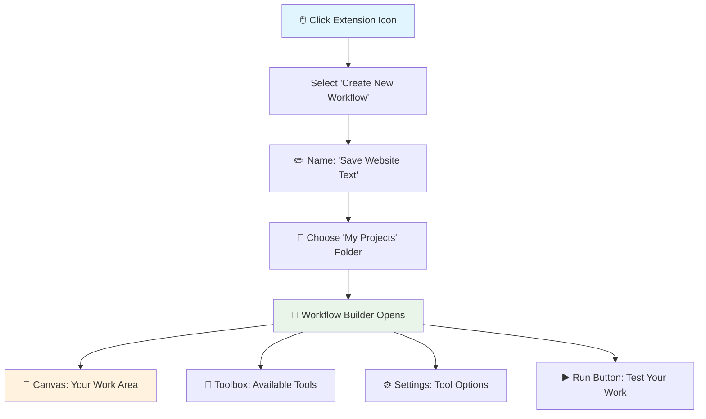
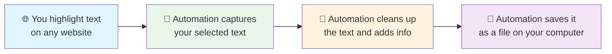
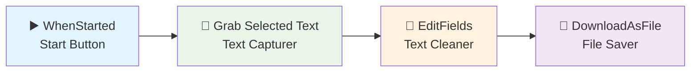

# Your First Workflow: Save Text from Any Website

Ready to build something useful? Let's create your first automation that saves text from websites directly to your computer. Think of it like having a smart assistant that captures and organizes information for you.

## What You'll Build

By the end of this tutorial, you'll have created an automation that:
- **Captures text** you select on any website (like highlighting with a marker)
- **Cleans up the text** by removing extra spaces and adding useful information
- **Saves it as a file** on your computer with the date and word count
- **Works on any website** - news articles, research papers, product descriptions, anything!

**Real-world example:** Imagine you're researching vacation destinations. You find great descriptions on travel blogs, but copying and pasting into documents is tedious. This automation lets you highlight text and instantly save it with all the details organized.

## Before You Start

**You'll need:**
- ✅ Agentic Workflow Studio extension installed ([Setup guide here](/learning/text-courses/beginner/installation-setup/))
- ✅ 30 minutes of time
- ✅ Any website with text (we'll suggest some good ones)

**What you'll learn:**
- How to build automations using **nodes** (think of them as LEGO blocks that do specific jobs)
- How information flows from one step to the next
- How to save your work automatically

**💡 New to automation?** Don't worry! We'll explain everything in simple terms as we go.

## Step 1: Open Your Automation Builder

Let's start by opening the tool where you'll build your automation.



### Getting Started

1. **Find the extension icon** in your browser toolbar (it looks like connected boxes)
   - **✅ Checkpoint:** You should see a small popup menu when you click it

2. **Create your automation**
   - Click "Create New Workflow" 
   - Name it: "Save Website Text" (or whatever makes sense to you)
   - **✅ Checkpoint:** A new window should open with a blank workspace

3. **Get familiar with your workspace**
   - **Canvas** (big empty area): This is where you'll build your automation
   - **Toolbox** (left side): Contains all the tools (**nodes**) you can use
   - **Settings panel** (right side): Shows options for whatever you select
   - **Run button** (top): Tests your automation when you're ready

**💡 Think of nodes as:** Each node is like a specialized worker. One worker might be great at grabbing text, another at cleaning it up, and another at saving files. You'll connect these workers to create your automation team.

### Planning Your Automation

Before we start building, let's understand what we're creating:



**Real example:** You're on a recipe website, you highlight "Bake at 350°F for 25 minutes", and your automation instantly saves it as a clean text file with the date and website info included.

## Step 2: Add Your Text Grabber

Now we'll add the first worker to your automation team - the one that captures text you select.

### Finding and Adding the Text Grabber

1. **Look in your toolbox** (left side of the screen)
   - Click on "Extension Tools" to expand that section
   - Find the tool called "GetSelectedText"
   - **✅ Checkpoint:** You should see a tool with that exact name

2. **Add it to your workspace**
   - Drag "GetSelectedText" from the toolbox to the canvas
   - Drop it on the left side (this will be where your automation starts)
   - **✅ Checkpoint:** You should see a box appear on your canvas

3. **Give it a friendly name and settings**
   - Click on the box you just added
   - In the settings panel (right side), change these options:
     ```
     Name: "Grab My Selected Text"
     Include Formatting: ✓ (keeps bold, italic text)
     Preserve Whitespace: ✓ (keeps proper spacing)
     Extract Context: ✓ (includes nearby text for reference)
     ```
   - **✅ Checkpoint:** The settings panel should show these options when the box is selected

### What This Tool Does

**💡 Simple explanation:** This tool watches for when you highlight text on a website (like when you drag your mouse to select text). When you do, it captures that text and gets it ready for the next step.

**What it captures:**
- **The exact text you selected** (the main content)
- **Surrounding text** (a few words before and after, for context)
- **Where it came from** (which part of the webpage)
- **How it was formatted** (bold, italic, etc.)

**Real example:** If you select "Best pizza in Chicago" from a restaurant review, this tool captures that phrase plus maybe "The best pizza in Chicago is definitely at Tony's" and remembers it came from a paragraph on that webpage.

## Step 3: Add Your Text Cleaner

Next, we'll add a worker that cleans up and improves the text we captured.

### Adding the Text Cleaner

1. **Find the cleaning tool**
   - In your toolbox, click on "Data Tools" 
   - Look for "EditFields" (this tool modifies and improves data)
   - **✅ Checkpoint:** You should see "EditFields" in the Data Tools section

2. **Add it to your workspace**
   - Drag "EditFields" to your canvas
   - Place it to the right of your "Grab My Selected Text" box
   - **✅ Checkpoint:** You now have two boxes on your canvas

3. **Connect your workers**
   - Look for a small circle on the right side of your first box (this is the **output port** - where information comes out)
   - Click and drag from that circle to the left side of your second box (the **input port** - where information goes in)
   - **✅ Checkpoint:** You should see a line connecting the two boxes, showing information flows from left to right

### Setting Up the Text Cleaner

Now let's tell this worker what improvements to make:

1. **Click on your EditFields box** to select it
2. **In the settings panel, add these improvements:**

   **Improvement 1: Clean Up Spacing**
   ```
   What to improve: selectedText
   How to improve it: Remove extra spaces
   Find this pattern: Multiple spaces in a row
   Replace with: Single space
   ```

   **Improvement 2: Add Today's Date**
   ```
   Create new field: extractedAt  
   Set it to: Today's date and time
   ```

   **Improvement 3: Count the Words**
   ```
   Create new field: wordCount
   Set it to: Number of words in the selected text
   ```

3. **✅ Checkpoint:** Your settings should show three different improvements listed

### What's Happening Now

**💡 Simple explanation:** Think of this like an assembly line. The first worker (GetSelectedText) hands the raw text to the second worker (EditFields). The second worker cleans it up, adds useful information like the date, and counts how many words there are.

```
Your highlighted text → Worker 1 captures it → Worker 2 cleans and improves it → Ready for saving
```

**Real example:** You select "Check out this amazing recipe!" The first worker captures it, then the second worker removes extra spaces, adds "Captured on March 15, 2024 at 2:30 PM" and notes "Word count: 5 words".

## Step 4: Add Your File Saver

Now we'll add the final worker - the one that saves everything to your computer.

### Adding the File Saver

1. **Find the saving tool**
   - In "Data Tools", look for "DownloadAsFile"
   - **✅ Checkpoint:** This tool saves information as files on your computer

2. **Add and connect it**
   - Drag "DownloadAsFile" to the right of your EditFields box
   - Connect the output of EditFields to the input of DownloadAsFile
   - **✅ Checkpoint:** You should now have three connected boxes

3. **Configure the file saver**
   - Click on the DownloadAsFile box
   - Set these options:
     ```
     File Name: "website-text-" + today's date + ".json"
     File Type: JSON (a simple, readable format)
     Include All Info: ✓ (saves everything we captured)
     Auto Download: ✗ (we'll save manually when ready)
     ```

### Adding the Start Button

Every automation needs a way to begin. Let's add that:

1. **Find the starter**
   - In your toolbox, look for "Triggers"
   - Find "WhenStarted" (this begins your automation)

2. **Add and connect it**
   - Drag "WhenStarted" to the far left of your canvas
   - Connect its output to the input of your first box ("Grab My Selected Text")
   - **✅ Checkpoint:** You should now have four connected boxes in a line

### Your Complete Automation

Your workspace should now look like this:



**💡 What you've built:** A complete automation that starts when you click a button, captures text you've selected on any website, cleans it up and adds useful information, then saves it as a file on your computer with today's date in the filename.

## Step 5: Test Your Automation

Time to see your creation in action! Let's test it with real content.

### Getting Ready to Test

1. **Save your work first**
   - Click the "Save" button at the top of your workspace
   - **✅ Checkpoint:** You should see a confirmation that it saved successfully

2. **Find a good test website**
   - Open a new browser tab
   - Try one of these content-rich sites:
     - **News articles** (BBC, CNN, local news sites)
     - **Wikipedia pages** (great for testing with lots of text)
     - **Blog posts** (recipe blogs, travel blogs, how-to guides)
     - **Product descriptions** (Amazon, shopping sites)

### Running Your First Test

1. **Select some text on the website**
   - Highlight a sentence or paragraph by dragging your mouse
   - **✅ Checkpoint:** The text should be highlighted in blue/colored background
   - **💡 Tip:** Start with a short paragraph (2-3 sentences) for your first test

2. **Run your automation**
   - Switch back to your Workflow Studio tab
   - Click the big "Execute Workflow" or "Run" button
   - **✅ Checkpoint:** You should see your boxes light up one by one as they work

3. **Watch it work**
   - Each box will change color as it processes (usually green for success)
   - The whole process should take just a few seconds
   - **✅ Checkpoint:** All boxes should turn green when finished

### Checking Your Results

1. **See what each worker did**
   - Click on each box to see what information it processed
   - **First box:** Should show the text you selected
   - **Second box:** Should show the cleaned text with date and word count
   - **Third box:** Should show the file ready for download

2. **Download your saved file**
   - Click on the last box (DownloadAsFile)
   - Look for a "Download" button and click it
   - **✅ Checkpoint:** A file should download to your computer (check your Downloads folder)

### What Your Saved File Looks Like

When you open the downloaded file, you'll see something like this:
```json
{
  "selectedText": "The best pizza in Chicago is definitely at Tony's Restaurant.",
  "context": "After trying dozens of places, the best pizza in Chicago is definitely at Tony's Restaurant. Their deep dish is legendary.",
  "extractedAt": "2024-03-15T14:30:45.123Z",
  "wordCount": 11,
  "website": "travel-blog.com"
}
```

**💡 What this means:**
- **selectedText:** The exact text you highlighted
- **context:** A bit of surrounding text for reference  
- **extractedAt:** When you captured this (date and time)
- **wordCount:** How many words were in your selection
- **website:** Where you found this text

## Step 6: Understanding What Happened

### Data Flow Analysis

Let's trace how data moved through your workflow:

1. **WhenStarted Trigger**
   - Initiated the workflow execution
   - Passed control to the next node

2. **GetSelectedText Extraction**
   - Detected your text selection on the web page
   - Extracted the text along with context and metadata
   - Passed structured data to the next node

3. **EditFields Processing**
   - Received the raw extraction data
   - Applied cleaning operations to remove extra whitespace
   - Added timestamp and word count metadata
   - Passed enhanced data to the final node

4. **DownloadAsFile Output**
   - Received the processed data
   - Formatted it as JSON
   - Prepared it for download or further processing

### Key Concepts Demonstrated

**Node-Based Architecture:** Each node has a specific purpose and can be configured independently.

**Data Transformation:** Raw browser data is processed and enhanced as it flows through the workflow.

**Browser Integration:** The workflow seamlessly interacts with web page content through the browser extension.

**Flexible Output:** Results can be saved, downloaded, or passed to other systems.

## Step 7: Experiment and Extend

### Try Different Configurations

1. **Modify Text Processing**
   - Change the EditFields configuration
   - Try different text cleaning operations
   - Add more metadata fields

2. **Test Different Content**
   - Try selecting text from different types of web pages
   - Test with formatted text (bold, italic, links)
   - Experiment with different text lengths

3. **Add More Nodes**
   - Insert additional processing nodes
   - Try the Filter node to process only certain types of text
   - Add conditional logic with the IF node

### Common Variations

**Email Extraction Workflow:**
```
GetSelectedText → EditFields (extract emails) → Filter (valid emails) → DownloadAsFile
```

**Link Collection Workflow:**
```
GetAllLinks → EditFields (clean URLs) → Filter (external links) → DownloadAsFile
```

**Content Summary Workflow:**
```
GetAllText → EditFields (truncate) → AI Processing → DownloadAsFile
```

## When Things Don't Work (Troubleshooting)

Don't worry if something goes wrong - it happens to everyone! Here are the most common issues and how to fix them.

### "My automation didn't capture any text"

**What you'll see:** The first box shows no text or says "no data"

**How to fix it:**
1. **Make sure text is actually selected**
   - The text should be highlighted (colored background) on the webpage
   - Try selecting different text or refresh the page and try again
   - **✅ Test:** Can you copy the selected text with Ctrl+C? If not, try selecting again

2. **Check if the website allows it**
   - Some websites block extensions from working
   - Try the same automation on a different website (like Wikipedia)
   - **✅ Test:** If it works on Wikipedia but not another site, that site is blocking it

3. **Permission problems**
   - Your browser might ask for permission to access the website
   - Look for permission popups and click "Allow"
   - **✅ Test:** Check if there's a shield or lock icon in your address bar

### "My automation shows red boxes (errors)"

**What you'll see:** One or more boxes turn red instead of green

**How to fix it:**
1. **Check your connections**
   - Make sure all boxes are connected with lines
   - The lines should go from right side of one box to left side of the next
   - **✅ Test:** You should see a clear path from start to finish

2. **Check your settings**
   - Click on the red box and look at the settings panel
   - Make sure all required fields are filled in
   - **✅ Test:** No settings should show red warning text

3. **Start over with a simple test**
   - Try selecting just a few words instead of a long paragraph
   - Use a simple website like Wikipedia
   - **✅ Test:** If simple text works, gradually try more complex selections

### "No file was downloaded"

**What you'll see:** The automation runs successfully but no file appears

**How to fix it:**
1. **Check your browser's download settings**
   - Look in your Downloads folder
   - Check if your browser is blocking downloads (look for download icons in the address bar)
   - **✅ Test:** Try downloading something else to make sure downloads work

2. **Check extension permissions**
   - The extension needs permission to save files
   - Look for permission requests in your browser
   - **✅ Test:** Try running the automation again after granting permissions

3. **Manual download**
   - Click on the last box (DownloadAsFile) 
   - Look for a "Download" button and click it manually
   - **✅ Test:** This should force the download to start

## What You've Accomplished

🎉 **Congratulations!** You've just built your first automation that can save text from any website. Here's what you now know how to do:

### Skills You've Gained
- **Build automations** using connected workers (**nodes**)
- **Capture text** from any website by highlighting it
- **Clean and organize** captured information automatically  
- **Save your work** as files on your computer
- **Troubleshoot** when things don't work as expected

### Real-World Uses for Your New Automation
- **Research projects:** Save quotes and facts from multiple websites
- **Recipe collection:** Capture cooking instructions from food blogs
- **Travel planning:** Save descriptions from travel websites
- **Shopping research:** Collect product details from different stores
- **Learning:** Save important information from educational websites

## Ideas to Try Next

### Experiment with Your Current Automation
1. **Try different websites** - news sites, blogs, shopping sites
2. **Select different types of text** - headlines, paragraphs, lists
3. **Change the file name** to organize your saved content better

### Ready for More?
**Next tutorials:** [Browser Permissions](/learning/text-courses/beginner/browser-permissions/) • [Data Flow Basics](/learning/text-courses/beginner/data-flow-basics/) • [Multi-Step Workflows](/learning/text-courses/intermediate/multi-step-workflows/)

**Explore more nodes:** [Get All Text](/integrations/extension/GetAllText/) • [Get All Links](/integrations/extension/GetAllLinks/) • [Form Filler](/integrations/extension/FormFiller/)

**Workflow patterns:** [Content Manipulation](/learning/workflow-patterns/content-manipulation-patterns/) • [Research Automation](/learning/workflow-patterns/real-world-examples/research-automation/) • [Web Scraping Patterns](/learning/workflow-patterns/web-scraping-patterns/)

---

**⏱️ Time to complete:** 30-45 minutes  
**🎯 Difficulty:** 🌱 Beginner (perfect for first-timers)  
**📋 What you needed:** Browser extension installed