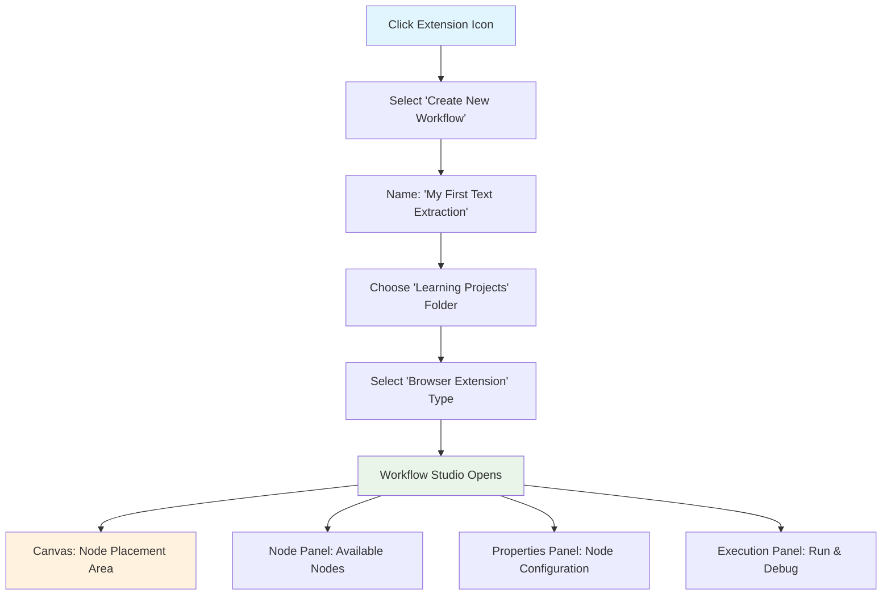
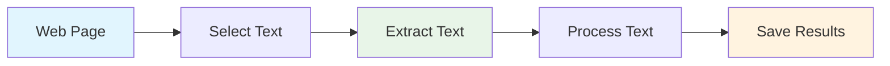
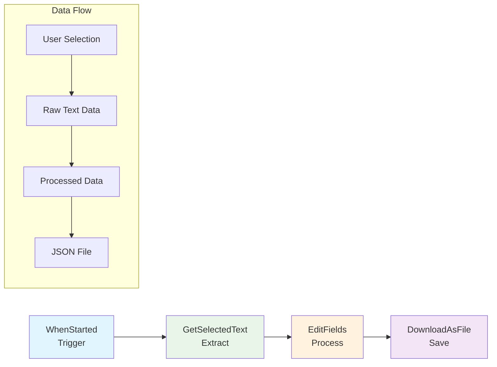

# Your First Workflow: Text Extraction

Now that you have Agentic Workflow Studio installed, let's create your first workflow! This tutorial will guide you through building a simple but powerful text extraction workflow that demonstrates the core concepts of browser-based automation.

## What You'll Build

In this tutorial, you'll create a workflow that:
- Extracts selected text from any web page
- Processes and cleans the extracted text
- Saves the results for further use
- Demonstrates basic data flow between nodes

## Prerequisites

- Completed [Browser Extension Installation & Setup](/learning/text-courses/beginner/installation-setup/)
- Agentic Workflow Studio extension installed and configured
- Basic understanding of web page text selection

## Learning Objectives

By the end of this tutorial, you'll understand:
- How to create and configure workflow nodes
- Basic data flow between browser extension nodes
- Text extraction and processing techniques
- Workflow execution and debugging

## Step 1: Create Your First Workflow



### Opening the Workflow Studio

1. **Launch the Extension**
   - Click the Agentic Workflow Studio icon in your browser toolbar
   - Select "Create New Workflow" from the popup menu

2. **Set Up Your Workspace**
   - Name your workflow: "My First Text Extraction"
   - Choose the "Learning Projects" folder
   - Select "Browser Extension" as the workflow type

3. **Understand the Interface**
   - **Canvas**: Where you'll place and connect nodes
   - **Node Panel**: Available nodes organized by category
   - **Properties Panel**: Configure selected node settings
   - **Execution Panel**: Run and debug your workflow

### Workflow Planning

Before building, let's plan our workflow:



This simple flow demonstrates the fundamental pattern of browser automation workflows.

## Step 2: Add Your First Node - Text Selection

### Adding the GetSelectedText Node

1. **Open the Node Panel**
   - Click "Extension Nodes" category
   - Find "GetSelectedText" node

2. **Add to Canvas**
   - Drag "GetSelectedText" node to the canvas
   - Position it on the left side (this will be our starting point)

3. **Configure the Node**
   - Click the node to select it
   - In the Properties Panel, set:
     ```
     Node Name: "Extract Selected Text"
     Include Formatting: true
     Preserve Whitespace: true
     Extract Context: true
     ```

### Understanding GetSelectedText

This node captures text that users select on web pages:

**Input:** User text selection on any web page  
**Output:** Structured data containing:
- `selectedText`: The actual selected text
- `context`: Surrounding text for context
- `element`: HTML element information
- `position`: Selection position data

**Configuration Options:**
- **Include Formatting**: Preserves bold, italic, and other text formatting
- **Preserve Whitespace**: Maintains original spacing and line breaks
- **Extract Context**: Includes surrounding text for better understanding

## Step 3: Add Text Processing

### Adding the EditFields Node

1. **Add EditFields Node**
   - From "Data Transformation" category
   - Drag to canvas, position to the right of GetSelectedText

2. **Connect the Nodes**
   - Click the output port of GetSelectedText (right side)
   - Drag to the input port of EditFields (left side)
   - You should see a connection line appear

3. **Configure Text Processing**
   - Select the EditFields node
   - Add these field operations:
     ```
     Operation 1: Clean Text
     - Field: selectedText
     - Action: Remove extra whitespace
     - Pattern: /\s+/g
     - Replace with: " "
     
     Operation 2: Add Metadata
     - Field: extractedAt
     - Action: Set value
     - Value: {{new Date().toISOString()}}
     
     Operation 3: Count Words
     - Field: wordCount
     - Action: Set value
     - Value: {{$json.selectedText.split(' ').length}}
     ```

### Understanding Data Flow

At this point, data flows like this:
```
User Selection → GetSelectedText → EditFields → Processed Data
```

The EditFields node receives the raw extraction data and:
- Cleans up extra whitespace in the text
- Adds a timestamp showing when extraction occurred
- Calculates and adds word count

## Step 4: Add Output and Storage

### Adding the DownloadAsFile Node

1. **Add DownloadAsFile Node**
   - From "Data Transformation" category
   - Position to the right of EditFields

2. **Connect and Configure**
   - Connect EditFields output to DownloadAsFile input
   - Configure the download settings:
     ```
     File Name: "extracted-text-{{new Date().toISOString().split('T')[0]}}.json"
     File Format: JSON
     Include Metadata: true
     Auto Download: false (we'll trigger manually)
     ```

### Adding a Trigger Node

1. **Add WhenStarted Node**
   - From "Trigger" category
   - Position at the far left of your canvas

2. **Connect the Trigger**
   - Connect WhenStarted output to GetSelectedText input
   - This creates a complete workflow chain

Your workflow should now look like:



## Step 5: Test Your Workflow

### Preparing for Testing

1. **Save Your Workflow**
   - Click "Save" in the toolbar
   - Verify the workflow name and location

2. **Open a Test Web Page**
   - Navigate to any article or blog post
   - Choose a page with substantial text content
   - Good options: news articles, Wikipedia pages, blog posts

### Running Your First Test

1. **Select Text on the Page**
   - Highlight a paragraph or sentence
   - Ensure the text is clearly selected (highlighted in blue)

2. **Execute the Workflow**
   - Return to the Workflow Studio
   - Click "Execute Workflow" button
   - Watch the execution progress in the Execution Panel

3. **Monitor Execution**
   - Each node will light up as it processes
   - Green indicates successful execution
   - Red indicates errors (we'll troubleshoot if needed)

### Viewing Results

1. **Check Node Outputs**
   - Click on each node to see its output data
   - GetSelectedText should show your selected text
   - EditFields should show processed data with metadata
   - DownloadAsFile should show the prepared file data

2. **Download Your Results**
   - If auto-download is disabled, click "Download" in the DownloadAsFile node
   - Check your browser's download folder for the JSON file

### Example Output

Your downloaded file should contain something like:
```json
{
  "selectedText": "This is the text you selected from the web page.",
  "context": "...surrounding text for context...",
  "element": {
    "tagName": "P",
    "className": "article-paragraph",
    "id": ""
  },
  "position": {
    "start": 145,
    "end": 198
  },
  "extractedAt": "2024-01-15T10:30:45.123Z",
  "wordCount": 10
}
```

## Step 6: Understanding What Happened

### Data Flow Analysis

Let's trace how data moved through your workflow:

1. **WhenStarted Trigger**
   - Initiated the workflow execution
   - Passed control to the next node

2. **GetSelectedText Extraction**
   - Detected your text selection on the web page
   - Extracted the text along with context and metadata
   - Passed structured data to the next node

3. **EditFields Processing**
   - Received the raw extraction data
   - Applied cleaning operations to remove extra whitespace
   - Added timestamp and word count metadata
   - Passed enhanced data to the final node

4. **DownloadAsFile Output**
   - Received the processed data
   - Formatted it as JSON
   - Prepared it for download or further processing

### Key Concepts Demonstrated

**Node-Based Architecture:** Each node has a specific purpose and can be configured independently.

**Data Transformation:** Raw browser data is processed and enhanced as it flows through the workflow.

**Browser Integration:** The workflow seamlessly interacts with web page content through the browser extension.

**Flexible Output:** Results can be saved, downloaded, or passed to other systems.

## Step 7: Experiment and Extend

### Try Different Configurations

1. **Modify Text Processing**
   - Change the EditFields configuration
   - Try different text cleaning operations
   - Add more metadata fields

2. **Test Different Content**
   - Try selecting text from different types of web pages
   - Test with formatted text (bold, italic, links)
   - Experiment with different text lengths

3. **Add More Nodes**
   - Insert additional processing nodes
   - Try the Filter node to process only certain types of text
   - Add conditional logic with the IF node

### Common Variations

**Email Extraction Workflow:**
```
GetSelectedText → EditFields (extract emails) → Filter (valid emails) → DownloadAsFile
```

**Link Collection Workflow:**
```
GetAllLinks → EditFields (clean URLs) → Filter (external links) → DownloadAsFile
```

**Content Summary Workflow:**
```
GetAllText → EditFields (truncate) → AI Processing → DownloadAsFile
```

## Troubleshooting Common Issues

### Text Selection Not Detected

**Problem:** GetSelectedText node shows no data

**Solutions:**
1. **Verify Text Selection**
   - Ensure text is actually selected (highlighted) on the page
   - Try selecting different text or refreshing the page

2. **Check Permissions**
   - Verify the extension has access to the current site
   - Grant permissions if prompted

3. **Page Compatibility**
   - Some sites may block extension access
   - Try on a different website to isolate the issue

### Workflow Execution Fails

**Problem:** Nodes show error status (red)

**Solutions:**
1. **Check Node Configuration**
   - Verify all required fields are filled
   - Ensure data types match expected inputs

2. **Review Connections**
   - Verify nodes are properly connected
   - Check that data flows from output to input ports

3. **Debug Mode**
   - Enable debug mode in workflow settings
   - Check the execution log for detailed error messages

### No File Downloaded

**Problem:** DownloadAsFile node executes but no file appears

**Solutions:**
1. **Browser Settings**
   - Check if browser is blocking downloads
   - Verify download location in browser settings

2. **Extension Permissions**
   - Ensure extension has download permissions
   - Re-grant permissions if necessary

3. **File Configuration**
   - Check file name doesn't contain invalid characters
   - Verify file format is supported

## Best Practices Learned

### Workflow Design
- **Start Simple:** Begin with basic functionality and add complexity gradually
- **Test Frequently:** Execute workflows after each major change
- **Use Descriptive Names:** Name nodes and workflows clearly

### Data Handling
- **Validate Inputs:** Always check that nodes receive expected data
- **Add Metadata:** Include timestamps and processing information
- **Handle Errors:** Plan for cases where extraction might fail

### Browser Integration
- **Respect Permissions:** Only request necessary site access
- **Test Across Sites:** Different websites may behave differently
- **Consider Performance:** Large text extractions can impact browser performance

## Next Steps

Congratulations! You've created your first browser automation workflow. You now understand:
- How to create and configure nodes
- Basic data flow between nodes
- Text extraction from web pages
- Workflow execution and debugging

### Continue Your Learning Journey

1. **[Browser Permissions & Security](/learning/text-courses/beginner/browser-permissions/)** - Understand security implications and permission management
2. **[Data Flow Basics](/learning/text-courses/beginner/data-flow-basics/)** - Deep dive into how data moves between nodes
3. **[Multi-Node Automation](/learning/examples/multi-node-automation/)** - Build more complex workflows

### Explore More Nodes

- **[GetAllText](/integration/extension/GetAllText/)** - Extract all text from a page
- **[GetAllLinks](/integration/extension/GetAllLinks/)** - Collect all links from a page
- **[ProcessHTML](/integration/extension/ProcessHTML/)** - Advanced HTML processing

---

**Estimated Time:** 30-45 minutes  
**Difficulty:** Beginner  
**Prerequisites:** Extension installation completed