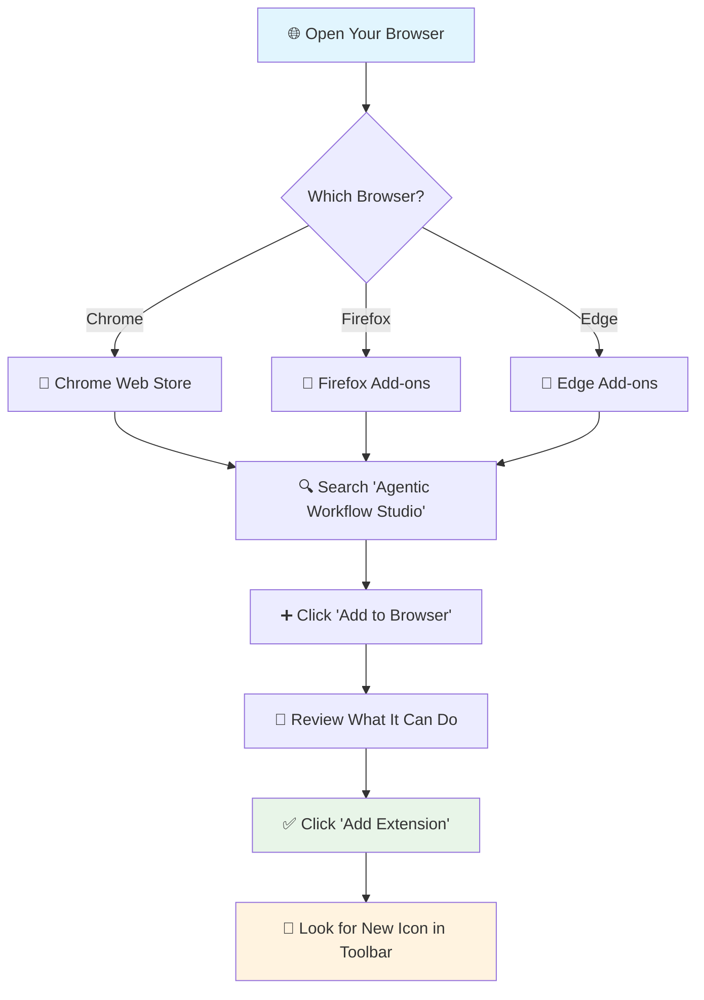

# Install Your Automation Tool: Step-by-Step Setup

Ready to start automating your web browsing? Let's get Agentic Workflow Studio installed and working in your browser. Think of this as adding a smart assistant to your browser that can help you save time on repetitive tasks.

## What You Need Before Starting

**✅ Check these first:**
- **Chrome, Firefox, or Edge browser** (any recent version from the last 2 years)
- **10 minutes of time** for installation and setup
- **Permission to install browser extensions** (if you're on a work computer, check with IT first)

**💡 New to browser extensions?** They're like apps for your browser - small programs that add new features. You probably already use some (like ad blockers or password managers).

## Step 1: Find and Install the Extension

Let's get the tool installed in your browser. The process is slightly different depending on which browser you use.



### If You Use Chrome

1. **Go to the Chrome Web Store**
   - Type `chrome.google.com/webstore` in your address bar
   - Or search "Chrome Web Store" in Google
   - **✅ Checkpoint:** You should see a page that looks like an app store

2. **Find our extension**
   - Use the search box to look for "Agentic Workflow Studio"
   - Click on the correct result (it should have our logo)
   - **✅ Checkpoint:** You should see a page with an "Add to Chrome" button

3. **Install it**
   - Click the blue "Add to Chrome" button
   - A popup will appear asking for permissions - click "Add extension"
   - **✅ Checkpoint:** You should see a new icon appear in your browser toolbar (it looks like connected boxes)

### If You Use Firefox

1. **Go to Firefox Add-ons**
   - Type `addons.mozilla.org` in your address bar
   - Or click the menu button (three lines) → "Add-ons and themes"
   - **✅ Checkpoint:** You should see the Firefox add-ons page

2. **Find our extension**
   - Search for "Agentic Workflow Studio"
   - Click on the correct result
   - **✅ Checkpoint:** You should see a page with an "Add to Firefox" button

3. **Install it**
   - Click "Add to Firefox"
   - Click "Add" when Firefox asks for confirmation
   - **✅ Checkpoint:** Look for the new icon in your toolbar or extensions menu

### If You Use Edge

1. **Go to Edge Add-ons**
   - Type `microsoftedge.microsoft.com/addons` in your address bar
   - **✅ Checkpoint:** You should see the Microsoft Edge Add-ons page

2. **Find and install**
   - Search for "Agentic Workflow Studio"
   - Click "Get" then "Add extension"
   - **✅ Checkpoint:** New icon should appear in your toolbar

## Step 2: Give It Permission to Help You

Now we need to tell your browser what the extension is allowed to do. Think of this like giving a new employee their access card and explaining what they're allowed to help with.

### Understanding What Permissions Mean

**💡 Why does it need permissions?** The extension needs to read and interact with websites to automate tasks for you. Your browser asks permission to keep you safe.

**What it needs to do its job:**
- **Read the current webpage** - So it can find text, links, and other content you want to work with
- **Save your automations** - So you don't have to rebuild them every time
- **Download files** - So it can save the information it collects for you

### Setting Up Permissions (Easy Way)

1. **Click on your new extension icon** (the connected boxes in your toolbar)
   - **✅ Checkpoint:** A small popup should appear

2. **Look for permission requests**
   - Your browser might show messages like "This extension wants to..."
   - Click "Allow" or "Grant" for each request
   - **✅ Checkpoint:** The extension popup should open without error messages

3. **If you see a "Permissions" or "Settings" option:**
   - Click on it
   - Turn on these helpful features:
     ```
     ✅ Access to all websites (recommended - lets you use it anywhere)
     ✅ Download files (lets it save your work)
     ✅ Read webpage content (required for automation)
     ```

### What Each Permission Does

**🌐 "Access to all websites"**
- **What it means:** The extension can work on any website you visit
- **Why it's helpful:** You can create automations that work on news sites, shopping sites, social media, etc.
- **Is it safe?** Yes - it only acts when you tell it to

**💾 "Download files"**  
- **What it means:** The extension can save files to your Downloads folder
- **Why it's helpful:** When you extract text or data, it can save it as a file for you
- **Is it safe?** Yes - it only saves what you tell it to save

**📄 "Read webpage content"**
- **What it means:** The extension can see the text, images, and links on webpages
- **Why it's helpful:** This is how it knows what to automate (like finding text you selected)
- **Is it safe?** Yes - it only reads, doesn't change anything unless you tell it to

## Step 3: Set Up Your Workspace

Now let's create your personal workspace where you'll build and organize your automations.

### Opening Your Automation Builder

1. **Click your extension icon** (the connected boxes in your toolbar)
   - **✅ Checkpoint:** You should see a popup menu

2. **Look for "Open Workflow Studio" or "Create Workflow"**
   - Click on it
   - **✅ Checkpoint:** A new tab should open with your workspace

3. **Set up your workspace name**
   - You might be asked to name your workspace
   - Try something like "My Automations" or "Personal Projects"
   - **✅ Checkpoint:** You should see a clean workspace with toolboxes and a canvas area

### Configure Helpful Settings

When you first open the workspace, you might see some setup options:

**Recommended settings for beginners:**
```
Auto-save: ✅ Every 30 seconds (so you don't lose work)
Beginner mode: ✅ Shows helpful tips and explanations  
Debug mode: ✅ Helps you see what's happening when things go wrong
```

### Test That Everything Works

Let's make sure your installation is working properly:

1. **Open a simple website for testing**
   - Try Wikipedia, BBC News, or any blog
   - **✅ Checkpoint:** The page should load normally

2. **Test text selection detection**
   - Highlight some text on the page (drag your mouse to select it)
   - Go back to your extension popup
   - **✅ Checkpoint:** It should mention that it detected your text selection

3. **Test the workspace**
   - In your Workflow Studio, look for a toolbox or panel with different tools
   - **✅ Checkpoint:** You should see categories like "Extension Tools", "Data Tools", etc.

## Step 4: Workspace Organization

### Setting Up Your Environment

1. **Create Project Folders**
   ```
   My Workflows/
   ├── Learning Projects/
   ├── Personal Automation/
   └── Work Projects/
   ```

2. **Configure Default Settings**
   - Set preferred data export format (JSON/CSV)
   - Choose default workflow execution mode
   - Configure error handling preferences

3. **Import Sample Workflows**
   - Download starter workflow templates
   - Import them into your workspace
   - Test execution to verify functionality

## When Things Don't Work (Troubleshooting)

Don't worry if you run into issues - these are the most common problems and their simple fixes.

### "I can't find the extension icon"

**What you'll see:** No new icon appeared in your browser toolbar after installation

**How to fix it:**
1. **Check if it's actually installed**
   - **Chrome:** Type `chrome://extensions/` in your address bar
   - **Firefox:** Type `about:addons` in your address bar  
   - **✅ Test:** You should see "Agentic Workflow Studio" in the list

2. **Make the icon visible**
   - Look for a puzzle piece icon in your toolbar (extensions menu)
   - Click it and find "Agentic Workflow Studio"
   - Click the pin icon next to it
   - **✅ Test:** The icon should now appear in your main toolbar

3. **Try restarting your browser**
   - Close all browser windows completely
   - Open your browser again
   - **✅ Test:** Check your toolbar for the new icon

### "It says 'Access Denied' or won't work on websites"

**What you'll see:** Error messages when trying to use the extension, or it doesn't detect text you select

**How to fix it:**
1. **Give it permission for the current website**
   - Right-click on the extension icon
   - Look for "This can read and change site data"
   - Choose "On all sites" (recommended) or "On this site"
   - **✅ Test:** Try selecting text on the page again

2. **Some websites block extensions**
   - Try using it on a different website (like Wikipedia)
   - If it works elsewhere, the original site is blocking it
   - **✅ Test:** Wikipedia should always work for testing

3. **Reset permissions**
   - Go to your browser's extension settings
   - Turn the extension off, then back on
   - Re-grant permissions when asked
   - **✅ Test:** Try the extension on a simple website

### "The extension is slow or makes my browser freeze"

**What you'll see:** Browser becomes unresponsive, or automations take a very long time

**How to fix it:**
1. **Close other tabs**
   - Too many open tabs can slow things down
   - Close tabs you're not using
   - **✅ Test:** Try your automation with fewer tabs open

2. **Restart your browser**
   - Close the browser completely
   - Open it again and try the extension
   - **✅ Test:** Performance should improve after restart

3. **Start with simple tasks**
   - Try selecting just a few words instead of entire articles
   - Test on simple websites before complex ones
   - **✅ Test:** Small text selections should work quickly

### "It won't capture text I select"

**What you'll see:** You highlight text but the extension doesn't detect it

**How to fix it:**
1. **Make sure text is actually selected**
   - The text should be highlighted (colored background)
   - Try selecting different text or refreshing the page
   - **✅ Test:** Can you copy the text with Ctrl+C? If not, try selecting again

2. **Wait for the page to fully load**
   - Some websites load content slowly
   - Wait a few seconds after the page opens before selecting text
   - **✅ Test:** Try on a fully loaded page like Wikipedia

3. **Try a different website**
   - Some sites use special formatting that's harder to detect
   - Test on news sites, blogs, or Wikipedia
   - **✅ Test:** Simple text on basic websites should always work

## Staying Safe While Automating

### Your Data Privacy

**💡 Good news:** Your information stays on your computer
- **What gets stored:** Only the automations you create and their settings
- **Where it's stored:** Locally in your browser (not sent anywhere)
- **Who can see it:** Only you (unless you choose to share an automation)

**Best practices for staying safe:**
- **Start with public websites** (news, Wikipedia) before trying sensitive sites
- **Don't automate login information** until you're comfortable with the tool
- **Review what you're capturing** before saving sensitive information

### Smart Permission Management

**Recommended approach:**
- **Grant "all sites" permission** for convenience (you can revoke it anytime)
- **Test on trusted websites first** (Wikipedia, BBC, major news sites)
- **Be cautious with banking or personal sites** until you're experienced

## You're All Set! What's Next?

🎉 **Congratulations!** You now have Agentic Workflow Studio installed and ready to use. Here's what you can do:

### Immediate Next Steps
1. **[Build Your First Automation](/learning/text-courses/beginner/first-workflow/)** - Create a simple text-saving automation (takes 30 minutes)
2. **[Learn About Browser Permissions](/learning/text-courses/beginner/browser-permissions/)** - Understand how to safely use automations on different websites
3. **[Understand How Information Flows](/learning/text-courses/beginner/data-flow-basics/)** - Learn how data moves through your automations

### When You're Ready for More
- **[Extension Tools Reference](/integration/extension/)** - See all the tools available for automation
- **[Get Help](/usage/help-and-community/help/)** - Find solutions to common questions
- **[Join the Community](/usage/help-and-community/contributing/)** - Connect with other users

### Quick Reference
**✅ What you accomplished:**
- Installed the browser extension
- Set up permissions safely
- Created your workspace
- Tested that everything works

**🚀 You're ready to:** Build your first automation that saves text from websites!

---

**⏱️ Time to complete:** 10-15 minutes  
**🎯 Difficulty:** 🌱 Beginner (anyone can do this)  
**📋 What you needed:** A modern web browser