# Workflow Patterns

This section provides a comprehensive library of proven workflow patterns that you can use as templates for your own automation projects. Each pattern includes detailed implementation steps, code examples, and best practices.

```mermaid
graph TB
    A[Workflow Patterns] --> B[Web Scraping Patterns]
    A --> C[Data Processing Patterns]
    A --> D[Content Manipulation Patterns]
    A --> E[Integration Patterns]
    
    B --> B1[Basic Web Scraping]
    B --> B2[Multi-Page Scraping]
    B --> B3[Dynamic Content Scraping]
    B --> B4[Authenticated Scraping]
    
    C --> C1[Text Processing]
    C --> C2[Structured Data Extraction]
    C --> C3[Media Processing]
    C --> C4[Real-time Data Streaming]
    
    D --> D1[Form Automation]
    D --> D2[Content Injection]
    D --> D3[Page Modification]
    D --> D4[Interactive Automation]
    
    E --> E1[API Integration]
    E --> E2[Database Operations]
    E --> E3[File System Operations]
    E --> E4[Cross-Platform Integration]
    
    style A fill:#e1f5fe
    style B fill:#f3e5f5
    style C fill:#e8f5e8
    style D fill:#fff3e0
    style E fill:#fce4ec
```

## Pattern Categories

### Web Scraping Patterns
- **Basic Web Scraping**: Simple data extraction from single pages
- **Multi-Page Scraping**: Navigate and extract data across multiple pages
- **Dynamic Content Scraping**: Handle JavaScript-rendered content and SPAs
- **Authenticated Scraping**: Work with login-protected content

### Data Processing Patterns
- **Text Processing**: Extract, clean, and transform textual data
- **Structured Data Extraction**: Parse tables, lists, and forms
- **Media Processing**: Handle images, videos, and other media files
- **Real-time Data Streaming**: Process continuous data feeds

### Content Manipulation Patterns
- **Form Automation**: Automatically fill and submit web forms
- **Content Injection**: Insert dynamic content into web pages
- **Page Modification**: Modify existing page content and structure
- **Interactive Automation**: Simulate user interactions and workflows

### Integration Patterns
- **API Integration**: Connect browser workflows with external services
- **Database Operations**: Store and retrieve workflow data
- **File System Operations**: Read, write, and process local files
- **Cross-Platform Integration**: Connect with desktop and mobile applications

## Getting Started

Each pattern includes:
- **Overview**: What the pattern does and when to use it
- **Prerequisites**: Required setup and permissions
- **Implementation**: Step-by-step workflow construction
- **Code Examples**: Complete, working examples
- **Variations**: Common modifications and extensions
- **Troubleshooting**: Common issues and solutions

Choose a pattern that matches your use case and follow the detailed implementation guide to build your workflow.