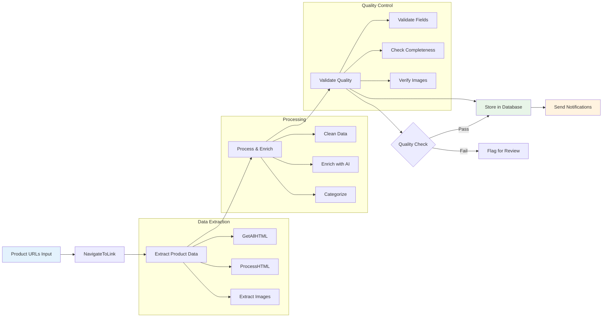
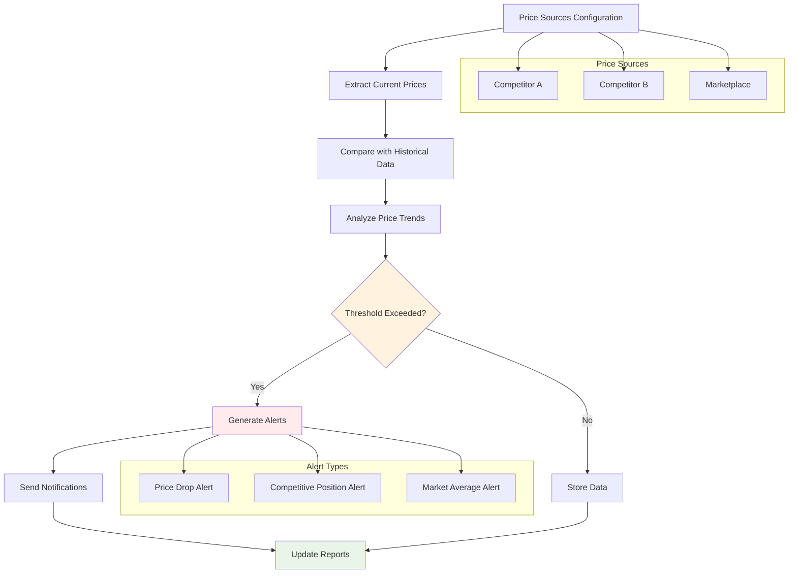

# E-commerce Automation Workflows

E-commerce automation enables businesses to efficiently manage product catalogs, monitor competitive pricing, and track inventory across multiple platforms. This guide provides production-ready workflows for common e-commerce automation scenarios.

## Product Data Extraction Workflow

### Business Context
Automatically extract and synchronize product information from supplier websites, competitor sites, or marketplace platforms to maintain up-to-date product catalogs.

### Technical Architecture

#### Workflow Overview



#### Implementation

1. **Product URL Management**
   ```javascript
   // Input: List of product URLs to process
   {
     "productUrls": [
       "https://supplier.com/product/12345",
       "https://competitor.com/item/67890",
       "https://marketplace.com/listing/abc123"
     ],
     "batchSize": 10,
     "processingMode": "parallel"
   }
   ```

2. **Navigation and Data Extraction**
   ```javascript
   // NavigateToLink configuration
   {
     "url": "{{productUrl}}",
     "waitForLoad": true,
     "timeout": 15000,
     "userAgent": "Mozilla/5.0 (compatible; ProductBot/1.0)",
     "headers": {
       "Accept": "text/html,application/xhtml+xml,application/xml;q=0.9,*/*;q=0.8"
     }
   }
   
   // GetAllHTML for structured extraction
   {
     "selector": ".product-details, .item-info, .listing-content",
     "preserveStructure": true,
     "includeMetadata": true
   }
   ```

3. **Product Information Processing**
   ```javascript
   // ProcessHTML for product data
   {
     "extractionRules": [
       {
         "field": "title",
         "selectors": ["h1.product-title", ".item-name", ".listing-title"],
         "required": true
       },
       {
         "field": "price",
         "selectors": [".price", ".cost", ".amount"],
         "transform": "extractCurrency",
         "validation": "isNumeric"
       },
       {
         "field": "description",
         "selectors": [".description", ".details", ".product-info"],
         "transform": "cleanText"
       },
       {
         "field": "images",
         "selectors": [".product-images img", ".gallery img"],
         "attribute": "src",
         "transform": "absoluteUrl"
       },
       {
         "field": "specifications",
         "selectors": [".specs table", ".attributes"],
         "transform": "parseTable"
       },
       {
         "field": "availability",
         "selectors": [".stock-status", ".availability"],
         "transform": "parseAvailability"
       }
     ]
   }
   ```

4. **Data Validation and Enrichment**
   ```javascript
   // Validation rules
   {
     "validationRules": [
       {
         "field": "title",
         "required": true,
         "minLength": 5,
         "maxLength": 200
       },
       {
         "field": "price",
         "required": true,
         "type": "number",
         "min": 0
       },
       {
         "field": "images",
         "required": true,
         "minCount": 1,
         "validateUrls": true
       }
     ],
     "enrichment": [
       {
         "field": "category",
         "source": "categoryClassifier",
         "input": "title,description"
       },
       {
         "field": "brand",
         "source": "brandExtractor",
         "input": "title,specifications"
       }
     ]
   }
   ```

5. **Data Storage and Synchronization**
   ```javascript
   // Database storage
   {
     "operation": "upsert",
     "table": "products",
     "keyFields": ["sourceUrl"],
     "data": {
       "title": "{{extracted.title}}",
       "price": "{{extracted.price}}",
       "description": "{{extracted.description}}",
       "images": "{{extracted.images}}",
       "specifications": "{{extracted.specifications}}",
       "availability": "{{extracted.availability}}",
       "category": "{{enriched.category}}",
       "brand": "{{enriched.brand}}",
       "sourceUrl": "{{productUrl}}",
       "lastUpdated": "{{now()}}",
       "extractionMetadata": {
         "extractedAt": "{{timestamp}}",
         "workflowVersion": "1.2.0",
         "dataQuality": "{{qualityScore}}"
       }
     }
   }
   ```

### Expected Output
```json
{
  "products": [
    {
      "id": "prod_12345",
      "title": "Premium Wireless Headphones - Noise Cancelling",
      "price": 299.99,
      "currency": "USD",
      "description": "High-quality wireless headphones with active noise cancellation...",
      "images": [
        "https://example.com/images/headphones-main.jpg",
        "https://example.com/images/headphones-side.jpg"
      ],
      "specifications": {
        "Battery Life": "30 hours",
        "Connectivity": "Bluetooth 5.0",
        "Weight": "250g"
      },
      "availability": "In Stock",
      "category": "Electronics > Audio > Headphones",
      "brand": "AudioTech",
      "sourceUrl": "https://supplier.com/product/12345",
      "lastUpdated": "2024-01-15T10:30:00Z"
    }
  ]
}
```

## Price Monitoring Workflow

### Business Context
Monitor competitor pricing across multiple platforms to maintain competitive positioning and identify pricing opportunities.

### Implementation

#### Workflow Structure



#### Step-by-Step Implementation

1. **Price Source Configuration**
   ```javascript
   // Define monitoring targets
   {
     "priceMonitoringConfig": {
       "products": [
         {
           "productId": "PROD_001",
           "name": "Wireless Headphones",
           "sources": [
             {
               "name": "Competitor A",
               "url": "https://competitor-a.com/product/headphones-xyz",
               "priceSelector": ".price-current"
             },
             {
               "name": "Competitor B", 
               "url": "https://competitor-b.com/item/audio-headphones",
               "priceSelector": ".sale-price, .regular-price"
             },
             {
               "name": "Marketplace",
               "url": "https://marketplace.com/dp/B08XYZ123",
               "priceSelector": ".a-price-whole"
             }
           ]
         }
       ],
       "monitoringFrequency": "hourly",
       "alertThresholds": {
         "priceDropPercent": 5,
         "significantChange": 10
       }
     }
   }
   ```

2. **Price Extraction and Processing**
   ```javascript
   // Extract current prices
   {
     "priceExtraction": {
       "extractionMethod": "smart",
       "fallbackSelectors": [".price", ".cost", ".amount"],
       "currencyDetection": true,
       "priceValidation": {
         "minPrice": 1,
         "maxPrice": 10000,
         "currencyFormat": "USD"
       },
       "transformations": [
         {
           "operation": "cleanPrice",
           "removeChars": ["$", ",", " "]
         },
         {
           "operation": "parseFloat",
           "precision": 2
         }
       ]
     }
   }
   ```

3. **Price Comparison and Analysis**
   ```javascript
   // Compare with historical data
   {
     "priceAnalysis": {
       "compareWith": "historical",
       "timeframes": ["1h", "24h", "7d", "30d"],
       "calculations": [
         {
           "metric": "priceChange",
           "formula": "(current - previous) / previous * 100"
         },
         {
           "metric": "competitivePosition",
           "formula": "rank(currentPrice, competitorPrices)"
         },
         {
           "metric": "marketAverage",
           "formula": "average(allCurrentPrices)"
         }
       ]
     }
   }
   ```

4. **Alert Generation**
   ```javascript
   // Generate alerts based on thresholds
   {
     "alertRules": [
       {
         "condition": "priceChange < -5",
         "severity": "high",
         "message": "Significant price drop detected: {{productName}} - {{priceChange}}%",
         "actions": ["email", "slack", "webhook"]
       },
       {
         "condition": "competitivePosition > 3",
         "severity": "medium",
         "message": "Price competitiveness alert: {{productName}} ranked {{position}} of {{totalCompetitors}}",
         "actions": ["email"]
       }
     ]
   }
   ```

## Inventory Tracking Workflow

### Business Context
Monitor inventory levels across multiple sales channels and suppliers to prevent stockouts and optimize inventory management.

### Implementation

#### Workflow Structure
```
[Inventory Sources] → [Extract Stock Data] → [Normalize] → [Aggregate] → [Analyze] → [Alert]
```

#### Step-by-Step Implementation

1. **Multi-Channel Inventory Extraction**
   ```javascript
   // Extract inventory from various sources
   {
     "inventorySources": [
       {
         "channel": "website",
         "url": "https://mystore.com/admin/inventory",
         "stockSelector": ".stock-quantity",
         "productSelector": ".product-row"
       },
       {
         "channel": "marketplace_a",
         "url": "https://marketplace-a.com/seller/inventory",
         "stockSelector": ".available-quantity",
         "productSelector": ".inventory-item"
       },
       {
         "channel": "warehouse",
         "type": "api",
         "endpoint": "https://warehouse-api.com/v1/inventory",
         "authentication": "bearer_token"
       }
     ]
   }
   ```

2. **Inventory Data Processing**
   ```javascript
   // Normalize inventory data
   {
     "inventoryProcessing": {
       "normalization": [
         {
           "field": "sku",
           "operation": "standardize",
           "format": "uppercase"
         },
         {
           "field": "quantity",
           "operation": "parseInteger",
           "defaultValue": 0
         },
         {
           "field": "location",
           "operation": "mapLocation",
           "mapping": {
             "WH1": "Main Warehouse",
             "ST1": "Store Location 1"
           }
         }
       ]
     }
   }
   ```

3. **Inventory Analysis and Alerts**
   ```javascript
   // Analyze inventory levels
   {
     "inventoryAnalysis": {
       "aggregation": {
         "groupBy": ["sku", "location"],
         "calculations": [
           "totalQuantity",
           "availableQuantity", 
           "reservedQuantity"
         ]
       },
       "alertRules": [
         {
           "condition": "totalQuantity <= reorderPoint",
           "severity": "high",
           "message": "Low stock alert: {{sku}} - {{totalQuantity}} units remaining"
         },
         {
           "condition": "totalQuantity == 0",
           "severity": "critical",
           "message": "Stock out: {{sku}} - No inventory available"
         }
       ]
     }
   }
   ```

## Review Analysis Workflow

### Business Context
Automatically collect and analyze customer reviews to monitor product sentiment, identify issues, and track competitive positioning.

### Implementation

#### Workflow Structure
```
[Review Sources] → [Extract Reviews] → [Sentiment Analysis] → [Categorize] → [Report]
```

#### Step-by-Step Implementation

1. **Review Collection**
   ```javascript
   // Multi-platform review extraction
   {
     "reviewSources": [
       {
         "platform": "amazon",
         "productUrl": "https://amazon.com/dp/{{asin}}",
         "reviewSelector": "[data-hook='review']",
         "ratingSelector": ".a-icon-alt",
         "textSelector": "[data-hook='review-body']"
       },
       {
         "platform": "google_reviews",
         "businessUrl": "https://google.com/maps/place/{{businessId}}",
         "reviewSelector": ".jftiEf",
         "ratingSelector": ".kvMYJc",
         "textSelector": ".wiI7pd"
       }
     ]
   }
   ```

2. **Sentiment Analysis and Categorization**
   ```javascript
   // AI-powered review analysis
   {
     "reviewAnalysis": {
       "sentimentAnalysis": {
         "model": "sentiment-classifier",
         "confidence": 0.8,
         "categories": ["positive", "negative", "neutral"]
       },
       "topicExtraction": {
         "model": "topic-classifier",
         "topics": [
           "product_quality",
           "shipping",
           "customer_service",
           "value_for_money",
           "usability"
         ]
       },
       "keywordExtraction": {
         "method": "tfidf",
         "maxKeywords": 10,
         "minFrequency": 2
       }
     }
   }
   ```

3. **Review Reporting and Insights**
   ```javascript
   // Generate actionable insights
   {
     "reportGeneration": {
       "metrics": [
         {
           "name": "averageRating",
           "calculation": "average(ratings)"
         },
         {
           "name": "sentimentDistribution",
           "calculation": "groupBy(sentiment).count()"
         },
         {
           "name": "topIssues",
           "calculation": "topKeywords(negativeReviews, 5)"
         }
       ],
       "alerts": [
         {
           "condition": "averageRating < 3.5",
           "message": "Product rating below threshold: {{averageRating}}"
         },
         {
           "condition": "negativeReviews.count > 10",
           "message": "High volume of negative reviews detected"
         }
       ]
     }
   }
   ```

## Performance Optimization

### Batch Processing
```javascript
// Optimize for large-scale operations
{
  "batchConfig": {
    "batchSize": 50,
    "concurrency": 5,
    "delayBetweenBatches": 2000,
    "errorHandling": "continue",
    "progressTracking": true
  }
}
```

### Caching Strategy
```javascript
// Implement intelligent caching
{
  "cachingConfig": {
    "productData": {
      "ttl": 3600,
      "strategy": "lru",
      "maxSize": 1000
    },
    "priceData": {
      "ttl": 300,
      "strategy": "time-based",
      "refreshOnAccess": true
    }
  }
}
```

### Rate Limiting
```javascript
// Respect site rate limits
{
  "rateLimiting": {
    "requestsPerMinute": 60,
    "burstLimit": 10,
    "backoffStrategy": "exponential",
    "respectRobotsTxt": true
  }
}
```

## Error Handling and Recovery

### Robust Error Management
```javascript
// Comprehensive error handling
{
  "errorHandling": {
    "retryConfig": {
      "maxRetries": 3,
      "backoffMultiplier": 2,
      "retryableErrors": ["NETWORK_ERROR", "TIMEOUT", "RATE_LIMIT"]
    },
    "fallbackStrategies": [
      {
        "error": "SELECTOR_NOT_FOUND",
        "action": "tryAlternativeSelectors"
      },
      {
        "error": "PRICE_PARSE_ERROR",
        "action": "useManualValidation"
      }
    ],
    "alerting": {
      "errorThreshold": 5,
      "timeWindow": 300,
      "notificationChannels": ["email", "slack"]
    }
  }
}
```

## Monitoring and Maintenance

### Performance Monitoring
```javascript
// Track workflow performance
{
  "monitoring": {
    "metrics": [
      "executionTime",
      "successRate",
      "errorRate",
      "dataQuality"
    ],
    "dashboards": [
      "workflow_performance",
      "data_quality",
      "error_analysis"
    ],
    "alerts": [
      {
        "metric": "successRate",
        "threshold": 95,
        "operator": "less_than"
      }
    ]
  }
}
```

### Maintenance Procedures
```javascript
// Automated maintenance tasks
{
  "maintenance": {
    "schedules": [
      {
        "task": "validateSelectors",
        "frequency": "daily",
        "time": "02:00"
      },
      {
        "task": "cleanupOldData",
        "frequency": "weekly",
        "retention": "90d"
      }
    ]
  }
}
```