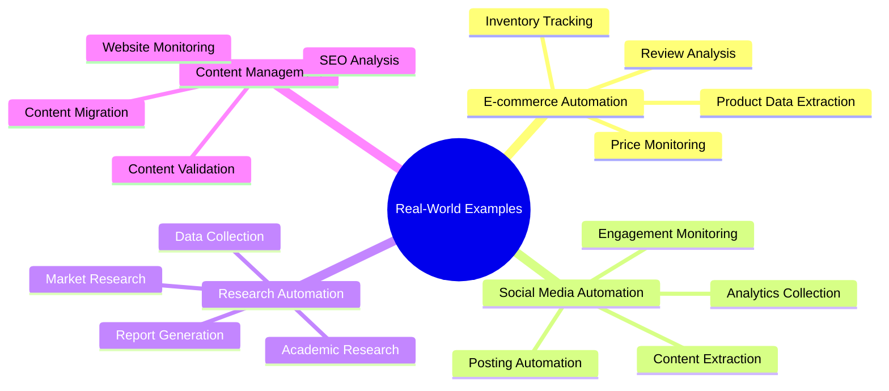
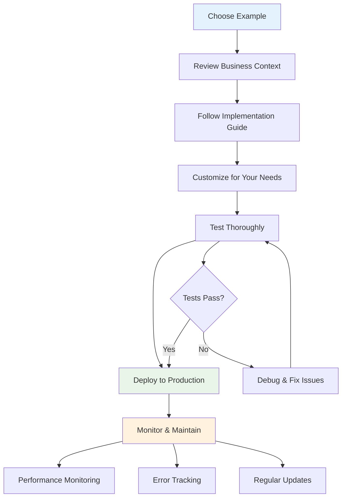

# Real-World Application Examples

This section provides complete, production-ready workflow examples that solve real business problems. Each example includes full implementation details, error handling, and optimization strategies.

## Available Examples

### E-commerce Automation
- **Product Data Extraction**: Automated product catalog management
- **Price Monitoring**: Competitive pricing analysis and alerts
- **Inventory Tracking**: Stock level monitoring across platforms
- **Review Analysis**: Customer sentiment analysis and reporting

### Social Media Automation
- **Content Extraction**: Automated content collection and curation
- **Engagement Monitoring**: Track mentions, comments, and interactions
- **Posting Automation**: Scheduled content publishing workflows
- **Analytics Collection**: Performance metrics and reporting

### Research Automation
- **Academic Research**: Literature review and citation management
- **Market Research**: Competitive analysis and trend monitoring
- **Data Collection**: Systematic information gathering workflows
- **Report Generation**: Automated research report compilation

### Content Management
- **Website Monitoring**: Track changes and updates across sites
- **Content Migration**: Automated content transfer between platforms
- **SEO Analysis**: Search engine optimization monitoring
- **Content Validation**: Quality assurance and compliance checking

## Implementation Guidelines

Each example includes:
- **Business Context**: Real-world problem and solution overview
- **Technical Architecture**: Workflow design and node configuration
- **Implementation Steps**: Detailed setup and configuration instructions
- **Code Examples**: Complete, working workflow configurations
- **Error Handling**: Robust error management and recovery strategies
- **Performance Optimization**: Scalability and efficiency improvements
- **Monitoring and Maintenance**: Ongoing management and troubleshooting

## Getting Started

1. Choose an example that matches your use case
2. Review the business context and requirements
3. Follow the step-by-step implementation guide
4. Customize the workflow for your specific needs
5. Test thoroughly before production deployment
6. Implement monitoring and maintenance procedures