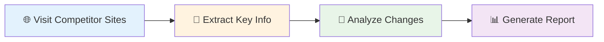

# Research Automation Workflows

Turn hours of manual research into minutes of automated data collection. These workflows help you gather information from multiple sources, analyze it systematically, and generate professional reports automatically.

## Why This Matters

Manual research is time-consuming and inconsistent. Research automation ensures you collect comprehensive data from all relevant sources, analyze it objectively, and generate consistent reports - all while saving 80% of your time.

## Business Example: Automated Competitor Research

**Scenario:** You need to monitor 10 competitors monthly and create a summary report for your executive team.

**Manual Process:** Visit each competitor's website, read their latest updates, take notes, organize findings, and write a report. Takes 6-8 hours monthly.

**Automated Process:** Workflow visits all competitor sites, extracts key information, analyzes changes, and generates a formatted report. Takes 30 minutes to review and customize.

### Simple Workflow Structure



### Copy-Paste Ready Workflow

```json
{
  "name": "Monthly Competitor Analysis",
  "description": "Automatically research competitors and generate summary report",
  "nodes": [
    {
      "id": "visit_competitors",
      "type": "NavigateToLink",
      "name": "Visit Competitor Websites",
      "settings": {
        "urls": [
          "https://competitor1.com/about",
          "https://competitor1.com/products",
          "https://competitor2.com/news",
          "https://competitor3.com/pricing"
        ]
      }
    },
    {
      "id": "extract_content",
      "type": "GetAllText",
      "name": "Extract Page Content"
    },
    {
      "id": "analyze_changes",
      "type": "Agent",
      "name": "Analyze Competitor Updates",
      "settings": {
        "input": "{{extract_content.output}}",
        "prompt": "Analyze this competitor content and identify: 1) New products or features, 2) Pricing changes, 3) Marketing messages, 4) Strategic announcements. Summarize key changes since last month."
      }
    },
    {
      "id": "generate_report",
      "type": "StructuredOutputParser",
      "name": "Create Executive Summary",
      "settings": {
        "input": "{{analyze_changes.output}}",
        "schema": {
          "executiveSummary": "2-3 sentence overview",
          "keyFindings": ["List of important discoveries"],
          "competitiveThreats": ["Potential threats to our business"],
          "opportunities": ["Market opportunities identified"],
          "recommendations": ["Suggested actions for our team"]
        }
      }
    }
  ]
}
```

**Business Value:** Saves 6+ hours monthly and provides more comprehensive, consistent competitive intelligence than manual research.

## Step-by-Step Guide: Building Your Research Workflow

### Step 1: Define Your Research Goals
Choose what you want to research:
- Competitor product updates
- Industry news and trends
- Customer feedback analysis
- Market pricing changes
- Technology developments

### Step 2: Identify Your Sources
List where you'll gather information:
- Competitor websites
- Industry publications
- News sites
- Review platforms
- Social media

### Step 3: Set Up Data Collection
Use these nodes to gather information:
- `NavigateToLink` - Visit multiple websites
- `GetAllText` - Extract text content
- `GetAllLinks` - Find related pages
- `GetSelectedText` - Focus on specific sections

### Step 4: Process with AI
Analyze collected data using:
- `Agent` - Understand and summarize content
- `StructuredOutputParser` - Format results consistently
- `BasicLLMChain` - Generate insights and recommendations

## Quick Troubleshooting

**Problem:** Workflow can't access certain websites

**Solution:** Some sites block automated access. Try adding delays between requests, or use alternative data sources. Focus on publicly available information.

**Problem:** AI analysis is inconsistent

**Solution:** Make your analysis prompts more specific with clear examples. Break complex analysis into smaller, focused steps.

**Problem:** Too much irrelevant data collected

**Solution:** Add filtering steps early in your workflow. Use more specific search terms and target only the most relevant pages or sections.