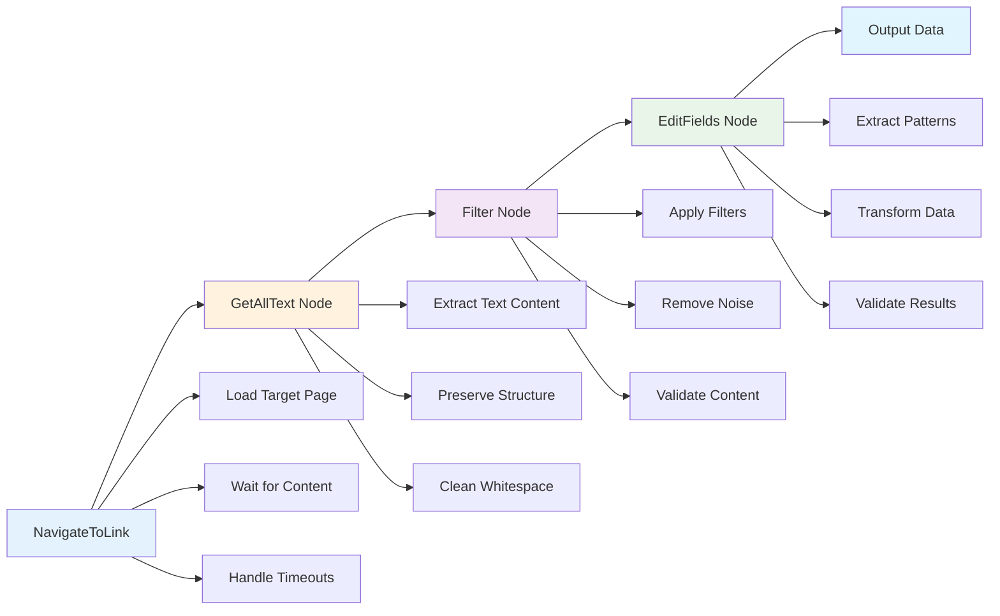
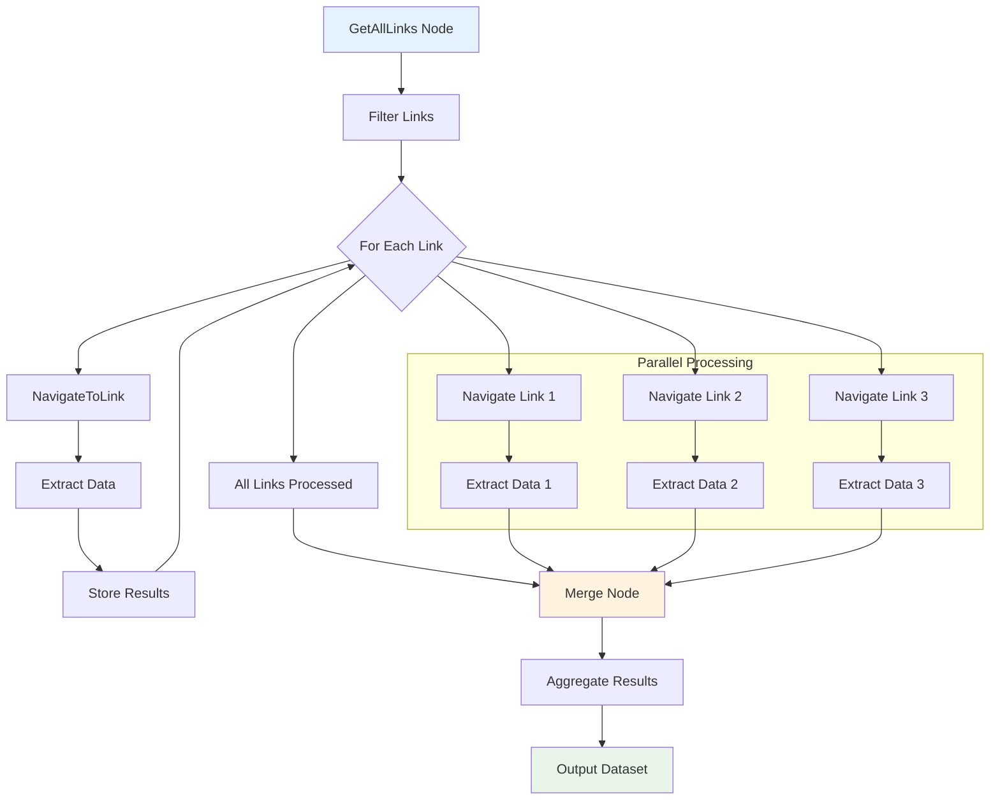
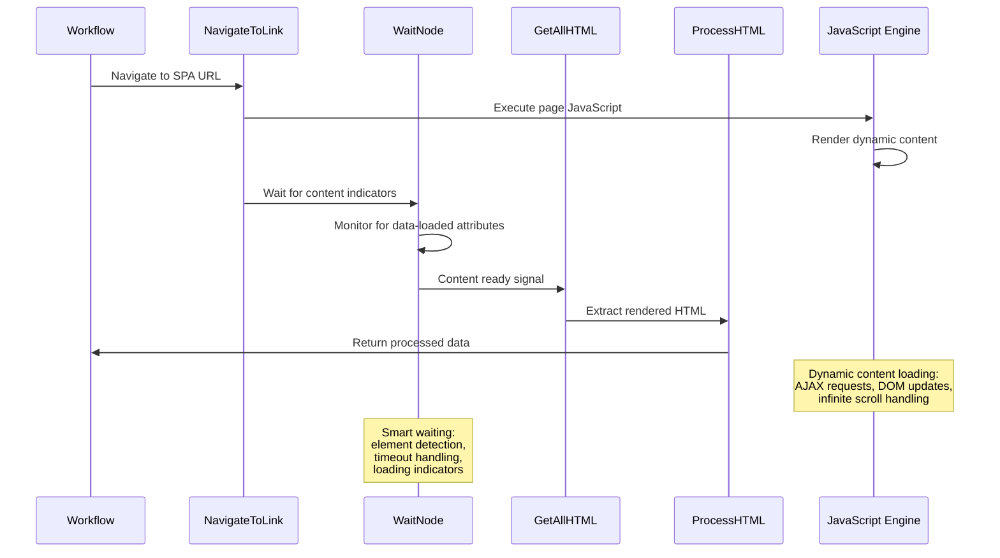
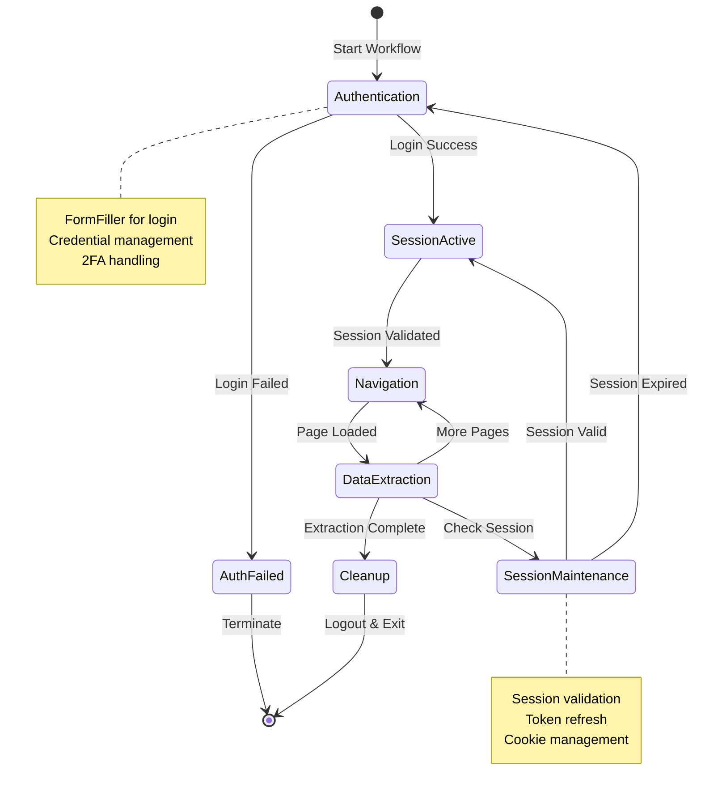

# Web Scraping Patterns

Web scraping is one of the most common use cases for browser automation. This guide covers proven patterns for different scraping scenarios, from simple single-page extraction to complex multi-site data collection.

## Basic Web Scraping Pattern

### Overview
Extract specific data from a single web page using text and HTML extraction nodes.

### Use Cases
- Product information extraction
- Contact information gathering
- News article content extraction
- Basic data collection

### Implementation

#### Workflow Structure



#### Step-by-Step Implementation

1. **Navigation Setup**
   ```javascript
   // NavigateToLink node configuration
   {
     "url": "https://example.com/product/123",
     "waitForLoad": true,
     "timeout": 10000
   }
   ```

2. **Text Extraction**
   ```javascript
   // GetAllText node configuration
   {
     "selector": ".product-info",
     "includeHidden": false,
     "cleanWhitespace": true
   }
   ```

3. **Data Processing**
   ```javascript
   // EditFields node - extract specific information
   {
     "operations": [
       {
         "field": "title",
         "operation": "extract",
         "pattern": "Product: (.*?)\\n"
       },
       {
         "field": "price",
         "operation": "extract", 
         "pattern": "\\$([0-9,]+\\.?[0-9]*)"
       }
     ]
   }
   ```

### Expected Output
```json
{
  "title": "Premium Wireless Headphones",
  "price": "299.99",
  "url": "https://example.com/product/123"
}
```

## Multi-Page Scraping Pattern

### Overview
Navigate through multiple pages systematically to collect comprehensive datasets.

### Use Cases
- E-commerce catalog scraping
- Directory listings extraction
- Search result aggregation
- Pagination handling

### Implementation

#### Workflow Structure



#### Step-by-Step Implementation

1. **Link Collection**
   ```javascript
   // GetAllLinks node configuration
   {
     "selector": ".product-link",
     "includeExternal": false,
     "validateLinks": true
   }
   ```

2. **Link Filtering**
   ```javascript
   // Filter node - keep only product pages
   {
     "conditions": [
       {
         "field": "href",
         "operation": "contains",
         "value": "/product/"
       }
     ]
   }
   ```

3. **Iterative Processing**
   ```javascript
   // For each link, navigate and extract
   // NavigateToLink + GetAllHTML + ProcessHTML
   {
     "extractionRules": [
       {
         "field": "title",
         "selector": "h1.product-title"
       },
       {
         "field": "description", 
         "selector": ".product-description"
       },
       {
         "field": "images",
         "selector": ".product-images img",
         "attribute": "src"
       }
     ]
   }
   ```

### Performance Optimization
- Implement delays between requests
- Use concurrent processing with limits
- Cache frequently accessed data
- Handle rate limiting gracefully

## Dynamic Content Scraping Pattern

### Overview
Handle JavaScript-rendered content and single-page applications that load data dynamically.

### Use Cases
- React/Vue/Angular applications
- Infinite scroll pages
- AJAX-loaded content
- Real-time data feeds

### Implementation

#### Workflow Structure



#### Step-by-Step Implementation

1. **Navigation with Waiting**
   ```javascript
   // NavigateToLink with dynamic content handling
   {
     "url": "https://spa-example.com/data",
     "waitForSelector": ".data-loaded",
     "waitTimeout": 15000,
     "executeJS": "window.scrollTo(0, document.body.scrollHeight)"
   }
   ```

2. **Dynamic Content Detection**
   ```javascript
   // Wait node for content loading
   {
     "waitType": "element",
     "selector": ".dynamic-content[data-loaded='true']",
     "timeout": 10000
   }
   ```

3. **Content Extraction**
   ```javascript
   // ProcessHTML for dynamic content
   {
     "operations": [
       {
         "type": "select",
         "selector": ".data-item",
         "extract": "all"
       },
       {
         "type": "transform",
         "field": "timestamp",
         "operation": "parseDate"
       }
     ]
   }
   ```

### Advanced Techniques
- Scroll-triggered loading
- Button click automation
- Form submission handling
- WebSocket data capture

## Authenticated Scraping Pattern

### Overview
Access and scrape content that requires user authentication or session management.

### Use Cases
- Social media data extraction
- Account-specific information
- Protected content access
- Personalized data collection

### Implementation

#### Workflow Structure



#### Step-by-Step Implementation

1. **Authentication Setup**
   ```javascript
   // FormFiller for login
   {
     "formSelector": "#login-form",
     "fields": [
       {
         "selector": "input[name='username']",
         "value": "{{credentials.username}}"
       },
       {
         "selector": "input[name='password']",
         "value": "{{credentials.password}}"
       }
     ],
     "submitAfterFill": true
   }
   ```

2. **Session Validation**
   ```javascript
   // Verify successful login
   {
     "waitForSelector": ".user-dashboard",
     "errorSelector": ".login-error",
     "timeout": 5000
   }
   ```

3. **Protected Content Access**
   ```javascript
   // Navigate to protected pages
   {
     "url": "https://example.com/protected/data",
     "maintainSession": true,
     "headers": {
       "User-Agent": "Mozilla/5.0..."
     }
   }
   ```

### Security Considerations
- Store credentials securely
- Implement session timeout handling
- Use proper logout procedures
- Respect rate limits and terms of service

## Best Practices

### Performance Optimization
- **Concurrent Processing**: Use parallel execution for independent operations
- **Caching**: Store frequently accessed data to reduce requests
- **Selective Extraction**: Only extract needed data to improve speed
- **Request Throttling**: Implement delays to avoid overwhelming servers

### Error Handling
- **Retry Logic**: Implement automatic retries for failed requests
- **Fallback Strategies**: Provide alternative extraction methods
- **Graceful Degradation**: Continue processing when non-critical operations fail
- **Comprehensive Logging**: Track errors and performance metrics

### Maintenance
- **Regular Testing**: Validate workflows against target sites
- **Selector Monitoring**: Track changes in page structure
- **Performance Monitoring**: Monitor execution times and success rates
- **Documentation Updates**: Keep patterns current with site changes

### Ethical Considerations
- **Respect robots.txt**: Follow site crawling guidelines
- **Rate Limiting**: Avoid overwhelming target servers
- **Terms of Service**: Comply with website usage policies
- **Data Privacy**: Handle extracted data responsibly