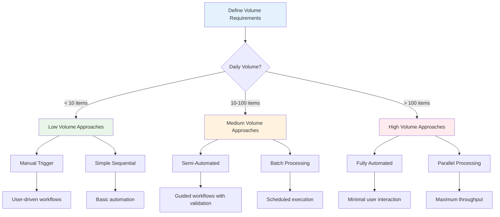
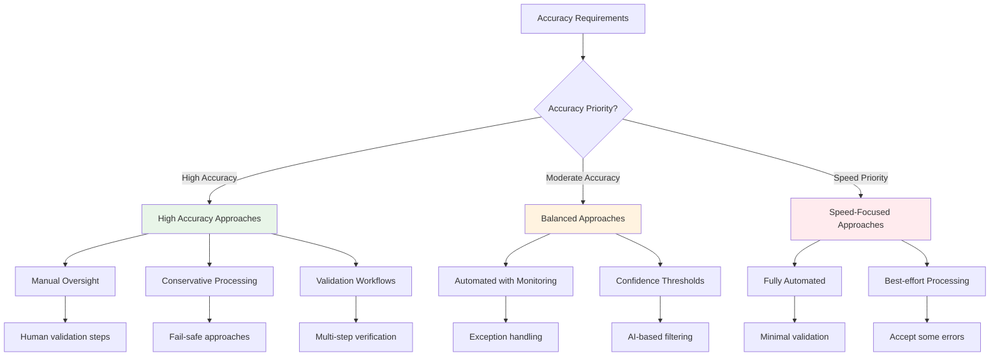
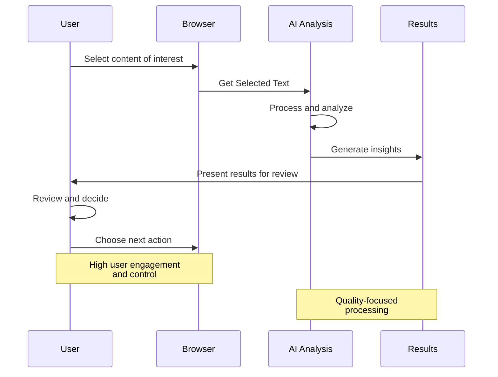
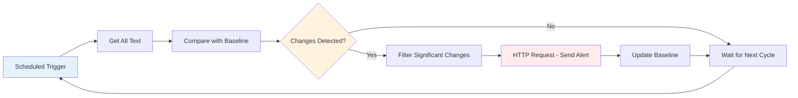
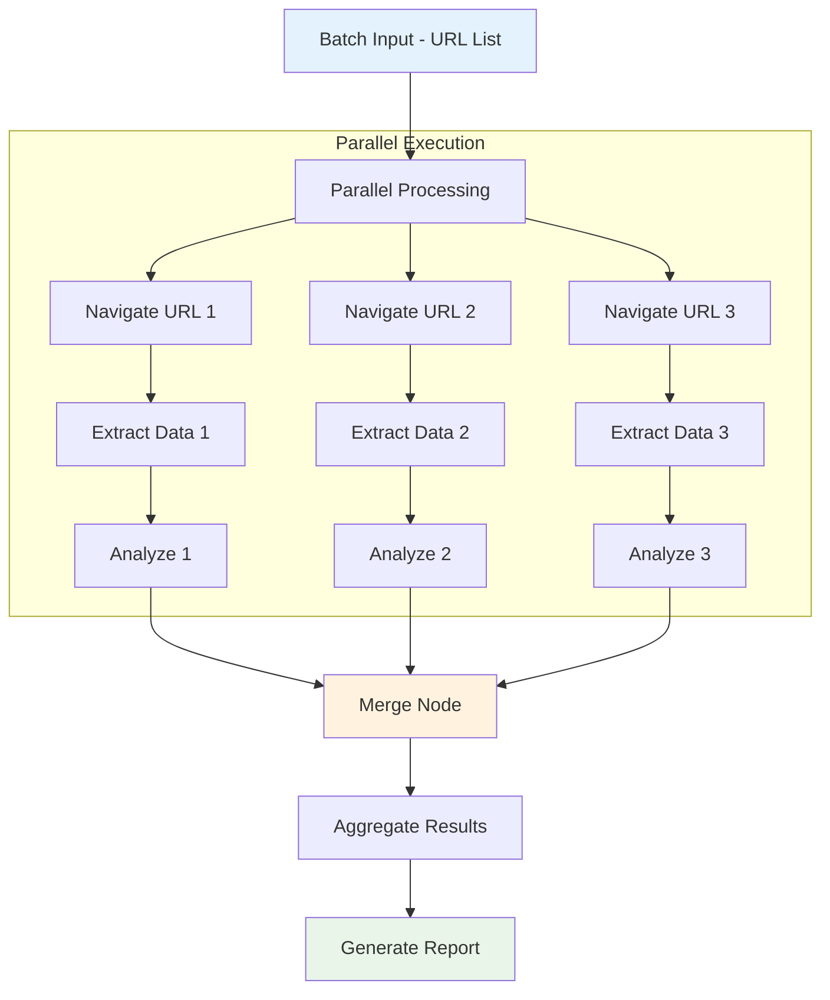
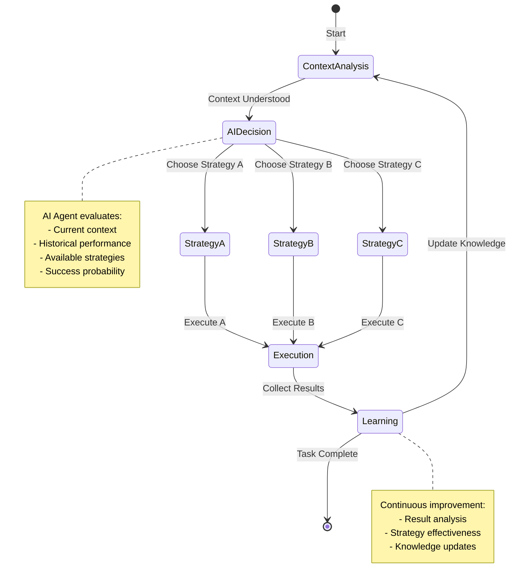

This comprehensive guide helps you choose the most effective workflow approach by comparing different automation strategies, their trade-offs, and ideal use cases.

## Workflow Approach Categories

### By Automation Level

| Approach | User Interaction | Automation Level | Flexibility | Best For |
|----------|------------------|------------------|-------------|----------|
| **Manual Trigger** | High | Low | Maximum | Ad-hoc tasks, user-driven analysis |
| **Semi-Automated** | Medium | Medium | High | Guided workflows, validation steps |
| **Fully Automated** | Minimal | High | Limited | Monitoring, batch processing |
| **Adaptive/AI-Driven** | Variable | Very High | Maximum | Complex decision-making, learning systems |

### By Processing Strategy

| Strategy | Data Handling | Performance | Complexity | Scalability |
|----------|---------------|-------------|------------|-------------|
| **Sequential Processing** | One-by-one | Predictable | Low | Limited |
| **Parallel Processing** | Simultaneous | Fast | Medium | Good |
| **Batch Processing** | Groups | Efficient | Medium | Excellent |
| **Stream Processing** | Real-time | Variable | High | Excellent |

### By Integration Pattern

| Pattern | External Dependencies | Reliability | Maintenance | Cost |
|---------|----------------------|-------------|-------------|------|
| **Browser-Only** | None | High | Low | Low |
| **API Integration** | External services | Medium | Medium | Variable |
| **Hybrid Processing** | Mixed | Medium | High | Medium |
| **Cloud-Native** | Cloud services | Variable | Low | High |

## Detailed Approach Comparison

### Manual Trigger vs Automated Workflows

#### Manual Trigger Workflows
**When to Choose**:
- User expertise is required for decision-making
- Content selection needs human judgment
- Quality over quantity is prioritized
- Workflows are used occasionally

**Advantages**:
- ✅ Maximum user control and flexibility
- ✅ High accuracy through human oversight
- ✅ Easy to modify and adapt on-the-fly
- ✅ No risk of unwanted automated actions

**Limitations**:
- ❌ Requires user presence and attention
- ❌ Not suitable for high-volume processing
- ❌ Inconsistent execution timing
- ❌ Cannot run during off-hours

**Example Workflow**:
```javascript
Manual Research Analysis Workflow:
1. User navigates to research article
2. User selects key findings text
3. Get Selected Text → AI Analysis → Generate Summary
4. User reviews and saves results
5. User decides next action

Trigger: User selection
Frequency: As needed
Oversight: Complete human control
```

#### Fully Automated Workflows
**When to Choose**:
- Repetitive tasks with clear rules
- High-volume data processing
- Monitoring and alerting systems
- Time-sensitive operations

**Advantages**:
- ✅ Consistent, reliable execution
- ✅ Can run 24/7 without supervision
- ✅ High throughput and efficiency
- ✅ Reduces human error and fatigue

**Limitations**:
- ❌ Limited adaptability to edge cases
- ❌ Requires robust error handling
- ❌ May need periodic maintenance
- ❌ Risk of unwanted actions if misconfigured

**Example Workflow**:
```javascript
Automated Content Monitoring:
1. Timer triggers every hour
2. Navigate to target websites
3. Get All Text → Compare with baseline
4. Filter → Detect significant changes
5. HTTP Request → Send alert if changes found

Trigger: Scheduled timer
Frequency: Hourly
Oversight: Exception-based monitoring
```

### Sequential vs Parallel Processing

#### Sequential Processing
**Characteristics**:
- Processes one item at a time
- Predictable resource usage
- Simple error handling
- Easier debugging and monitoring

**Best For**:
- Simple workflows with dependencies
- Resource-constrained environments
- Workflows requiring strict ordering
- Learning and development phases

**Example Pattern**:
```javascript
Sequential Article Analysis:
Article 1: Extract → Analyze → Save → Complete
Article 2: Extract → Analyze → Save → Complete
Article 3: Extract → Analyze → Save → Complete

Pros: Predictable, simple, reliable
Cons: Slower overall completion time
```

#### Parallel Processing
**Characteristics**:
- Processes multiple items simultaneously
- Higher resource usage
- Complex error handling
- Faster overall completion

**Best For**:
- Independent processing tasks
- High-performance requirements
- Batch operations on large datasets
- Time-sensitive workflows

**Example Pattern**:
```javascript
Parallel Article Analysis:
Articles 1-5: All extract simultaneously
Articles 1-5: All analyze simultaneously
Articles 1-5: All save simultaneously

Pros: Faster completion, better throughput
Cons: Higher complexity, resource usage
```

### Browser-Only vs API Integration

#### Browser-Only Workflows
**Characteristics**:
- All processing happens in browser
- No external dependencies
- Limited by browser capabilities
- Maximum privacy and security

**Advantages**:
- ✅ No external service dependencies
- ✅ Complete data privacy (local processing)
- ✅ No API costs or rate limits
- ✅ Works offline once loaded

**Limitations**:
- ❌ Limited processing power
- ❌ Restricted by browser security policies
- ❌ Cannot access external data sources
- ❌ Limited AI model capabilities

**Example Use Cases**:
```javascript
Browser-Only Content Analysis:
Get All Text → Local Text Processing → Edit Fields → Insert Text

Best For:
- Privacy-sensitive content
- Simple text manipulation
- Offline workflows
- Cost-sensitive applications
```

#### API Integration Workflows
**Characteristics**:
- Leverages external services and APIs
- More powerful processing capabilities
- Dependent on external service availability
- May involve costs and rate limits

**Advantages**:
- ✅ Access to powerful AI models
- ✅ Advanced processing capabilities
- ✅ Integration with business systems
- ✅ Scalable processing power

**Limitations**:
- ❌ External service dependencies
- ❌ Potential costs and rate limits
- ❌ Data privacy considerations
- ❌ Network connectivity requirements

**Example Use Cases**:
```javascript
AI-Enhanced Analysis:
Get Selected Text → OpenAI API → Advanced Analysis → Save Results

Best For:
- Advanced AI processing
- Integration with business systems
- High-volume processing
- Complex analysis requirements
```

## Decision Framework

### Step 1: Define Requirements

#### Volume and Frequency



#### Accuracy Requirements



#### Resource Constraints
```
Limited Resources:
├── Browser-Only → No external dependencies
├── Sequential Processing → Predictable resource usage
└── Simple Workflows → Minimal complexity

Moderate Resources:
├── Selective API Usage → Cost-effective integration
├── Hybrid Processing → Mix local and external
└── Optimized Workflows → Balanced performance

Unlimited Resources:
├── Full API Integration → Maximum capabilities
├── Parallel Processing → Maximum speed
└── Advanced AI → Sophisticated analysis
```

### Step 2: Choose Architecture Pattern

#### Pattern 1: User-Centric Interactive
**Best For**: Research, content creation, ad-hoc analysis



**Characteristics:**
- High user engagement
- Flexible and adaptable
- Quality over quantity
- Manual quality control

#### Pattern 2: Automated Monitoring
**Best For**: Content monitoring, change detection, alerts



**Characteristics:**
- Fully automated
- Consistent execution
- Exception-based intervention
- Scalable monitoring

#### Pattern 3: Batch Processing
**Best For**: Data collection, analysis, reporting



**Characteristics:**
- High throughput
- Efficient resource usage
- Comprehensive results
- Scheduled execution

#### Pattern 4: Adaptive AI-Driven
**Best For**: Complex decision-making, learning systems



**Characteristics:**
- Intelligent adaptation
- Context-aware processing
- Continuous improvement
- Complex implementation

## Performance Comparison

### Throughput Analysis

| Approach | Items/Hour | Setup Time | Maintenance | Resource Usage |
|----------|------------|------------|-------------|----------------|
| **Manual Trigger** | 5-20 | Low | Low | Low |
| **Semi-Automated** | 20-100 | Medium | Medium | Medium |
| **Fully Automated** | 100-1000+ | High | Medium | Medium-High |
| **Parallel Processing** | 500-5000+ | High | High | High |

### Cost-Benefit Analysis

#### Development Costs
```
Manual Workflows:
- Development: Low (simple setup)
- Testing: Low (user validates)
- Maintenance: Low (user adapts)

Automated Workflows:
- Development: High (complex logic)
- Testing: High (edge case handling)
- Maintenance: Medium (periodic updates)

AI-Driven Workflows:
- Development: Very High (AI integration)
- Testing: Very High (AI behavior validation)
- Maintenance: High (model updates, monitoring)
```

#### Operational Costs
```
Browser-Only:
- Infrastructure: None
- API Costs: None
- Maintenance: Low

API Integration:
- Infrastructure: Low-Medium
- API Costs: Variable (usage-based)
- Maintenance: Medium

Cloud-Native:
- Infrastructure: Medium-High
- API Costs: High (full cloud services)
- Maintenance: Low (managed services)
```

## Common Anti-Patterns

### Over-Automation
**Problem**: Automating tasks that benefit from human judgment

**Symptoms**:
- Frequent false positives/negatives
- User frustration with automated decisions
- Constant manual overrides needed

**Solution**: Implement semi-automated workflows with human validation points

### Under-Automation
**Problem**: Manual processes for repetitive, rule-based tasks

**Symptoms**:
- High manual effort for routine tasks
- Inconsistent execution quality
- Bottlenecks in processing capacity

**Solution**: Identify automation opportunities and implement appropriate workflows

### Premature Optimization
**Problem**: Choosing complex approaches before understanding requirements

**Symptoms**:
- Over-engineered solutions for simple problems
- High maintenance overhead
- Difficult to modify or debug

**Solution**: Start simple and evolve based on actual usage patterns

## Migration Strategies

### From Manual to Automated

#### Phase 1: Assisted Manual
```javascript
Current: Fully manual process
Target: Manual with automated assistance

Changes:
- Add data extraction automation
- Provide processing suggestions
- Maintain human decision-making
```

#### Phase 2: Semi-Automated
```javascript
Current: Assisted manual
Target: Automated with human oversight

Changes:
- Automate routine decisions
- Add validation checkpoints
- Implement exception handling
```

#### Phase 3: Fully Automated
```javascript
Current: Semi-automated
Target: Minimal human intervention

Changes:
- Automate validation processes
- Implement comprehensive error handling
- Add monitoring and alerting
```

### From Sequential to Parallel

#### Assessment Phase
```javascript
Analyze Current Workflow:
1. Identify independent processing steps
2. Measure current processing times
3. Estimate parallel processing benefits
4. Assess resource requirements
```

#### Implementation Phase
```javascript
Gradual Migration:
1. Parallelize data extraction phase
2. Implement parallel processing logic
3. Add result aggregation
4. Optimize resource usage
```

## Best Practices by Approach

### Manual Trigger Workflows
1. **Clear User Instructions**: Provide obvious guidance for user actions
2. **Immediate Feedback**: Show processing status and results quickly
3. **Error Recovery**: Allow users to retry or modify inputs easily
4. **Flexible Output**: Let users choose how to use results

### Automated Workflows
1. **Robust Error Handling**: Plan for all possible failure scenarios
2. **Monitoring and Alerting**: Track workflow health and performance
3. **Graceful Degradation**: Continue operating when components fail
4. **Regular Maintenance**: Schedule updates and health checks

### AI-Driven Workflows
1. **Confidence Thresholds**: Only act on high-confidence AI decisions
2. **Human Oversight**: Provide mechanisms for human review
3. **Continuous Learning**: Improve AI models based on outcomes
4. **Explainable Decisions**: Make AI reasoning transparent

## Troubleshooting Guide

### Performance Issues
**Symptoms**: Slow execution, timeouts, resource exhaustion

**Diagnosis**:
1. Measure processing times for each step
2. Identify bottlenecks and resource usage
3. Analyze error rates and failure patterns

**Solutions**:
- **Sequential → Parallel**: Parallelize independent operations
- **Synchronous → Asynchronous**: Use non-blocking operations
- **Full Processing → Selective**: Process only necessary data
- **Local → Distributed**: Distribute processing load

### Reliability Issues
**Symptoms**: Inconsistent results, frequent failures, data loss

**Diagnosis**:
1. Review error logs and failure patterns
2. Test edge cases and error conditions
3. Validate data integrity and consistency

**Solutions**:
- **Add Validation**: Implement data and result validation
- **Improve Error Handling**: Handle all possible error conditions
- **Implement Retries**: Add retry logic for transient failures
- **Add Monitoring**: Track workflow health and performance

### Scalability Issues
**Symptoms**: Performance degrades with increased load

**Diagnosis**:
1. Load test with increasing data volumes
2. Monitor resource usage patterns
3. Identify scaling bottlenecks

**Solutions**:
- **Horizontal Scaling**: Process multiple items in parallel
- **Vertical Scaling**: Optimize individual processing efficiency
- **Caching**: Store and reuse processed results
- **Batching**: Group operations for efficiency

## Related Resources

### Documentation
- **[Workflow Patterns](/learning/workflow-patterns/)** - Comprehensive pattern library
- **[Performance Optimization](/learning/workflow-patterns/optimization-best-practices/)** - Optimization techniques
- **[Integration Patterns](/learning/workflow-patterns/integration-patterns/)** - External service integration

### Examples
- **[Real-World Examples](/learning/workflow-patterns/real-world-examples/)** - Practical implementations
- **[Multi-Node Automation](/learning/examples/multi-node-automation/)** - Complex workflow examples
- **[Web Automation Patterns](/learning/examples/web-automation-patterns/)** - Browser automation strategies

### Learning Materials
- **[Multi-Step Workflows](/learning/text-courses/intermediate/multi-step-workflows/)** - Building complex workflows
- **[Performance Optimization](/learning/text-courses/intermediate/performance-optimization/)** - Optimization techniques
- **[Enterprise Patterns](/learning/text-courses/advanced/enterprise-patterns/)** - Scalable workflow design