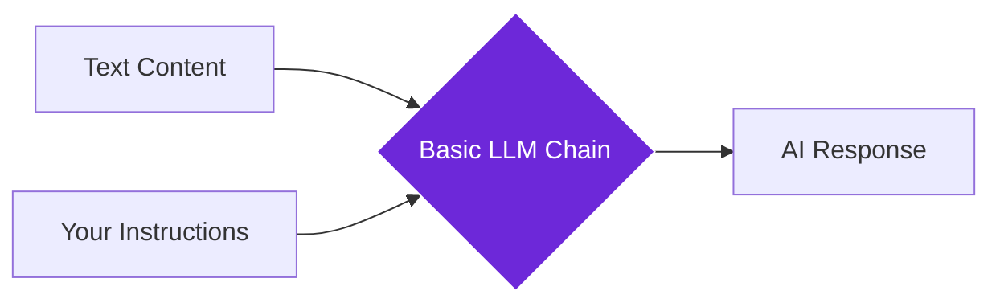

import { Steps, Aside, Tabs, TabItem } from "@astrojs/starlight/components";
import { Image } from "astro:assets";
import { Code } from "@astrojs/starlight/components";
import Social from "@images/social.webp";

The **Basic LLM Chain** node is like having a smart writing assistant that can read, understand, and respond to any text you give it. Whether you want to summarize articles, extract key information, or generate new content, this node makes AI processing simple and accessible.

Think of it as your personal AI that can analyze web content, answer questions, or create new text based on what it reads.

<Image
  src={Social}
  alt="Illustration of AI processing and analyzing text content"
/>

## How it works

You provide text content and instructions to the AI, and it processes the information to give you intelligent responses, summaries, or generated content based on your specific needs.



## Setup guide

<Steps>

1. **Connect Your AI Model**: Choose an AI service like OpenAI GPT-4 or use a local model through Ollama.

2. **Write Clear Instructions**: Tell the AI exactly what you want it to do with the content - summarize, analyze, extract information, etc.

3. **Provide Content**: Connect text content from web pages, documents, or other sources.

4. **Configure Settings**: Adjust creativity level and response length based on your needs.

</Steps>

## Practical example: Article summarizer

Let's create a workflow that automatically summarizes any news article into key points.

**Option 1: Summarize**
- **Goal**: Get a quick overview.
- **Instruction**: "Summarize this article in 3 key bullet points."
- **Settings**: Low creativity (0.3) to keep it factual.

**Option 2: Extract Info**
- **Goal**: Pull out specific data.
- **Instruction**: "Extract the title, main topic, and key findings from this content."
- **Settings**: Very low creativity (0.1) for maximum accuracy.

**Option 3: Create Content**
- **Goal**: Write something new.
- **Instruction**: "Create a social media post based on this article content."
- **Settings**: High creativity (0.7) to make it engaging.

## Common use cases

| Use Case | Temperature Setting | Example Prompt |
|----------|-------------------|----------------|
| **Summarizing** | 0.1-0.3 (consistent) | "Summarize this in 3 bullet points" |
| **Information Extraction** | 0.1 (precise) | "Extract the price, features, and rating" |
| **Content Generation** | 0.7-0.9 (creative) | "Write a tweet about this news" |
| **Analysis** | 0.3-0.5 (balanced) | "What are the pros and cons mentioned?" |

## Configuration settings

| Setting | Purpose | Recommended Values |
|---------|---------|-------------------|
| **Temperature** | Controls creativity vs consistency | 0.1 for facts, 0.7 for creative content |
| **Max Tokens** | Maximum response length | 300 for summaries, 500+ for detailed analysis |
| **Prompt** | Instructions for the AI | Be specific about format and requirements |

<Aside type="tip" title="Start with specific prompts">
  Instead of "analyze this," try "extract the 3 main benefits and 2 potential drawbacks." Specific instructions lead to better results.
</Aside>

## Real-world examples

### Product research assistant
Automatically extract key product information from any e-commerce page:
```
Prompt: "Extract product name, price, top 3 features, and customer rating"
Temperature: 0.1 (for accuracy)
Max Tokens: 400
```

### News briefing generator
Create daily news summaries from multiple articles:
```
Prompt: "Summarize this news article in 2 sentences, focusing on what happened and why it matters"
Temperature: 0.3 (for consistency)
Max Tokens: 200
```

### Content repurposing
Transform blog posts into social media content:
```
Prompt: "Create 3 different social media posts from this article - one for Twitter, one for LinkedIn, one for Facebook"
Temperature: 0.7 (for variety)
Max Tokens: 600
```

## Troubleshooting

- **Inconsistent results**: Lower the temperature setting to 0.1-0.3 for more predictable outputs.
- **Responses too short**: Increase max tokens or ask for more detail in your prompt.
- **AI misunderstands instructions**: Make your prompt more specific and include examples of the desired format.
- **Processing takes too long**: Reduce max tokens or break large content into smaller pieces.