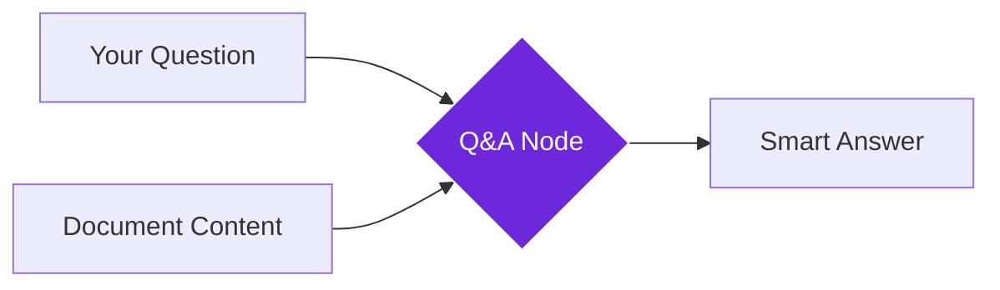

import { Steps, Aside, Tabs, TabItem } from "@astrojs/starlight/components";
import { Image } from "astro:assets";
import { Code } from "@astrojs/starlight/components";
import Social from "@images/social.webp";

The **Q&A** node is like having a smart reading assistant that can answer specific questions about any text you give it. Instead of reading through long documents yourself, you can ask targeted questions and get accurate, contextual answers.

Perfect for extracting specific information, analyzing content, or understanding complex documents quickly.

<Image
  src={Social}
  alt="Illustration of AI answering questions about document content"
/>

## How it works

You provide both a question and the content you want analyzed. The AI reads through the content, finds relevant information, and provides a focused answer based on what it discovers.



## Setup guide

<Steps>

1. **Connect Your AI Model**: Choose an AI service like OpenAI GPT-4 or use a local model.

2. **Ask Specific Questions**: Write clear, focused questions about what you want to know from the content.

3. **Provide Content**: Connect the text content you want the AI to analyze and answer questions about.

4. **Set Confidence Level**: Choose how confident the AI should be before providing an answer.

</Steps>

## Practical example: Product research

Let's analyze product reviews to find specific information about customer experiences.

**Goal 1: Extract Key Info**
- **Question**: "What are the main benefits customers mention?"
- **Confidence**: High (0.8) - Start with only very sure answers.
- **Length**: Medium summary.

**Goal 2: Find Problems**
- **Question**: "What complaints do customers have about this product?"
- **Style**: Bullet points list.
- **Confidence**: Medium (0.7) - Catch more potential issues.

**Goal 3: Compare Features**
- **Question**: "How does this product compare to competitors mentioned?"
- **Length**: Long detailed answer.
- **Confidence**: High (0.8).

## Common question types

| Question Type | Example | Best For |
|---------------|---------|----------|
| **Factual Extraction** | "What is the price mentioned?" | Getting specific data points |
| **Analysis** | "What are the pros and cons?" | Understanding balanced perspectives |
| **Comparison** | "How does this compare to alternatives?" | Competitive analysis |
| **Summary** | "What are the main points?" | Quick overviews |

## Configuration settings

| Setting | Purpose | Recommended Values |
|---------|---------|-------------------|
| **Confidence Threshold** | Minimum confidence for answers | 0.7 for general use, 0.8+ for critical info |
| **Max Answer Length** | Maximum response size | 200-300 for summaries, 500+ for detailed analysis |
| **Answer Style** | Format of the response | "concise", "detailed", or "bullet-points" |

<Aside type="tip" title="Ask specific questions">
  Instead of "Tell me about this," try "What are the top 3 benefits and 2 main drawbacks mentioned?" Specific questions get better answers.
</Aside>

## Real-world examples

### News article analysis
Extract key information from news articles:
```
Question: "What happened, when did it happen, and what are the implications?"
Confidence: 0.8 (for accuracy)
Answer Style: "detailed"
```

### Product comparison
Compare products mentioned in reviews:
```
Question: "What are the price, main features, and customer rating?"
Confidence: 0.7 (balanced accuracy)
Answer Style: "bullet-points"
```

### Research paper insights
Extract findings from academic papers:
```
Question: "What are the main findings, methodology, and limitations?"
Confidence: 0.8 (for research accuracy)
Max Length: 600 (detailed analysis)
```

## Troubleshooting

- **Low confidence answers**: Make your question more specific or check if the content actually contains the information you're asking about.
- **Inconsistent answer formats**: Be more specific in your question about the desired format (e.g., "List the top 3 features as bullet points").
- **"Information not found" responses**: Verify the content contains what you're asking about, or rephrase your question.
- **Slow processing**: Break very long content into smaller chunks or ask more focused questions.