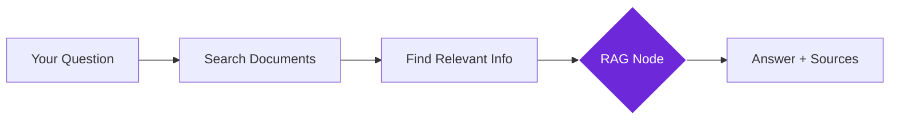

import { Steps, Aside, Tabs, TabItem } from "@astrojs/starlight/components";
import { Image } from "astro:assets";
import { Code } from "@astrojs/starlight/components";
import Social from "@images/social.webp";

The **RAG** node is like having a research assistant that actually reads your documents before answering questions. Instead of guessing or making things up, it searches through your knowledge base, finds relevant information, then uses AI to give you accurate, source-backed answers.

This eliminates AI "hallucinations" by grounding responses in your actual documents.

<Image
  src={Social}
  alt="Illustration of AI searching through documents to provide accurate answers"
/>

## How it works

When you ask a question, RAG first searches your document collection to find relevant information, then uses AI to analyze those specific documents and provide an answer with source citations.



## Setup guide

<Steps>

1. **Build Your Knowledge Base**: Use the Indexer Node to prepare your documents for searching.

2. **Connect Document Storage**: Link to your Local Knowledge database containing the indexed documents.

3. **Ask Your Questions**: Write natural language questions about information in your documents.

4. **Configure Search Settings**: Set how many documents to search and how closely they must match your question.

</Steps>

## Practical example: Company FAQ system

Let's create a smart FAQ system that answers questions using your company documentation.

**Scenario 1: General Questions**
- search 5 documents.
- match threshold 0.7 (standard matching).
- **Result**: Good for answering general questions like "What are your support hours?".

**Scenario 2: Precise Answers**
- search 3 documents (only the best matches).
- match threshold 0.8 (strict matching).
- **Result**: Perfect for specific policy questions like "How many vacation days do I get?".

**Scenario 3: Deep Research**
- search 8 documents (broad search).
- match threshold 0.6 (fuzzy matching).
- **Result**: Best for exploring topics like "What is our company's history with renewable energy?".

## Why RAG is better than regular AI

| Regular AI | RAG (Smart Search + AI) |
|------------|-------------------------|
| May make up facts | Only uses your actual documents |
| No source citations | Shows exactly where answers come from |
| Uses outdated training data | Uses your latest documents |
| Can "hallucinate" information | Cannot invent facts not in your documents |

## Configuration settings

| Setting | Purpose | Recommended Values |
|---------|---------|-------------------|
| **Top K** | How many documents to search | 3-5 for focused answers, 8+ for comprehensive |
| **Similarity Threshold** | How closely documents must match | 0.7 for general use, 0.8+ for precise matches |
| **Include Metadata** | Show document titles and sources | Always recommended |

<Aside type="tip" title="Start with balanced settings">
  Use 5 documents with 0.7 similarity threshold for most questions. Adjust based on whether you need more precision or broader coverage.
</Aside>

## Real-world examples

### Employee knowledge base
Answer HR and policy questions instantly:
```
Question: "What's our vacation policy?"
Top K: 3 (focused search)
Similarity: 0.8 (precise matches)
Result: Accurate policy info with source citations
```

### Technical documentation search
Find specific technical information:
```
Question: "How do I configure SSL certificates?"
Top K: 5 (comprehensive coverage)
Similarity: 0.7 (related concepts)
Result: Step-by-step instructions with documentation links
```

### Research assistant
Discover insights across multiple papers:
```
Question: "What are the main benefits of renewable energy?"
Top K: 8 (broad research)
Similarity: 0.6 (catch related concepts)
Result: Comprehensive answer with multiple source citations
```

## Troubleshooting

- **"No relevant documents found"**: Lower the similarity threshold to 0.6 or add more documents to your knowledge base.
- **Slow search results**: Reduce the number of documents searched (Top K) or clean up your knowledge base.
- **Poor answer quality**: Check if your documents actually contain the information you're asking about.
- **Storage quota exceeded**: Remove old or irrelevant documents, or use document compression techniques.