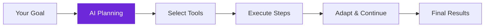

import { Steps, Aside, Tabs, TabItem } from "@astrojs/starlight/components";
import { Image } from "astro:assets";
import { Code } from "@astrojs/starlight/components";
import Social from "@images/social.webp";

The **Tools Agent** is like having an AI assistant that can actually do things. Give it a task like "research competitor pricing" and it will automatically figure out which tools to use, visit websites, extract information, and compile results - all on its own.

This is true AI automation that can adapt and make decisions as it works toward your goal.

<Image
  src={Social}
  alt="Illustration of AI agent automatically selecting and using different tools"
/>

## How it works

You describe what you want accomplished, and the AI agent creates a plan, selects the right tools for each step, executes the plan, and adapts if something doesn't work as expected.



## Setup guide

<Steps>

1. **Describe Your Task**: Write a clear description of what you want the agent to accomplish.

2. **Choose Available Tools**: Select which tools the agent can use to complete the task.

3. **Set Limits**: Configure maximum steps and error handling to keep the agent focused.

4. **Let It Work**: The agent will automatically plan, execute, and adapt until the task is complete.

</Steps>

## Practical example: Competitive research

Let's create an agent that automatically researches competitor pricing across multiple websites.

**Task 1: Research Prices**
- **Instruction**: "Visit 3 competitor websites and extract their pricing information."
- **Tools Given**: `Get All Text`, `AI Text Processor`, `Field Editor`.
- **Limit**: 8 steps maximum.

**Task 2: Lead Collection**
- **Instruction**: "Extract contact information from tech company websites."
- **Tools Given**: `Get HTML`, `Field Editor`, `Filter`.
- **Limit**: 6 steps maximum.

**Task 3: Analyze Reviews**
- **Instruction**: "Analyze product reviews and summarize key insights."
- **Tools Given**: `Get All Text`, `AI Text Processor`, `Questions & Answers`.
- **Limit**: 10 steps maximum.

## What makes it smart

| Traditional Automation | Tools Agent |
|------------------------|-------------|
| Fixed sequence of steps | Adapts plan based on results |
| Breaks if something changes | Tries alternative approaches |
| Requires manual tool selection | Automatically chooses best tools |
| No error recovery | Learns from failures and adjusts |

## Configuration settings

| Setting | Purpose | Recommended Values |
|---------|---------|-------------------|
| **Task Description** | What you want accomplished | Be specific about the end goal |
| **Available Tools** | Tools the agent can use | Only include relevant tools |
| **Max Iterations** | Maximum steps allowed | 5-10 for most tasks |
| **Planning Mode** | How to approach the task | "adaptive" for flexibility |

<Aside type="tip" title="Start with clear goals">
  Instead of "research competitors," try "visit 3 competitor websites and extract pricing for their basic and premium plans." Specific goals get better results.
</Aside>

## Real-world examples

### Market research automation
Automatically gather competitive intelligence:
```
Task: "Research pricing and features from 5 SaaS competitors"
Tools: GetAllTextFromLink, BasicLLMChain, EditFields
Max Steps: 12
Result: Comprehensive competitive analysis report
```

### Lead generation
Find and qualify potential customers:
```
Task: "Find contact information for tech startups in San Francisco"
Tools: GetHTMLFromLink, EditFields, Filter
Max Steps: 8
Result: Qualified lead list with contact details
```

### Content monitoring
Track mentions and sentiment across websites:
```
Task: "Monitor 10 news sites for mentions of our company"
Tools: GetAllTextFromLink, BasicLLMChain, QANode
Max Steps: 15
Result: Sentiment analysis and mention tracking
```

## Troubleshooting

- **Agent gets stuck in loops**: Make your task description more specific with clear success criteria, or reduce max iterations.
- **Wrong tool selection**: Limit available tools to only those relevant for your specific task.
- **Incomplete results**: Increase max iterations or break complex tasks into smaller, focused goals.
- **Slow execution**: Reduce the number of available tools or optimize the tools being used for better performance.

