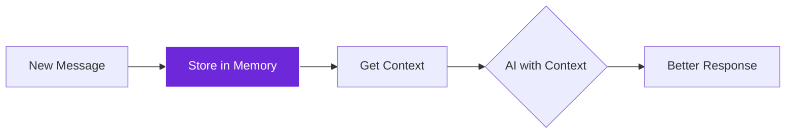

import { Steps, Aside, Tabs, TabItem } from "@astrojs/starlight/components";
import { Image } from "astro:assets";
import { Code } from "@astrojs/starlight/components";
import Social from "@images/social.webp";

The **Local Memory** node is like giving your AI assistant a notebook to remember what you've talked about before. It stores conversation history locally in your browser, so AI can maintain context and provide more relevant responses based on previous interactions.

Perfect for creating chatbots, AI assistants, or any workflow where context matters across multiple interactions.

<Image
  src={Social}
  alt="Illustration of AI maintaining conversation memory and context"
/>

## How it works

The node stores messages and conversation history in your browser's local storage. When you need context for AI responses, it retrieves relevant conversation history and formats it for the AI to understand.



## Setup guide

<Steps>

1. **Choose Memory Key**: Give your conversation a unique name like "user_chat" or "support_session".

2. **Set Storage Limits**: Decide how many messages to remember (50 is usually good for most conversations).

3. **Configure Actions**: Set up storing new messages and retrieving context when needed.

4. **Connect to AI**: Use the retrieved context to give AI better understanding of the conversation.

</Steps>

## Practical example: AI chatbot with memory

Let's create an AI assistant that remembers your conversation history.

**Action 1: Store Message**
- **Goal**: Save what the user said.
- **Key**: `user_chat_session`
- **Action**: Store
- **Content**: "What's the weather like today?" (User role).

**Action 2: Retrieve Context**
- **Goal**: Get history to send to AI.
- **Key**: `user_chat_session`
- **Action**: Retrieve
- **Limit**: Last 10 messages.

**Action 3: Clear Memory**
- **Goal**: Start fresh.
- **Key**: `user_chat_session`
- **Action**: Clear.

## Common memory actions

| Action | Purpose | When to Use |
|--------|---------|-------------|
| **Store** | Save a new message | After each user input or AI response |
| **Retrieve** | Get conversation history | Before sending context to AI |
| **Clear** | Delete all messages | Start fresh conversation or reset |
| **Update** | Modify existing message | Correct or enhance stored information |

## Configuration settings

| Setting | Purpose | Recommended Values |
|---------|---------|-------------------|
| **Memory Key** | Unique conversation identifier | "user_chat", "support_session" |
| **Max Messages** | How many messages to remember | 20-50 for most conversations |
| **Context Window** | Recent messages for AI context | 5-10 messages |

<Aside type="tip" title="Keep it focused">
  Store only essential conversation turns. Too much history can overwhelm the AI and slow down responses.
</Aside>

## Real-world examples

### Customer support chatbot
Remember customer issues across the conversation:
```
Memory Key: "support_session_" + userId
Max Messages: 30 (enough for complex issues)
Context Window: 8 (recent conversation focus)
```

### Personal AI assistant
Maintain context for ongoing tasks:
```
Memory Key: "personal_assistant"
Max Messages: 50 (longer conversations)
Context Window: 10 (broader context)
```

### Educational tutor
Track learning progress and questions:
```
Memory Key: "tutor_session_" + studentId
Max Messages: 40 (educational conversations)
Context Window: 6 (focused learning context)
```

## Troubleshooting

- **Memory not persisting**: Check that your memory key is consistent across store and retrieve actions.
- **Context too long**: Reduce max messages or context window to prevent overwhelming the AI.
- **Storage quota exceeded**: Clear old conversations or reduce the number of stored messages.
- **Slow performance**: Limit context window size and clean up unused memory keys regularly.

