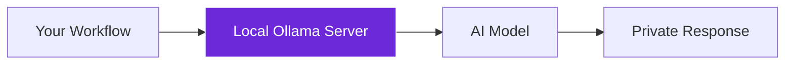

import { Steps, Aside, Tabs, TabItem } from "@astrojs/starlight/components";
import { Image } from "astro:assets";
import { Code } from "@astrojs/starlight/components";
import Social from "@images/social.webp";

The **Ollama** node lets you run powerful AI models directly on your computer instead of using cloud services. This means complete privacy (your data never leaves your machine), no ongoing costs, and the ability to work offline.

Perfect for sensitive data processing, cost-conscious projects, or when you want full control over your AI processing.

<Image
  src={Social}
  alt="Illustration of AI models running locally on your computer"
/>

## How it works

Ollama runs as a local server on your computer, hosting AI models that your workflows can connect to. Instead of sending data to external APIs, everything processes locally with complete privacy.



## Setup guide

<Steps>

1. **Install Ollama**: Download from [ollama.com](https://ollama.com) and install on your computer.

2. **Download AI Models**: Run `ollama pull llama2:7b` to download your first model.

3. **Start the Server**: Run `ollama serve` to start the local AI server.

4. **Connect Workflows**: Use `http://localhost:11434` as your Ollama URL in workflows.

</Steps>

## Practical example: Private document analysis

Let's set up local AI processing for analyzing sensitive documents.

**Option 1: Basic Setup**
- **Server URL**: `http://localhost:11434` (Default local address)
- **Model**: `llama2:7b` (Good balance of speed and quality)
- **Creativity**: Low (0.3) for consistent answers.

**Option 2: Creative Writing**
- **Model**: `mistral:7b` (Known for good writing)
- **Creativity**: High (0.8) for more varied output.
- **Length**: Up to 1000 tokens (longer responses).

**Option 3: Code Analysis**
- **Model**: `codellama:7b` (Specialized for code)
- **Creativity**: Very low (0.1) for precision.
- **Length**: Up to 800 tokens.

## Why choose local AI

| Local AI (Ollama) | Cloud AI Services |
|-------------------|-------------------|
| Complete privacy - data never leaves your machine | Data sent to external servers |
| No ongoing costs after setup | Pay per API call |
| Works offline | Requires internet connection |
| No rate limits | API rate limits apply |
| Full control over models | Limited model choices |

## Popular models to try

| Model | Best For | RAM Needed | Speed |
|-------|----------|------------|-------|
| **llama2:7b** | General tasks, good balance | 8GB | Fast |
| **mistral:7b** | Fast responses, efficient | 8GB | Very Fast |
| **codellama:7b** | Code analysis and generation | 8GB | Fast |
| **llama2:13b** | Higher quality responses | 16GB | Slower |

<Aside type="tip" title="Start with llama2:7b">
  The llama2:7b model provides excellent quality for most use cases while being reasonably fast and not requiring too much RAM.
</Aside>

## System requirements

### Minimum requirements
- **RAM**: 8GB (for 7b models)
- **Storage**: 4GB free space
- **CPU**: Modern processor (2018+)

### Recommended setup
- **RAM**: 16GB+ (for larger models)
- **Storage**: 10GB+ free space
- **GPU**: Optional, for faster processing

## Real-world examples

### Private document summarization
Process confidential documents without external services:
```
Setup: llama2:7b with temperature 0.3
Use case: Summarize legal documents, medical records, financial reports
Benefit: Complete privacy, no data leaves your computer
```

### Offline content generation
Create content without internet connection:
```
Setup: mistral:7b with temperature 0.7
Use case: Write emails, articles, creative content
Benefit: Works anywhere, no connectivity required
```

### Code review and analysis
Analyze proprietary code safely:
```
Setup: codellama:7b with temperature 0.2
Use case: Code review, bug detection, documentation
Benefit: No code sent to external services
```

## Troubleshooting

- **"Connection failed" errors**: Make sure Ollama is running with `ollama serve` and check the URL is correct.
- **"Model not found" errors**: Download the model first using `ollama pull model-name`.
- **Slow responses**: Try a smaller model (7b instead of 13b) or check if your system has enough RAM.
- **Out of memory errors**: Close other applications or use a smaller model that fits your available RAM.

