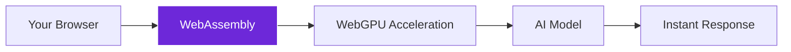

import { Steps, Aside, Tabs, TabItem } from "@astrojs/starlight/components";
import { Image } from "astro:assets";
import { Code } from "@astrojs/starlight/components";
import Social from "@images/social.webp";

The **Web LLM** node runs AI models completely in your browser using cutting-edge WebAssembly technology. No external servers, no internet required after initial setup, and complete privacy - your data never leaves your browser.

This is the ultimate in privacy-focused AI processing, perfect for sensitive data or when you need guaranteed offline functionality.

<Image
  src={Social}
  alt="Illustration of AI models running directly in the browser"
/>

## How it works

Web LLM downloads and runs AI models directly in your browser using WebAssembly and WebGPU acceleration. Everything happens locally in your browser tab with no external dependencies.



## Setup guide

<Steps>

1. **Choose a Model**: Select from available browser-compatible AI models.

2. **Wait for Download**: The model downloads and caches in your browser (one-time process).

3. **Start Processing**: Once loaded, the AI runs instantly with no network delays.

4. **Enjoy Privacy**: All processing happens locally - your data never leaves the browser.

</Steps>

## Practical example: Ultra-private document analysis

Let's set up completely private AI processing that works offline.

<Tabs>
  <TabItem label="General Analysis">
    <Code
      code={`{
  "model": "Llama-2-7b-chat-hf-q4f16_1",
  "temperature": 0.3,
  "maxTokens": 500
}`}
      lang="json"
    />
  </TabItem>
  <TabItem label="Creative Writing">
    <Code
      code={`{
  "model": "Llama-2-7b-chat-hf-q4f16_1",
  "temperature": 0.8,
  "maxTokens": 1000
}`}
      lang="json"
    />
  </TabItem>
  <TabItem label="Precise Tasks">
    <Code
      code={`{
  "model": "Llama-2-7b-chat-hf-q4f16_1",
  "temperature": 0.1,
  "maxTokens": 300
}`}
      lang="json"
    />
  </TabItem>
</Tabs>

## Why choose browser AI

| Browser AI (Web LLM) | Cloud AI | Local AI (Ollama) |
|----------------------|----------|-------------------|
| Runs in browser | Requires internet | Requires installation |
| Ultimate privacy | Data sent externally | Local but needs setup |
| Works offline | Always online | Works offline |
| No installation | No installation | Requires software |
| Instant startup | API delays | Server startup time |

## Available models

| Model | Size | Best For | Performance |
|-------|------|----------|-------------|
| **Llama-2-7b-chat-hf-q4f16_1** | ~4GB | General tasks | Good balance |
| **TinyLlama-1.1B-Chat-v0.4-q4f16_1** | ~700MB | Quick responses | Very fast |
| **Phi-2-q4f16_1** | ~1.6GB | Reasoning tasks | Fast |

<Aside type="tip" title="Start with TinyLlama for testing">
  TinyLlama downloads quickly and runs fast, perfect for testing Web LLM functionality before trying larger models.
</Aside>

## Browser requirements

### Minimum requirements
- **Modern browser** (Chrome 113+, Firefox 117+, Edge 113+)
- **4GB RAM** available to browser
- **WebAssembly support** (automatic in modern browsers)

### Recommended setup
- **8GB+ RAM** for larger models
- **WebGPU support** for acceleration (Chrome/Edge)
- **Fast internet** for initial model download

## Real-world examples

### Maximum privacy document processing
Process highly sensitive documents with zero external access:
```
Use case: Legal documents, medical records, personal data
Benefit: Guaranteed privacy - nothing leaves your browser
Model: Llama-2-7b-chat-hf-q4f16_1 with temperature 0.2
```

### Offline AI assistant
Create AI workflows that work without internet:
```
Use case: Field work, remote locations, air-gapped systems
Benefit: Complete offline functionality after initial setup
Model: TinyLlama for fast responses, Llama-2 for quality
```

### Educational AI tools
Build AI learning tools with no external dependencies:
```
Use case: Student projects, classroom environments, demos
Benefit: No API keys, no costs, works anywhere
Model: Phi-2 for reasoning tasks, TinyLlama for speed
```

## Troubleshooting

- **Model won't load**: Check available browser memory and try a smaller model like TinyLlama.
- **Slow performance**: Enable WebGPU in browser settings or try a smaller model.
- **Out of memory errors**: Close other browser tabs and try a lighter model.
- **Download fails**: Check internet connection and browser storage permissions.

