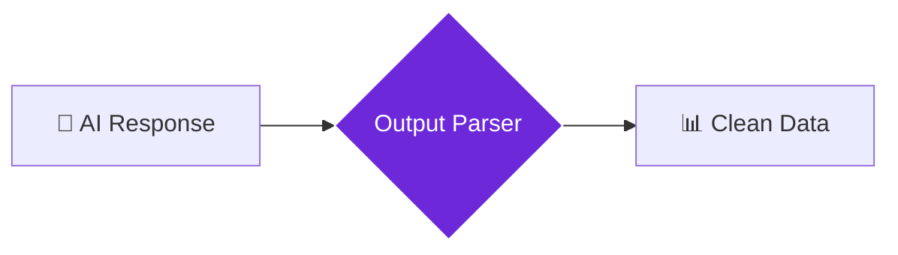

import { Steps, Aside, Tabs, TabItem } from "@astrojs/starlight/components";
import { Image } from "astro:assets";
import { Code } from "@astrojs/starlight/components";
import Social from "@images/social.webp";

The **Structured Output Parser** transforms messy AI responses into clean, organized data. Think of it as a translator that takes whatever format the AI gives you and converts it into exactly the structure you need for your workflow.

Instead of getting unpredictable text that you have to manually clean up, this node ensures you always receive data in a consistent, usable format - perfect for feeding into spreadsheets, databases, or other workflow steps.

<Image
  src={Social}
  alt="Illustration of converting unstructured AI text into organized data"
/>

## How it works

The parser takes raw AI output and applies a "schema" (a blueprint) that defines exactly what data you want and how it should be formatted. It validates the response and extracts only the information you need in the structure you specify.

## Setup guide

<Steps>

1. **Define Your Schema**: Specify what data fields you want (name, age, category, etc.) and their types (text, number, true/false).
2. **Connect AI Output**: Link the raw response from your AI node (like Basic LLM Chain or Q&A Node).
3. **Set Validation Rules**: Choose whether missing fields should cause errors or just warnings.
4. **Get Clean Data**: The output will be a structured object with exactly the fields you requested.

</Steps>

## Practical example: Extract product information

Let's say you're using AI to analyze product descriptions and want consistent data for a spreadsheet.

<Tabs>
  <TabItem label="AI Response (Messy)">
    <Code
      code={`"This is a great laptop! It's called the TechBook Pro and costs around $1,299. It has 16GB of RAM and comes in silver or black colors. The screen is 15.6 inches and it's really fast for gaming."`}
      lang="text"
    />
  </TabItem>
  <TabItem label="Schema (What You Want)">
    <Code
      code={`{
  "schema": {
    "type": "object",
    "properties": {
      "product_name": {"type": "string"},
      "price": {"type": "number"},
      "ram": {"type": "string"},
      "screen_size": {"type": "string"},
      "colors": {"type": "array", "items": {"type": "string"}}
    },
    "required": ["product_name", "price"]
  }
}`}
      lang="json"
    />
  </TabItem>
  <TabItem label="Output (Clean Data)">
    <Code
      code={`{
  "structured_data": {
    "product_name": "TechBook Pro",
    "price": 1299,
    "ram": "16GB",
    "screen_size": "15.6 inches",
    "colors": ["silver", "black"]
  },
  "validation_status": "success",
  "missing_fields": []
}`}
      lang="json"
    />
  </TabItem>
</Tabs>

## Common schema types

| Data Type | Purpose | Example |
|-----------|---------|---------|
| **string** | Text information | Names, descriptions, categories |
| **number** | Numeric values | Prices, quantities, ratings |
| **boolean** | True/false values | In stock, featured, recommended |
| **array** | Lists of items | Colors, features, tags |
| **object** | Nested data | Address with street, city, zip |

<Aside type="tip" title="Start simple">
  Begin with just 2-3 fields in your schema. Once that works reliably, you can add more complex data structures and validation rules.
</Aside>

## When to use this parser

**Perfect for:**
- Extracting data from AI analysis for spreadsheets
- Creating consistent reports from AI research
- Building databases from AI-processed content
- Ensuring reliable data flow between workflow steps

**Skip if:**
- You want the AI's natural language response as-is
- You're doing creative writing or content generation
- The AI output doesn't contain structured information

## Troubleshooting

- **"Schema validation failed"**: The AI didn't provide data in the expected format. Try simplifying your schema or improving your AI prompt
- **"Missing required fields"**: The AI response didn't include essential information. Make your AI prompt more specific about what data to include
- **"Parsing error"**: The AI response wasn't in a format the parser could understand. Check that your AI is producing structured output