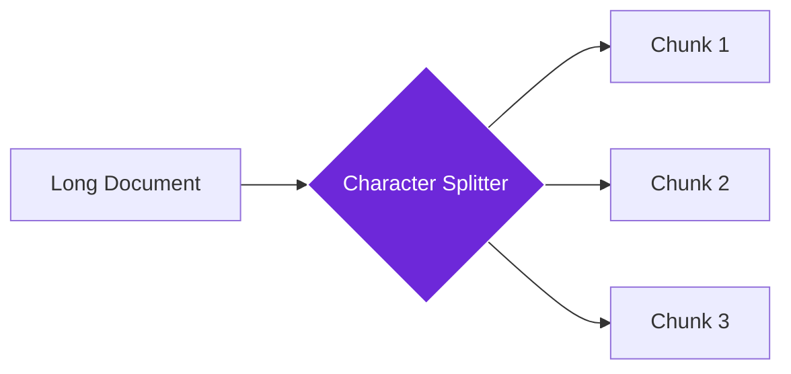

import { Steps, Aside, Tabs, TabItem } from "@astrojs/starlight/components";
import { Image } from "astro:assets";
import { Code } from "@astrojs/starlight/components";
import Social from "@images/social.webp";

The **Character Text Splitter** breaks long documents into smaller, equal-sized pieces. Think of it like cutting a long article into pages - each piece is roughly the same size, making it easier for AI to process and understand.

This is the simplest way to prepare documents for AI workflows. While other splitters use smart rules, this one just counts characters and splits at regular intervals.

<Image
  src={Social}
  alt="Illustration of splitting text into equal-sized chunks"
/>

## How it works

The splitter takes your text and divides it based on character count. You can choose where it prefers to split (like at paragraph breaks) and how much overlap you want between pieces to maintain context.

## Setup guide

<Steps>

1. **Connect Your Text**: Provide the document you want to split. This usually comes from a "Get All Text From Link" or similar node.
2. **Set Chunk Size**: Choose how many characters each piece should contain (typically 500-1500 characters).
3. **Choose Split Points**: Decide where to split - at paragraph breaks ("\n\n") works well for most documents.
4. **Add Overlap**: Set how many characters should overlap between chunks to maintain context (usually 100-200 characters).

</Steps>

## Practical example: Research article processing

Let's say you want to process a long research article for AI analysis.

**Input Configuration:**
- **Chunk Size**: 800 characters per piece.
- **Separator**: Split at empty lines (`\n\n`) to keep paragraphs together.
- **Overlap**: 100 characters to keep context.

**Resulting Split:**
1. **Chunk 1**: "Introduction... (content)..." (Length: 800 chars)
2. **Chunk 2**: "...(overlap from chunk 1)... Methodology..." (Length: 800 chars)

Total: 2 chunks created from the article.

## Common settings

| Setting | Purpose | Recommended Value |
|---------|---------|-------------------|
| **Chunk Size** | How many characters per piece | 800-1200 for most documents |
| **Separator** | Where to prefer splitting | "\n\n" for paragraphs, "\n" for lines |
| **Chunk Overlap** | Characters shared between chunks | 100-200 to maintain context |

<Aside type="tip" title="Perfect for beginners">
  This splitter is ideal when you're just getting started with AI document processing. It's simple, predictable, and works well for most text types.
</Aside>

## When to use this splitter

**Perfect for:**
- Simple document processing workflows
- When you need consistent chunk sizes
- Processing plain text documents
- Getting started with AI text analysis

**Consider alternatives for:**
- Complex documents with varied structure
- When you need to respect semantic boundaries
- Processing code or structured data

## Troubleshooting

- **Chunks too small**: Increase the chunk size or check if your separator appears frequently in the text
- **Important information split**: Increase chunk overlap or use paragraph separators ("\n\n") instead of sentence separators
- **No splitting occurs**: Make sure your separator actually exists in the text, or try a simpler separator like " " (space)

