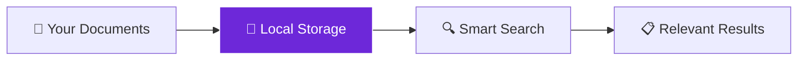

import { Steps, Aside, Tabs, TabItem } from "@astrojs/starlight/components";
import { Image } from "astro:assets";
import { Code } from "@astrojs/starlight/components";
import Social from "@images/social.webp";

The **Local Knowledge** node creates a smart document database right in your browser. Think of it as your personal search engine for documents - you can store articles, PDFs, notes, and then ask questions or search for specific information using natural language.

Unlike traditional search that only finds exact word matches, this creates a "smart" database that understands meaning and context, all while keeping your documents completely private on your device.

<Image
  src={Social}
  alt="Illustration of a local knowledge database with documents and search"
/>

## How it works

The node stores your documents in your browser's local storage and converts them into searchable "vectors" (mathematical representations of meaning). When you search, it finds documents that are conceptually similar to your query, even if they don't contain the exact words.

## Setup guide

<Steps>

1. **Create Database**: Choose a name for your knowledge base (like "research_docs" or "company_kb").
2. **Set Action**: Choose what you want to do - "create" for new database, "insert" to add documents, "search" to find information.
3. **Add Documents**: When inserting, provide the document text, title, and any metadata you want to store.
4. **Search Smart**: Use natural language queries to find relevant documents based on meaning, not just keywords.

</Steps>

## Practical example: Personal research database

Let's build a searchable collection of research articles about renewable energy.

**Action 1: Creating Database**
- **Action**: Create
- **Name**: `renewable_energy_research`
- **Settings**: Standard dimension (768).

**Action 2: Adding Documents**
- **Action**: Insert
- **Target**: `renewable_energy_research`
- **Content**: The text of your article (e.g., "Solar Panel Efficiency Study...").
- **Metadata**: Add details like source ("Journal of Renewable Energy") and date.

**Action 3: Searching Documents**
- **Action**: Search
- **Target**: `renewable_energy_research`
- **Query**: "What are the latest improvements in solar technology?"
- **Limit**: Top 5 results.
- **Accuracy**: 0.7 threshold.

## Common actions

| Action | Purpose | When to Use |
|--------|---------|-------------|
| **create** | Set up a new knowledge base | First time creating a database |
| **insert** | Add documents to the database | Adding new articles, notes, or content |
| **search** | Find relevant documents | Looking for information or answers |
| **update** | Modify existing documents | Correcting or updating stored content |
| **delete** | Remove documents or database | Cleaning up or removing outdated content |

<Aside type="tip" title="Complete privacy">
  All your documents stay in your browser - they're never uploaded anywhere. You can search through thousands of documents completely offline while keeping everything private.
</Aside>

## Why use Local Knowledge?

**Perfect for:**
- Building personal research collections
- Creating company knowledge bases
- Organizing study materials
- Building smart FAQ systems
- Storing and searching through any text content

**Key benefits:**
- Works completely offline
- Keeps all data private in your browser
- Searches by meaning, not just keywords
- No storage limits (beyond browser capacity)
- Instant search results

## Troubleshooting

- **"Database not found"**: Make sure you've created the database first using the "create" action
- **No search results**: Try lowering the similarity threshold to 0.6 or check if your documents actually contain related content
- **Storage quota exceeded**: Delete old documents or unused databases to free up space
- **Slow performance**: Reduce the number of documents or use more specific search terms

