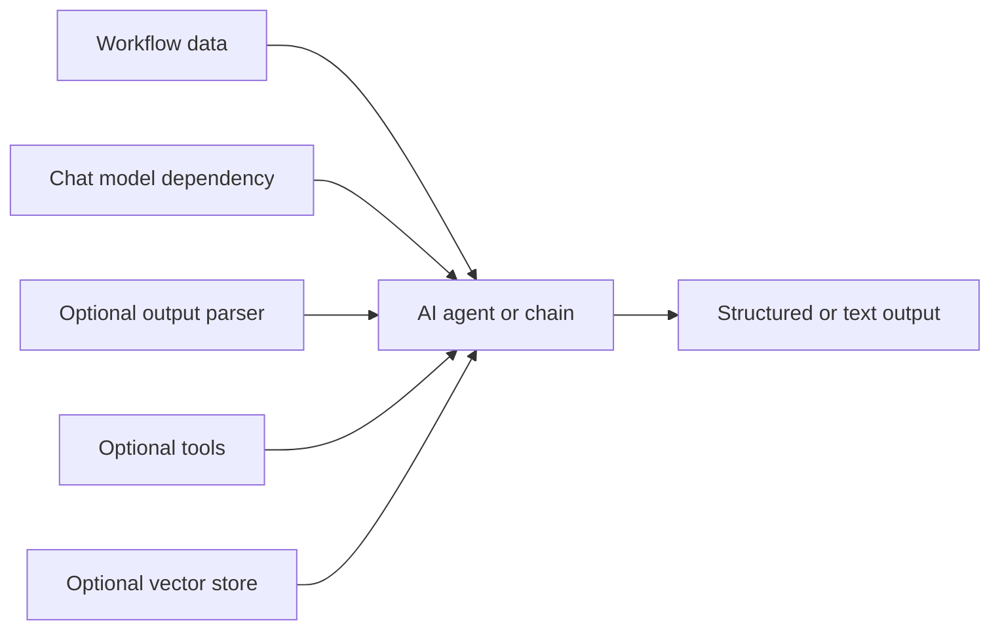

# AI Nodes

AI nodes are split into agent nodes and dependency nodes. Agent nodes execute AI tasks, while dependencies provide chat models, memory, tools, output parsers, vector stores, embeddings, and text splitters.

Start with [Basic LLM Chain](/nodes/builtin/ai/aiagents/basicllmchainnode/) for simple text generation, [Tools Agent](/nodes/builtin/ai/aiagents/toolsagentnode/) when the model should use tools, or [RAG Agent](/nodes/builtin/ai/aiagents/ragnode/) when the workflow needs retrieval from indexed content.

## Mental Model

Agent nodes do the work. Dependency nodes are reusable configuration blocks that agent nodes rely on.

## Recommended Order

1. Pick the agent node that matches the task.
2. Connect the required model dependency.
3. Add embeddings, vector stores, memory, tools, or parsers only when the agent node needs them.
4. Test the output shape before connecting the AI result to browser actions or integrations.

For concept-level guidance, see [Model Dependencies](/advanced-ai/concepts/model-dependencies/) and [Prompting and Structured Outputs](/advanced-ai/concepts/prompting-and-outputs/).
