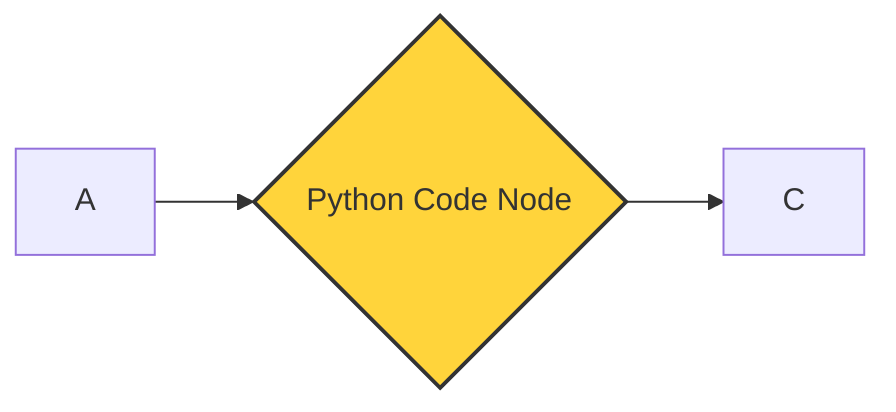

import {
  Steps,
  Aside,
  Tabs,
  TabItem
} from "@astrojs/starlight/components";
import { Image } from "astro:assets";
import { Code } from "@astrojs/starlight/components";
import Social from "@images/social.webp";

The **Python Code** node allows you to write and execute Python scripts directly within your workflow. Unlike traditional automation tools that require a server, this node runs entirely inside your browser using **Pyodide**.

This is perfect for cleaning data, performing calculations, or using advanced math libraries without your data ever leaving your computer.

  <Image
    src={Social}
    alt="Illustration of Python code running in a browser environment"
  />

## How it works

The node receives data from the previous step as a list of items. You can modify these items, create new ones, or filter them out using standard Python syntax. Because it uses Pyodide, you have access to the standard Python library and several powerful scientific packages.



## Setup guide

<Steps>

1. **Add the node**: Locate the **Python Code** node under the "Core" category and add it to your workflow canvas.
2. **Write your script**: Enter your Python code in the editor. By default, the node provides a template to help you get started.
3. **Access data**: Use the built-in `items` variable to interact with the data flowing into the node.
4. **Return results**: Your script must return a list of dictionaries (objects) so the next node can understand the data.

</Steps>

## Basic example

If you want to add a new field to every item passing through, you can use a simple loop.

<Tabs>
<TabItem label="The Code">
<Code code={`# 'items' is the list of data coming from the previous step
new_items = []

for item in items:
    # Add a new field called 'status'
    item['status'] = 'processed'
    
    # Calculate a new total price
    item['grand_total'] = item['price'] * 1.2
    
    # Add the updated item to our list
    new_items.append(item)

# Always return the modified list
return new_items`} lang="python" title="transform.py" />

</TabItem>
<TabItem label="What happens to the data">

**Input Data:**
Imagine you have a list of products, each with a `price`.

**Output Result:**
After the code runs, each product will still have its price, but now it also has:
- A `status` field set to "processed".
- A `grand_total` field calculated as 1.2 times the price.

</TabItem>
</Tabs>

## Using powerful libraries

One of the biggest advantages of the Python Code node is the support for heavy-duty data libraries. These are pre-loaded and ready to use:

| Library        | Best for                                      |
| -------------- | --------------------------------------------- |
| **Pandas**     | Complex table manipulation and data analysis. |
| **NumPy**      | High-performance mathematical operations.     |
| **Matplotlib** | Generating charts and visualizations.         |

<Aside type="tip">
  To use these, simply add `import pandas as pd` or `import numpy as np` at the
  top of your script.
</Aside>

## Common tasks

### Filtering items

You can easily remove items that don't meet a specific condition.

```python
# Only keep items where the price is greater than 50
return [item for item in items if item['price'] > 50]

```

### Formatting text

Clean up names or labels before sending them to a database.

```python
for item in items:
    item['name'] = item['name'].strip().title()
return items

```

## Important limitations

<Aside type="caution" title="Memory usage">
  Since the Python engine runs entirely in your browser's memory, processing
  extremely large datasets (e.g., hundreds of thousands of rows) might slow down
  your browser tab. For massive data, consider splitting your workflow into
  smaller chunks.
</Aside>

- **Browser Only**: This code executes on your machine. If you share a workflow, the recipient's browser will run the code when they trigger it.
- **External Requests**: Standard Python `requests` are not supported. Use our(/nodes/builtin/browser/click/) or(/nodes/builtin/core/http/) to fetch data from the web.