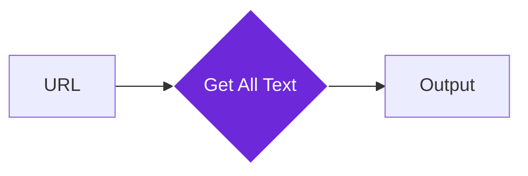

import { Steps, Aside, Tabs, TabItem } from "@astrojs/starlight/components";
import { Image } from "astro:assets";
import { Code } from "@astrojs/starlight/components";
import Social from "@images/social.webp";

The **Get All Text From Link** node is designed to help you gather information from the web quickly. It takes a web address (URL), visits that page in the background, and returns every piece of readable text it finds.

This node is the perfect starting point for building a "Research Assistant" or a news aggregator, as it turns a messy web page into clean, searchable text.

<Image
  src={Social}
  alt="Illustration of text being extracted from a website link"
/>

## How it works

When this node runs, it opens the provided link in a hidden browser context. It intelligently ignores background "noise" like programming scripts or styling code, focusing only on the words a human would actually read on the screen.



## Setup guide

<Steps>

1. **Identify the link**: Connect this node to a step that provides a URL, or type a web address directly into the **Link URL** field.
2. **Choose extraction depth**: By default, the node captures everything. You can toggle options to include or exclude specific sections like headers and footers.
3. **Run the node**: Once executed, the node will output a text block containing the full content of the page.

</Steps>

## Practical example

Imagine you have a list of blog post links and you want to summarize them using an AI.

<Tabs>
<TabItem label="Setting the URL">
In the node settings, you would point to the link found in a previous step:

```
`Link URL: {{ $json.link }}`

```

</TabItem>
<TabItem label="Input (The Link)">
<Code code={`{ &quot;link&quot;: &quot;https://example.com/blog/how-to-automate&quot; }`} lang="json" />
</TabItem>
<TabItem label="Output (The Result)">
<Code code={`{ &quot;text&quot;: &quot;How to Automate Your Workflow. Automation is the key to productivity... In this guide, we will explore the best tools for 2026...&quot; }`} lang="json" />
</TabItem>
</Tabs>

## Useful tips

<Aside type="tip">
  If you are extracting text to send to an AI model, combine this node with the
  [Python Code](https://www.google.com/search?q=/nodes/builtin/core/code/) node
  to trim the text length. This helps you save on "tokens" and stay within the
  AI's memory limits.
</Aside>

<Aside type="note" title="Privacy and Speed">
  Because this node runs directly in your browser, it uses your current internet
  connection and session. This means it can often access pages you are already
  logged into without requiring extra passwords.
</Aside>

## Common questions

### Does it work with PDF links?

This node is optimized for web pages (HTML). For PDF files, we recommend using a specialized document processing node.

### Will it capture text inside images?

No. This node only reads text that is part of the page code. If a website displays text as an image, this node will not be able to "see" it.