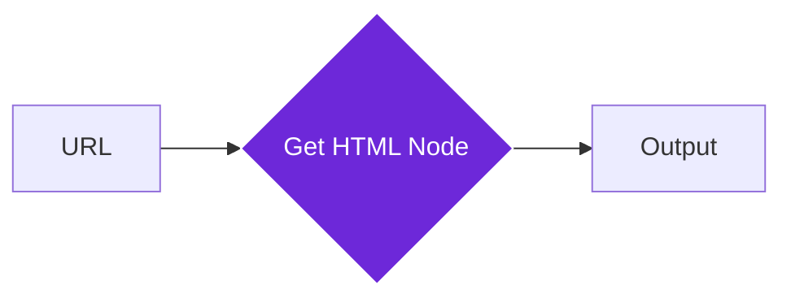

import { Steps, Aside, Tabs, TabItem } from "@astrojs/starlight/components";
import { Image } from "astro:assets";
import { Code } from "@astrojs/starlight/components";
import Social from "@images/social.webp";

The **Get HTML From Link** node allows you to "peek behind the curtain" of a website. It takes a web address (URL) and retrieves the entire underlying source code (HTML) of that page.

While the [Get All Text From Link](/nodes/builtin/core/GetAllTextFromLink/) node is better for reading content, this node is essential when you need to see the structure of a site to find hidden data, metadata, or specific elements that aren't visible as plain text.

<Image
  src={Social}
  alt="Illustration of fetching source code from a web link"
/>

## How it works

When you provide a link, the node visits the page in the background. It can wait for the page to finish loading (including content that appears after a delay) and then captures every line of code from the top to the bottom.

## Setup guide

<Steps>

1. **Enter the Link**: In the node settings, provide the URL of the website you want to analyze. You can type it manually or map it from a previous step.
2. **Wait for Load**: If the website uses modern "loading" animations or takes a while to display data, ensure the **Wait For Load** option is enabled.
3. **Set a Timeout**: Decide how long the node should try to reach the site before giving up (default is 30 seconds).
4. **Run the node**: The output will contain a text field named `html` containing the full source code.

</Steps>

## Practical example: E-commerce data

Suppose you want to see if a product page contains hidden "Stock Level" data that isn't written in plain text but is hidden in the code.

Suppose you want to see if a product page contains hidden "Stock Level" data that isn't written in plain text but is hidden in the code.

**What you configure:**
- **Link**: The URL of the product page (e.g., `https://shop.example.com/product/123`).
- **Settings**: Turn on "Wait for Load" to make sure all data is present.

**What you get:**
- **HTML**: The full code of the page (`<html>...</html>`).
- **Metadata**: Found details like the page title ("Product Title - Tech Store") and load time.

## Common settings

| Setting               | Purpose                                                                                                                    |
| --------------------- | -------------------------------------------------------------------------------------------------------------------------- |
| **Wait For Load**     | Keeps the browser open until the page is fully ready. Turn this on for "Single Page Apps" like dashboards or modern shops. |
| **Sanitize HTML**     | Cleans the code to remove potentially harmful scripts. Recommended if you plan to display the HTML elsewhere.              |
| **Include Resources** | Captures the styling (CSS) and scripts (JS) inside the HTML. This makes the file much larger but preserves the exact look. |

<Aside type="tip" title="Use with the Python Code node">
  Raw HTML is often very "noisy." We recommend passing the output of this node
  into a [Python Code](/nodes/builtin/core/Code/) node using
  the **BeautifulSoup** or **Pandas** libraries to easily find the specific data
  you need.
</Aside>

## Troubleshooting

- **Missing Content**: If the HTML you get looks like it's missing the middle of the page, try increasing the **Timeout** or ensuring **Wait For Load** is checked. Some sites wait for data to load after the initial page appears.
- **Access Denied**: Some websites block automated tools. Since Agentic Workflow Studio runs in your browser, you can often bypass this by being logged into the site in another tab.
