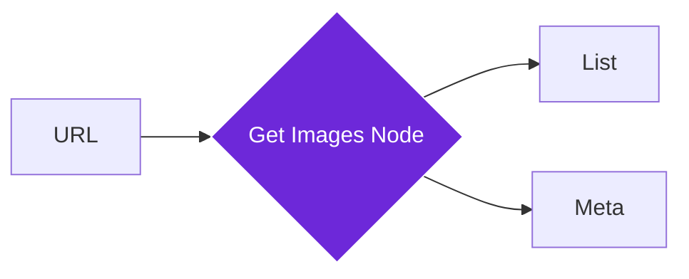

import { Steps, Aside, Tabs, TabItem, Code } from "@astrojs/starlight/components";
import { Image } from "astro:assets";
import Social from "@images/social.webp";

The **Get Images From Link** node is a powerful tool for media collection and web research. It scans a specific web address (URL) and provides you with a clean list of every image it finds on that page, including their descriptions and sizes. [1, 2]

Whether you are building a product gallery, conducting a visual audit, or gathering assets for a presentation, this node automates the tedious task of "right-click, save as."

<Image src={Social} alt="Illustration of extracting images from a website" />

## How it works

When the workflow reaches this node, it visits the provided link in a background browser tab. It scans the page's structure for `` tags, high-resolution source sets, and even icons. [3, 4] By using your current browser session, it can often find images on pages where you are already logged in. [5, 6]

## Setup guide

<Steps>

1. **Identify the Link**: Provide the URL of the page you want to scan. You can type this in or pull it from a previous node. 

2. **Apply Size Filters**: To avoid cluttering your results with tiny icons or invisible tracking pixels, set a **Minimum Width** or **Height** (e.g., 200px).
3. **Wait for Load**: If the website uses "Lazy Loading" (where images only appear as you scroll), ensure **Wait For Load** is enabled to give the page time to fully render. 

4. **Run the Workflow**: The node will output a list of image objects containing the URL, "Alt Text" (description), and dimensions. 

</Steps>

## Practical example: Product Research

Suppose you want to collect all product photos from a specific category page on an e-commerce site.

<Tabs>
<TabItem label="The Link">
In the node settings, you would provide the category link:
`https://shop.example.com/laptops`
</TabItem>
<TabItem label="Input">
<Code
code={`{ &quot;url&quot;: &quot;https://shop.example.com/laptops&quot; }`}
lang="json"
/>
</TabItem>
<TabItem label="Output (Result)">
<Code
code={`{ &quot;images&quot;:, &quot;totalImages&quot;: 2 }`}
lang="json"
/>
</TabItem>
</Tabs>

## Common settings

| Setting | Purpose |
| --- | --- |
| **Minimum Width/Height** | Prevents the node from picking up small buttons, arrows, or decorative icons. |
| **Max Images** | Limits the number of results (e.g., "only give me the first 10 images"). |
| **Include Data URLs** | If enabled, this will capture the image content itself as a string of code. Use this sparingly as it can make your workflow very slow. 

 |
| **Wait For Load** | Keeps the node "watching" the page until slow-loading images appear. 

 |

<Aside type="tip" title="Use for Accessibility Audits">
You can use this node to quickly find images that are missing **Alt Text**. Images without descriptions are difficult for visually impaired users to understand, and this node makes it easy to spot them in bulk.
</Aside>

## Troubleshooting

* **Missing Images**: If you see images in your browser but the node doesn't find them, the site might be using "Lazy Loading." Try increasing the **Timeout** or ensuring **Wait For Load** is checked. 

* **Access Blocked**: Some sites prevent automated tools from seeing images. Since Agentic Workflow Studio runs in your own browser, you can often bypass this by opening the website in another tab first to "wake up" your session. 

* **Memory Issues**: Extracting hundreds of high-resolution images at once can use a lot of computer memory. If your browser feels slow, use the **Max Images** filter to limit the count.

## Related nodes

* (/nodes/builtin/browser/get-html/) — To see the full code behind the images.
* (/nodes/builtin/core/getalltextfromlink/) — To read the articles surrounding the images.
* [Python Code](https://www.google.com/search?q=/nodes/builtin/core/code/) — To filter or rename your image list using custom logic. 